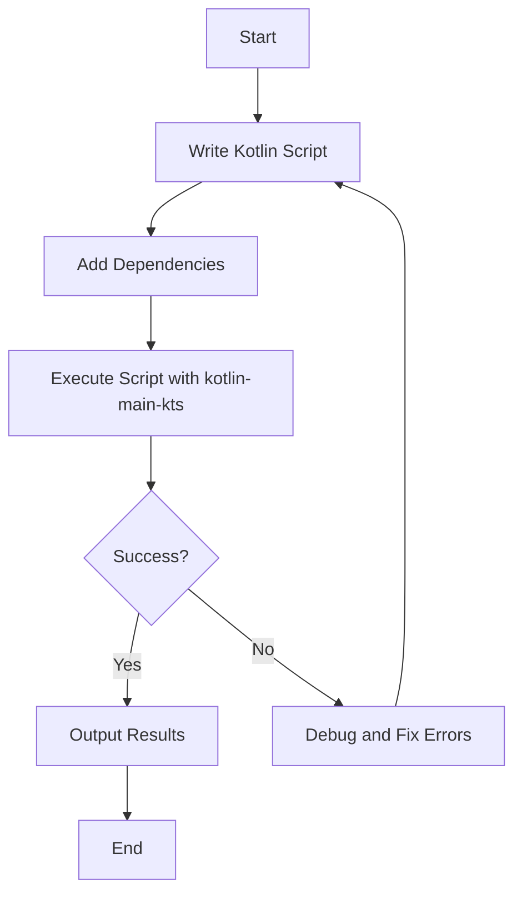

## 20.8 Scripting with Kotlin

Kotlin, a modern and versatile programming language, extends its capabilities beyond traditional application development into the realm of scripting. Scripting with Kotlin allows developers to automate tasks, streamline workflows, and enhance productivity. In this section, we will delve into the world of Kotlin scripting, focusing on the `kotlin-main-kts` script engine, which enables Kotlin to be used as a scripting language.

### Introduction to Kotlin Scripting

Kotlin scripting provides a powerful way to write concise scripts for automating repetitive tasks, configuring systems, and performing quick computations. Unlike compiled Kotlin applications, scripts are interpreted, making them ideal for scenarios where quick execution and flexibility are paramount.

#### Why Use Kotlin for Scripting?

- **Conciseness**: Kotlin's syntax is expressive and concise, reducing boilerplate code.
- **Interoperability**: Kotlin seamlessly integrates with Java libraries, allowing access to a vast ecosystem.
- **Type Safety**: Benefit from Kotlin's strong type system, reducing runtime errors.
- **Tooling Support**: Leverage existing Kotlin tools and IDE support for scripting.

### Getting Started with Kotlin Scripts

To begin scripting in Kotlin, you need to set up your environment to execute Kotlin scripts. The `kotlin-main-kts` script engine is a key component that facilitates this process.

#### Setting Up Your Environment

1. **Install Kotlin**: Ensure you have Kotlin installed on your machine. You can download it from the [official Kotlin website](https://kotlinlang.org/).

2. **Install Kotlin Command Line Tools**: Use the Kotlin command line tools to execute scripts. You can install these tools via SDKMAN! or directly from the Kotlin website.

3. **Configure Your IDE**: If you prefer using an IDE, IntelliJ IDEA provides excellent support for Kotlin scripting.

#### Writing Your First Kotlin Script

Let's start with a simple "Hello, World!" script in Kotlin:

```kotlin
// hello.kts
println("Hello, World!")
```

To execute this script, use the following command in your terminal:

```shell
kotlinc -script hello.kts
```

This command compiles and runs the script, outputting "Hello, World!" to the console.

### Exploring kotlin-main-kts

The `kotlin-main-kts` script engine enhances Kotlin scripting by providing additional features and conveniences. It allows you to use Kotlin scripts with dependencies and execute them in a more flexible manner.

#### Using kotlin-main-kts

To use `kotlin-main-kts`, ensure you have the Kotlin command line tools installed. You can then execute scripts with dependencies by specifying them directly in the script file.

```kotlin
// example.kts
@file:DependsOn("com.squareup.okhttp3:okhttp:4.9.0")

import okhttp3.OkHttpClient
import okhttp3.Request

val client = OkHttpClient()
val request = Request.Builder().url("https://api.github.com").build()
val response = client.newCall(request).execute()

println(response.body?.string())
```

In this example, we use the `@file:DependsOn` annotation to include the OkHttp library as a dependency. This allows us to perform HTTP requests directly within the script.

#### Executing Scripts with Dependencies

To execute a script with dependencies, use the `kotlin` command with the `-script` option:

```shell
kotlin -script example.kts
```

The script will automatically resolve and download the specified dependencies, making it easy to manage external libraries.

### Advanced Scripting Techniques

Kotlin scripting can be extended with advanced techniques to handle more complex scenarios. Let's explore some of these techniques.

#### Creating Reusable Scripts

Scripts can be modularized and reused across different projects. By organizing scripts into functions and classes, you can create libraries of reusable code.

```kotlin
// utils.kts
fun greet(name: String) {
    println("Hello, $name!")
}

// main.kts
@file:Import("utils.kts")

greet("Kotlin Scripting")
```

In this example, the `utils.kts` script defines a reusable function `greet`, which is then imported and used in `main.kts`.

#### Handling Input and Output

Kotlin scripts can interact with the user by handling input and output. Use the `readLine` function to capture user input and `println` for output.

```kotlin
println("Enter your name:")
val name = readLine()
println("Hello, $name!")
```

This script prompts the user for their name and then greets them.

#### Error Handling in Scripts

Implement error handling in scripts using try-catch blocks to manage exceptions gracefully.

```kotlin
try {
    val result = 10 / 0
    println("Result: $result")
} catch (e: ArithmeticException) {
    println("Error: Division by zero is not allowed.")
}
```

This script demonstrates how to handle division by zero errors.

### Integrating Kotlin Scripts with Build Tools

Kotlin scripts can be integrated with build tools like Gradle to automate build processes and manage dependencies.

#### Using Kotlin Scripts in Gradle

Gradle supports Kotlin DSL for build scripts, allowing you to write build configurations in Kotlin.

```kotlin
// build.gradle.kts
plugins {
    kotlin("jvm") version "1.8.0"
}

dependencies {
    implementation("org.jetbrains.kotlin:kotlin-stdlib")
}
```

This build script configures a Kotlin project with the necessary dependencies.

#### Automating Tasks with Gradle Scripts

Leverage Kotlin scripts to automate tasks such as code generation, testing, and deployment.

```kotlin
// tasks.kts
task("hello") {
    doLast {
        println("Hello from Kotlin script!")
    }
}
```

Execute this task using the command:

```shell
gradle -b tasks.kts hello
```

### Scripting Use Cases

Kotlin scripting is versatile and can be applied to various use cases, from simple automation to complex system configurations.

#### Automating System Administration Tasks

Kotlin scripts can automate system administration tasks such as file management, network configuration, and process automation.

```kotlin
// fileCleanup.kts
import java.io.File

val directory = File("/path/to/directory")
directory.listFiles()?.forEach { file ->
    if (file.isFile && file.extension == "tmp") {
        file.delete()
        println("Deleted: ${file.name}")
    }
}
```

This script deletes temporary files in a specified directory.

#### Data Processing and Analysis

Use Kotlin scripts for data processing and analysis, leveraging Kotlin's powerful collections and standard library.

```kotlin
// dataAnalysis.kts
val numbers = listOf(1, 2, 3, 4, 5)
val sum = numbers.sum()
val average = numbers.average()

println("Sum: $sum")
println("Average: $average")
```

This script calculates the sum and average of a list of numbers.

#### Web Scraping and API Integration

Kotlin scripts can perform web scraping and interact with APIs to automate data retrieval and processing.

```kotlin
// webScraping.kts
@file:DependsOn("org.jsoup:jsoup:1.13.1")

import org.jsoup.Jsoup

val document = Jsoup.connect("https://example.com").get()
val title = document.title()

println("Webpage Title: $title")
```

This script retrieves and prints the title of a webpage.

### Best Practices for Kotlin Scripting

To maximize the effectiveness of Kotlin scripting, consider the following best practices:

- **Modularize Code**: Break down scripts into reusable functions and modules.
- **Use Dependencies Wisely**: Manage dependencies with `@file:DependsOn` and avoid unnecessary libraries.
- **Handle Errors Gracefully**: Implement error handling to ensure scripts run smoothly.
- **Document Scripts**: Add comments and documentation to make scripts understandable and maintainable.
- **Test Scripts**: Regularly test scripts to ensure they perform as expected.

### Visualizing Kotlin Scripting Workflow

To better understand the workflow of Kotlin scripting, let's visualize the process using a flowchart.



This flowchart illustrates the typical workflow of writing, executing, and debugging a Kotlin script.

### Try It Yourself

To get hands-on experience with Kotlin scripting, try modifying the provided examples. Experiment with adding new features, handling different input types, or integrating additional libraries.

For instance, modify the web scraping script to extract and print all hyperlinks from a webpage. This exercise will help you understand how to work with external libraries and process HTML content.

### Conclusion

Kotlin scripting, powered by `kotlin-main-kts`, offers a robust and flexible solution for automating tasks and enhancing productivity. By leveraging Kotlin's expressive syntax, strong type system, and seamless Java interoperability, you can create powerful scripts for a wide range of applications.

As you continue your journey in Kotlin scripting, remember to explore new libraries, experiment with different use cases, and refine your skills. The possibilities are endless, and with practice, you'll become proficient in automating complex workflows with ease.

## Quiz Time!



### What is the primary advantage of using Kotlin for scripting?

- [x] Conciseness and expressiveness
- [ ] Lack of tooling support
- [ ] Limited interoperability
- [ ] Weak type system

> **Explanation:** Kotlin's syntax is concise and expressive, making it ideal for scripting tasks.

### Which annotation is used to specify dependencies in a Kotlin script?

- [x] @file:DependsOn
- [ ] @file:Import
- [ ] @file:Include
- [ ] @file:Require

> **Explanation:** The `@file:DependsOn` annotation is used to specify dependencies in Kotlin scripts.

### How do you execute a Kotlin script using the command line?

- [x] kotlin -script script.kts
- [ ] kotlinc script.kts
- [ ] java -jar script.kts
- [ ] ./script.kts

> **Explanation:** The `kotlin -script script.kts` command is used to execute Kotlin scripts.

### What is the purpose of the `kotlin-main-kts` script engine?

- [x] To enhance Kotlin scripting with additional features
- [ ] To compile Kotlin applications
- [ ] To debug Kotlin code
- [ ] To convert Kotlin to Java

> **Explanation:** The `kotlin-main-kts` script engine provides additional features for Kotlin scripting.

### Which function is used to capture user input in a Kotlin script?

- [x] readLine()
- [ ] readInput()
- [ ] getInput()
- [ ] captureInput()

> **Explanation:** The `readLine()` function is used to capture user input in Kotlin scripts.

### What is a common use case for Kotlin scripting?

- [x] Automating system administration tasks
- [ ] Developing Android applications
- [ ] Building web servers
- [ ] Designing user interfaces

> **Explanation:** Kotlin scripting is commonly used for automating system administration tasks.

### How can you handle errors in a Kotlin script?

- [x] Using try-catch blocks
- [ ] Using error handlers
- [ ] Using exception filters
- [ ] Using error logs

> **Explanation:** Errors in Kotlin scripts can be handled using try-catch blocks.

### What is a best practice for managing dependencies in Kotlin scripts?

- [x] Use `@file:DependsOn` for necessary libraries
- [ ] Include all available libraries
- [ ] Avoid using external libraries
- [ ] Use manual dependency management

> **Explanation:** Using `@file:DependsOn` helps manage necessary dependencies in Kotlin scripts.

### Which tool can be used to automate tasks in a Kotlin project?

- [x] Gradle
- [ ] Maven
- [ ] Ant
- [ ] Make

> **Explanation:** Gradle is commonly used to automate tasks in Kotlin projects.

### True or False: Kotlin scripts can be used for web scraping.

- [x] True
- [ ] False

> **Explanation:** Kotlin scripts can be used for web scraping by leveraging libraries like Jsoup.


