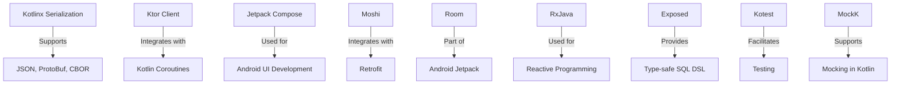

## 20.9 Libraries and Frameworks

Kotlin has rapidly grown into a versatile and powerful language, thanks in part to its rich ecosystem of libraries and frameworks. These tools enable developers to build robust applications efficiently, leveraging Kotlin's expressive syntax and modern features. In this section, we'll explore some of the most popular Kotlin libraries and frameworks, focusing on serialization, HTTP clients, and other essential tools that enhance Kotlin development.

### Introduction to Kotlin Libraries and Frameworks

Kotlin libraries and frameworks provide pre-built functionalities that streamline development processes. They cover a wide range of use cases, from data serialization and network communication to UI development and reactive programming. By using these libraries, developers can focus on writing business logic rather than reinventing the wheel.

### Serialization Libraries

Serialization is a crucial aspect of modern software development, enabling data interchange between systems. Kotlin offers several libraries to facilitate serialization, each with its unique features and benefits.

#### Kotlinx Serialization

**Kotlinx Serialization** is a powerful library developed by JetBrains, designed to handle serialization and deserialization of Kotlin objects. It supports various formats, including JSON, ProtoBuf, CBOR, and more.

- **Key Features:**
  - Annotations for defining serialization behavior.
  - Support for custom serializers.
  - Integration with Kotlin's coroutines for asynchronous serialization.

- **Sample Code:**

```kotlin
import kotlinx.serialization.*
import kotlinx.serialization.json.*

@Serializable
data class User(val name: String, val age: Int)

fun main() {
    val user = User("Alice", 30)
    val jsonString = Json.encodeToString(user)
    println(jsonString) // {"name":"Alice","age":30}

    val decodedUser = Json.decodeFromString<User>(jsonString)
    println(decodedUser) // User(name=Alice, age=30)
}
```

- **Design Considerations:**
  - Use annotations like `@Serializable` to mark classes for serialization.
  - Customize serialization with `@SerialName` and `@Transient`.

#### Gson

**Gson** is a popular JSON serialization library from Google, known for its simplicity and ease of use. While not Kotlin-specific, it integrates well with Kotlin projects.

- **Key Features:**
  - Automatic serialization and deserialization.
  - Support for custom type adapters.
  - Compatibility with Java and Kotlin.

- **Sample Code:**

```kotlin
import com.google.gson.Gson

data class Product(val id: Int, val name: String)

fun main() {
    val gson = Gson()
    val product = Product(1, "Laptop")
    val json = gson.toJson(product)
    println(json) // {"id":1,"name":"Laptop"}

    val productFromJson = gson.fromJson(json, Product::class.java)
    println(productFromJson) // Product(id=1, name=Laptop)
}
```

- **Design Considerations:**
  - Use Gson for projects requiring Java interoperability.
  - Customize serialization with `@SerializedName`.

#### Moshi

**Moshi** is another JSON library that offers a modern approach to serialization. It is built by Square and provides a type-safe way to handle JSON in Kotlin.

- **Key Features:**
  - Built-in support for Kotlin data classes.
  - Type-safe adapters.
  - Integration with Retrofit for network requests.

- **Sample Code:**

```kotlin
import com.squareup.moshi.Moshi
import com.squareup.moshi.kotlin.reflect.KotlinJsonAdapterFactory

data class Book(val title: String, val author: String)

fun main() {
    val moshi = Moshi.Builder().add(KotlinJsonAdapterFactory()).build()
    val jsonAdapter = moshi.adapter(Book::class.java)

    val book = Book("1984", "George Orwell")
    val json = jsonAdapter.toJson(book)
    println(json) // {"title":"1984","author":"George Orwell"}

    val bookFromJson = jsonAdapter.fromJson(json)
    println(bookFromJson) // Book(title=1984, author=George Orwell)
}
```

- **Design Considerations:**
  - Use Moshi for projects that require type safety and integration with Retrofit.
  - Leverage KotlinJsonAdapterFactory for seamless Kotlin integration.

### HTTP Clients

Handling HTTP requests is a common requirement in modern applications. Kotlin offers several libraries to simplify network communication.

#### Ktor Client

**Ktor Client** is part of the Ktor framework, designed for asynchronous HTTP requests. It is highly customizable and supports various platforms.

- **Key Features:**
  - Asynchronous and synchronous requests.
  - Support for multiple platforms (JVM, JS, Native).
  - Integration with Kotlin coroutines.

- **Sample Code:**

```kotlin
import io.ktor.client.*
import io.ktor.client.request.*
import io.ktor.client.statement.*

suspend fun main() {
    val client = HttpClient()
    val response: HttpResponse = client.get("https://api.github.com")
    println(response.status)
    println(response.readText())
    client.close()
}
```

- **Design Considerations:**
  - Use Ktor Client for projects that require cross-platform support.
  - Leverage coroutine support for non-blocking requests.

#### OkHttp

**OkHttp** is a widely-used HTTP client from Square, known for its performance and reliability. It is not Kotlin-specific but integrates seamlessly with Kotlin projects.

- **Key Features:**
  - Synchronous and asynchronous requests.
  - Connection pooling and caching.
  - Support for HTTP/2 and WebSocket.

- **Sample Code:**

```kotlin
import okhttp3.OkHttpClient
import okhttp3.Request

fun main() {
    val client = OkHttpClient()
    val request = Request.Builder().url("https://api.github.com").build()

    client.newCall(request).execute().use { response ->
        println(response.code)
        println(response.body?.string())
    }
}
```

- **Design Considerations:**
  - Use OkHttp for projects requiring advanced networking features.
  - Combine with Retrofit for REST API integration.

#### Fuel

**Fuel** is a lightweight HTTP client for Kotlin, designed to be simple and easy to use.

- **Key Features:**
  - Synchronous and asynchronous requests.
  - Built-in support for JSON, XML, and other formats.
  - Kotlin-friendly API.

- **Sample Code:**

```kotlin
import com.github.kittinunf.fuel.Fuel

fun main() {
    Fuel.get("https://api.github.com").response { request, response, result ->
        println(response.statusCode)
        println(String(response.data))
    }
}
```

- **Design Considerations:**
  - Use Fuel for projects that prioritize simplicity and ease of use.
  - Ideal for quick prototyping and small applications.

### UI Frameworks

Kotlin is not just for backend development; it also shines in UI development, especially for Android and desktop applications.

#### Jetpack Compose

**Jetpack Compose** is a modern UI toolkit for Android, built with Kotlin. It simplifies UI development with a declarative approach.

- **Key Features:**
  - Declarative UI components.
  - Integration with Android's ViewModel and LiveData.
  - Support for animations and theming.

- **Sample Code:**

```kotlin
import androidx.compose.material.*
import androidx.compose.runtime.*
import androidx.compose.ui.tooling.preview.Preview

@Composable
fun Greeting(name: String) {
    Text(text = "Hello, $name!")
}

@Preview
@Composable
fun PreviewGreeting() {
    Greeting("World")
}
```

- **Design Considerations:**
  - Use Jetpack Compose for modern Android applications.
  - Leverage composables for reusable UI components.

#### TornadoFX

**TornadoFX** is a lightweight JavaFX framework for Kotlin, designed for building desktop applications.

- **Key Features:**
  - Kotlin-friendly DSL for JavaFX.
  - Support for dependency injection.
  - Integration with JavaFX properties and bindings.

- **Sample Code:**

```kotlin
import tornadofx.*

class MyApp: App(MyView::class)

class MyView: View() {
    override val root = vbox {
        label("Hello, TornadoFX!")
        button("Click Me") {
            action {
                println("Button clicked!")
            }
        }
    }
}
```

- **Design Considerations:**
  - Use TornadoFX for desktop applications that require a rich UI.
  - Leverage Kotlin DSL for concise and readable code.

### Reactive Programming Libraries

Reactive programming is a paradigm that deals with asynchronous data streams. Kotlin offers several libraries to facilitate reactive programming.

#### Kotlin Flow

**Kotlin Flow** is part of the Kotlin Coroutines library, designed for handling asynchronous data streams.

- **Key Features:**
  - Cold streams that are lazily evaluated.
  - Integration with coroutines for non-blocking operations.
  - Support for backpressure.

- **Sample Code:**

```kotlin
import kotlinx.coroutines.flow.*
import kotlinx.coroutines.runBlocking

fun main() = runBlocking {
    flowOf(1, 2, 3)
        .map { it * 2 }
        .collect { println(it) }
}
```

- **Design Considerations:**
  - Use Kotlin Flow for projects that require reactive data handling.
  - Leverage operators like `map`, `filter`, and `collect`.

#### RxJava

**RxJava** is a popular library for reactive programming, offering a wide range of operators and utilities.

- **Key Features:**
  - Support for observables and flowables.
  - Extensive operator library.
  - Integration with Android and Java.

- **Sample Code:**

```kotlin
import io.reactivex.rxjava3.core.Observable

fun main() {
    Observable.just(1, 2, 3)
        .map { it * 2 }
        .subscribe { println(it) }
}
```

- **Design Considerations:**
  - Use RxJava for projects that require extensive reactive features.
  - Combine with Retrofit for reactive network requests.

### Database Libraries

Kotlin provides several libraries for database access, each catering to different needs and preferences.

#### Room

**Room** is part of Android's Jetpack components, designed for local database access.

- **Key Features:**
  - SQLite abstraction layer.
  - Compile-time verification of SQL queries.
  - Integration with LiveData and Flow.

- **Sample Code:**

```kotlin
import androidx.room.*

@Entity
data class User(
    @PrimaryKey val uid: Int,
    @ColumnInfo(name = "first_name") val firstName: String?,
    @ColumnInfo(name = "last_name") val lastName: String?
)

@Dao
interface UserDao {
    @Query("SELECT * FROM user")
    fun getAll(): List<User>

    @Insert
    fun insertAll(vararg users: User)
}
```

- **Design Considerations:**
  - Use Room for Android applications that require local data storage.
  - Leverage annotations for defining database schema.

#### Exposed

**Exposed** is a Kotlin SQL library that provides a DSL for database access.

- **Key Features:**
  - Type-safe SQL queries.
  - Support for multiple database backends.
  - Integration with Kotlin coroutines.

- **Sample Code:**

```kotlin
import org.jetbrains.exposed.sql.*
import org.jetbrains.exposed.sql.transactions.transaction

object Users : Table() {
    val id = integer("id").autoIncrement()
    val name = varchar("name", 50)
    override val primaryKey = PrimaryKey(id)
}

fun main() {
    Database.connect("jdbc:h2:mem:test", driver = "org.h2.Driver")

    transaction {
        SchemaUtils.create(Users)

        Users.insert {
            it[name] = "Alice"
        }

        for (user in Users.selectAll()) {
            println("${user[Users.id]}: ${user[Users.name]}")
        }
    }
}
```

- **Design Considerations:**
  - Use Exposed for projects that require type-safe database access.
  - Leverage DSL for concise and readable queries.

### Testing Libraries

Testing is a crucial part of software development, and Kotlin offers several libraries to facilitate testing.

#### Kotest

**Kotest** is a flexible and comprehensive testing framework for Kotlin.

- **Key Features:**
  - Support for various testing styles (spec, behavior, etc.).
  - Extensive matchers and assertions.
  - Integration with JUnit.

- **Sample Code:**

```kotlin
import io.kotest.core.spec.style.StringSpec
import io.kotest.matchers.shouldBe

class MyTests : StringSpec({
    "length should return size of string" {
        "hello".length shouldBe 5
    }
})
```

- **Design Considerations:**
  - Use Kotest for projects that require flexible testing styles.
  - Leverage matchers for expressive assertions.

#### MockK

**MockK** is a mocking library for Kotlin, designed to work seamlessly with Kotlin features.

- **Key Features:**
  - Support for mocking Kotlin classes and functions.
  - Integration with coroutines.
  - DSL for defining mocks and verifications.

- **Sample Code:**

```kotlin
import io.mockk.every
import io.mockk.mockk
import io.mockk.verify

class MyService {
    fun greet(name: String) = "Hello, $name!"
}

fun main() {
    val mockService = mockk<MyService>()
    every { mockService.greet("World") } returns "Hi, World!"

    println(mockService.greet("World")) // Hi, World!

    verify { mockService.greet("World") }
}
```

- **Design Considerations:**
  - Use MockK for projects that require mocking Kotlin-specific features.
  - Leverage DSL for concise and readable mock definitions.

### Try It Yourself

Now that we've explored various Kotlin libraries and frameworks, it's time to get hands-on. Try modifying the code examples provided in this section to better understand how these libraries work. For instance, experiment with different serialization formats in Kotlinx Serialization or try integrating a new HTTP client into your project.

### Visualizing Kotlin Libraries and Frameworks

To better understand the relationships and interactions between different libraries and frameworks, let's visualize them using a diagram.



**Diagram Description:** This diagram illustrates the relationships between various Kotlin libraries and frameworks. It shows how libraries like Kotlinx Serialization support multiple formats, while Ktor Client integrates with Kotlin Coroutines. Jetpack Compose is used for Android UI development, and Moshi integrates with Retrofit for JSON handling. Room is part of Android Jetpack, RxJava is used for reactive programming, Exposed provides a type-safe SQL DSL, Kotest facilitates testing, and MockK supports mocking in Kotlin.

### Knowledge Check

Before we conclude, let's reinforce what we've learned with a few questions:

- What are the key features of Kotlinx Serialization?
- How does Ktor Client differ from OkHttp?
- What are the benefits of using Jetpack Compose for Android development?
- How does Kotlin Flow facilitate reactive programming?
- What are the advantages of using MockK for mocking in Kotlin?

### Conclusion

In this section, we've explored a variety of Kotlin libraries and frameworks that enhance the development experience. From serialization and HTTP clients to UI frameworks and testing libraries, these tools provide powerful capabilities that streamline development processes. As you continue your journey with Kotlin, remember to experiment with these libraries and frameworks to discover their full potential.

## Quiz Time!



### What is the primary purpose of Kotlinx Serialization?

- [x] To handle serialization and deserialization of Kotlin objects.
- [ ] To provide a UI framework for Android development.
- [ ] To facilitate reactive programming in Kotlin.
- [ ] To mock Kotlin classes and functions.

> **Explanation:** Kotlinx Serialization is designed to handle serialization and deserialization of Kotlin objects, supporting various formats like JSON, ProtoBuf, and CBOR.

### Which library is known for its performance and reliability in handling HTTP requests?

- [ ] Ktor Client
- [x] OkHttp
- [ ] Fuel
- [ ] Retrofit

> **Explanation:** OkHttp, developed by Square, is widely recognized for its performance and reliability in handling HTTP requests.

### What is Jetpack Compose primarily used for?

- [ ] Backend development
- [x] Android UI development
- [ ] Database access
- [ ] Reactive programming

> **Explanation:** Jetpack Compose is a modern UI toolkit for Android, built with Kotlin, and is primarily used for Android UI development.

### How does Kotlin Flow facilitate reactive programming?

- [x] By providing cold streams that are lazily evaluated.
- [ ] By offering a UI framework for Android.
- [ ] By handling HTTP requests asynchronously.
- [ ] By mocking Kotlin classes and functions.

> **Explanation:** Kotlin Flow facilitates reactive programming by providing cold streams that are lazily evaluated, integrating with coroutines for non-blocking operations.

### Which library provides a type-safe SQL DSL for Kotlin?

- [ ] Room
- [x] Exposed
- [ ] Moshi
- [ ] Kotest

> **Explanation:** Exposed is a Kotlin SQL library that provides a type-safe SQL DSL, supporting multiple database backends.

### What is the primary benefit of using MockK in Kotlin projects?

- [x] It supports mocking Kotlin-specific features.
- [ ] It provides a UI framework for Android.
- [ ] It handles HTTP requests asynchronously.
- [ ] It facilitates reactive programming.

> **Explanation:** MockK is designed to work seamlessly with Kotlin features, supporting mocking of Kotlin-specific features.

### Which library is part of Android's Jetpack components for local database access?

- [x] Room
- [ ] Exposed
- [ ] Moshi
- [ ] Kotlinx Serialization

> **Explanation:** Room is part of Android's Jetpack components, designed for local database access with SQLite abstraction.

### What is the primary use case for Ktor Client?

- [x] Handling asynchronous HTTP requests across multiple platforms.
- [ ] Providing a UI framework for Android.
- [ ] Facilitating reactive programming in Kotlin.
- [ ] Mocking Kotlin classes and functions.

> **Explanation:** Ktor Client is designed for handling asynchronous HTTP requests across multiple platforms, integrating with Kotlin coroutines.

### Which library integrates with Retrofit for JSON handling?

- [ ] Kotlinx Serialization
- [ ] Gson
- [x] Moshi
- [ ] Fuel

> **Explanation:** Moshi integrates with Retrofit for JSON handling, offering a modern approach to serialization with type-safe adapters.

### True or False: Kotlin Flow is part of the Kotlin Coroutines library.

- [x] True
- [ ] False

> **Explanation:** True. Kotlin Flow is part of the Kotlin Coroutines library, designed for handling asynchronous data streams.



Remember, this is just the beginning. As you progress, you'll build more complex and interactive applications using these libraries and frameworks. Keep experimenting, stay curious, and enjoy the journey!
