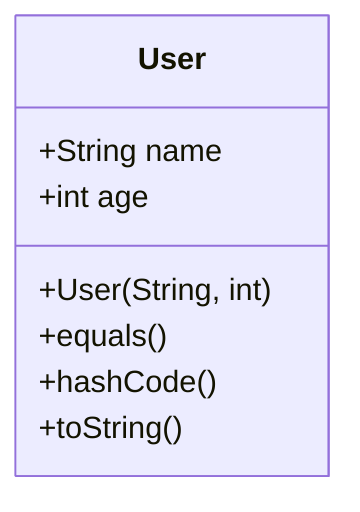

## 21.1 Code Style and Conventions

In the world of software development, consistency is key. Adhering to a set of code style and conventions not only enhances the readability and maintainability of your code but also facilitates collaboration among developers. In this section, we will delve into the best practices for Kotlin code style and conventions, exploring formatting guidelines, linting tools, and strategies for writing clean, idiomatic Kotlin code.

### Importance of Code Style and Conventions

Before we dive into specifics, let's understand why code style and conventions are crucial:

- **Readability**: Consistent code style makes it easier for developers to read and understand the codebase.
- **Maintainability**: Well-structured code is easier to maintain and extend over time.
- **Collaboration**: A unified style ensures that team members can work together seamlessly.
- **Error Reduction**: Adhering to conventions can help prevent common coding errors and pitfalls.

### Kotlin Coding Standards

Kotlin has its own set of coding standards that are widely accepted in the community. These standards are designed to promote readability and maintainability. Let's explore some of the key aspects of Kotlin coding standards.

#### Naming Conventions

Naming conventions are fundamental to code readability. In Kotlin, the following naming conventions are recommended:

- **Classes and Objects**: Use PascalCase (e.g., `MyClass`, `MyObject`).
- **Functions and Properties**: Use camelCase (e.g., `myFunction`, `myProperty`).
- **Constants**: Use uppercase letters with underscores (e.g., `MY_CONSTANT`).
- **Type Parameters**: Use single uppercase letters (e.g., `T`, `R`).

#### Code Layout

Proper code layout enhances readability. Here are some guidelines:

- **Indentation**: Use four spaces for indentation. Avoid using tabs.
- **Line Length**: Limit lines to 100 characters. Break lines if necessary.
- **Blank Lines**: Use blank lines to separate logical sections of code.

#### Function and Property Declarations

When declaring functions and properties, clarity is key:

- **Function Declarations**: Place the return type on the same line as the function name if it fits within the line length limit.
- **Property Declarations**: Prefer using `val` for read-only properties and `var` for mutable properties.

#### Control Flow Statements

Control flow statements should be clear and concise:

- **If Statements**: Use braces even for single-line statements to avoid errors.
- **When Expressions**: Use `when` for multi-branch conditions instead of multiple `if-else` statements.

### Formatting and Linting Tools

To ensure adherence to coding standards, use formatting and linting tools. These tools automatically format your code and highlight potential issues.

#### Kotlin Formatter

The Kotlin formatter is a built-in tool that formats your code according to standard conventions. It can be integrated into your IDE for automatic formatting.

#### Detekt

Detekt is a static code analysis tool for Kotlin. It helps identify code smells, style violations, and potential bugs. Detekt can be customized to enforce specific coding standards.

#### Ktlint

Ktlint is a Kotlin linter that checks for code style violations. It can be integrated into your build process to ensure consistent code formatting across the project.

### Writing Idiomatic Kotlin Code

Writing idiomatic Kotlin code means leveraging the language's features to write clean, concise, and expressive code. Let's explore some best practices for writing idiomatic Kotlin code.

#### Use Data Classes

Data classes are a powerful feature in Kotlin for representing data. They automatically generate common methods like `equals()`, `hashCode()`, and `toString()`.

```kotlin
data class User(val name: String, val age: Int)
```

#### Leverage Extension Functions

Extension functions allow you to add functionality to existing classes without modifying their source code. Use them to create cleaner and more expressive APIs.

```kotlin
fun String.isPalindrome(): Boolean {
    return this == this.reversed()
}
```

#### Prefer Immutability

Favor immutability by using `val` instead of `var` whenever possible. This reduces the risk of unintended side effects and makes your code more predictable.

```kotlin
val immutableList = listOf(1, 2, 3)
```

#### Utilize Null Safety Features

Kotlin's null safety features help prevent null pointer exceptions. Use nullable types and safe calls to handle null values gracefully.

```kotlin
val length: Int? = nullableString?.length
```

#### Use Higher-Order Functions

Higher-order functions allow you to pass functions as parameters or return them. This enables more flexible and reusable code.

```kotlin
fun calculate(operation: (Int, Int) -> Int, a: Int, b: Int): Int {
    return operation(a, b)
}
```

#### Employ Smart Casts

Kotlin's smart casts automatically cast variables to their expected types when possible. This reduces the need for explicit casting.

```kotlin
fun printLength(obj: Any) {
    if (obj is String) {
        println(obj.length) // Smart cast to String
    }
}
```

### Try It Yourself

To solidify your understanding, try modifying the code examples provided. Experiment with different naming conventions, formatting styles, and idiomatic features. This hands-on approach will help you internalize the concepts and apply them effectively in your projects.

### Visualizing Kotlin Code Style

To better understand how these conventions come together, let's visualize the structure of a well-formatted Kotlin class using a class diagram.



This diagram represents a simple `User` class with properties and methods automatically generated by the data class feature.

### References and Further Reading

For more in-depth information on Kotlin code style and conventions, consider exploring the following resources:

- [Kotlin Coding Conventions](https://kotlinlang.org/docs/coding-conventions.html)
- [Detekt Documentation](https://detekt.dev/)
- [Ktlint Documentation](https://ktlint.github.io/)

### Knowledge Check

Before we wrap up, let's reinforce your understanding with a few questions:

- What are the benefits of adhering to code style and conventions?
- How do naming conventions enhance code readability?
- What tools can be used to enforce Kotlin coding standards?
- Why is immutability preferred in Kotlin?

### Embrace the Journey

Remember, mastering code style and conventions is a continuous journey. As you progress, you'll develop a keen eye for clean, maintainable code. Keep experimenting, stay curious, and enjoy the journey!

## Quiz Time!



### What is the recommended indentation style in Kotlin?

- [x] Four spaces
- [ ] Two spaces
- [ ] Tabs
- [ ] Eight spaces

> **Explanation:** Kotlin's coding conventions recommend using four spaces for indentation to ensure consistency and readability.

### Which tool is used for static code analysis in Kotlin?

- [ ] Ktlint
- [x] Detekt
- [ ] Checkstyle
- [ ] PMD

> **Explanation:** Detekt is a static code analysis tool specifically designed for Kotlin, helping identify code smells and style violations.

### How should constants be named in Kotlin?

- [ ] camelCase
- [ ] PascalCase
- [x] Uppercase with underscores
- [ ] snake_case

> **Explanation:** Constants in Kotlin should be named using uppercase letters with underscores to differentiate them from other variables.

### What is the primary benefit of using data classes in Kotlin?

- [ ] They allow for inheritance
- [x] They automatically generate common methods
- [ ] They improve performance
- [ ] They enable reflection

> **Explanation:** Data classes in Kotlin automatically generate common methods like `equals()`, `hashCode()`, and `toString()`, making them ideal for representing data.

### Which keyword is used to declare read-only properties in Kotlin?

- [x] val
- [ ] var
- [ ] const
- [ ] final

> **Explanation:** The `val` keyword is used to declare read-only properties in Kotlin, promoting immutability.

### What is the purpose of extension functions in Kotlin?

- [ ] To modify existing classes
- [x] To add functionality to existing classes
- [ ] To improve performance
- [ ] To enable reflection

> **Explanation:** Extension functions allow you to add functionality to existing classes without modifying their source code, enhancing code expressiveness.

### How can you handle null values safely in Kotlin?

- [ ] Using `!!` operator
- [x] Using safe calls
- [ ] Using `try-catch`
- [ ] Using `if-else`

> **Explanation:** Safe calls (`?.`) in Kotlin allow you to handle null values gracefully, preventing null pointer exceptions.

### What is the advantage of using higher-order functions in Kotlin?

- [ ] They improve performance
- [x] They enable more flexible and reusable code
- [ ] They simplify syntax
- [ ] They allow reflection

> **Explanation:** Higher-order functions enable more flexible and reusable code by allowing functions to be passed as parameters or returned.

### Which of the following is a key feature of idiomatic Kotlin code?

- [ ] Extensive use of `var`
- [ ] Avoiding data classes
- [x] Leveraging null safety features
- [ ] Using explicit casting

> **Explanation:** Idiomatic Kotlin code leverages null safety features to prevent null pointer exceptions and promote safe programming practices.

### True or False: Kotlin's smart casts require explicit casting.

- [x] False
- [ ] True

> **Explanation:** Kotlin's smart casts automatically cast variables to their expected types when possible, reducing the need for explicit casting.


