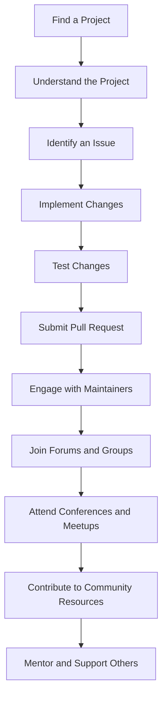

## 21.10 Community Involvement

In the world of software development, community involvement is not just a beneficial practice; it's a cornerstone of innovation and growth. For Kotlin developers, engaging with the community and contributing to open-source projects can significantly enhance both personal and professional development. This section delves into the importance of community involvement, provides guidance on contributing to open-source projects, and explores ways to engage with the vibrant Kotlin community.

### Why Community Involvement Matters

Community involvement in software development offers numerous benefits, including:

- **Knowledge Sharing**: Engaging with the community allows developers to share knowledge, learn from others, and stay updated with the latest trends and technologies.
- **Networking Opportunities**: Building connections with other developers can lead to collaborations, job opportunities, and mentorship.
- **Skill Enhancement**: Contributing to open-source projects helps developers improve their coding skills, learn new technologies, and gain experience in collaborative development.
- **Giving Back**: By contributing to the community, developers can give back to the ecosystem that supports their work, fostering a culture of collaboration and support.

### Contributing to Open-Source Projects

Contributing to open-source projects is a rewarding way to engage with the community. It not only helps improve the software but also enhances your skills and reputation as a developer. Here's how you can get started:

#### 1. Finding the Right Project

To contribute effectively, find a project that aligns with your interests and expertise. Consider the following:

- **Interest and Passion**: Choose a project that you are passionate about. This will keep you motivated and engaged.
- **Skill Level**: Ensure the project's complexity matches your skill level. Start with beginner-friendly projects if you're new to open-source.
- **Community and Documentation**: Look for projects with active communities and comprehensive documentation. This will make it easier to get involved and understand the project's goals.

#### 2. Understanding the Project

Before contributing, take the time to understand the project's structure, coding standards, and contribution guidelines. Here are some steps to follow:

- **Read the Documentation**: Thoroughly read the project's documentation, including the README file, contribution guidelines, and any available developer guides.
- **Explore the Codebase**: Familiarize yourself with the codebase by exploring the project's files and understanding its architecture.
- **Join the Community**: Engage with the project's community through forums, mailing lists, or chat platforms like Slack or Discord. This will help you get answers to your questions and understand the project's current needs.

#### 3. Making Your First Contribution

Once you're familiar with the project, it's time to make your first contribution. Follow these steps:

- **Identify an Issue**: Look for open issues labeled as "good first issue" or "beginner-friendly." These are usually simpler tasks that are ideal for new contributors.
- **Fork the Repository**: Fork the project's repository to your GitHub account and clone it to your local machine.
- **Make Changes**: Implement the changes required to address the issue. Ensure your code adheres to the project's coding standards.
- **Test Your Changes**: Thoroughly test your changes to ensure they work as expected and do not introduce new bugs.
- **Submit a Pull Request**: Once your changes are ready, submit a pull request (PR) to the project's repository. Provide a clear description of the changes and reference the issue you addressed.

#### 4. Engaging with the Project Maintainers

After submitting your PR, engage with the project maintainers to ensure your contribution is reviewed and merged:

- **Be Responsive**: Respond promptly to any feedback or requests for changes from the maintainers.
- **Be Open to Feedback**: Accept constructive criticism and be willing to make changes to your code if needed.
- **Stay Involved**: Continue to engage with the project by addressing additional issues, participating in discussions, and helping other contributors.

### Engaging with the Kotlin Community

The Kotlin community is vibrant and welcoming, offering numerous opportunities for engagement and collaboration. Here are some ways to get involved:

#### 1. Join Online Forums and Groups

Participate in online forums and groups dedicated to Kotlin development. These platforms provide a space for developers to ask questions, share knowledge, and discuss the latest trends and technologies. Some popular platforms include:

- **Kotlin Slack**: Join the Kotlin Slack community to connect with other developers, participate in discussions, and get help with your projects.
- **Reddit**: The r/Kotlin subreddit is a great place to share news, ask questions, and engage with the Kotlin community.
- **Stack Overflow**: Use Stack Overflow to ask and answer questions related to Kotlin development. This platform is an excellent resource for finding solutions to common programming challenges.

#### 2. Attend Conferences and Meetups

Attending conferences and meetups is a fantastic way to network with other developers and learn from industry experts. Consider participating in the following events:

- **KotlinConf**: KotlinConf is the official Kotlin conference, featuring talks and workshops from leading Kotlin developers and experts.
- **Local Meetups**: Join local Kotlin meetups to connect with developers in your area. These events often feature talks, workshops, and networking opportunities.

#### 3. Contribute to Community Resources

Contributing to community resources, such as blogs, tutorials, and documentation, is another way to engage with the Kotlin community. Here are some ideas:

- **Write Blog Posts**: Share your knowledge and experiences by writing blog posts about Kotlin development. This can help other developers learn from your insights and expertise.
- **Create Tutorials**: Develop tutorials that teach specific Kotlin concepts or demonstrate how to build applications using Kotlin.
- **Improve Documentation**: Contribute to the documentation of open-source Kotlin projects, making it easier for new developers to get started.

#### 4. Mentor and Support Other Developers

Mentoring and supporting other developers is a valuable way to give back to the community. Consider the following:

- **Offer Code Reviews**: Provide constructive feedback on other developers' code, helping them improve their skills and understanding of Kotlin.
- **Host Workshops**: Organize workshops or webinars to teach Kotlin concepts and best practices to other developers.
- **Participate in Mentorship Programs**: Join mentorship programs that connect experienced developers with newcomers, offering guidance and support.

### Code Example: Contributing to an Open-Source Kotlin Project

Let's walk through a simple example of contributing to an open-source Kotlin project. We'll use a hypothetical project called "KotlinUtils," which provides utility functions for Kotlin developers.

#### Step 1: Fork and Clone the Repository

First, fork the KotlinUtils repository on GitHub and clone it to your local machine:

```bash
git clone https://github.com/your-username/KotlinUtils.git
cd KotlinUtils
```

#### Step 2: Identify an Issue

Next, identify an issue to work on. Let's say there's an open issue to add a new utility function for calculating the factorial of a number.

#### Step 3: Implement the Function

Open the project in your favorite IDE and navigate to the appropriate file. Implement the factorial function as follows:

```kotlin
/**
 * Calculates the factorial of a given number.
 *
 * @param n The number to calculate the factorial for.
 * @return The factorial of the given number.
 * @throws IllegalArgumentException if n is negative.
 */
fun factorial(n: Int): Long {
    require(n >= 0) { "Factorial is not defined for negative numbers." }
    return if (n == 0) 1 else n * factorial(n - 1)
}
```

#### Step 4: Test Your Changes

Add tests for the new function to ensure it works correctly. Create a test file and add the following test cases:

```kotlin
import org.junit.jupiter.api.Assertions.assertEquals
import org.junit.jupiter.api.Test

class FactorialTest {

    @Test
    fun testFactorial() {
        assertEquals(1, factorial(0))
        assertEquals(1, factorial(1))
        assertEquals(2, factorial(2))
        assertEquals(6, factorial(3))
        assertEquals(24, factorial(4))
        assertEquals(120, factorial(5))
    }

    @Test
    fun testFactorialNegative() {
        try {
            factorial(-1)
        } catch (e: IllegalArgumentException) {
            assertEquals("Factorial is not defined for negative numbers.", e.message)
        }
    }
}
```

Run the tests to ensure they pass:

```bash
./gradlew test
```

#### Step 5: Submit a Pull Request

Once your changes are tested and ready, commit them and push to your forked repository:

```bash
git add .
git commit -m "Add factorial utility function"
git push origin main
```

Finally, submit a pull request to the original KotlinUtils repository, providing a clear description of your changes and referencing the issue number.

### Visualizing Community Engagement

Let's visualize the process of engaging with the Kotlin community using a flowchart. This diagram illustrates the steps involved in contributing to an open-source project and engaging with the community.



### Try It Yourself

Now that you have a basic understanding of contributing to open-source projects and engaging with the Kotlin community, try it yourself! Here are some suggestions:

- **Explore Open-Source Projects**: Browse GitHub for Kotlin projects that interest you and find issues to work on.
- **Join the Kotlin Slack**: Participate in discussions and ask questions to learn from other developers.
- **Write a Blog Post**: Share your experiences and insights about Kotlin development with the community.
- **Host a Workshop**: Organize a local meetup or online workshop to teach Kotlin concepts to other developers.

### Knowledge Check

Before we wrap up, let's reinforce what we've learned with a few questions:

- What are the benefits of community involvement in software development?
- How can you find the right open-source project to contribute to?
- What are some ways to engage with the Kotlin community?
- How can you mentor and support other developers in the community?

### Embrace the Journey

Remember, community involvement is an ongoing journey. As you engage with the Kotlin community and contribute to open-source projects, you'll continue to grow as a developer and make valuable connections. Keep experimenting, stay curious, and enjoy the journey!

## Quiz Time!



### What is a key benefit of contributing to open-source projects?

- [x] Skill enhancement
- [ ] Guaranteed employment
- [ ] Immediate financial gain
- [ ] Avoiding collaboration

> **Explanation:** Contributing to open-source projects enhances skills by providing real-world coding experience and collaboration opportunities.

### Which platform is NOT mentioned as a place to engage with the Kotlin community?

- [ ] Kotlin Slack
- [ ] Reddit
- [x] Instagram
- [ ] Stack Overflow

> **Explanation:** Instagram is not mentioned as a platform for engaging with the Kotlin community in this section.

### What should you do before making your first contribution to an open-source project?

- [x] Understand the project's structure and guidelines
- [ ] Submit a pull request immediately
- [ ] Ignore the community discussions
- [ ] Start with complex issues

> **Explanation:** Understanding the project's structure and guidelines is crucial before making your first contribution.

### What is the first step in contributing to an open-source project?

- [ ] Submit a pull request
- [x] Fork and clone the repository
- [ ] Write a blog post
- [ ] Attend a conference

> **Explanation:** The first step is to fork and clone the repository to start working on the project locally.

### How can you support other developers in the community?

- [x] Offer code reviews
- [ ] Ignore their questions
- [x] Host workshops
- [ ] Dismiss their contributions

> **Explanation:** Offering code reviews and hosting workshops are effective ways to support other developers.

### What is a recommended way to find beginner-friendly issues in a project?

- [x] Look for issues labeled as "good first issue"
- [ ] Choose the most complex issue
- [ ] Ignore the issue labels
- [ ] Start with documentation

> **Explanation:** Issues labeled as "good first issue" are typically beginner-friendly and a good starting point for new contributors.

### Which of the following is a benefit of attending conferences and meetups?

- [x] Networking opportunities
- [ ] Guaranteed job offers
- [ ] Free software licenses
- [ ] Immediate project funding

> **Explanation:** Conferences and meetups provide networking opportunities, allowing developers to connect with peers and industry experts.

### What is an effective way to contribute to community resources?

- [x] Write tutorials
- [ ] Avoid documentation
- [ ] Focus solely on coding
- [ ] Ignore community feedback

> **Explanation:** Writing tutorials is an effective way to contribute to community resources and help other developers learn.

### What should you do if a project maintainer requests changes to your pull request?

- [x] Be responsive and make the necessary changes
- [ ] Ignore the feedback
- [ ] Withdraw your contribution
- [ ] Argue with the maintainer

> **Explanation:** Being responsive and making the necessary changes is crucial for successful collaboration and contribution.

### True or False: Community involvement is a one-time activity.

- [ ] True
- [x] False

> **Explanation:** Community involvement is an ongoing journey that requires continuous engagement and contribution.


