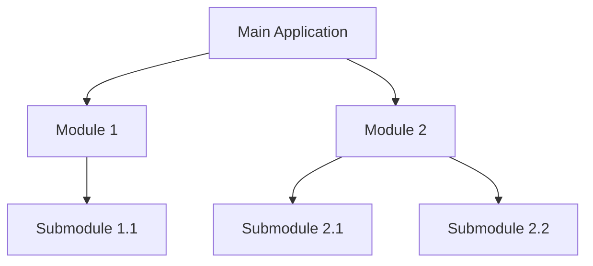
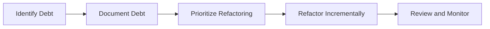

## 21.11 Sustainable Software Development

In the rapidly evolving world of software engineering, sustainable software development is a critical practice that ensures the longevity and adaptability of your codebase. This section delves into the principles and practices of writing maintainable and extensible code in Kotlin, with a particular focus on managing technical debt. Let's explore how we can create software that stands the test of time, adapts to changing requirements, and remains a joy to work with.

### Understanding Sustainable Software Development

Sustainable software development is about creating software that is easy to maintain, extend, and adapt over time. It involves writing code that is clean, well-documented, and designed with future changes in mind. The goal is to minimize technical debt, which refers to the cost of additional work required in the future due to shortcuts or suboptimal solutions implemented today.

#### Key Concepts

1. **Maintainability**: The ease with which a software system can be modified to fix defects, improve performance, or adapt to a changing environment.
2. **Extensibility**: The ability to add new features or modify existing ones with minimal impact on existing code.
3. **Technical Debt**: The implied cost of future refactoring due to quick and dirty solutions implemented in the present.

### Principles of Sustainable Software Development

To achieve sustainability in software development, we must adhere to certain principles that guide our design and coding practices. Here are some key principles to consider:

#### 1. Write Clean Code

Clean code is the foundation of sustainable software development. It is easy to read, understand, and modify. Here are some tips for writing clean code:

- **Use Descriptive Names**: Choose meaningful names for variables, functions, and classes that convey their purpose.
- **Keep Functions Small**: Each function should perform a single task and be concise.
- **Avoid Deep Nesting**: Limit the depth of nested structures to improve readability.
- **Use Comments Wisely**: Comments should explain why something is done, not what is done. Aim for self-explanatory code.

#### 2. Embrace Modularity

Modular code is easier to manage and extend. It involves breaking down a system into smaller, independent modules that can be developed, tested, and maintained separately.

- **Use Packages and Modules**: Organize your code into logical packages and modules to promote separation of concerns.
- **Apply the Single Responsibility Principle (SRP)**: Each module or class should have one reason to change, focusing on a single responsibility.

#### 3. Favor Composition Over Inheritance

Composition involves building classes by combining objects rather than inheriting from a parent class. This approach promotes flexibility and reduces tight coupling.

- **Use Interfaces and Delegation**: Define interfaces for common behaviors and use delegation to share functionality between classes.
- **Avoid Deep Inheritance Hierarchies**: Keep inheritance shallow to avoid complexity and fragility.

#### 4. Prioritize Testability

Testing is crucial for maintaining code quality and ensuring that changes do not introduce new bugs. Write tests that are easy to understand and maintain.

- **Write Unit Tests**: Test individual components in isolation to ensure they work as expected.
- **Use Test-Driven Development (TDD)**: Write tests before implementing functionality to guide your design and ensure coverage.

#### 5. Manage Technical Debt

Technical debt is inevitable, but it can be managed effectively to minimize its impact on your project.

- **Identify and Document Debt**: Keep track of known issues and areas that need improvement.
- **Prioritize Refactoring**: Regularly allocate time to refactor and improve code quality.
- **Balance Speed and Quality**: Make informed decisions about when to take shortcuts and when to invest in quality.

### Implementing Sustainable Practices in Kotlin

Kotlin offers several language features and tools that support sustainable software development. Let's explore how we can leverage these features to write maintainable and extensible code.

#### Kotlin's Language Features

1. **Null Safety**

Kotlin's type system is designed to eliminate null pointer exceptions by making all types non-nullable by default. This feature encourages developers to handle nullability explicitly, reducing runtime errors and improving code reliability.

```kotlin
fun greet(name: String?) {
    val greeting = name?.let { "Hello, $it!" } ?: "Hello, Guest!"
    println(greeting)
}
```

2. **Data Classes**

Data classes in Kotlin provide a concise way to create classes that are primarily used to hold data. They automatically generate useful methods such as `equals()`, `hashCode()`, and `toString()`, reducing boilerplate code.

```kotlin
data class User(val name: String, val age: Int)
```

3. **Extension Functions**

Extension functions allow you to add new functionality to existing classes without modifying their source code. This feature promotes code reuse and enhances readability.

```kotlin
fun String.isPalindrome(): Boolean {
    return this == this.reversed()
}

val word = "level"
println(word.isPalindrome()) // Output: true
```

4. **Coroutines**

Kotlin's coroutines provide a powerful way to handle asynchronous programming, making it easier to write non-blocking code. They help manage concurrency and improve the responsiveness of applications.

```kotlin
import kotlinx.coroutines.*

fun main() = runBlocking {
    launch {
        delay(1000L)
        println("World!")
    }
    println("Hello,")
}
```

#### Best Practices for Kotlin Development

1. **Use Immutability**

Immutability is a key concept in sustainable software development. Immutable objects are easier to reason about and reduce the risk of unintended side effects.

- **Prefer `val` over `var`**: Use `val` to declare read-only variables whenever possible.
- **Use Immutable Collections**: Leverage Kotlin's immutable collection interfaces to prevent modification.

2. **Leverage Kotlin's Type System**

Kotlin's type system is designed to catch errors at compile time, reducing runtime issues.

- **Use Sealed Classes for State Management**: Sealed classes provide a way to represent restricted class hierarchies, making it easier to handle different states in a type-safe manner.

```kotlin
sealed class Result {
    data class Success(val data: String) : Result()
    data class Error(val error: Throwable) : Result()
}
```

3. **Adopt Functional Programming Techniques**

Functional programming promotes immutability and pure functions, which are easier to test and reason about.

- **Use Higher-Order Functions**: Pass functions as parameters to promote code reuse and flexibility.
- **Leverage Lambdas and Inline Functions**: Write concise and expressive code using Kotlin's lambda syntax.

4. **Document Your Code**

Documentation is essential for maintaining and extending code. Use Kotlin's documentation tools to generate clear and comprehensive documentation.

- **Use KDoc for Documentation**: Write documentation comments using KDoc syntax to generate API documentation.

```kotlin
/**
 * Calculates the sum of two integers.
 *
 * @param a the first integer
 * @param b the second integer
 * @return the sum of a and b
 */
fun sum(a: Int, b: Int): Int {
    return a + b
}
```

### Managing Technical Debt

Technical debt is a reality in software development, but it can be managed effectively to ensure the sustainability of your project. Here are some strategies for managing technical debt:

#### 1. Identify and Prioritize Debt

- **Conduct Code Reviews**: Regular code reviews help identify areas of technical debt and promote best practices.
- **Use Static Analysis Tools**: Tools like Detekt can automatically identify code smells and potential issues in your Kotlin codebase.

#### 2. Plan for Refactoring

- **Allocate Time for Refactoring**: Regularly schedule time for refactoring to address technical debt and improve code quality.
- **Refactor Incrementally**: Break down refactoring tasks into smaller, manageable pieces to minimize disruption.

#### 3. Balance Speed and Quality

- **Make Informed Decisions**: Weigh the trade-offs between delivering features quickly and maintaining code quality.
- **Communicate with Stakeholders**: Ensure that stakeholders understand the impact of technical debt and the importance of addressing it.

### Tools and Resources for Sustainable Development

Kotlin offers a variety of tools and resources to support sustainable software development. Here are some recommended tools and resources:

#### 1. Integrated Development Environments (IDEs)

- **IntelliJ IDEA**: A powerful IDE with excellent Kotlin support, including code completion, refactoring, and debugging tools.
- **Android Studio**: Based on IntelliJ IDEA, Android Studio provides a comprehensive environment for Android development with Kotlin.

#### 2. Build Tools

- **Gradle**: A flexible build automation tool that supports Kotlin DSL for writing build scripts.
- **Maven**: A popular build tool with Kotlin support through plugins.

#### 3. Testing Frameworks

- **JUnit**: A widely used testing framework for unit testing in Kotlin.
- **Kotest**: A Kotlin-specific testing framework that supports property-based testing and more.

#### 4. Static Analysis Tools

- **Detekt**: A static analysis tool for Kotlin that helps identify code smells and enforce coding standards.
- **SonarQube**: A platform for continuous inspection of code quality, supporting Kotlin analysis.

#### 5. Documentation Tools

- **KDoc**: A documentation tool for generating API documentation from KDoc comments in Kotlin code.
- **Dokka**: A documentation engine for Kotlin that generates documentation in various formats.

### Visualizing Sustainable Software Development

To better understand the principles of sustainable software development, let's visualize some key concepts using Mermaid.js diagrams.

#### Visualizing Code Modularity



*Caption: This diagram illustrates a modular application structure, where the main application is composed of independent modules and submodules.*

#### Visualizing Technical Debt Management



*Caption: This flowchart outlines the process of managing technical debt, from identification to refactoring and monitoring.*

### Conclusion

Sustainable software development is a journey, not a destination. By adopting the principles and practices outlined in this guide, you can create software that is maintainable, extensible, and resilient to change. Remember, the key to sustainability is continuous improvement and a commitment to quality. As you progress in your Kotlin development journey, keep experimenting, stay curious, and embrace the challenges and opportunities that come your way.

## Quiz Time!



### What is the primary goal of sustainable software development?

- [x] To create software that is easy to maintain, extend, and adapt over time.
- [ ] To deliver software quickly, regardless of quality.
- [ ] To focus solely on performance optimization.
- [ ] To minimize the use of third-party libraries.

> **Explanation:** Sustainable software development aims to create software that is maintainable, extensible, and adaptable, ensuring its longevity and ease of modification.

### Which Kotlin feature helps eliminate null pointer exceptions?

- [x] Null Safety
- [ ] Data Classes
- [ ] Extension Functions
- [ ] Coroutines

> **Explanation:** Kotlin's null safety feature makes all types non-nullable by default, reducing the risk of null pointer exceptions.

### What is the benefit of using data classes in Kotlin?

- [x] They reduce boilerplate code by automatically generating useful methods.
- [ ] They allow for inheritance from multiple classes.
- [ ] They improve performance by using less memory.
- [ ] They enable asynchronous programming.

> **Explanation:** Data classes in Kotlin automatically generate methods like `equals()`, `hashCode()`, and `toString()`, reducing boilerplate code.

### Why is composition favored over inheritance in sustainable software development?

- [x] It promotes flexibility and reduces tight coupling.
- [ ] It allows for deeper inheritance hierarchies.
- [ ] It simplifies code by combining multiple classes.
- [ ] It improves performance by reducing memory usage.

> **Explanation:** Composition promotes flexibility and reduces tight coupling by allowing classes to be built by combining objects rather than inheriting from a parent class.

### What is the purpose of using sealed classes in Kotlin?

- [x] To represent restricted class hierarchies and manage different states in a type-safe manner.
- [ ] To enable multiple inheritance.
- [ ] To improve performance by using less memory.
- [ ] To allow for asynchronous programming.

> **Explanation:** Sealed classes in Kotlin are used to represent restricted class hierarchies, making it easier to handle different states in a type-safe manner.

### How can technical debt be effectively managed?

- [x] By identifying, documenting, and prioritizing debt, and planning for regular refactoring.
- [ ] By ignoring it until it becomes a critical issue.
- [ ] By focusing solely on performance optimization.
- [ ] By using more third-party libraries.

> **Explanation:** Technical debt can be managed by identifying, documenting, and prioritizing it, and planning for regular refactoring to improve code quality.

### Which tool is recommended for static analysis of Kotlin code?

- [x] Detekt
- [ ] Gradle
- [ ] JUnit
- [ ] KDoc

> **Explanation:** Detekt is a static analysis tool for Kotlin that helps identify code smells and enforce coding standards.

### What is the advantage of using Kotlin's coroutines?

- [x] They provide a powerful way to handle asynchronous programming and improve responsiveness.
- [ ] They enable multiple inheritance.
- [ ] They automatically generate useful methods.
- [ ] They improve performance by using less memory.

> **Explanation:** Kotlin's coroutines provide a powerful way to handle asynchronous programming, making it easier to write non-blocking code and improve responsiveness.

### What is the role of documentation in sustainable software development?

- [x] To maintain and extend code by providing clear and comprehensive information.
- [ ] To improve performance by reducing memory usage.
- [ ] To enable multiple inheritance.
- [ ] To allow for asynchronous programming.

> **Explanation:** Documentation is essential for maintaining and extending code by providing clear and comprehensive information about the codebase.

### True or False: Sustainable software development focuses solely on delivering software quickly.

- [ ] True
- [x] False

> **Explanation:** Sustainable software development focuses on creating software that is maintainable, extensible, and adaptable, rather than solely on quick delivery.


