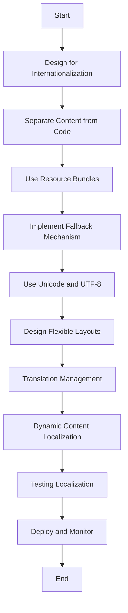

## 21.12 Internationalization and Localization

In today's interconnected world, developing software that caters to a global audience is more important than ever. Internationalization (i18n) and localization (l10n) are crucial processes in making applications accessible and user-friendly across different languages and regions. In this section, we will delve into the best practices for implementing internationalization and localization in Kotlin applications, ensuring that your software can reach and resonate with a diverse audience.

### Understanding Internationalization and Localization

Before we dive into the technical aspects, let's clarify what internationalization and localization entail:

- **Internationalization (i18n):** This is the process of designing your application in such a way that it can be easily adapted to various languages and regions without requiring engineering changes. It involves separating the core functionality from locale-specific elements.

- **Localization (l10n):** This refers to the adaptation of your application to a specific locale, which includes translating text, adjusting date and time formats, currency symbols, and other region-specific elements.

### Key Concepts and Terminology

1. **Locale:** A set of parameters that define the user's language, region, and any special variant preferences. In Kotlin, you can use `Locale` class from the Java standard library.

2. **Resource Bundles:** These are collections of locale-specific resources, such as strings and images, that your application can load at runtime based on the current locale.

3. **Translation Files:** Files that contain translated text for different locales. Common formats include `.properties` files for Java-based applications and `.json` or `.xml` for web applications.

4. **Fallback Mechanism:** A strategy to provide default resources when a specific locale resource is not available.

### Best Practices for Internationalization

#### 1. Design for Internationalization from the Start

- **Separate Content from Code:** Store all user-facing text in external resource files. This makes it easier to translate and manage content without altering the codebase.

- **Use Resource Bundles:** Utilize Kotlin's interoperability with Java to leverage `ResourceBundle` for managing locale-specific resources.

```kotlin
import java.util.*

fun getLocalizedString(key: String, locale: Locale): String {
    val bundle = ResourceBundle.getBundle("MessagesBundle", locale)
    return bundle.getString(key)
}
```

- **Avoid Hardcoding Text:** Never hardcode strings in your code. Instead, reference them from your resource files.

#### 2. Implement a Fallback Mechanism

- **Default Locale:** Always provide a default locale to ensure your application functions even if specific locale resources are missing.

```kotlin
val defaultLocale = Locale.ENGLISH
val currentLocale = Locale.getDefault()

val message = getLocalizedString("welcome.message", currentLocale) ?: 
              getLocalizedString("welcome.message", defaultLocale)
```

#### 3. Use Unicode and UTF-8 Encoding

- **Character Encoding:** Ensure your application supports Unicode and uses UTF-8 encoding to handle a wide range of characters and symbols.

#### 4. Design Flexible Layouts

- **Responsive UI:** Design your user interface to accommodate different text lengths and orientations. For instance, some languages like Arabic and Hebrew are read from right to left.

### Localization Techniques

#### 1. Translation Management

- **Translation Files:** Organize your translations in structured files. For Kotlin applications, you can use `.properties` files or JSON/XML formats.

- **Translation Tools:** Utilize translation management tools like Crowdin or Transifex to streamline the translation process and collaborate with translators.

#### 2. Dynamic Content Localization

- **Date and Time Formatting:** Use `java.time` package to format dates and times according to the user's locale.

```kotlin
import java.time.LocalDateTime
import java.time.format.DateTimeFormatter
import java.util.*

fun formatDateTime(dateTime: LocalDateTime, locale: Locale): String {
    val formatter = DateTimeFormatter.ofPattern("yyyy-MM-dd HH:mm", locale)
    return dateTime.format(formatter)
}
```

- **Number and Currency Formatting:** Use `NumberFormat` class to format numbers and currencies based on locale.

```kotlin
import java.text.NumberFormat

fun formatCurrency(amount: Double, locale: Locale): String {
    val currencyFormatter = NumberFormat.getCurrencyInstance(locale)
    return currencyFormatter.format(amount)
}
```

#### 3. Testing Localization

- **Locale Testing:** Test your application with different locales to ensure that all elements are displayed correctly.

- **Automated Tests:** Write automated tests to verify that locale-specific resources are loaded and displayed properly.

### Kotlin-Specific Features for Internationalization

#### 1. Kotlin Multiplatform

- **Shared Codebase:** Use Kotlin Multiplatform to share localization logic across different platforms (JVM, JS, Native).

#### 2. Kotlin DSL for Localization

- **Domain-Specific Languages (DSLs):** Create DSLs to simplify the management of localization resources.

```kotlin
class LocalizationBuilder {
    private val messages = mutableMapOf<String, String>()

    fun message(key: String, value: String) {
        messages[key] = value
    }

    fun build(): Map<String, String> = messages
}

fun localization(init: LocalizationBuilder.() -> Unit): Map<String, String> {
    val builder = LocalizationBuilder()
    builder.init()
    return builder.build()
}

val englishMessages = localization {
    message("welcome", "Welcome")
    message("goodbye", "Goodbye")
}
```

### Challenges in Internationalization and Localization

#### 1. Cultural Differences

- **Contextual Translation:** Ensure translations are culturally appropriate and contextually accurate.

#### 2. Continuous Updates

- **Dynamic Content:** Manage updates to translations as your application evolves.

#### 3. Performance Considerations

- **Resource Loading:** Optimize the loading of resource bundles to minimize performance overhead.

### Visualizing the Localization Process



*Figure 1: Internationalization and Localization Workflow*

### Conclusion

Internationalization and localization are essential for creating applications that can thrive in a global market. By following best practices and leveraging Kotlin's features, you can build software that is both flexible and culturally sensitive. Remember, the key to successful internationalization is planning and designing your application with a global audience in mind from the very beginning.

### Further Reading

- [Kotlin Documentation on Localization](https://kotlinlang.org/docs/reference/)
- [Java Internationalization and Localization](https://docs.oracle.com/javase/tutorial/i18n/)
- [Unicode Consortium](https://www.unicode.org/)

## Quiz Time!



### What is the primary goal of internationalization (i18n)?

- [x] To design software that can be easily adapted to various languages and regions without engineering changes.
- [ ] To translate software into multiple languages.
- [ ] To create a single version of software for all users.
- [ ] To focus solely on translating text.

> **Explanation:** Internationalization involves designing software in a way that it can be easily adapted to different languages and regions without requiring changes to the codebase.

### What is a locale in the context of internationalization?

- [x] A set of parameters that define the user's language, region, and variant preferences.
- [ ] A file containing translations for a specific language.
- [ ] A tool used for managing translations.
- [ ] A programming language feature for handling strings.

> **Explanation:** A locale is a set of parameters that define the user's language, region, and any special variant preferences, which helps in adapting the application for different users.

### Which of the following is a best practice for internationalization?

- [x] Separating content from code.
- [ ] Hardcoding strings in the application.
- [ ] Using only one language in the application.
- [ ] Ignoring cultural differences.

> **Explanation:** Separating content from code is a best practice as it allows for easier translation and management of content without altering the codebase.

### What is the purpose of a fallback mechanism in localization?

- [x] To provide default resources when specific locale resources are unavailable.
- [ ] To translate text automatically.
- [ ] To ignore missing translations.
- [ ] To prioritize certain locales over others.

> **Explanation:** A fallback mechanism ensures that the application can provide default resources when specific locale resources are not available, maintaining functionality.

### How can you format dates and times according to the user's locale in Kotlin?

- [x] Using the `java.time` package and `DateTimeFormatter`.
- [ ] Hardcoding date formats in the application.
- [ ] Using the `String` class.
- [ ] Ignoring locale-specific formats.

> **Explanation:** The `java.time` package and `DateTimeFormatter` are used to format dates and times according to the user's locale in Kotlin.

### Which encoding should be used to handle a wide range of characters and symbols?

- [x] UTF-8
- [ ] ASCII
- [ ] ISO-8859-1
- [ ] UTF-16

> **Explanation:** UTF-8 encoding should be used to handle a wide range of characters and symbols, as it supports Unicode.

### What is the role of resource bundles in internationalization?

- [x] To manage locale-specific resources such as strings and images.
- [ ] To compile the application code.
- [ ] To store user data.
- [ ] To define application logic.

> **Explanation:** Resource bundles are used to manage locale-specific resources, allowing the application to load appropriate content based on the current locale.

### What is a common format for translation files in Java-based applications?

- [x] `.properties` files
- [ ] `.txt` files
- [ ] `.docx` files
- [ ] `.csv` files

> **Explanation:** `.properties` files are commonly used in Java-based applications for managing translations and locale-specific resources.

### Why is it important to design flexible layouts in internationalized applications?

- [x] To accommodate different text lengths and orientations.
- [ ] To reduce application size.
- [ ] To simplify the codebase.
- [ ] To improve performance.

> **Explanation:** Designing flexible layouts is important to accommodate different text lengths and orientations, ensuring the application is user-friendly across various languages.

### True or False: Localization involves only translating text.

- [ ] True
- [x] False

> **Explanation:** Localization involves more than just translating text; it includes adapting the application to specific locales, which may involve adjusting date formats, currency symbols, and other region-specific elements.



Remember, this is just the beginning. As you progress, you'll build more complex and interactive global applications. Keep experimenting, stay curious, and enjoy the journey!
