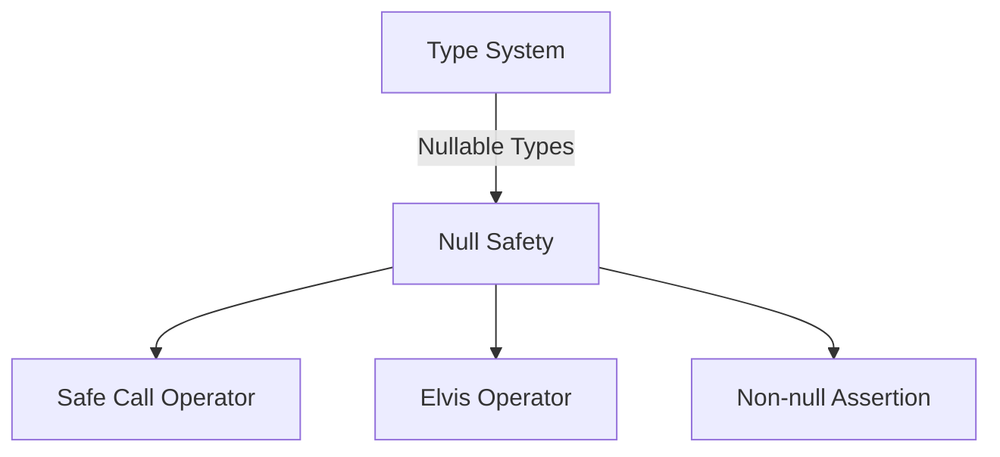
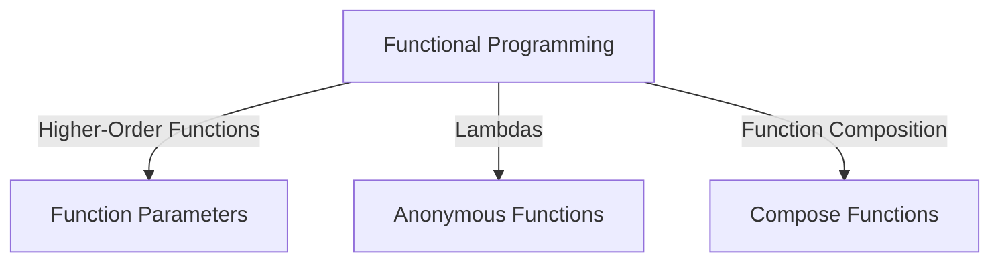

## 21.2 Effective Use of Language Features

Kotlin, as a modern programming language, provides a rich set of features designed to enhance productivity and maintainability. By leveraging these features effectively, developers can write more concise, expressive, and robust code. This section delves into how expert software engineers and architects can maximize productivity using Kotlin's language features while avoiding common anti-patterns.

### Understanding Kotlin's Core Language Features

Kotlin's design philosophy emphasizes simplicity and safety. The language incorporates several features that help developers write clear and error-free code. Let's explore these features and understand how they contribute to effective programming.

#### 1. Null Safety

One of Kotlin's standout features is its approach to null safety. By design, Kotlin eliminates the null pointer exceptions that plague many other languages.

```kotlin
// Example of null safety in Kotlin
fun main() {
    var name: String? = null
    println(name?.length) // Safe call operator
    println(name?.length ?: "Unknown") // Elvis operator
}
```

- **Safe Call Operator (`?.`)**: Allows you to safely access a property or call a method on a nullable object.
- **Elvis Operator (`?:`)**: Provides a default value if the preceding expression is null.

**Avoiding Anti-patterns**: Overusing the `!!` operator can lead to null pointer exceptions. Always prefer safe calls and the Elvis operator.

#### 2. Immutability and Data Classes

Kotlin encourages immutability, which leads to safer and more predictable code. Data classes in Kotlin are a concise way to create immutable data structures.

```kotlin
// Example of a data class
data class User(val name: String, val age: Int)

fun main() {
    val user = User("Alice", 30)
    println(user)
}
```

- **Data Classes**: Automatically provide `equals()`, `hashCode()`, `toString()`, and `copy()` methods.
- **Immutability**: Use `val` for read-only variables to ensure data integrity.

**Avoiding Anti-patterns**: Avoid mutable data structures unless necessary. Use `val` instead of `var` to prevent unintended modifications.

#### 3. Extension Functions and Properties

Kotlin allows you to extend existing classes with new functionality without modifying their source code.

```kotlin
// Example of an extension function
fun String.isPalindrome(): Boolean {
    return this == this.reversed()
}

fun main() {
    println("madam".isPalindrome()) // true
}
```

- **Extension Functions**: Add new functions to existing classes.
- **Extension Properties**: Similar to extension functions but for properties.

**Avoiding Anti-patterns**: Overusing extension functions can lead to cluttered code. Use them judiciously to enhance readability.

#### 4. Functional Programming Features

Kotlin supports functional programming paradigms, allowing you to write more expressive and concise code.

```kotlin
// Example of higher-order functions and lambdas
fun calculate(x: Int, y: Int, operation: (Int, Int) -> Int): Int {
    return operation(x, y)
}

fun main() {
    val sum = calculate(5, 3) { a, b -> a + b }
    println(sum) // 8
}
```

- **Higher-Order Functions**: Functions that take other functions as parameters or return them.
- **Lambdas**: Anonymous functions that can be used to pass behavior as data.

**Avoiding Anti-patterns**: Avoid overly complex lambda expressions that reduce readability. Keep them simple and clear.

#### 5. Coroutines for Asynchronous Programming

Kotlin's coroutines provide a powerful way to handle asynchronous programming, making it easier to write non-blocking code.

```kotlin
import kotlinx.coroutines.*

fun main() = runBlocking {
    launch {
        delay(1000L)
        println("World!")
    }
    println("Hello,")
}
```

- **Coroutines**: Lightweight threads that allow for asynchronous programming without blocking the main thread.
- **Suspending Functions**: Functions that can be paused and resumed, marked with the `suspend` keyword.

**Avoiding Anti-patterns**: Avoid using `GlobalScope` for launching coroutines unless necessary. Prefer structured concurrency for better lifecycle management.

### Advanced Language Features

As you become more proficient with Kotlin, you can leverage advanced language features to further enhance your code.

#### 6. Inline Functions and Reified Types

Inline functions can improve performance by reducing the overhead of function calls, while reified types allow you to work with generic types at runtime.

```kotlin
// Example of an inline function with reified type
inline fun <reified T> printType() {
    println(T::class)
}

fun main() {
    printType<String>() // class kotlin.String
}
```

- **Inline Functions**: Functions that are expanded at the call site, reducing overhead.
- **Reified Types**: Allow access to the type information of generic parameters at runtime.

**Avoiding Anti-patterns**: Overusing inline functions can lead to code bloat. Use them when performance gains are significant.

#### 7. Delegated Properties

Delegated properties provide a way to delegate the implementation of a property to another object.

```kotlin
import kotlin.properties.Delegates

// Example of a delegated property
class User {
    var name: String by Delegates.observable("<no name>") {
        prop, old, new ->
        println("$old -> $new")
    }
}

fun main() {
    val user = User()
    user.name = "Alice"
    user.name = "Bob"
}
```

- **Delegated Properties**: Use `by` keyword to delegate property implementation.
- **Built-in Delegates**: Include `lazy`, `observable`, and `vetoable`.

**Avoiding Anti-patterns**: Avoid complex delegation logic that can obscure the property's behavior. Keep it simple and transparent.

#### 8. Sealed Classes and Enum Classes

Sealed classes and enum classes provide a way to define restricted class hierarchies.

```kotlin
// Example of a sealed class
sealed class Result {
    data class Success(val data: String) : Result()
    data class Error(val exception: Exception) : Result()
}

fun handleResult(result: Result) {
    when (result) {
        is Result.Success -> println("Success: ${result.data}")
        is Result.Error -> println("Error: ${result.exception}")
    }
}
```

- **Sealed Classes**: Allow defining a closed set of subclasses, ensuring exhaustive `when` expressions.
- **Enum Classes**: Define a fixed set of constants.

**Avoiding Anti-patterns**: Avoid using sealed classes for open-ended hierarchies. Use them when the set of subclasses is known and fixed.

### Visualizing Kotlin's Language Features

To better understand the relationships between Kotlin's language features, let's visualize some of these concepts using Mermaid.js diagrams.

#### Diagram: Kotlin's Type System and Null Safety



**Caption**: This diagram illustrates how Kotlin's type system enforces null safety through nullable types and operators like safe call and Elvis.

#### Diagram: Kotlin's Functional Programming Features



**Caption**: This diagram shows the core components of Kotlin's functional programming features, including higher-order functions and lambdas.

### Best Practices for Using Kotlin Language Features

To maximize productivity and maintainability, follow these best practices when using Kotlin's language features:

1. **Embrace Null Safety**: Use nullable types and safe calls to prevent null pointer exceptions. Avoid the `!!` operator unless absolutely necessary.

2. **Favor Immutability**: Use `val` for variables and data classes for immutable data structures. This leads to safer and more predictable code.

3. **Leverage Extension Functions Wisely**: Use extension functions to add functionality to existing classes without modifying them. Avoid overusing them to prevent clutter.

4. **Utilize Functional Programming**: Use higher-order functions and lambdas to write concise and expressive code. Keep lambda expressions simple and clear.

5. **Adopt Coroutines for Asynchronous Tasks**: Use coroutines for non-blocking asynchronous programming. Prefer structured concurrency for better lifecycle management.

6. **Optimize with Inline Functions**: Use inline functions to reduce overhead in performance-critical sections. Avoid overuse to prevent code bloat.

7. **Simplify with Delegated Properties**: Use delegated properties to delegate property implementation. Keep delegation logic simple and transparent.

8. **Define Restricted Hierarchies with Sealed Classes**: Use sealed classes for closed sets of subclasses. Ensure exhaustive `when` expressions for better type safety.

### Try It Yourself

To solidify your understanding of Kotlin's language features, try modifying the code examples provided. Experiment with different operators, create your own extension functions, and explore the use of coroutines in various scenarios.

### References and Further Reading

- [Kotlin Documentation](https://kotlinlang.org/docs/home.html)
- [Kotlin Coroutines Guide](https://kotlinlang.org/docs/coroutines-guide.html)
- [Kotlin Language Features](https://kotlinlang.org/docs/reference/language-features.html)

### Knowledge Check

- How does Kotlin's null safety feature prevent null pointer exceptions?
- What are the benefits of using data classes in Kotlin?
- How can extension functions enhance existing classes?
- What is the role of coroutines in asynchronous programming?
- How do inline functions improve performance?

### Embrace the Journey

Remember, mastering Kotlin's language features is a journey. As you progress, you'll discover new ways to write more efficient and expressive code. Keep experimenting, stay curious, and enjoy the process!

## Quiz Time!



### What is the primary benefit of Kotlin's null safety feature?

- [x] Preventing null pointer exceptions
- [ ] Improving code readability
- [ ] Enhancing performance
- [ ] Reducing memory usage

> **Explanation:** Kotlin's null safety feature is designed to prevent null pointer exceptions by enforcing nullability at the type level.

### Which operator in Kotlin provides a default value if an expression is null?

- [ ] Safe call operator (`?.`)
- [x] Elvis operator (`?:`)
- [ ] Non-null assertion operator (`!!`)
- [ ] Lambda operator (`->`)

> **Explanation:** The Elvis operator (`?:`) provides a default value if the preceding expression is null.

### What is a key advantage of using data classes in Kotlin?

- [ ] They allow for mutable data structures.
- [x] They automatically generate `equals()`, `hashCode()`, and `toString()` methods.
- [ ] They improve runtime performance.
- [ ] They simplify error handling.

> **Explanation:** Data classes in Kotlin automatically generate useful methods like `equals()`, `hashCode()`, and `toString()`.

### How can extension functions be used in Kotlin?

- [x] To add new functionality to existing classes without modifying them
- [ ] To create new classes
- [ ] To improve performance
- [ ] To handle exceptions

> **Explanation:** Extension functions allow you to add new functionality to existing classes without modifying their source code.

### What is the purpose of Kotlin's coroutines?

- [ ] To improve code readability
- [x] To handle asynchronous programming without blocking the main thread
- [ ] To enhance security
- [ ] To simplify error handling

> **Explanation:** Coroutines in Kotlin are used to handle asynchronous programming efficiently without blocking the main thread.

### Which keyword is used to mark a function as a suspending function in Kotlin?

- [x] `suspend`
- [ ] `async`
- [ ] `await`
- [ ] `defer`

> **Explanation:** The `suspend` keyword is used to mark a function as a suspending function in Kotlin, allowing it to be paused and resumed.

### What is a common anti-pattern when using Kotlin's null safety feature?

- [x] Overusing the non-null assertion operator (`!!`)
- [ ] Using safe calls (`?.`)
- [ ] Using the Elvis operator (`?:`)
- [ ] Avoiding nullable types

> **Explanation:** Overusing the non-null assertion operator (`!!`) can lead to null pointer exceptions, which Kotlin's null safety feature aims to prevent.

### How do inline functions benefit performance in Kotlin?

- [x] By reducing the overhead of function calls
- [ ] By improving code readability
- [ ] By simplifying error handling
- [ ] By enhancing security

> **Explanation:** Inline functions reduce the overhead of function calls by expanding the function body at the call site.

### What is the role of delegated properties in Kotlin?

- [ ] To improve performance
- [x] To delegate property implementation to another object
- [ ] To handle exceptions
- [ ] To create new classes

> **Explanation:** Delegated properties in Kotlin allow you to delegate the implementation of a property to another object.

### True or False: Sealed classes in Kotlin allow for open-ended class hierarchies.

- [ ] True
- [x] False

> **Explanation:** Sealed classes in Kotlin are used for closed sets of subclasses, not open-ended hierarchies.


