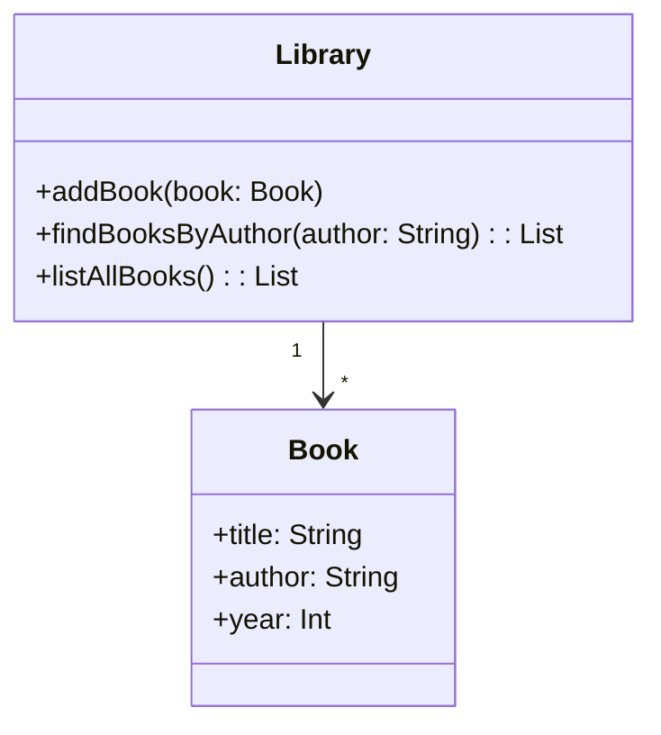

## 21.3 API Design Guidelines

Designing APIs is a critical aspect of software development, especially in a world where interoperability and integration are key. As Kotlin developers, we have the advantage of leveraging Kotlin's expressive syntax and modern features to create APIs that are not only powerful but also user-friendly and maintainable. In this section, we will explore the principles of API design, focusing on building user-friendly APIs and ensuring backward compatibility.

### Understanding API Design

APIs, or Application Programming Interfaces, are the bridges that allow different software systems to communicate with each other. A well-designed API can significantly enhance the usability and functionality of a software system, making it easier for developers to integrate and extend applications.

#### Key Principles of API Design

1. **Simplicity**: Keep the API simple and intuitive. Avoid unnecessary complexity and provide clear, concise documentation.
2. **Consistency**: Use consistent naming conventions and design patterns throughout the API to reduce the learning curve for developers.
3. **Flexibility**: Design APIs that are flexible enough to accommodate future changes without breaking existing functionality.
4. **Security**: Implement security best practices to protect sensitive data and prevent unauthorized access.
5. **Performance**: Optimize the API for performance, ensuring that it can handle the expected load efficiently.

### Building User-Friendly APIs

A user-friendly API is one that developers find easy to understand, use, and integrate into their applications. Here are some guidelines to achieve this:

#### 1. Use Clear and Consistent Naming Conventions

- **Descriptive Names**: Use descriptive names for functions, classes, and parameters that clearly convey their purpose.
- **Consistent Style**: Follow a consistent naming style, such as camelCase for functions and variables, and PascalCase for classes.

#### 2. Provide Comprehensive Documentation

- **API Reference**: Include detailed API reference documentation that describes each function, parameter, and return value.
- **Code Examples**: Provide code examples to demonstrate how to use the API effectively.
- **Usage Guidelines**: Offer guidelines on best practices for using the API, including common pitfalls to avoid.

#### 3. Design for Intuitive Usability

- **Logical Structure**: Organize the API logically, grouping related functions and classes together.
- **Minimalist Approach**: Avoid overloading the API with too many features. Focus on the core functionality and provide extensions for advanced use cases.

#### 4. Ensure Robust Error Handling

- **Meaningful Error Messages**: Provide clear and meaningful error messages that help developers diagnose and fix issues quickly.
- **Consistent Error Handling**: Use a consistent approach to error handling across the API, such as exceptions or error codes.

#### 5. Support Multiple Platforms

- **Cross-Platform Compatibility**: Design the API to be compatible with multiple platforms, such as Android, iOS, and web applications.
- **Kotlin Multiplatform**: Leverage Kotlin Multiplatform to share code across different platforms, reducing duplication and maintenance effort.

### Ensuring Backward Compatibility

Backward compatibility is crucial for maintaining the stability and reliability of an API. It ensures that existing applications continue to function correctly even as the API evolves. Here are some strategies to achieve backward compatibility:

#### 1. Use Semantic Versioning

- **Versioning Scheme**: Adopt a versioning scheme that clearly indicates the nature of changes, such as major, minor, and patch versions.
- **Breaking Changes**: Reserve major version increments for breaking changes that are not backward compatible.

#### 2. Deprecate Features Gradually

- **Deprecation Policy**: Establish a clear deprecation policy that outlines how and when deprecated features will be removed.
- **Deprecation Warnings**: Provide deprecation warnings in the documentation and code to inform developers of upcoming changes.

#### 3. Maintain Compatibility Layers

- **Compatibility Wrappers**: Implement compatibility wrappers or adapters to support older versions of the API.
- **Legacy Support**: Consider maintaining legacy support for critical features that are widely used by existing applications.

#### 4. Test for Compatibility

- **Regression Testing**: Conduct thorough regression testing to ensure that new changes do not introduce compatibility issues.
- **Backward Compatibility Tests**: Implement automated tests that verify the compatibility of the API with previous versions.

### Code Examples

Let's explore some code examples to illustrate the concepts discussed above.

#### Example 1: Designing a Simple API with Clear Naming

```kotlin
// Define a simple API for managing a collection of books

data class Book(val title: String, val author: String, val year: Int)

class Library {
    private val books = mutableListOf<Book>()

    // Add a book to the library
    fun addBook(book: Book) {
        books.add(book)
    }

    // Find books by author
    fun findBooksByAuthor(author: String): List<Book> {
        return books.filter { it.author == author }
    }

    // List all books in the library
    fun listAllBooks(): List<Book> {
        return books.toList()
    }
}

// Usage example
fun main() {
    val library = Library()
    library.addBook(Book("1984", "George Orwell", 1949))
    library.addBook(Book("Brave New World", "Aldous Huxley", 1932))

    println("Books by George Orwell: ${library.findBooksByAuthor("George Orwell")}")
    println("All books in the library: ${library.listAllBooks()}")
}
```

#### Example 2: Implementing Backward Compatibility

```kotlin
// Define a versioned API with backward compatibility

interface LibraryV1 {
    fun addBook(book: Book)
    fun findBooksByAuthor(author: String): List<Book>
}

class LibraryV2 : LibraryV1 {
    private val books = mutableListOf<Book>()

    override fun addBook(book: Book) {
        books.add(book)
    }

    override fun findBooksByAuthor(author: String): List<Book> {
        return books.filter { it.author == author }
    }

    // New feature in V2: Find books by year
    fun findBooksByYear(year: Int): List<Book> {
        return books.filter { it.year == year }
    }
}

// Usage example
fun main() {
    val library: LibraryV1 = LibraryV2()
    library.addBook(Book("1984", "George Orwell", 1949))
    library.addBook(Book("Brave New World", "Aldous Huxley", 1932))

    println("Books by George Orwell: ${library.findBooksByAuthor("George Orwell")}")

    // Cast to LibraryV2 to access new features
    if (library is LibraryV2) {
        println("Books published in 1949: ${library.findBooksByYear(1949)}")
    }
}
```

### Visualizing API Design

To better understand the process of API design, let's visualize the structure of a simple API using a class diagram.



**Diagram Description**: The diagram above represents a simple API for managing a collection of books. The `Library` class provides methods to add books, find books by author, and list all books. The `Book` class represents a book with a title, author, and year of publication.

### Try It Yourself

Now that we've covered the basics of API design, let's encourage you to experiment with the code examples provided. Try modifying the `Library` class to add new features, such as finding books by title or sorting the books by year. Experiment with different approaches to backward compatibility, such as using interfaces or abstract classes.

### References and Links

For further reading on API design, consider exploring the following resources:

- [Kotlin Documentation](https://kotlinlang.org/docs/reference/)
- [Effective Java by Joshua Bloch](https://www.oreilly.com/library/view/effective-java-3rd/9780134686097/)
- [Designing Data-Intensive Applications by Martin Kleppmann](https://dataintensive.net/)

### Knowledge Check

Before we conclude, let's pose a few questions to reinforce your understanding of API design:

1. What are the key principles of API design?
2. How can you ensure backward compatibility in an API?
3. What are some best practices for designing user-friendly APIs?

### Embrace the Journey

Remember, designing APIs is both an art and a science. As you continue to develop your skills, you'll find new ways to create APIs that are both powerful and easy to use. Keep experimenting, stay curious, and enjoy the journey!

### Formatting and Structure

In this section, we've organized the content with clear headings and subheadings to make it easy to follow. We've used bullet points to break down complex information and highlighted important terms and concepts using bold text.

### Writing Style

Throughout this section, we've used first-person plural to create a collaborative feel. We've avoided gender-specific pronouns and used inclusive language to ensure that the content is accessible to all readers.

## Quiz Time!



### What is a key principle of API design?

- [x] Simplicity
- [ ] Complexity
- [ ] Obfuscation
- [ ] Redundancy

> **Explanation:** Simplicity is a key principle of API design, as it helps make the API easy to understand and use.

### How can you ensure backward compatibility in an API?

- [x] Use semantic versioning
- [ ] Remove deprecated features immediately
- [ ] Ignore compatibility layers
- [ ] Avoid testing for compatibility

> **Explanation:** Using semantic versioning helps communicate changes and maintain backward compatibility.

### What is the benefit of providing comprehensive documentation for an API?

- [x] It helps developers understand how to use the API effectively
- [ ] It increases the complexity of the API
- [ ] It makes the API harder to use
- [ ] It discourages developers from using the API

> **Explanation:** Comprehensive documentation helps developers understand how to use the API effectively.

### What is a common strategy for deprecating features in an API?

- [x] Provide deprecation warnings
- [ ] Remove features without notice
- [ ] Ignore deprecated features
- [ ] Make breaking changes without warning

> **Explanation:** Providing deprecation warnings helps inform developers of upcoming changes.

### What is the advantage of using Kotlin Multiplatform for API design?

- [x] It allows sharing code across different platforms
- [ ] It limits the API to a single platform
- [ ] It increases code duplication
- [ ] It complicates maintenance

> **Explanation:** Kotlin Multiplatform allows sharing code across different platforms, reducing duplication and maintenance effort.

### Why is it important to use clear and consistent naming conventions in an API?

- [x] It reduces the learning curve for developers
- [ ] It increases the complexity of the API
- [ ] It makes the API harder to understand
- [ ] It discourages developers from using the API

> **Explanation:** Clear and consistent naming conventions reduce the learning curve for developers.

### What is a benefit of designing an API with a minimalist approach?

- [x] It focuses on core functionality
- [ ] It adds unnecessary features
- [ ] It complicates the API
- [ ] It increases the learning curve

> **Explanation:** A minimalist approach focuses on core functionality and avoids overloading the API with too many features.

### How can you support multiple platforms in an API?

- [x] Design for cross-platform compatibility
- [ ] Limit the API to a single platform
- [ ] Increase code duplication
- [ ] Ignore platform-specific considerations

> **Explanation:** Designing for cross-platform compatibility ensures the API can be used on multiple platforms.

### What is a key consideration for optimizing API performance?

- [x] Efficiently handle the expected load
- [ ] Ignore performance considerations
- [ ] Increase the complexity of the API
- [ ] Use inefficient algorithms

> **Explanation:** Optimizing the API for performance ensures it can handle the expected load efficiently.

### True or False: Backward compatibility is not important for maintaining the stability of an API.

- [ ] True
- [x] False

> **Explanation:** Backward compatibility is crucial for maintaining the stability and reliability of an API.


