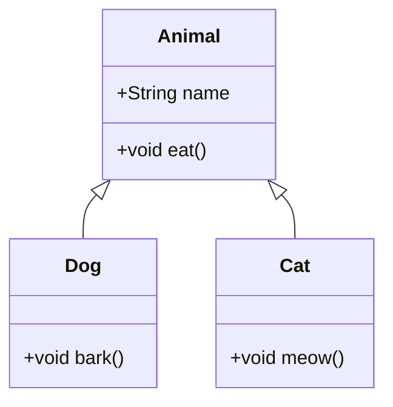

## 21.4 Documentation and Comments

In the realm of software development, the importance of clear and concise documentation cannot be overstated. For expert software engineers and architects working with Kotlin, maintaining code clarity through effective documentation and comments is crucial. This section delves into the best practices for documenting Kotlin code, using KotlinDoc, and generating comprehensive documentation that enhances code readability and maintainability.

### Introduction to Documentation and Comments

Documentation and comments serve as the bridge between the code and its users, whether they are other developers, future maintainers, or even the original author revisiting the code after some time. They provide context, explain the purpose and functionality of code segments, and offer insights into the design decisions made during development.

#### Why Documentation Matters

- **Improves Code Readability**: Well-documented code is easier to read and understand, reducing the cognitive load on developers.
- **Facilitates Maintenance**: Documentation helps maintainers understand the codebase, making it easier to fix bugs and add new features.
- **Enhances Collaboration**: Clear documentation enables team members to work together more effectively by providing a shared understanding of the code.
- **Preserves Knowledge**: It captures the rationale behind design decisions, ensuring that valuable knowledge is not lost over time.

### Best Practices for Writing Comments

Comments are an integral part of code documentation. They provide explanations and context that are not immediately apparent from the code itself. Here are some best practices for writing effective comments in Kotlin:

#### 1. Write Meaningful Comments

- **Explain the Why, Not the What**: Focus on explaining why a particular piece of code exists rather than what it does. The code itself should be self-explanatory regarding its functionality.
- **Avoid Redundancy**: Do not state the obvious. Comments should add value and not repeat what the code already conveys.

#### 2. Use Comments Sparingly

- **Prioritize Code Clarity**: Strive to write clear and self-explanatory code that minimizes the need for comments. Use meaningful variable names and modularize code to enhance readability.
- **Avoid Over-Commenting**: Excessive comments can clutter the code and make it harder to read. Use comments judiciously to highlight complex logic or important design decisions.

#### 3. Keep Comments Up-to-Date

- **Maintain Consistency**: Ensure that comments are updated whenever the code changes. Outdated comments can be misleading and cause confusion.
- **Review Regularly**: Incorporate comment review as part of the code review process to ensure accuracy and relevance.

#### 4. Use Standard Commenting Conventions

- **Single-Line Comments**: Use `//` for brief comments that explain a single line or a small block of code.
- **Multi-Line Comments**: Use `/* ... */` for longer comments that span multiple lines. These are useful for explaining complex logic or providing detailed explanations.

### KotlinDoc: Documenting Kotlin Code

KotlinDoc is a powerful tool for generating API documentation from Kotlin source code. It is similar to JavaDoc but tailored for Kotlin's syntax and features. KotlinDoc extracts comments from the source code and generates HTML documentation, making it easier for developers to understand and use the code.

#### Key Features of KotlinDoc

- **Automatic Documentation Generation**: KotlinDoc generates documentation directly from the source code, ensuring that it is always up-to-date with the latest code changes.
- **Support for Markdown**: KotlinDoc supports Markdown syntax, allowing developers to format comments with headings, lists, code blocks, and more.
- **Integration with IDEs**: KotlinDoc is integrated with popular IDEs like IntelliJ IDEA, providing a seamless experience for writing and generating documentation.

#### Writing KotlinDoc Comments

To write effective KotlinDoc comments, follow these guidelines:

- **Use KDoc Tags**: Utilize KDoc tags such as `@param`, `@return`, and `@throws` to document function parameters, return values, and exceptions. These tags provide structured information that enhances the readability of the documentation.
- **Provide Examples**: Include code examples within the documentation to illustrate how to use the API. Examples help users understand the practical application of the code.
- **Document Public APIs**: Focus on documenting public classes, functions, and properties. Internal implementation details should be documented only if they are complex or non-obvious.

#### Example of KotlinDoc Comments

```kotlin
/**
 * Calculates the factorial of a given number.
 *
 * @param n The number for which the factorial is to be calculated. Must be non-negative.
 * @return The factorial of the given number.
 * @throws IllegalArgumentException If the input number is negative.
 *
 * Example usage:
 * ```
 * val result = calculateFactorial(5)
 * println(result) // Output: 120
 * ```
 */
fun calculateFactorial(n: Int): Int {
    require(n >= 0) { "Input must be non-negative" }
    return if (n == 0) 1 else n * calculateFactorial(n - 1)
}
```

### Generating Documentation with KotlinDoc

Generating documentation with KotlinDoc is straightforward. The following steps outline the process:

1. **Set Up the Build Script**: Configure the build script (e.g., `build.gradle.kts`) to include the KotlinDoc task. This task will generate the documentation from the source code.

2. **Run the KotlinDoc Task**: Execute the KotlinDoc task using the build tool (e.g., Gradle) to generate the documentation. The generated documentation will be available in the specified output directory.

3. **Review and Publish**: Review the generated documentation for accuracy and completeness. Once satisfied, publish the documentation to a web server or documentation portal for easy access by developers.

#### Example Build Script Configuration

```kotlin
tasks.register<org.jetbrains.dokka.gradle.DokkaTask>("dokkaHtml") {
    outputDirectory.set(buildDir.resolve("dokka"))
    dokkaSourceSets {
        configureEach {
            includes.from("Module.md")
            sourceLink {
                localDirectory.set(file("src/main/kotlin"))
                remoteUrl.set(URL("https://github.com/your-repo/your-project/tree/main/src/main/kotlin"))
                remoteLineSuffix.set("#L")
            }
        }
    }
}
```

### Visualizing Documentation with Diagrams

In addition to textual documentation, diagrams can significantly enhance the understanding of complex code structures and workflows. Use tools like Mermaid.js to create diagrams that visually represent code architecture, data flow, and interactions.

#### Example: Visualizing a Kotlin Class Hierarchy



**Caption**: This diagram illustrates the class hierarchy of an `Animal` class with two subclasses, `Dog` and `Cat`. Each subclass inherits properties and methods from the `Animal` class.

### Encouraging Experimentation: Try It Yourself

To reinforce learning, experiment with the code examples provided in this section. Modify the `calculateFactorial` function to handle larger numbers using iterative methods instead of recursion. Observe how the documentation changes when you update the function's logic or parameters. This hands-on approach will deepen your understanding of documentation practices in Kotlin.

### Knowledge Check: Key Takeaways

- **Effective Documentation**: Strive for clear and concise documentation that enhances code readability and maintainability.
- **KotlinDoc**: Utilize KotlinDoc to generate structured and comprehensive API documentation from source code comments.
- **Diagrams**: Use diagrams to visually represent complex code structures and workflows, aiding in understanding and communication.

### Continuing Education and Resources

For further reading on documentation and comments in Kotlin, explore the following resources:

- [Kotlin Documentation](https://kotlinlang.org/docs/reference/)
- [KotlinDoc Guide](https://kotlinlang.org/docs/kotlin-doc.html)
- [Markdown Syntax](https://www.markdownguide.org/basic-syntax/)

### Embrace the Journey

Remember, effective documentation is an ongoing process. As you continue to develop and maintain Kotlin applications, prioritize clear and concise documentation that benefits both current and future developers. Keep experimenting, stay curious, and enjoy the journey of mastering Kotlin documentation and comments!

## Quiz Time!



### What is the primary purpose of comments in code?

- [x] To explain why a piece of code exists
- [ ] To repeat what the code does
- [ ] To add as many comments as possible
- [ ] To replace documentation

> **Explanation:** Comments should focus on explaining why a piece of code exists, providing context and rationale that may not be immediately apparent from the code itself.

### Which of the following is a best practice for writing comments?

- [x] Use comments sparingly
- [ ] Write comments for every line of code
- [ ] Use comments to describe variable names
- [ ] Avoid updating comments

> **Explanation:** Comments should be used sparingly to avoid cluttering the code. They should provide value by explaining complex logic or important design decisions.

### What tool is used to generate documentation from Kotlin source code?

- [x] KotlinDoc
- [ ] JavaDoc
- [ ] Markdown
- [ ] IntelliJ IDEA

> **Explanation:** KotlinDoc is used to generate documentation from Kotlin source code, similar to JavaDoc but tailored for Kotlin's syntax and features.

### Which KDoc tag is used to document function parameters?

- [x] @param
- [ ] @return
- [ ] @throws
- [ ] @example

> **Explanation:** The `@param` tag is used to document function parameters, providing structured information about each parameter.

### What is a key feature of KotlinDoc?

- [x] Support for Markdown syntax
- [ ] Automatic code refactoring
- [ ] Code execution
- [ ] Debugging

> **Explanation:** KotlinDoc supports Markdown syntax, allowing developers to format comments with headings, lists, code blocks, and more.

### How can diagrams enhance documentation?

- [x] By visually representing complex code structures
- [ ] By replacing all text documentation
- [ ] By making the code more complex
- [ ] By reducing the need for comments

> **Explanation:** Diagrams can enhance documentation by visually representing complex code structures and workflows, aiding in understanding and communication.

### What should be included in KotlinDoc comments for public APIs?

- [x] Code examples
- [ ] Internal implementation details
- [ ] Personal opinions
- [ ] Unrelated information

> **Explanation:** Code examples should be included in KotlinDoc comments for public APIs to illustrate how to use the API and provide practical application insights.

### What is the role of the `@throws` tag in KotlinDoc?

- [x] To document exceptions that a function might throw
- [ ] To document return values
- [ ] To document function parameters
- [ ] To document code examples

> **Explanation:** The `@throws` tag is used to document exceptions that a function might throw, providing important information about error handling.

### True or False: Comments should always be updated when code changes.

- [x] True
- [ ] False

> **Explanation:** Comments should always be updated when code changes to ensure they remain accurate and relevant, preventing confusion and misinformation.

### What is the benefit of using meaningful variable names?

- [x] It reduces the need for comments
- [ ] It makes the code harder to read
- [ ] It increases the need for comments
- [ ] It complicates code maintenance

> **Explanation:** Using meaningful variable names reduces the need for comments by making the code more self-explanatory and easier to understand.


