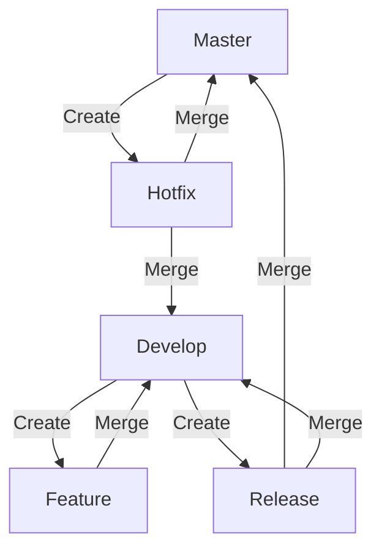
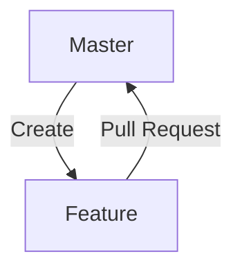
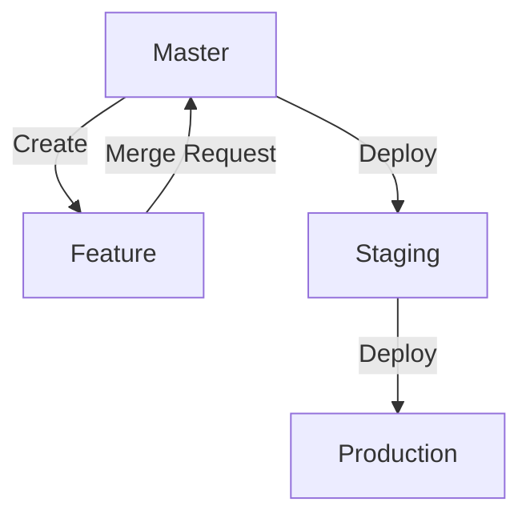
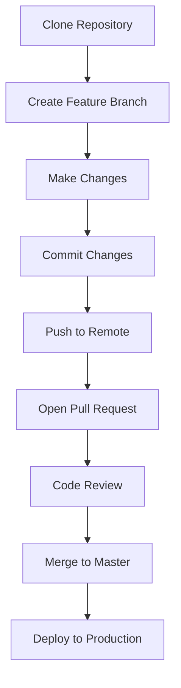

## 21.5 Version Control Strategies

In the realm of software development, effective version control is paramount. It ensures that code changes are tracked, managed, and integrated seamlessly, allowing teams to collaborate efficiently and maintain high-quality software. In this section, we will delve into version control strategies, focusing on managing code repositories, branching models, and workflows, all within the context of Kotlin development.

### Introduction to Version Control

Version control systems (VCS) are tools that help developers manage changes to source code over time. They enable multiple developers to work on a project simultaneously, track changes, and revert to previous versions if necessary. The most popular VCS today is Git, which is a distributed version control system that offers flexibility and powerful features for managing code.

#### Key Concepts in Version Control

- **Repository**: A repository, or repo, is a storage location for software packages. It contains all the project files and the entire history of changes made to those files.
- **Commit**: A commit is a snapshot of the project's file system at a specific point in time. It represents a set of changes made to the codebase.
- **Branch**: A branch is a parallel version of the repository. It allows developers to work on different features or fixes independently.
- **Merge**: Merging is the process of integrating changes from one branch into another.
- **Conflict**: A conflict occurs when changes from different branches cannot be automatically merged and require manual resolution.

### Managing Code Repositories

Managing code repositories effectively is crucial for maintaining the integrity and organization of a project. Here are some best practices for managing repositories in Kotlin development:

#### Repository Structure

1. **Monorepo vs. Multirepo**: Decide whether to use a monorepo (a single repository for all projects) or a multirepo (separate repositories for each project). Monorepos simplify dependency management and code sharing, while multirepos provide more isolation and can be easier to manage for large teams.

2. **Organize by Feature or Module**: Structure your repository by feature or module to improve code readability and maintainability. This is especially useful in Kotlin projects where modularization is common.

3. **Use Clear Naming Conventions**: Adopt consistent naming conventions for branches, commits, and tags to make it easier for team members to understand the purpose and status of each element.

#### Repository Management Tools

- **GitHub/GitLab/Bitbucket**: Use platforms like GitHub, GitLab, or Bitbucket to host your repositories. These platforms offer features like pull requests, issue tracking, and CI/CD integration.

- **Access Control**: Implement access control mechanisms to ensure that only authorized team members can make changes to the repository. Use role-based access control to manage permissions effectively.

### Branching Models

Branching models define how branches are used and managed in a repository. They are essential for organizing work and ensuring smooth collaboration among team members. Let's explore some popular branching models:

#### Git Flow

Git Flow is a branching model that defines a strict branching structure with specific roles for each branch. It is well-suited for projects with a scheduled release cycle.

- **Master Branch**: The master branch contains production-ready code. It should always be stable and deployable.

- **Develop Branch**: The develop branch serves as the integration branch for features. It contains the latest delivered development changes for the next release.

- **Feature Branches**: Feature branches are created from the develop branch to work on new features. Once a feature is complete, it is merged back into develop.

- **Release Branches**: Release branches are created from develop when a release is imminent. They allow for final bug fixes and preparation for release.

- **Hotfix Branches**: Hotfix branches are created from master to address critical issues in production. Once fixed, changes are merged back into both master and develop.



#### GitHub Flow

GitHub Flow is a simpler branching model that is ideal for continuous delivery and deployment. It is based on the following principles:

- **Master Branch**: The master branch is always deployable. All changes are made through pull requests.

- **Feature Branches**: Feature branches are created from master. Once a feature is complete, a pull request is opened, reviewed, and merged into master.

- **Continuous Deployment**: Changes merged into master are automatically deployed to production.



#### GitLab Flow

GitLab Flow combines aspects of both Git Flow and GitHub Flow. It introduces the concept of environment branches to manage different environments (e.g., staging, production).

- **Master Branch**: The master branch contains production-ready code.

- **Feature Branches**: Feature branches are created from master for new features.

- **Environment Branches**: Environment branches (e.g., staging) are used to manage code in different environments.

- **Merge Requests**: Changes are integrated through merge requests, which are similar to pull requests.



### Workflows

Workflows define how developers interact with the version control system and collaborate on code. A well-defined workflow ensures that code changes are reviewed, tested, and integrated smoothly.

#### Code Review Process

1. **Pull Requests/Merge Requests**: Use pull requests (GitHub) or merge requests (GitLab) to propose changes. This allows team members to review and discuss changes before they are merged.

2. **Code Review Guidelines**: Establish code review guidelines to ensure consistency and quality. Encourage reviewers to focus on code readability, maintainability, and adherence to coding standards.

3. **Automated Testing**: Integrate automated testing into the code review process. Use CI/CD pipelines to run tests automatically when a pull request is opened or updated.

#### Continuous Integration/Continuous Deployment (CI/CD)

1. **CI/CD Pipelines**: Set up CI/CD pipelines to automate the build, test, and deployment processes. This ensures that code changes are tested and deployed consistently.

2. **Environment Management**: Use environment branches or tags to manage code in different environments (e.g., development, staging, production).

3. **Rollback Strategies**: Implement rollback strategies to quickly revert changes if a deployment causes issues.

### Best Practices for Version Control

1. **Commit Often, Commit Early**: Encourage developers to commit changes frequently. This reduces the risk of conflicts and makes it easier to track progress.

2. **Write Descriptive Commit Messages**: Use clear and descriptive commit messages to explain the purpose of each change. This helps team members understand the history of the project.

3. **Avoid Large Commits**: Break down large changes into smaller, manageable commits. This makes it easier to review and understand changes.

4. **Use Tags for Releases**: Use tags to mark specific points in the repository's history, such as releases. This makes it easy to identify and access specific versions of the code.

5. **Regularly Clean Up Branches**: Delete branches that are no longer needed to keep the repository clean and organized.

### Code Examples

Let's explore some code examples to illustrate version control strategies in action.

#### Example 1: Creating a Feature Branch

```bash
git clone https://github.com/yourusername/yourproject.git

cd yourproject

git checkout -b feature/new-feature

echo "println('Hello, Kotlin!')" > hello.kt

git add hello.kt

git commit -m "Add hello.kt with a greeting message"

git push origin feature/new-feature
```

#### Example 2: Merging a Feature Branch

```bash
git checkout master

git pull origin master

git merge feature/new-feature

git push origin master
```

#### Example 3: Resolving a Merge Conflict

```bash
git merge feature/another-feature

# Open hello.kt in a text editor and resolve the conflict

git add hello.kt

git commit -m "Resolve merge conflict in hello.kt"

git push origin master
```

### Visualizing Version Control Workflows

Let's visualize a typical Git workflow using a Mermaid.js diagram.



### Knowledge Check

- **What is the purpose of a branch in version control?**
- **How does Git Flow differ from GitHub Flow?**
- **Why is it important to write descriptive commit messages?**
- **What are some best practices for managing code repositories?**

### Try It Yourself

- **Experiment with Branching**: Create a new branch in your project and make some changes. Practice merging the branch back into the main branch.
- **Resolve a Merge Conflict**: Simulate a merge conflict by making conflicting changes in two branches. Practice resolving the conflict and completing the merge.
- **Set Up a CI/CD Pipeline**: If you haven't already, set up a CI/CD pipeline for your project. Experiment with automating tests and deployments.

### Conclusion

Version control is an essential aspect of modern software development. By adopting effective version control strategies, you can improve collaboration, maintain code quality, and streamline the development process. Remember, this is just the beginning. As you progress, you'll refine your strategies and adapt them to fit the unique needs of your projects. Keep experimenting, stay curious, and enjoy the journey!

## Quiz Time!



### What is the purpose of a branch in version control?

- [x] To allow parallel development of features or fixes
- [ ] To store the entire history of the project
- [ ] To automatically deploy code to production
- [ ] To manage user access to the repository

> **Explanation:** A branch allows developers to work on different features or fixes independently, enabling parallel development.

### How does Git Flow differ from GitHub Flow?

- [x] Git Flow uses multiple branches for different purposes, while GitHub Flow uses a single branch for deployment.
- [ ] Git Flow is used for continuous deployment, while GitHub Flow is for scheduled releases.
- [ ] Git Flow does not support hotfix branches, while GitHub Flow does.
- [ ] Git Flow is only for open-source projects, while GitHub Flow is for private repositories.

> **Explanation:** Git Flow uses multiple branches like master, develop, feature, release, and hotfix, while GitHub Flow primarily uses the master branch with feature branches for development.

### Why is it important to write descriptive commit messages?

- [x] To help team members understand the purpose of changes
- [ ] To automatically generate documentation
- [ ] To improve code performance
- [ ] To increase the size of the repository

> **Explanation:** Descriptive commit messages explain the purpose of changes, making it easier for team members to understand the history of the project.

### What are some best practices for managing code repositories?

- [x] Use clear naming conventions for branches and commits
- [x] Regularly clean up branches that are no longer needed
- [ ] Store binary files directly in the repository
- [ ] Avoid using tags for releases

> **Explanation:** Clear naming conventions and regular cleanup help maintain an organized repository. Storing binary files in the repository is generally discouraged.

### What is a pull request?

- [x] A request to merge changes from one branch into another
- [ ] A request to clone a repository
- [ ] A request to delete a branch
- [ ] A request to deploy code to production

> **Explanation:** A pull request is a request to merge changes from one branch into another, allowing for code review and discussion.

### What is the role of automated testing in a CI/CD pipeline?

- [x] To ensure code changes are tested consistently
- [ ] To manually review code changes
- [ ] To deploy code to production
- [ ] To manage user access to the repository

> **Explanation:** Automated testing ensures that code changes are tested consistently, reducing the risk of introducing bugs.

### What is a merge conflict?

- [x] A situation where changes from different branches cannot be automatically merged
- [ ] A situation where a branch cannot be deleted
- [ ] A situation where a repository cannot be cloned
- [ ] A situation where code changes are automatically deployed

> **Explanation:** A merge conflict occurs when changes from different branches cannot be automatically merged and require manual resolution.

### What is the purpose of using tags in a repository?

- [x] To mark specific points in the repository's history, such as releases
- [ ] To automatically deploy code to production
- [ ] To manage user access to the repository
- [ ] To store binary files

> **Explanation:** Tags are used to mark specific points in the repository's history, making it easy to identify and access specific versions of the code.

### What is the benefit of using a monorepo?

- [x] Simplifies dependency management and code sharing
- [ ] Provides more isolation for large teams
- [ ] Requires less storage space
- [ ] Automatically deploys code to production

> **Explanation:** A monorepo simplifies dependency management and code sharing, making it easier to manage projects with shared components.

### True or False: GitHub Flow is ideal for projects with a scheduled release cycle.

- [ ] True
- [x] False

> **Explanation:** GitHub Flow is ideal for continuous delivery and deployment, not for projects with a scheduled release cycle.


