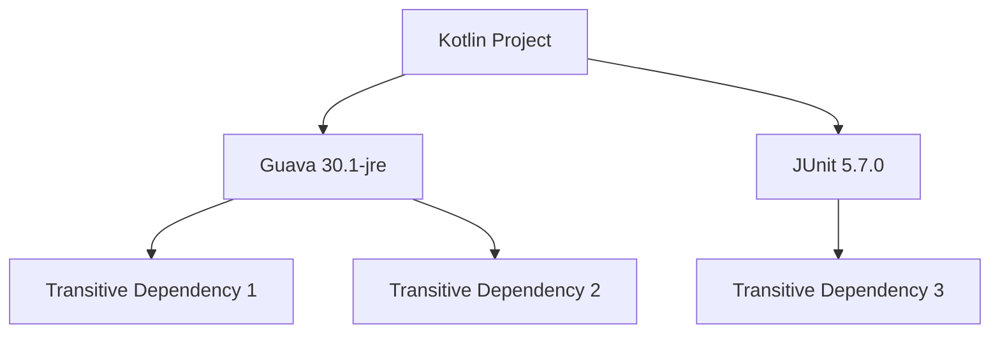
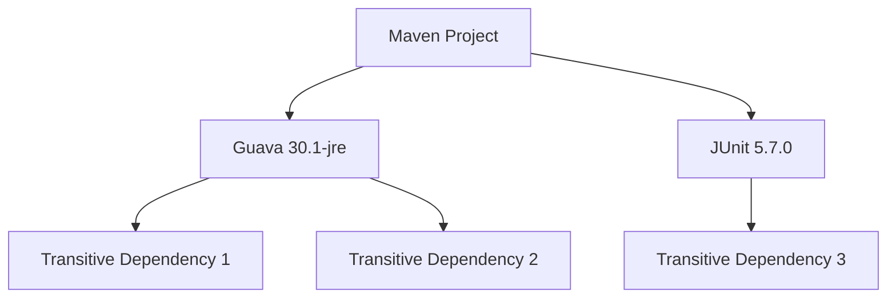

## 21.6 Dependency Management

In modern software development, managing dependencies effectively is crucial for maintaining a stable and scalable codebase. As Kotlin developers, we often rely on build tools like Gradle and Maven to handle dependencies, automate builds, and ensure consistent project configurations. In this section, we'll delve into the intricacies of dependency management using these tools, explore best practices, and provide practical examples to enhance your Kotlin projects.

### Understanding Dependency Management

Dependency management is the process of handling external libraries and modules that your project relies on. It involves specifying, resolving, and maintaining these dependencies to ensure your application functions correctly. Effective dependency management helps prevent version conflicts, reduces build times, and enhances project maintainability.

### Gradle: A Powerful Build Tool

Gradle is a popular build automation tool that is widely used in the Kotlin ecosystem. It offers a flexible and efficient way to manage dependencies, build scripts, and project configurations. Let's explore how to use Gradle effectively for dependency management.

#### Setting Up Gradle

To get started with Gradle, you need to create a `build.gradle.kts` file in your project. This file contains the configuration for your project, including dependencies, plugins, and build scripts.

```kotlin
plugins {
    kotlin("jvm") version "1.8.0"
    application
}

repositories {
    mavenCentral()
}

dependencies {
    implementation("org.jetbrains.kotlin:kotlin-stdlib:1.8.0")
    testImplementation("org.junit.jupiter:junit-jupiter:5.7.0")
}

application {
    mainClass.set("com.example.MainKt")
}
```

In this example, we define a simple Kotlin project with dependencies on the Kotlin standard library and JUnit for testing. The `repositories` block specifies where to find these dependencies, and the `dependencies` block lists the libraries required by the project.

#### Managing Dependency Versions

Managing dependency versions is critical to avoid conflicts and ensure compatibility. Gradle allows you to specify versions explicitly or use dynamic versioning.

- **Explicit Versioning**: Specify the exact version of a dependency.

  ```kotlin
  implementation("com.google.guava:guava:30.1-jre")
  ```

- **Dynamic Versioning**: Use version ranges or placeholders to automatically update to the latest version.

  ```kotlin
  implementation("com.google.guava:guava:30.+")
  ```

While dynamic versioning can be convenient, it may lead to unexpected issues if a new version introduces breaking changes. Therefore, it's essential to balance flexibility and stability.

#### Dependency Constraints

Gradle provides a mechanism to enforce constraints on dependency versions, ensuring consistency across your project. You can define constraints in the `dependencies` block.

```kotlin
dependencies {
    constraints {
        implementation("com.google.guava:guava") {
            version {
                strictly("30.1-jre")
            }
        }
    }
}
```

In this example, we enforce a strict version constraint on the Guava library, ensuring that only version `30.1-jre` is used.

#### Dependency Resolution Strategies

Gradle offers various strategies to resolve dependency conflicts, such as:

- **Fail on Version Conflict**: Stops the build if there are conflicting versions.

  ```kotlin
  configurations.all {
      resolutionStrategy {
          failOnVersionConflict()
      }
  }
  ```

- **Force Specific Versions**: Overrides all other version specifications.

  ```kotlin
  configurations.all {
      resolutionStrategy {
          force("com.google.guava:guava:30.1-jre")
      }
  }
  ```

- **Prefer Newer Versions**: Automatically selects the newest version available.

  ```kotlin
  configurations.all {
      resolutionStrategy {
          preferProjectModules()
      }
  }
  ```

These strategies help maintain a consistent dependency graph and prevent conflicts that could lead to runtime errors.

#### Visualizing Dependency Graphs

Understanding the dependency graph of your project is crucial for effective management. Gradle provides a task to visualize dependencies.

```bash
./gradlew dependencies
```

This command generates a report of all dependencies and their transitive dependencies, helping you identify potential conflicts or redundancies.



### Maven: A Reliable Alternative

Maven is another popular build tool that offers a robust dependency management system. It uses an XML-based configuration file (`pom.xml`) to define project dependencies and build configurations.

#### Setting Up Maven

To use Maven, create a `pom.xml` file in your project directory. This file specifies the project's dependencies, plugins, and build settings.

```xml
<project xmlns="http://maven.apache.org/POM/4.0.0"
         xmlns:xsi="http://www.w3.org/2001/XMLSchema-instance"
         xsi:schemaLocation="http://maven.apache.org/POM/4.0.0 http://maven.apache.org/xsd/maven-4.0.0.xsd">
    <modelVersion>4.0.0</modelVersion>
    <groupId>com.example</groupId>
    <artifactId>my-app</artifactId>
    <version>1.0-SNAPSHOT</version>

    <dependencies>
        <dependency>
            <groupId>org.jetbrains.kotlin</groupId>
            <artifactId>kotlin-stdlib</artifactId>
            <version>1.8.0</version>
        </dependency>
        <dependency>
            <groupId>org.junit.jupiter</groupId>
            <artifactId>junit-jupiter</artifactId>
            <version>5.7.0</version>
            <scope>test</scope>
        </dependency>
    </dependencies>

    <build>
        <plugins>
            <plugin>
                <groupId>org.jetbrains.kotlin</groupId>
                <artifactId>kotlin-maven-plugin</artifactId>
                <version>1.8.0</version>
                <executions>
                    <execution>
                        <goals>
                            <goal>compile</goal>
                            <goal>test-compile</goal>
                        </goals>
                    </execution>
                </executions>
            </plugin>
        </plugins>
    </build>
</project>
```

This `pom.xml` file defines a simple Kotlin project with dependencies on the Kotlin standard library and JUnit for testing. The `build` section specifies the Kotlin Maven plugin for compiling Kotlin code.

#### Managing Dependency Versions

Maven allows you to manage dependency versions using properties or dependency management sections.

- **Using Properties**: Define versions as properties for easy updates.

  ```xml
  <properties>
      <kotlin.version>1.8.0</kotlin.version>
      <junit.version>5.7.0</junit.version>
  </properties>
  ```

- **Dependency Management**: Centralize version management for multi-module projects.

  ```xml
  <dependencyManagement>
      <dependencies>
          <dependency>
              <groupId>org.jetbrains.kotlin</groupId>
              <artifactId>kotlin-stdlib</artifactId>
              <version>${kotlin.version}</version>
          </dependency>
      </dependencies>
  </dependencyManagement>
  ```

#### Handling Transitive Dependencies

Maven automatically resolves transitive dependencies, but you can exclude specific transitive dependencies if needed.

```xml
<dependency>
    <groupId>com.google.guava</groupId>
    <artifactId>guava</artifactId>
    <version>30.1-jre</version>
    <exclusions>
        <exclusion>
            <groupId>com.google.code.findbugs</groupId>
            <artifactId>jsr305</artifactId>
        </exclusion>
    </exclusions>
</dependency>
```

This example excludes the `jsr305` transitive dependency from the Guava library.

#### Visualizing Dependency Trees

Maven provides a command to visualize the dependency tree of your project.

```bash
mvn dependency:tree
```

This command generates a tree view of all dependencies, helping you identify potential conflicts or redundancies.



### Best Practices for Dependency Management

To ensure effective dependency management, consider the following best practices:

#### Use Semantic Versioning

Adopt semantic versioning for your dependencies to clearly communicate changes and compatibility. Semantic versioning follows the format `MAJOR.MINOR.PATCH`, where:

- **MAJOR**: Incompatible API changes.
- **MINOR**: Backward-compatible new features.
- **PATCH**: Backward-compatible bug fixes.

#### Lock Dependency Versions

Lock dependency versions to prevent unexpected changes that could break your build. Gradle provides a `lock` feature to lock dependency versions.

```bash
./gradlew dependencies --write-locks
```

This command generates a `gradle.lockfile` that locks the versions of all dependencies.

#### Regularly Update Dependencies

Regularly update your dependencies to benefit from bug fixes, security patches, and new features. Use tools like Dependabot or Renovate to automate dependency updates.

#### Minimize Transitive Dependencies

Minimize transitive dependencies by carefully selecting libraries and excluding unnecessary dependencies. This reduces the risk of conflicts and keeps your project lightweight.

#### Use Dependency Constraints

Use dependency constraints to enforce consistent versions across your project. This helps prevent version conflicts and ensures compatibility.

#### Monitor for Vulnerabilities

Monitor your dependencies for known vulnerabilities using tools like OWASP Dependency-Check or Snyk. These tools scan your dependencies for security issues and provide remediation suggestions.

#### Document Dependencies

Document your dependencies and their versions in a `README` or `DEPENDENCIES` file. This provides transparency and helps new team members understand the project's dependencies.

### Try It Yourself

To solidify your understanding of dependency management, try the following exercises:

1. **Create a New Kotlin Project**: Set up a new Kotlin project using Gradle or Maven. Define dependencies for Kotlin standard library and JUnit.

2. **Experiment with Versioning**: Use both explicit and dynamic versioning for a dependency. Observe the differences in behavior when updating dependencies.

3. **Visualize Dependency Graphs**: Generate and analyze the dependency graph for your project. Identify any potential conflicts or redundancies.

4. **Implement Dependency Constraints**: Add dependency constraints to your project and observe how they affect dependency resolution.

5. **Monitor Vulnerabilities**: Use a vulnerability scanning tool to analyze your project's dependencies. Address any identified issues.

### Conclusion

Effective dependency management is a cornerstone of successful Kotlin development. By mastering tools like Gradle and Maven, you can ensure your projects are stable, scalable, and secure. Remember, dependency management is an ongoing process that requires regular updates, monitoring, and optimization. Keep experimenting, stay curious, and enjoy the journey of building robust Kotlin applications!

## Quiz Time!



### What is the primary purpose of dependency management in software development?

- [x] To handle external libraries and modules that a project relies on.
- [ ] To automate the deployment process.
- [ ] To manage user authentication and authorization.
- [ ] To optimize the user interface design.

> **Explanation:** Dependency management involves handling external libraries and modules that a project relies on, ensuring they are correctly specified, resolved, and maintained.

### Which build tool is widely used in the Kotlin ecosystem for dependency management?

- [x] Gradle
- [ ] Ant
- [ ] Make
- [ ] CMake

> **Explanation:** Gradle is a popular build automation tool widely used in the Kotlin ecosystem for managing dependencies, build scripts, and project configurations.

### What is the benefit of using semantic versioning for dependencies?

- [x] It clearly communicates changes and compatibility.
- [ ] It automatically updates dependencies.
- [ ] It reduces the size of the dependency graph.
- [ ] It eliminates the need for dependency constraints.

> **Explanation:** Semantic versioning follows the format MAJOR.MINOR.PATCH and clearly communicates changes and compatibility, helping developers understand the impact of updates.

### How can you lock dependency versions in a Gradle project?

- [x] By using the `--write-locks` option with the `dependencies` task.
- [ ] By specifying versions in the `repositories` block.
- [ ] By using the `lock` keyword in the `build.gradle.kts` file.
- [ ] By setting the `lockDependencies` property to `true`.

> **Explanation:** In Gradle, you can lock dependency versions by using the `--write-locks` option with the `dependencies` task, which generates a `gradle.lockfile`.

### What is a potential risk of using dynamic versioning for dependencies?

- [x] It may lead to unexpected issues if a new version introduces breaking changes.
- [ ] It prevents the project from building successfully.
- [ ] It increases the size of the final build artifact.
- [ ] It requires manual updates for each dependency.

> **Explanation:** Dynamic versioning may lead to unexpected issues if a new version introduces breaking changes, as it automatically updates to the latest version.

### Which Maven command generates a tree view of all dependencies?

- [x] `mvn dependency:tree`
- [ ] `mvn dependency:list`
- [ ] `mvn dependency:resolve`
- [ ] `mvn dependency:analyze`

> **Explanation:** The `mvn dependency:tree` command generates a tree view of all dependencies, helping identify potential conflicts or redundancies.

### What is the purpose of using dependency constraints in Gradle?

- [x] To enforce consistent versions across the project.
- [ ] To automatically update dependencies.
- [ ] To exclude transitive dependencies.
- [ ] To visualize the dependency graph.

> **Explanation:** Dependency constraints in Gradle enforce consistent versions across the project, preventing version conflicts and ensuring compatibility.

### Which tool can be used to monitor dependencies for known vulnerabilities?

- [x] OWASP Dependency-Check
- [ ] JUnit
- [ ] Gradle
- [ ] Kotlin

> **Explanation:** OWASP Dependency-Check is a tool that scans dependencies for known vulnerabilities, providing remediation suggestions.

### What is a best practice for documenting dependencies in a project?

- [x] Document dependencies and their versions in a `README` or `DEPENDENCIES` file.
- [ ] Use dynamic versioning for all dependencies.
- [ ] Exclude all transitive dependencies.
- [ ] Lock dependency versions in the `build.gradle.kts` file.

> **Explanation:** Documenting dependencies and their versions in a `README` or `DEPENDENCIES` file provides transparency and helps new team members understand the project's dependencies.

### True or False: Gradle and Maven are both used for dependency management in Kotlin projects.

- [x] True
- [ ] False

> **Explanation:** Both Gradle and Maven are widely used build tools for dependency management in Kotlin projects, offering robust features for handling dependencies, build scripts, and project configurations.


