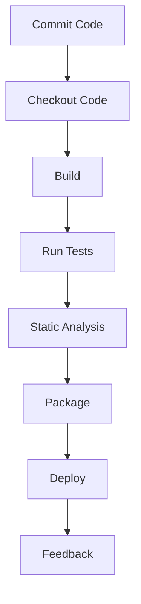

## 21.7 Continuous Integration Practices

Continuous Integration (CI) is a cornerstone of modern software development, enabling teams to deliver high-quality software efficiently and reliably. In this section, we will delve into the best practices for implementing CI in Kotlin projects, focusing on automating the build process and ensuring code quality through comprehensive checks.

### Introduction to Continuous Integration

Continuous Integration is a development practice where developers integrate code into a shared repository frequently, ideally several times a day. Each integration is verified by an automated build, allowing teams to detect problems early. This practice leads to faster development cycles, reduced integration problems, and more stable releases.

#### Key Concepts of Continuous Integration

- **Frequent Commits:** Developers commit code changes frequently to a shared repository.
- **Automated Builds:** Each commit triggers an automated build to verify the integration.
- **Immediate Feedback:** Developers receive immediate feedback on their changes, allowing for quick resolution of issues.
- **Test Automation:** Automated testing is integral to the CI process, ensuring that new changes do not break existing functionality.

### Setting Up a CI Environment for Kotlin

To effectively implement CI for Kotlin projects, it's essential to set up a robust CI environment. This involves selecting appropriate tools and configuring them to automate the build and testing processes.

#### Choosing a CI Tool

Several CI tools are available, each with its strengths. Popular choices include:

- **Jenkins:** An open-source automation server that supports building, deploying, and automating any project.
- **GitHub Actions:** Integrated with GitHub, it allows you to automate workflows directly from your repository.
- **GitLab CI/CD:** A built-in CI/CD tool in GitLab that supports all stages of the DevOps lifecycle.
- **CircleCI:** A cloud-based CI tool that is easy to set up and offers robust features for building and testing.

#### Configuring the CI Pipeline

A typical CI pipeline for a Kotlin project includes the following stages:

1. **Checkout Code:** Retrieve the latest code from the repository.
2. **Build:** Compile the Kotlin code using a build tool like Gradle or Maven.
3. **Test:** Run unit tests to verify the functionality of the code.
4. **Static Analysis:** Perform code quality checks using tools like Detekt or Ktlint.
5. **Package:** Package the application for deployment.
6. **Deploy:** Deploy the application to a staging environment for further testing.

Here's an example of a simple CI pipeline configuration using GitHub Actions:

```yaml
name: Kotlin CI

on:
  push:
    branches:
      - main
  pull_request:
    branches:
      - main

jobs:
  build:
    runs-on: ubuntu-latest

    steps:
    - name: Checkout code
      uses: actions/checkout@v2

    - name: Set up JDK 11
      uses: actions/setup-java@v2
      with:
        java-version: '11'

    - name: Build with Gradle
      run: ./gradlew build

    - name: Run tests
      run: ./gradlew test

    - name: Static analysis
      run: ./gradlew detekt
```

### Automating the Build Process

Automating the build process is a critical aspect of CI, ensuring that every code change is compiled and tested consistently. In Kotlin projects, Gradle is the most commonly used build tool due to its flexibility and powerful features.

#### Gradle Build Automation

Gradle allows you to automate the build process with minimal configuration. Here's a basic `build.gradle.kts` file for a Kotlin project:

```kotlin
plugins {
    kotlin("jvm") version "1.5.31"
    application
}

group = "com.example"
version = "1.0-SNAPSHOT"

repositories {
    mavenCentral()
}

dependencies {
    implementation(kotlin("stdlib"))
    testImplementation("org.junit.jupiter:junit-jupiter:5.8.1")
}

tasks.test {
    useJUnitPlatform()
}

application {
    mainClass.set("com.example.MainKt")
}
```

#### Continuous Delivery with Gradle

Gradle can also be used to automate the deployment process, enabling Continuous Delivery (CD). By configuring Gradle tasks for packaging and deploying your application, you can streamline the release process.

### Ensuring Code Quality

Code quality is paramount in software development, and CI plays a crucial role in maintaining it. By integrating static analysis and testing tools into your CI pipeline, you can ensure that your Kotlin code adheres to best practices and is free of common issues.

#### Static Code Analysis

Static code analysis involves examining the source code for potential errors, code smells, and adherence to coding standards. In Kotlin projects, tools like Detekt and Ktlint are widely used for static analysis.

- **Detekt:** A static code analysis tool specifically for Kotlin. It helps identify code smells and enforces coding standards.
- **Ktlint:** A Kotlin linter that enforces Kotlin coding conventions.

Here's how you can integrate Detekt into your Gradle build:

```kotlin
plugins {
    id("io.gitlab.arturbosch.detekt") version "1.18.1"
}

detekt {
    config = files("detekt.yml")
    buildUponDefaultConfig = true
}
```

#### Automated Testing

Automated testing is a fundamental component of CI, ensuring that code changes do not introduce new bugs. In Kotlin, JUnit is the standard testing framework, and it can be easily integrated into the CI pipeline.

```kotlin
import org.junit.jupiter.api.Assertions.*
import org.junit.jupiter.api.Test

class ExampleTest {

    @Test
    fun testAddition() {
        assertEquals(4, 2 + 2)
    }
}
```

### Advanced CI Practices

For expert developers, advanced CI practices can further enhance the efficiency and reliability of the development process.

#### Parallel Builds

Running builds in parallel can significantly reduce the time it takes to complete the CI pipeline. Most CI tools support parallel execution, allowing you to run different stages or tests concurrently.

#### Caching Dependencies

Caching dependencies can speed up the build process by avoiding the need to download them each time. CI tools like GitHub Actions and CircleCI provide built-in caching mechanisms.

```yaml
- name: Cache Gradle packages
  uses: actions/cache@v2
  with:
    path: ~/.gradle/caches
    key: ${{ runner.os }}-gradle-${{ hashFiles('**/*.gradle*', '**/gradle-wrapper.properties') }}
    restore-keys: |
      ${{ runner.os }}-gradle-
```

#### Continuous Deployment

Continuous Deployment (CD) extends CI by automatically deploying code changes to production after passing all tests and checks. This practice requires a robust CI/CD pipeline with automated testing and deployment processes.

### Visualizing the CI/CD Pipeline

To better understand the flow of a CI/CD pipeline, let's visualize it using a Mermaid.js diagram:



This diagram illustrates the typical stages of a CI/CD pipeline, from committing code to receiving feedback after deployment.

### Best Practices for CI in Kotlin Projects

To maximize the benefits of CI in Kotlin projects, consider the following best practices:

- **Keep Builds Fast:** Optimize your build process to ensure quick feedback. Use parallel builds and caching to speed up the pipeline.
- **Fail Fast:** Configure your CI pipeline to fail early if any stage encounters an error. This approach helps identify issues quickly.
- **Maintain a Clean Codebase:** Regularly refactor code to maintain readability and simplicity. Use static analysis tools to enforce coding standards.
- **Monitor Build Health:** Continuously monitor the health of your CI pipeline. Use dashboards and alerts to track build status and performance.
- **Secure Your CI Environment:** Protect your CI environment from unauthorized access. Use secure credentials management and limit access to sensitive data.

### Try It Yourself

To solidify your understanding of CI practices, try setting up a CI pipeline for a simple Kotlin project. Experiment with different CI tools and configurations to see how they affect the build process. Consider adding additional stages, such as integration tests or performance tests, to your pipeline.

### Conclusion

Continuous Integration is an essential practice for modern software development, enabling teams to deliver high-quality software efficiently. By automating the build process and ensuring code quality through rigorous checks, you can enhance the reliability and maintainability of your Kotlin projects. Remember, the journey to mastering CI is ongoing. Keep experimenting, stay curious, and embrace the continuous improvement mindset.

## Quiz Time!



### What is the primary goal of Continuous Integration (CI)?

- [x] To integrate code changes frequently and verify them through automated builds.
- [ ] To deploy code changes directly to production.
- [ ] To perform manual testing of code changes.
- [ ] To write documentation for code changes.

> **Explanation:** The primary goal of CI is to integrate code changes frequently and verify them through automated builds, ensuring early detection of issues.

### Which tool is commonly used for static code analysis in Kotlin projects?

- [x] Detekt
- [ ] JUnit
- [ ] Gradle
- [ ] Jenkins

> **Explanation:** Detekt is a static code analysis tool specifically for Kotlin, used to identify code smells and enforce coding standards.

### What is the purpose of caching dependencies in a CI pipeline?

- [x] To speed up the build process by avoiding the need to download dependencies each time.
- [ ] To store build artifacts for deployment.
- [ ] To back up source code.
- [ ] To enhance security by encrypting dependencies.

> **Explanation:** Caching dependencies speeds up the build process by avoiding the need to download them each time, reducing build times.

### Which CI tool is integrated with GitHub for automating workflows?

- [x] GitHub Actions
- [ ] CircleCI
- [ ] Jenkins
- [ ] GitLab CI/CD

> **Explanation:** GitHub Actions is integrated with GitHub and allows you to automate workflows directly from your repository.

### What is the role of automated testing in a CI pipeline?

- [x] To ensure that code changes do not introduce new bugs.
- [ ] To deploy code changes to production.
- [ ] To generate documentation for code changes.
- [ ] To perform manual code reviews.

> **Explanation:** Automated testing ensures that code changes do not introduce new bugs, maintaining the integrity of the codebase.

### How can you optimize the build process in a CI pipeline?

- [x] By using parallel builds and caching dependencies.
- [ ] By increasing the number of manual tests.
- [ ] By reducing the number of commits.
- [ ] By disabling static analysis.

> **Explanation:** Optimizing the build process involves using parallel builds and caching dependencies to speed up the pipeline.

### What is Continuous Deployment (CD)?

- [x] Automatically deploying code changes to production after passing all tests and checks.
- [ ] Manually deploying code changes to production.
- [ ] Writing documentation for deployment processes.
- [ ] Performing manual testing of deployed code.

> **Explanation:** Continuous Deployment (CD) involves automatically deploying code changes to production after passing all tests and checks.

### Which build tool is commonly used for Kotlin projects?

- [x] Gradle
- [ ] Maven
- [ ] Ant
- [ ] Make

> **Explanation:** Gradle is the most commonly used build tool for Kotlin projects due to its flexibility and powerful features.

### What is the benefit of using static code analysis tools like Detekt?

- [x] They help identify code smells and enforce coding standards.
- [ ] They generate documentation for code changes.
- [ ] They deploy code changes to production.
- [ ] They perform manual testing of code changes.

> **Explanation:** Static code analysis tools like Detekt help identify code smells and enforce coding standards, improving code quality.

### True or False: Continuous Integration involves deploying code changes directly to production.

- [ ] True
- [x] False

> **Explanation:** Continuous Integration involves integrating code changes frequently and verifying them through automated builds, but it does not involve deploying code changes directly to production.


