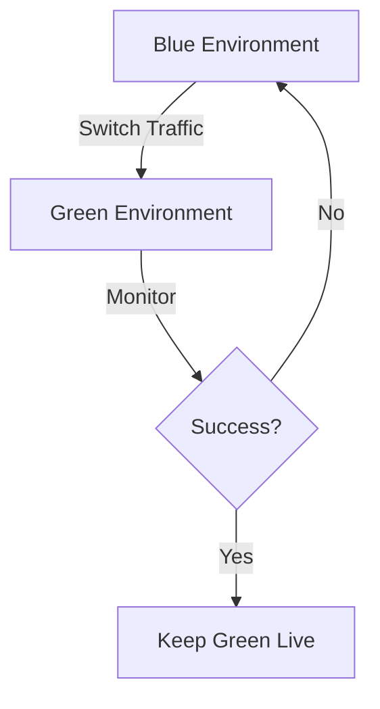
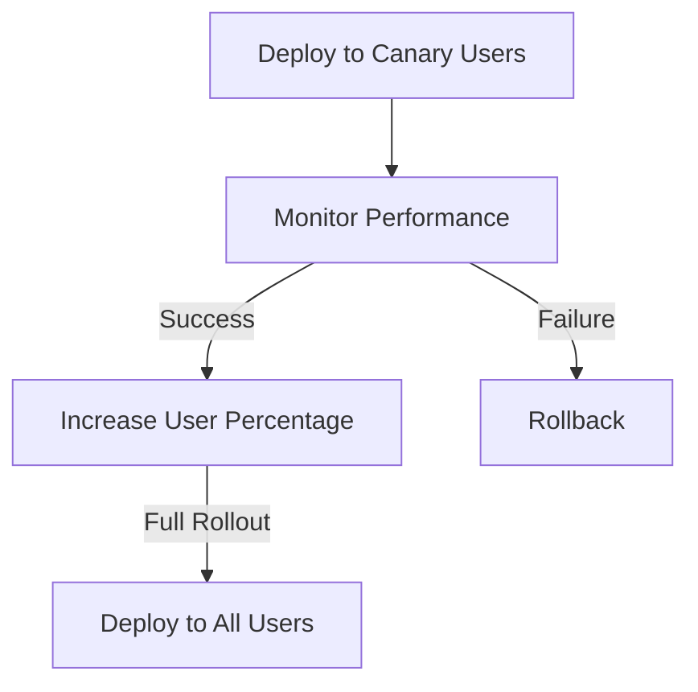

## 21.8 Deployment Strategies for Efficient Kotlin Applications

In the world of software development, deploying applications efficiently is crucial for maintaining a seamless user experience and ensuring that new features, bug fixes, and improvements reach users without causing disruptions. This section delves into deployment strategies that are particularly effective for Kotlin applications, focusing on blue-green and canary deployments. We'll explore these strategies in detail, provide practical examples, and discuss how they can be integrated into your development workflow.

### Introduction to Deployment Strategies

Deployment strategies define the approach and process by which new versions of an application are released to production environments. They aim to minimize downtime, reduce the risk of introducing errors, and provide mechanisms for rollback if issues arise. Effective deployment strategies are essential for maintaining high availability and reliability in modern software systems.

#### Key Objectives of Deployment Strategies

1. **Minimize Downtime**: Ensure that applications remain available to users during updates.
2. **Risk Mitigation**: Reduce the likelihood of introducing errors or bugs into production.
3. **Rollback Capability**: Provide a straightforward way to revert to a previous version if necessary.
4. **User Experience**: Maintain a seamless experience for end-users during and after deployment.

### Blue-Green Deployment

Blue-green deployment is a strategy that involves maintaining two separate environments, referred to as "blue" and "green." At any given time, one environment is live (e.g., blue), serving all production traffic, while the other (e.g., green) is idle or used for testing the new release.

#### How Blue-Green Deployment Works

1. **Prepare the Green Environment**: Deploy the new version of the application to the green environment. Conduct thorough testing to ensure that it functions as expected.

2. **Switch Traffic**: Once the green environment is verified, switch the production traffic from the blue environment to the green environment. This switch is typically done using a load balancer or DNS change.

3. **Monitor the Deployment**: After the switch, closely monitor the application for any issues or anomalies. Ensure that performance metrics and user feedback are positive.

4. **Rollback if Necessary**: If any issues arise, quickly switch back to the blue environment, minimizing downtime and impact on users.

#### Advantages of Blue-Green Deployment

- **Zero Downtime**: Traffic switching is instantaneous, ensuring no downtime during deployment.
- **Easy Rollback**: Reverting to the previous version is as simple as switching back to the blue environment.
- **Testing in Production-like Environment**: The green environment can be tested with production-like data and conditions.

#### Considerations for Blue-Green Deployment

- **Infrastructure Costs**: Maintaining two separate environments can be costly in terms of infrastructure resources.
- **Data Synchronization**: Ensure that data changes in the blue environment are synchronized with the green environment during the switch.

#### Code Example: Implementing Blue-Green Deployment

```kotlin
// Example of a simple load balancer configuration for blue-green deployment

class LoadBalancer {
    private var activeEnvironment: Environment = Environment.BLUE

    fun switchEnvironment() {
        activeEnvironment = if (activeEnvironment == Environment.BLUE) {
            Environment.GREEN
        } else {
            Environment.BLUE
        }
        println("Switched to ${activeEnvironment.name} environment.")
    }

    fun getCurrentEnvironment(): Environment {
        return activeEnvironment
    }
}

enum class Environment {
    BLUE, GREEN
}

fun main() {
    val loadBalancer = LoadBalancer()
    println("Current environment: ${loadBalancer.getCurrentEnvironment().name}")
    loadBalancer.switchEnvironment()
    println("Current environment: ${loadBalancer.getCurrentEnvironment().name}")
}
```

### Canary Deployment

Canary deployment is a strategy where a new version of the application is gradually rolled out to a small subset of users before being released to the entire user base. This approach allows developers to monitor the new version's performance and behavior in a real-world environment while minimizing risk.

#### How Canary Deployment Works

1. **Deploy to a Subset**: Release the new version to a small percentage of users or specific user segments. This group acts as the "canary" in the coal mine, providing early feedback on the new release.

2. **Monitor Performance**: Collect metrics and feedback from the canary users. Monitor for any issues, performance degradation, or unexpected behavior.

3. **Gradual Rollout**: If the canary deployment is successful, gradually increase the percentage of users receiving the new version until it is fully deployed.

4. **Rollback if Necessary**: If issues are detected during the canary phase, roll back the changes for the affected users while investigating and resolving the problems.

#### Advantages of Canary Deployment

- **Reduced Risk**: By exposing only a small portion of users to the new version initially, the risk of widespread issues is minimized.
- **Real-world Testing**: The new version is tested in a live environment with real user interactions.
- **Feedback Loop**: Early feedback from canary users can guide further improvements and refinements.

#### Considerations for Canary Deployment

- **User Segmentation**: Determine how users will be segmented for the canary release (e.g., by geography, user type, or random sampling).
- **Monitoring and Metrics**: Implement robust monitoring to track performance and user feedback during the canary phase.

#### Code Example: Implementing Canary Deployment

```kotlin
// Example of a simple canary deployment strategy

class CanaryDeployment {
    private val totalUsers = 1000
    private var canaryUsers = 100

    fun deployCanaryVersion() {
        println("Deploying new version to $canaryUsers users.")
        // Simulate deployment logic here
    }

    fun monitorCanary() {
        println("Monitoring canary users for feedback and performance.")
        // Simulate monitoring logic here
    }

    fun rolloutToAllUsers() {
        println("Rolling out new version to all $totalUsers users.")
        // Simulate full deployment logic here
    }
}

fun main() {
    val canaryDeployment = CanaryDeployment()
    canaryDeployment.deployCanaryVersion()
    canaryDeployment.monitorCanary()
    canaryDeployment.rolloutToAllUsers()
}
```

### Visualizing Deployment Strategies

To better understand the flow of these deployment strategies, let's visualize them using Mermaid.js diagrams.

#### Blue-Green Deployment Diagram



**Caption**: This diagram illustrates the blue-green deployment process, showing the switch from the blue environment to the green environment and the monitoring phase.

#### Canary Deployment Diagram



**Caption**: This diagram depicts the canary deployment process, highlighting the gradual rollout and monitoring phases.

### Integrating Deployment Strategies into Your Workflow

To effectively implement these deployment strategies, it's essential to integrate them into your existing development and operations workflows. Here are some best practices to consider:

1. **Continuous Integration/Continuous Deployment (CI/CD)**: Automate the deployment process using CI/CD pipelines. Tools like Jenkins, GitHub Actions, or GitLab CI can help streamline the deployment process and ensure consistency.

2. **Infrastructure as Code (IaC)**: Use IaC tools like Terraform or AWS CloudFormation to manage and provision your environments. This approach ensures that your blue-green or canary environments are consistently configured.

3. **Monitoring and Logging**: Implement comprehensive monitoring and logging solutions to track application performance and user feedback during deployments. Tools like Prometheus, Grafana, and ELK Stack can provide valuable insights.

4. **Feature Flags**: Use feature flags to control the visibility of new features. This technique allows you to enable or disable features for specific user segments without redeploying the application.

5. **Rollback Plans**: Always have a rollback plan in place. Define clear procedures for reverting to a previous version if issues arise during deployment.

### Try It Yourself: Experimenting with Deployment Strategies

To deepen your understanding of these deployment strategies, try experimenting with the code examples provided. Modify the parameters, such as the number of canary users or the switching logic in the blue-green deployment, to see how these changes affect the deployment process. Consider setting up a simple CI/CD pipeline to automate these deployments and observe the results.

### Knowledge Check: Key Takeaways

- **Deployment strategies** are essential for minimizing downtime and risk during application releases.
- **Blue-green deployment** involves maintaining two separate environments and switching traffic between them.
- **Canary deployment** gradually rolls out a new version to a subset of users, allowing for real-world testing and feedback.
- **Integration with CI/CD** and monitoring tools is crucial for successful deployment strategy implementation.
- **Feature flags** and rollback plans provide additional control and safety during deployments.

### Conclusion

Deploying applications efficiently is a critical aspect of modern software development. By understanding and implementing strategies like blue-green and canary deployments, you can ensure that your Kotlin applications are released smoothly, with minimal disruption to users. As you continue to refine your deployment processes, remember to leverage automation, monitoring, and user feedback to optimize your strategies.

## Quiz Time!



### What is the primary goal of deployment strategies?

- [x] Minimize downtime and risk during application releases
- [ ] Increase application size
- [ ] Reduce code complexity
- [ ] Improve user interface design

> **Explanation:** Deployment strategies aim to minimize downtime and risk during application releases, ensuring a seamless user experience.

### In a blue-green deployment, what happens after the green environment is verified?

- [x] Traffic is switched from the blue environment to the green environment
- [ ] The green environment is deleted
- [ ] The blue environment is updated
- [ ] Both environments are merged

> **Explanation:** After verifying the green environment, traffic is switched from the blue environment to the green environment to make the new version live.

### What is a key advantage of canary deployment?

- [x] Reduced risk by exposing a small portion of users to the new version initially
- [ ] Increased infrastructure costs
- [ ] Immediate full rollout to all users
- [ ] Elimination of testing phases

> **Explanation:** Canary deployment reduces risk by initially exposing only a small portion of users to the new version, allowing for real-world testing and feedback.

### Which tool can be used for automating the deployment process?

- [x] Jenkins
- [ ] Microsoft Word
- [ ] Adobe Photoshop
- [ ] Google Sheets

> **Explanation:** Jenkins is a popular tool for automating the deployment process as part of a CI/CD pipeline.

### What is the purpose of feature flags in deployment?

- [x] Control the visibility of new features without redeploying the application
- [ ] Increase application size
- [ ] Reduce code complexity
- [ ] Improve user interface design

> **Explanation:** Feature flags allow developers to control the visibility of new features without redeploying the application, providing flexibility during deployments.

### What should be included in a rollback plan?

- [x] Clear procedures for reverting to a previous version if issues arise
- [ ] Instructions for increasing application size
- [ ] Guidelines for reducing code complexity
- [ ] Steps for improving user interface design

> **Explanation:** A rollback plan should include clear procedures for reverting to a previous version if issues arise during deployment.

### Which of the following is a benefit of using Infrastructure as Code (IaC) in deployments?

- [x] Consistent configuration of environments
- [ ] Increased application size
- [ ] Reduced code complexity
- [ ] Improved user interface design

> **Explanation:** Infrastructure as Code (IaC) ensures consistent configuration of environments, which is beneficial for managing deployment environments.

### What is a common tool used for monitoring application performance during deployments?

- [x] Prometheus
- [ ] Microsoft Word
- [ ] Adobe Photoshop
- [ ] Google Sheets

> **Explanation:** Prometheus is a common tool used for monitoring application performance during deployments, providing valuable insights.

### True or False: Canary deployment involves deploying the new version to all users at once.

- [ ] True
- [x] False

> **Explanation:** False. Canary deployment involves gradually rolling out the new version to a subset of users before a full release.

### Which deployment strategy involves maintaining two separate environments?

- [x] Blue-green deployment
- [ ] Canary deployment
- [ ] Rolling deployment
- [ ] Shadow deployment

> **Explanation:** Blue-green deployment involves maintaining two separate environments (blue and green) and switching traffic between them.


