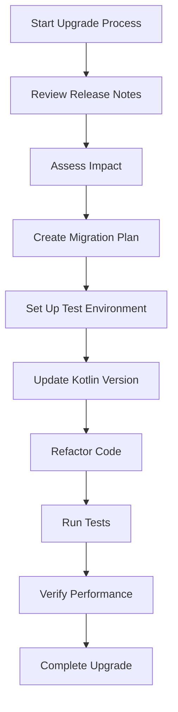

## 21.9 Upgrading and Migration

Upgrading and migrating Kotlin projects is an essential aspect of maintaining modern software applications. As Kotlin evolves, new features are introduced, and some older features may become deprecated. This section provides a comprehensive guide to transitioning between Kotlin versions, handling deprecations, and leveraging new language features effectively.

### Introduction to Kotlin Upgrading and Migration

Upgrading Kotlin involves moving your project from one version of the Kotlin language to a newer version. Migration, on the other hand, refers to adapting your codebase to accommodate changes in the language, libraries, or frameworks. Both processes are crucial for ensuring that your application remains up-to-date, secure, and efficient.

#### Why Upgrade?

- **Access to New Features**: New Kotlin versions often introduce language enhancements, performance improvements, and additional APIs that can simplify development and improve code quality.
- **Security and Stability**: Upgrading ensures that your application benefits from the latest security patches and bug fixes.
- **Community and Ecosystem Support**: Staying current with the latest Kotlin version ensures compatibility with libraries and frameworks, which often update to support the latest language features.

#### Challenges in Upgrading

- **Breaking Changes**: New versions may introduce changes that are incompatible with existing code, requiring modifications.
- **Deprecations**: Features that are deprecated in newer versions need to be replaced or refactored.
- **Dependency Management**: Ensuring that all dependencies are compatible with the new Kotlin version can be complex.

### Planning Your Upgrade

Before diving into the upgrade process, it's crucial to plan effectively. This involves understanding the changes in the new Kotlin version, assessing the impact on your codebase, and preparing a strategy for a smooth transition.

#### Assessing the Impact

1. **Review Release Notes**: Start by reviewing the release notes for the new Kotlin version. These notes provide detailed information about new features, deprecated elements, and breaking changes.
   
2. **Identify Affected Areas**: Use static analysis tools to identify parts of your code that might be affected by the upgrade. This includes deprecated APIs, language features, and third-party libraries.

3. **Evaluate Dependencies**: Check the compatibility of your project's dependencies with the new Kotlin version. This includes libraries, plugins, and frameworks.

#### Creating a Migration Plan

1. **Set Up a Test Environment**: Create a separate branch or environment to test the upgrade. This allows you to experiment without affecting the main codebase.

2. **Prioritize Changes**: Focus on critical areas first, such as security patches and performance improvements. Address deprecated features and breaking changes next.

3. **Automate Testing**: Ensure that your test suite is comprehensive and automated. This will help catch regressions and issues introduced during the upgrade.

### Executing the Upgrade

With a plan in place, you can begin the upgrade process. This involves updating your Kotlin version, refactoring code to accommodate changes, and verifying that everything works as expected.

#### Updating Kotlin Version

1. **Modify Build Scripts**: Update the Kotlin version in your build scripts (e.g., `build.gradle.kts` for Gradle projects). Ensure that the Kotlin plugin version is also updated.

   ```kotlin
   plugins {
       kotlin("jvm") version "1.8.0"
   }
   ```

2. **Update IDE and Tools**: Ensure that your IDE and any associated tools (e.g., Kotlin Compiler, IntelliJ IDEA) are updated to support the new Kotlin version.

#### Refactoring Code

1. **Handle Deprecations**: Replace deprecated features with their recommended alternatives. Use IDE inspections to identify and refactor deprecated code.

   ```kotlin
   // Deprecated usage
   val list = listOf(1, 2, 3)
   list.map { it * 2 }.forEach { println(it) }

   // Updated usage
   list.asSequence().map { it * 2 }.forEach { println(it) }
   ```

2. **Address Breaking Changes**: Modify code that relies on features that have changed or been removed. Refer to the release notes and migration guides for specific guidance.

3. **Leverage New Features**: Take advantage of new language features to improve code quality and performance. For example, use new syntax enhancements or APIs introduced in the latest version.

   ```kotlin
   // Using new feature: inline classes
   inline class UserId(val id: String)
   ```

#### Verifying the Upgrade

1. **Run Tests**: Execute your test suite to ensure that all tests pass. Pay special attention to edge cases and areas affected by the upgrade.

2. **Perform Manual Testing**: Conduct exploratory testing to catch any issues that automated tests might miss.

3. **Monitor Performance**: Use profiling tools to ensure that performance has not degraded. Address any bottlenecks or regressions.

### Handling Deprecations

Deprecations are a natural part of software evolution. They signal that a feature or API is outdated and will be removed in future versions. Handling deprecations involves identifying deprecated elements, understanding their replacements, and refactoring your code accordingly.

#### Identifying Deprecations

1. **Use IDE Inspections**: Modern IDEs like IntelliJ IDEA provide inspections that highlight deprecated code. Use these tools to quickly identify areas that need attention.

2. **Review Documentation**: Refer to the official Kotlin documentation and release notes for a list of deprecated features and their recommended replacements.

#### Refactoring Deprecated Code

1. **Understand Alternatives**: Before refactoring, understand the recommended alternatives for deprecated features. This ensures that your refactorings align with best practices.

2. **Refactor Incrementally**: Tackle deprecated code in small, manageable chunks. This reduces the risk of introducing errors and makes it easier to test changes.

3. **Test Thoroughly**: After refactoring, run your test suite to ensure that the changes do not introduce regressions.

### Leveraging New Language Features

Upgrading Kotlin provides an opportunity to leverage new language features that can enhance your codebase. These features often improve code readability, performance, and maintainability.

#### Exploring New Features

1. **Review Release Notes**: Familiarize yourself with new language features by reviewing the release notes. This will help you identify features that are relevant to your project.

2. **Experiment in a Sandbox**: Create a sandbox environment to experiment with new features. This allows you to explore their capabilities without affecting the main codebase.

3. **Incorporate Gradually**: Introduce new features gradually, focusing on areas where they provide the most benefit. This minimizes disruption and allows for thorough testing.

#### Examples of New Features

1. **Inline Classes**: Inline classes provide a way to create type-safe wrappers without the overhead of additional objects.

   ```kotlin
   inline class Email(val value: String)
   ```

2. **Contract Functions**: Contracts allow you to specify conditions that the Kotlin compiler can use to optimize code.

   ```kotlin
   fun requireNonNull(value: Any?): Any {
       contract {
           returns() implies (value != null)
       }
       if (value == null) throw IllegalArgumentException("Value cannot be null")
       return value
   }
   ```

3. **Coroutines Enhancements**: New coroutine features can simplify asynchronous programming and improve performance.

   ```kotlin
   // Using StateFlow for state management
   val stateFlow = MutableStateFlow(0)
   ```

### Managing Dependencies

Upgrading Kotlin often involves updating dependencies to ensure compatibility with the new language version. This process requires careful management to avoid conflicts and ensure stability.

#### Dependency Management Strategies

1. **Use Dependency Management Tools**: Tools like Gradle and Maven provide mechanisms for managing dependencies effectively. Use these tools to specify versions and resolve conflicts.

2. **Check Compatibility**: Before upgrading, check the compatibility of your dependencies with the new Kotlin version. This includes libraries, plugins, and frameworks.

3. **Update Gradually**: Update dependencies incrementally, testing each change thoroughly. This reduces the risk of introducing conflicts or breaking changes.

4. **Monitor for Updates**: Keep an eye on updates to your dependencies. Many libraries release updates to support new Kotlin versions shortly after they are released.

### Best Practices for Upgrading and Migration

Following best practices can help ensure a smooth and successful upgrade process. These practices focus on minimizing risks, maximizing benefits, and maintaining code quality.

#### General Best Practices

1. **Automate Testing**: Ensure that your test suite is comprehensive and automated. This allows you to catch regressions and issues early in the upgrade process.

2. **Document Changes**: Keep detailed documentation of changes made during the upgrade. This includes refactorings, dependency updates, and new features.

3. **Engage the Team**: Involve your development team in the upgrade process. This ensures that everyone is aware of changes and can contribute to testing and refactoring efforts.

4. **Plan for Rollback**: Have a rollback plan in place in case the upgrade introduces critical issues. This allows you to revert to the previous version quickly if needed.

#### Kotlin-Specific Best Practices

1. **Use IDE Features**: Leverage IDE features like inspections and refactoring tools to identify and address issues quickly.

2. **Stay Informed**: Keep up-to-date with the latest Kotlin developments by following the official Kotlin blog, forums, and community channels.

3. **Participate in the Community**: Engage with the Kotlin community to share experiences, seek advice, and learn from others who have gone through similar upgrades.

### Visualizing the Upgrade Process

To better understand the upgrade process, let's visualize it using a flowchart. This diagram outlines the key steps involved in upgrading a Kotlin project.



**Figure 1: Visualizing the Kotlin Upgrade Process**

### Knowledge Check

Before we conclude, let's reinforce what we've learned with a few questions:

1. **What are the key reasons for upgrading Kotlin?**
   - Access to new features, security and stability, and community support.

2. **What is the first step in planning an upgrade?**
   - Reviewing the release notes for the new Kotlin version.

3. **How can you identify deprecated code in your project?**
   - Use IDE inspections and review official documentation.

4. **What is a best practice for managing dependencies during an upgrade?**
   - Update dependencies incrementally and test each change thoroughly.

### Conclusion

Upgrading and migrating Kotlin projects is a critical aspect of maintaining modern software applications. By following best practices, leveraging new language features, and managing dependencies effectively, you can ensure a smooth transition between Kotlin versions. Remember, this is just the beginning. As you progress, you'll build more complex and interactive applications. Keep experimenting, stay curious, and enjoy the journey!

## Quiz Time!



### What is the primary reason for upgrading Kotlin?

- [x] Access to new features and improvements
- [ ] To increase code complexity
- [ ] To reduce project size
- [ ] To avoid using modern tools

> **Explanation:** Upgrading Kotlin provides access to new language features, performance improvements, and security patches.

### What should you review first when planning an upgrade?

- [x] Release notes for the new Kotlin version
- [ ] Your project's README file
- [ ] Old version documentation
- [ ] Code comments

> **Explanation:** Reviewing release notes helps you understand new features, deprecations, and breaking changes.

### How can you identify deprecated code in your Kotlin project?

- [x] Use IDE inspections
- [ ] Manually search through the code
- [ ] Ignore deprecated warnings
- [ ] Use code comments

> **Explanation:** IDE inspections can automatically highlight deprecated code, making it easier to identify.

### What is a recommended strategy for updating dependencies during an upgrade?

- [x] Update dependencies incrementally and test thoroughly
- [ ] Update all dependencies at once
- [ ] Ignore dependency updates
- [ ] Remove all dependencies

> **Explanation:** Incremental updates allow for thorough testing and reduce the risk of conflicts.

### Which tool can help manage dependencies effectively?

- [x] Gradle
- [ ] Notepad
- [ ] Excel
- [ ] Paint

> **Explanation:** Gradle is a build automation tool that helps manage dependencies effectively.

### What is a key benefit of leveraging new Kotlin language features?

- [x] Improved code readability and performance
- [ ] Increased code length
- [ ] More complex syntax
- [ ] Reduced functionality

> **Explanation:** New language features often enhance code readability, performance, and maintainability.

### What should you do after refactoring deprecated code?

- [x] Run your test suite to ensure no regressions
- [ ] Delete the test suite
- [ ] Ignore testing
- [ ] Write new code without testing

> **Explanation:** Running tests ensures that refactoring does not introduce new issues.

### What is a best practice for documenting changes during an upgrade?

- [x] Keep detailed documentation of all changes
- [ ] Write changes on a sticky note
- [ ] Ignore documentation
- [ ] Use verbal communication only

> **Explanation:** Detailed documentation helps track changes and assists in future upgrades.

### What is the purpose of setting up a test environment during an upgrade?

- [x] To experiment without affecting the main codebase
- [ ] To delete unnecessary files
- [ ] To merge all changes immediately
- [ ] To ignore testing

> **Explanation:** A test environment allows you to experiment and test changes safely.

### True or False: Participating in the Kotlin community can help with upgrading and migration.

- [x] True
- [ ] False

> **Explanation:** Engaging with the community provides access to shared experiences, advice, and support.


