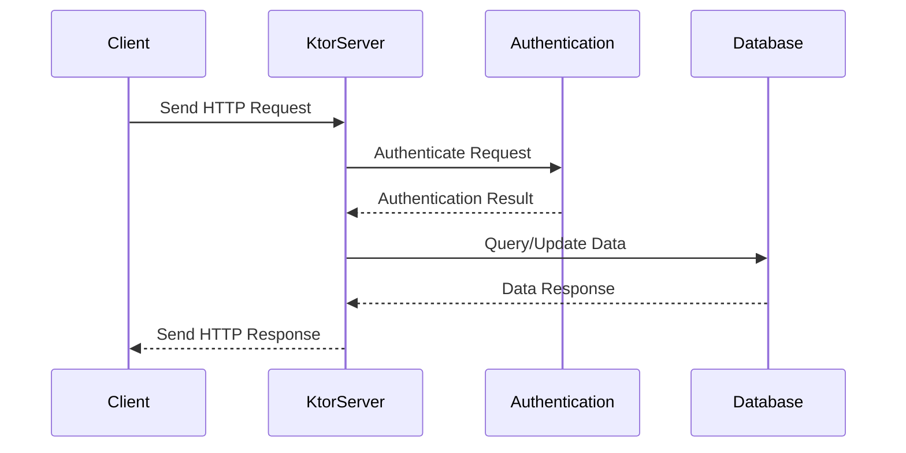

## 22.2 Building a RESTful API with Ktor

In this section, we will delve into the process of building a RESTful API using Ktor, a powerful and flexible framework for Kotlin. We'll explore best practices for designing and implementing APIs, address security and performance considerations, and provide practical code examples to guide you through the process.

### Introduction to Ktor

Ktor is an asynchronous framework for creating microservices and web applications in Kotlin. It is designed to be lightweight and flexible, allowing developers to choose the components they need and configure them as required. Ktor's modular architecture and Kotlin-first approach make it an excellent choice for building RESTful APIs.

#### Why Choose Ktor?

- **Kotlin-First**: Ktor is built with Kotlin in mind, leveraging Kotlin's features such as coroutines for asynchronous programming.
- **Modular Architecture**: Ktor allows you to include only the components you need, reducing bloat and improving performance.
- **Asynchronous by Design**: Ktor's use of coroutines makes it naturally asynchronous, which is ideal for handling multiple requests efficiently.
- **Extensible**: You can easily extend Ktor with plugins to add functionality such as authentication, serialization, and more.

### Setting Up a Ktor Project

To begin building a RESTful API with Ktor, you'll first need to set up a Kotlin project. We'll use Gradle as our build tool.

#### Step 1: Create a New Kotlin Project

Start by creating a new Kotlin project using IntelliJ IDEA or your preferred IDE. Ensure that you have the Kotlin plugin installed.

#### Step 2: Configure Gradle

In your `build.gradle.kts` file, include the necessary dependencies for Ktor:

```kotlin
plugins {
    kotlin("jvm") version "1.8.0"
    application
}

repositories {
    mavenCentral()
}

dependencies {
    implementation("io.ktor:ktor-server-core:2.0.0")
    implementation("io.ktor:ktor-server-netty:2.0.0")
    implementation("io.ktor:ktor-server-content-negotiation:2.0.0")
    implementation("io.ktor:ktor-serialization-kotlinx-json:2.0.0")
    testImplementation("io.ktor:ktor-server-tests:2.0.0")
    testImplementation("org.jetbrains.kotlin:kotlin-test:1.8.0")
}

application {
    mainClass.set("com.example.ApplicationKt")
}
```

#### Step 3: Define the Main Application File

Create a main application file, `Application.kt`, and set up a basic Ktor server:

```kotlin
package com.example

import io.ktor.server.engine.*
import io.ktor.server.netty.*
import io.ktor.server.application.*
import io.ktor.server.response.*
import io.ktor.server.request.*
import io.ktor.server.routing.*

fun main() {
    embeddedServer(Netty, port = 8080) {
        module()
    }.start(wait = true)
}

fun Application.module() {
    routing {
        get("/") {
            call.respondText("Hello, Ktor!")
        }
    }
}
```

### Designing the RESTful API

When designing a RESTful API, it's crucial to adhere to REST principles to ensure that your API is intuitive and easy to use. Here are some best practices to consider:

#### Use Meaningful Resource Names

Resource names should be nouns and represent the entity that the API manages. For example, use `/users` instead of `/getUsers`.

#### HTTP Methods

Use appropriate HTTP methods for different operations:

- **GET**: Retrieve data from the server.
- **POST**: Create a new resource.
- **PUT**: Update an existing resource.
- **DELETE**: Remove a resource.

#### Status Codes

Return appropriate HTTP status codes to indicate the result of an operation:

- **200 OK**: Successful request.
- **201 Created**: Resource created successfully.
- **400 Bad Request**: Invalid request data.
- **404 Not Found**: Resource not found.
- **500 Internal Server Error**: Server error.

#### Versioning

Version your API to manage changes over time. Include the version number in the URL, such as `/v1/users`.

### Implementing the RESTful API

Let's implement a simple RESTful API for managing users. We'll create endpoints for CRUD operations.

#### Step 1: Define the Data Model

Create a data class to represent a user:

```kotlin
data class User(val id: Int, val name: String, val email: String)
```

#### Step 2: Set Up In-Memory Storage

For simplicity, we'll use a mutable list to store users:

```kotlin
val users = mutableListOf<User>()
```

#### Step 3: Implement CRUD Endpoints

Add routes to handle CRUD operations in the `module` function:

```kotlin
fun Application.module() {
    routing {
        route("/users") {
            get {
                call.respond(users)
            }
            get("/{id}") {
                val id = call.parameters["id"]?.toIntOrNull()
                val user = users.find { it.id == id }
                if (user != null) {
                    call.respond(user)
                } else {
                    call.respondText("User not found", status = HttpStatusCode.NotFound)
                }
            }
            post {
                val user = call.receive<User>()
                users.add(user)
                call.respondText("User added", status = HttpStatusCode.Created)
            }
            put("/{id}") {
                val id = call.parameters["id"]?.toIntOrNull()
                val user = users.find { it.id == id }
                if (user != null) {
                    val updatedUser = call.receive<User>()
                    users.remove(user)
                    users.add(updatedUser)
                    call.respondText("User updated", status = HttpStatusCode.OK)
                } else {
                    call.respondText("User not found", status = HttpStatusCode.NotFound)
                }
            }
            delete("/{id}") {
                val id = call.parameters["id"]?.toIntOrNull()
                val user = users.find { it.id == id }
                if (user != null) {
                    users.remove(user)
                    call.respondText("User deleted", status = HttpStatusCode.OK)
                } else {
                    call.respondText("User not found", status = HttpStatusCode.NotFound)
                }
            }
        }
    }
}
```

### Security Considerations

Security is a critical aspect of any API. Here are some best practices to secure your Ktor API:

#### Authentication and Authorization

Implement authentication to verify user identity and authorization to control access to resources. Ktor provides plugins for handling authentication, such as JWT (JSON Web Tokens).

##### Example: Implementing JWT Authentication

Add the necessary dependencies to your `build.gradle.kts`:

```kotlin
implementation("io.ktor:ktor-server-auth:2.0.0")
implementation("io.ktor:ktor-server-auth-jwt:2.0.0")
```

Configure JWT authentication in your application:

```kotlin
fun Application.module() {
    install(Authentication) {
        jwt {
            realm = "ktor.io"
            verifier(JWT
                .require(Algorithm.HMAC256("secret"))
                .withAudience("ktor-audience")
                .withIssuer("ktor-issuer")
                .build())
            validate { credential ->
                if (credential.payload.audience.contains("ktor-audience")) JWTPrincipal(credential.payload) else null
            }
        }
    }

    routing {
        authenticate {
            route("/users") {
                // CRUD endpoints
            }
        }
    }
}
```

#### Input Validation

Validate incoming data to prevent injection attacks and ensure data integrity. Use libraries like `kotlinx.serialization` for JSON parsing and validation.

#### Rate Limiting

Implement rate limiting to prevent abuse and ensure fair usage of your API. You can use middleware to track and limit requests from each client.

### Performance Optimization

Optimizing the performance of your API is essential for providing a responsive user experience. Here are some strategies to consider:

#### Asynchronous Processing

Leverage Ktor's coroutine-based architecture to handle requests asynchronously. This allows your server to handle more concurrent requests efficiently.

#### Caching

Implement caching to reduce the load on your server and improve response times. Use HTTP caching headers or an in-memory cache like Caffeine.

#### Compression

Enable response compression to reduce the size of data sent over the network. Ktor provides a `Compression` plugin for this purpose.

```kotlin
install(Compression) {
    gzip {
        priority = 1.0
    }
    deflate {
        priority = 10.0
        minimumSize(1024) // condition
    }
}
```

#### Database Optimization

If your API interacts with a database, optimize queries and use connection pooling to improve performance. Consider using libraries like Exposed or Hibernate for ORM.

### Testing Your API

Testing is crucial to ensure the reliability and correctness of your API. Write unit tests for your business logic and integration tests for your API endpoints.

#### Example: Writing a Test for the User Endpoint

Add test dependencies to your `build.gradle.kts`:

```kotlin
testImplementation("io.ktor:ktor-server-tests:2.0.0")
testImplementation("org.jetbrains.kotlin:kotlin-test:1.8.0")
```

Write a test for the `/users` endpoint:

```kotlin
class UserApiTest : StringSpec({
    "should return all users" {
        withTestApplication({ module() }) {
            handleRequest(HttpMethod.Get, "/users").apply {
                response.status() shouldBe HttpStatusCode.OK
                response.content shouldBe "[]"
            }
        }
    }
})
```

### Try It Yourself

Experiment with the code examples provided in this guide. Try adding new features, such as:

- Implementing pagination for the `/users` endpoint.
- Adding a search functionality to filter users by name or email.
- Securing specific endpoints with different authentication methods.

### Visualizing the API Architecture

To better understand the architecture of our Ktor RESTful API, let's visualize the flow of a typical request:



This diagram illustrates the sequence of interactions between the client, server, authentication mechanism, and database during a typical API request.

### Conclusion

Building a RESTful API with Ktor involves understanding the principles of REST, implementing best practices for API design, and addressing security and performance considerations. By leveraging Ktor's features and Kotlin's capabilities, you can create efficient, scalable, and secure APIs.

Remember, this is just the beginning. As you progress, you'll build more complex and interactive APIs. Keep experimenting, stay curious, and enjoy the journey!

## Quiz Time!



### What is a key advantage of using Ktor for building RESTful APIs?

- [x] It is built with Kotlin in mind and leverages Kotlin's features.
- [ ] It is the only framework available for Kotlin.
- [ ] It does not support asynchronous programming.
- [ ] It requires a specific IDE to work.

> **Explanation:** Ktor is designed with Kotlin's features in mind, making it a natural choice for Kotlin developers. It supports asynchronous programming through coroutines, which is a key advantage.

### Which HTTP method is typically used to update an existing resource?

- [ ] GET
- [ ] POST
- [x] PUT
- [ ] DELETE

> **Explanation:** The PUT method is used to update an existing resource. It replaces the current representation of the target resource with the request payload.

### What is the purpose of JWT in a Ktor application?

- [ ] To compress data
- [x] To authenticate users
- [ ] To cache responses
- [ ] To handle database connections

> **Explanation:** JWT (JSON Web Tokens) are used for authenticating users by verifying their identity through tokens.

### What is a benefit of using asynchronous processing in Ktor?

- [x] It allows handling more concurrent requests efficiently.
- [ ] It makes the code more complex.
- [ ] It reduces the need for authentication.
- [ ] It increases the server's memory usage.

> **Explanation:** Asynchronous processing allows the server to handle multiple requests simultaneously without blocking, improving efficiency and scalability.

### Which plugin can be used in Ktor to enable response compression?

- [ ] Authentication
- [x] Compression
- [ ] Caching
- [ ] Serialization

> **Explanation:** The Compression plugin in Ktor is used to enable response compression, reducing the size of data sent over the network.

### What is a common practice for versioning RESTful APIs?

- [x] Including the version number in the URL, such as /v1/resource.
- [ ] Using different HTTP methods for different versions.
- [ ] Changing the domain name for each version.
- [ ] Not versioning at all.

> **Explanation:** A common practice for versioning RESTful APIs is to include the version number in the URL, which helps manage changes over time.

### How can you secure specific endpoints in a Ktor application?

- [ ] By using the Compression plugin
- [x] By implementing authentication and authorization
- [ ] By using different HTTP methods
- [ ] By not exposing them publicly

> **Explanation:** Securing specific endpoints involves implementing authentication and authorization to control access to resources.

### What is the role of input validation in a RESTful API?

- [ ] To compress data
- [ ] To authenticate users
- [x] To prevent injection attacks and ensure data integrity
- [ ] To handle database connections

> **Explanation:** Input validation is crucial for preventing injection attacks and ensuring that the data being processed is valid and secure.

### Which library can be used for ORM in a Ktor application?

- [ ] JWT
- [ ] Compression
- [x] Exposed
- [ ] Kapt

> **Explanation:** Exposed is a library that can be used for ORM (Object-Relational Mapping) in Kotlin applications, including those built with Ktor.

### True or False: Ktor is a synchronous framework by design.

- [ ] True
- [x] False

> **Explanation:** False. Ktor is an asynchronous framework by design, leveraging Kotlin's coroutines for non-blocking operations.


