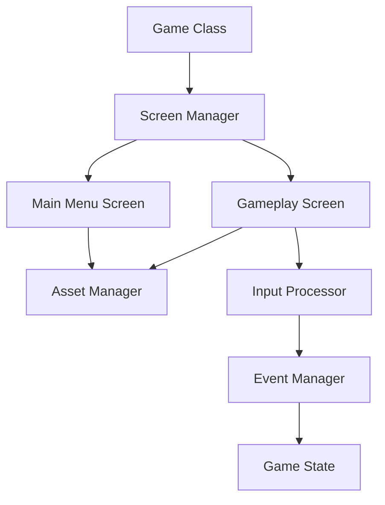

## 22.5 Game Development

Game development is a fascinating domain that combines creativity with technical expertise. Kotlin, with its expressive syntax and powerful features, is an excellent choice for game development, especially when paired with the libGDX framework. In this section, we will explore how to create games using Kotlin and libGDX, focusing on design patterns and performance optimization techniques to build efficient and engaging games.

### Introduction to libGDX

libGDX is a cross-platform game development framework that allows developers to write games in Java, which can then be deployed to multiple platforms, including Windows, macOS, Linux, Android, iOS, and HTML5. Its robust set of features and active community make it a popular choice for indie game developers.

#### Why Use Kotlin with libGDX?

Kotlin offers several advantages over Java, such as null safety, extension functions, and coroutines, which can significantly enhance the development experience. By using Kotlin with libGDX, developers can write more concise and maintainable code.

### Setting Up Your Development Environment

Before diving into game development, let's set up the development environment for Kotlin and libGDX.

1. **Install Java Development Kit (JDK):** Ensure you have JDK 8 or higher installed on your system.

2. **Install IntelliJ IDEA:** IntelliJ IDEA is a powerful IDE that supports Kotlin development. Download and install it from [JetBrains](https://www.jetbrains.com/idea/).

3. **Set Up libGDX Project:** Use the libGDX setup tool to create a new project. You can download the setup jar from the [libGDX website](https://libgdx.com/).

4. **Configure Kotlin:** Add Kotlin support to your project by including the Kotlin plugin in your build.gradle file.

```gradle
plugins {
    id 'org.jetbrains.kotlin.jvm' version '1.8.0'
}

dependencies {
    implementation "org.jetbrains.kotlin:kotlin-stdlib"
}
```

### Basic Game Structure

A typical libGDX game consists of several core components:

- **Game Class:** The main entry point of the game.
- **Screens:** Different states or views of the game, such as the main menu, gameplay, and settings.
- **Assets:** Resources like images, sounds, and fonts used in the game.
- **Input Processing:** Handling user input from keyboard, mouse, or touch.

#### Creating the Game Class

The game class extends `Game`, a libGDX class that manages different screens. Here's a simple example in Kotlin:

```kotlin
class MyGame : Game() {
    override fun create() {
        setScreen(MainMenuScreen(this))
    }
}
```

#### Implementing Screens

Screens are responsible for rendering graphics and handling input. Each screen implements the `Screen` interface, which includes methods like `show()`, `render()`, `resize()`, `pause()`, `resume()`, and `hide()`.

```kotlin
class MainMenuScreen(private val game: MyGame) : Screen {
    override fun show() {
        // Initialize resources
    }

    override fun render(delta: Float) {
        // Render the main menu
    }

    override fun resize(width: Int, height: Int) {}
    override fun pause() {}
    override fun resume() {}
    override fun hide() {}
    override fun dispose() {
        // Dispose resources
    }
}
```

### Design Patterns in Game Development

Design patterns are essential in game development for creating flexible and maintainable code. Let's explore some common patterns used in game development with Kotlin and libGDX.

#### Singleton Pattern

The Singleton pattern ensures that a class has only one instance and provides a global point of access to it. In game development, this pattern is often used for managing resources like textures and sounds.

```kotlin
object AssetManager {
    val texture: Texture by lazy { Texture("image.png") }

    fun dispose() {
        texture.dispose()
    }
}
```

#### Observer Pattern

The Observer pattern is useful for implementing event-driven systems. In games, it can be used for handling events like player actions or game state changes.

```kotlin
interface EventListener {
    fun onEvent(event: GameEvent)
}

class GameEventManager {
    private val listeners = mutableListOf<EventListener>()

    fun addListener(listener: EventListener) {
        listeners.add(listener)
    }

    fun notify(event: GameEvent) {
        listeners.forEach { it.onEvent(event) }
    }
}
```

#### State Pattern

The State pattern allows an object to change its behavior when its internal state changes. This is particularly useful for managing game states, such as playing, paused, or game over.

```kotlin
interface GameState {
    fun update()
    fun render()
}

class PlayingState : GameState {
    override fun update() {
        // Update game logic
    }

    override fun render() {
        // Render game
    }
}

class GameContext {
    var state: GameState = PlayingState()

    fun update() {
        state.update()
    }

    fun render() {
        state.render()
    }
}
```

### Performance Optimization

Performance is crucial in game development to ensure smooth gameplay. Here are some techniques to optimize performance in Kotlin and libGDX games.

#### Efficient Asset Management

Load assets efficiently to reduce memory usage and improve loading times. Use texture atlases to combine multiple images into a single file, reducing draw calls.

```kotlin
val textureAtlas = TextureAtlas("textures.atlas")
val playerTexture = textureAtlas.findRegion("player")
```

#### Use of Pools

Object pooling is a technique to reuse objects instead of creating new ones, which can reduce garbage collection overhead.

```kotlin
val bulletPool = Pool<Bullet> {
    Bullet()
}

fun shoot() {
    val bullet = bulletPool.obtain()
    // Initialize bullet
}

fun update() {
    // Return bullet to pool when no longer needed
    bulletPool.free(bullet)
}
```

#### Optimize Rendering

Minimize the number of draw calls by batching rendering operations. Use sprite batches to draw multiple sprites in a single call.

```kotlin
val spriteBatch = SpriteBatch()

fun render() {
    spriteBatch.begin()
    spriteBatch.draw(playerTexture, player.x, player.y)
    spriteBatch.end()
}
```

#### Leverage Kotlin Coroutines

Use Kotlin coroutines for asynchronous tasks, such as loading assets or handling network operations, to keep the game responsive.

```kotlin
fun loadAssets() = CoroutineScope(Dispatchers.IO).launch {
    // Load assets asynchronously
    withContext(Dispatchers.Main) {
        // Update UI on the main thread
    }
}
```

### Advanced Techniques

#### Entity-Component-System (ECS)

The ECS architecture separates data (components) from behavior (systems), allowing for flexible and reusable code. This pattern is particularly useful for managing complex game logic.

```kotlin
class PositionComponent(var x: Float, var y: Float)
class VelocityComponent(var vx: Float, var vy: Float)

class MovementSystem : IteratingSystem(Family.all(PositionComponent::class.java, VelocityComponent::class.java).get()) {
    override fun processEntity(entity: Entity, deltaTime: Float) {
        val position = entity.getComponent(PositionComponent::class.java)
        val velocity = entity.getComponent(VelocityComponent::class.java)
        position.x += velocity.vx * deltaTime
        position.y += velocity.vy * deltaTime
    }
}
```

#### Finite State Machines (FSM)

FSMs are useful for managing complex behaviors, such as AI or game logic. They allow you to define a set of states and transitions between them.

```kotlin
class EnemyAI {
    private var state: State = IdleState()

    fun update() {
        state = state.update()
    }

    interface State {
        fun update(): State
    }

    class IdleState : State {
        override fun update(): State {
            // Transition logic
            return this
        }
    }
}
```

### Visualizing Game Architecture

To better understand the architecture of a game using libGDX and Kotlin, let's visualize the components and their interactions.



**Diagram Description:** This diagram illustrates the flow of a typical libGDX game. The Game Class initializes the Screen Manager, which manages different screens like the Main Menu and Gameplay. Both screens interact with the Asset Manager to load resources. The Gameplay Screen also processes input through the Input Processor, which communicates with the Event Manager to update the Game State.

### Try It Yourself

Now that we've covered the basics, let's put your knowledge into practice. Try modifying the provided code examples to create a simple game. Here are some ideas:

- **Add a new screen:** Implement a settings screen where players can adjust game options.
- **Enhance input handling:** Add support for touch input on mobile devices.
- **Implement a new game state:** Create a pause state that halts gameplay when activated.

### Conclusion

Game development with Kotlin and libGDX offers a powerful combination of modern language features and a robust framework. By applying design patterns and performance optimization techniques, you can create efficient and engaging games. Remember, this is just the beginning. As you continue your journey, you'll discover new challenges and opportunities to refine your skills.

## Quiz Time!



### What is the primary advantage of using Kotlin with libGDX?

- [x] Kotlin offers null safety and concise syntax.
- [ ] Kotlin is faster than Java.
- [ ] Kotlin is the only language supported by libGDX.
- [ ] Kotlin has better graphics capabilities.

> **Explanation:** Kotlin provides null safety, extension functions, and a more concise syntax compared to Java, enhancing the development experience.

### Which design pattern is commonly used for managing game resources in libGDX?

- [x] Singleton Pattern
- [ ] Observer Pattern
- [ ] Factory Pattern
- [ ] Prototype Pattern

> **Explanation:** The Singleton Pattern is often used to manage resources like textures and sounds, ensuring a single instance is used throughout the game.

### How can you optimize rendering in a libGDX game?

- [x] Use sprite batches to minimize draw calls.
- [ ] Increase the number of draw calls.
- [ ] Use multiple threads for rendering.
- [ ] Load all assets at startup.

> **Explanation:** Using sprite batches allows you to draw multiple sprites in a single call, reducing the number of draw calls and improving performance.

### What is the purpose of the Entity-Component-System (ECS) architecture?

- [x] To separate data from behavior for flexible and reusable code.
- [ ] To combine data and behavior into a single class.
- [ ] To simplify the rendering process.
- [ ] To manage game states.

> **Explanation:** ECS separates data (components) from behavior (systems), allowing for more flexible and reusable code, especially in complex game logic.

### Which Kotlin feature is useful for handling asynchronous tasks in game development?

- [x] Coroutines
- [ ] Data classes
- [ ] Sealed classes
- [ ] Extension functions

> **Explanation:** Kotlin coroutines are useful for handling asynchronous tasks, such as loading assets or network operations, keeping the game responsive.

### What is the role of the Screen interface in libGDX?

- [x] It defines methods for rendering and handling input for different game states.
- [ ] It manages game resources.
- [ ] It handles network communication.
- [ ] It optimizes game performance.

> **Explanation:** The Screen interface defines methods like `show()`, `render()`, and `dispose()`, which are used to manage rendering and input for different game states.

### How does object pooling improve performance in game development?

- [x] By reusing objects instead of creating new ones, reducing garbage collection overhead.
- [ ] By increasing the number of objects created.
- [ ] By using more memory.
- [ ] By simplifying code structure.

> **Explanation:** Object pooling reuses objects, reducing the need for frequent object creation and garbage collection, which can improve performance.

### What is a common use case for the State pattern in game development?

- [x] Managing game states like playing, paused, or game over.
- [ ] Rendering graphics.
- [ ] Handling user input.
- [ ] Optimizing performance.

> **Explanation:** The State pattern is useful for managing different game states, allowing the game to change behavior based on its current state.

### Which tool is recommended for setting up a libGDX project?

- [x] libGDX setup tool
- [ ] Maven
- [ ] Ant
- [ ] Eclipse

> **Explanation:** The libGDX setup tool is specifically designed to create and configure new libGDX projects.

### True or False: Kotlin's extension functions can be used to add functionality to existing classes without modifying their source code.

- [x] True
- [ ] False

> **Explanation:** Kotlin's extension functions allow you to add new functionality to existing classes without altering their source code, enhancing code flexibility.


