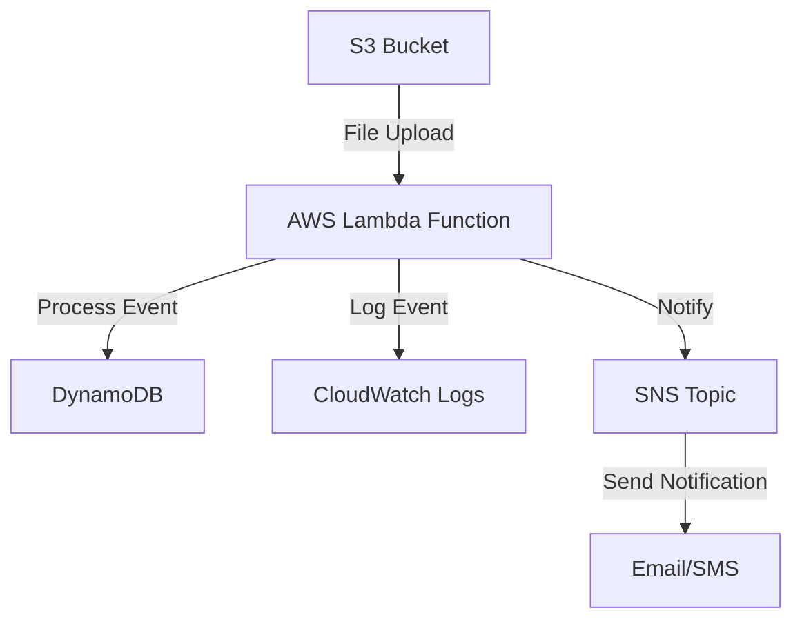

## 22.6 Serverless Application with AWS Lambda

In this section, we delve into the fascinating world of serverless computing with AWS Lambda, focusing on deploying Kotlin functions. We'll explore the benefits of serverless architecture, how to implement event-driven architectures using AWS Lambda, and best practices for creating efficient, scalable, and cost-effective applications. 

### Understanding Serverless Architecture

Serverless architecture is a cloud computing execution model where the cloud provider dynamically manages the allocation and provisioning of servers. By using serverless architecture, developers can focus on writing code without worrying about infrastructure management. 

#### Key Benefits of Serverless Architecture

1. **Cost Efficiency**: Pay only for the compute time you consume. There is no charge when your code is not running.
2. **Scalability**: Automatically scales your application by running code in response to each trigger.
3. **Reduced Operational Overhead**: No need to manage servers, allowing developers to focus on core product development.
4. **Rapid Deployment and Iteration**: Quickly deploy and iterate on applications without the need for complex deployment pipelines.

### AWS Lambda: A Serverless Compute Service

AWS Lambda is a serverless compute service that allows you to run code without provisioning or managing servers. You can trigger Lambda functions using various AWS services such as S3, DynamoDB, Kinesis, SNS, and more.

#### Key Features of AWS Lambda

- **Event-Driven Execution**: Lambda functions are triggered by events from other AWS services.
- **Automatic Scaling**: Lambda automatically scales your application by running code in response to each trigger.
- **Integrated Security**: AWS Identity and Access Management (IAM) roles can be used to control access to Lambda functions.
- **Flexible Language Support**: Supports multiple programming languages, including Kotlin via the Java runtime.

### Deploying Kotlin Functions with AWS Lambda

Kotlin is a modern, concise, and safe programming language that runs on the Java Virtual Machine (JVM). It is fully interoperable with Java, making it an excellent choice for AWS Lambda functions.

#### Setting Up Your Environment

Before deploying Kotlin functions on AWS Lambda, ensure you have the following setup:

1. **AWS Account**: Sign up for an AWS account if you don't have one.
2. **AWS CLI**: Install and configure the AWS Command Line Interface (CLI).
3. **Java Development Kit (JDK)**: Ensure you have JDK 8 or later installed.
4. **Gradle**: Use Gradle as the build tool for your Kotlin project.

#### Creating a Kotlin Lambda Function

Let's walk through creating a simple Kotlin Lambda function that processes an event from AWS S3.

1. **Initialize a Kotlin Project**: Use Gradle to set up a new Kotlin project.

   ```bash
   gradle init --type kotlin-application
   ```

2. **Add Dependencies**: Include the AWS SDK and Lambda dependencies in your `build.gradle.kts` file.

   ```kotlin
   dependencies {
       implementation("com.amazonaws:aws-lambda-java-core:1.2.1")
       implementation("com.amazonaws:aws-lambda-java-events:3.10.0")
   }
   ```

3. **Write the Lambda Function**: Create a Kotlin class with a function that handles the S3 event.

   ```kotlin
   import com.amazonaws.services.lambda.runtime.Context
   import com.amazonaws.services.lambda.runtime.RequestHandler
   import com.amazonaws.services.lambda.runtime.events.S3Event

   class S3EventHandler : RequestHandler<S3Event, String> {
       override fun handleRequest(event: S3Event, context: Context): String {
           val bucketName = event.records[0].s3.bucket.name
           val objectKey = event.records[0].s3.object.key
           context.logger.log("Processing file $objectKey from bucket $bucketName")
           // Add your processing logic here
           return "Processed $objectKey from $bucketName"
       }
   }
   ```

4. **Build the Project**: Use Gradle to build the project and create a JAR file.

   ```bash
   ./gradlew build
   ```

5. **Deploy to AWS Lambda**: Use the AWS CLI to deploy your Lambda function.

   ```bash
   aws lambda create-function --function-name S3EventHandler \
       --runtime java11 --role arn:aws:iam::account-id:role/execution_role \
       --handler com.example.S3EventHandler::handleRequest \
       --zip-file fileb://build/libs/your-jar-file.jar
   ```

### Event-Driven Architectures with AWS Lambda

Event-driven architecture is a software design pattern in which decoupled components communicate with each other by producing and consuming events. AWS Lambda is an ideal service for implementing event-driven architectures due to its ability to respond to events from various AWS services.

#### Common Event Sources for AWS Lambda

- **Amazon S3**: Trigger Lambda functions in response to object uploads.
- **Amazon DynamoDB**: Respond to data modifications in DynamoDB tables.
- **Amazon Kinesis**: Process streaming data in real-time.
- **Amazon SNS/SQS**: Handle messages from Simple Notification Service (SNS) or Simple Queue Service (SQS).

#### Designing Event-Driven Systems

When designing event-driven systems with AWS Lambda, consider the following:

1. **Event Source Mapping**: Configure your Lambda function to be triggered by specific events.
2. **Idempotency**: Ensure that your Lambda function can handle duplicate events gracefully.
3. **Error Handling**: Implement retry logic and dead-letter queues for failed events.
4. **Monitoring and Logging**: Use AWS CloudWatch for monitoring and logging Lambda function executions.

### Best Practices for Serverless Applications

1. **Optimize Cold Starts**: Use provisioned concurrency to reduce cold start latency.
2. **Efficient Resource Management**: Allocate appropriate memory and timeout settings for your Lambda functions.
3. **Security Best Practices**: Use IAM roles to control access and encrypt sensitive data.
4. **Cost Management**: Monitor usage and optimize function execution to reduce costs.

### Visualizing Serverless Architecture with AWS Lambda

Below is a diagram illustrating the interaction between AWS Lambda and other AWS services in a serverless architecture.



**Diagram Description**: This diagram shows an S3 bucket triggering a Lambda function upon file upload. The Lambda function processes the event, logs it to CloudWatch, updates a DynamoDB table, and sends a notification via SNS.

### Try It Yourself

Experiment with the provided code by modifying the event processing logic. For instance, you can add functionality to transform the uploaded file or integrate additional AWS services like Amazon Rekognition for image analysis.

### References and Further Reading

- [AWS Lambda Documentation](https://docs.aws.amazon.com/lambda/latest/dg/welcome.html)
- [Kotlin Programming Language](https://kotlinlang.org/)
- [AWS SDK for Java](https://aws.amazon.com/sdk-for-java/)

### Knowledge Check

1. **What is serverless architecture?**
   - A cloud computing model where the cloud provider manages server allocation.
   
2. **How does AWS Lambda scale applications?**
   - Automatically scales by running code in response to each trigger.

3. **What are common event sources for AWS Lambda?**
   - S3, DynamoDB, Kinesis, SNS, SQS.

### Embrace the Journey

Remember, this is just the beginning. As you progress, you'll build more complex and interactive serverless applications. Keep experimenting, stay curious, and enjoy the journey!

## Quiz Time!



### What is the primary benefit of using serverless architecture?

- [x] Reduced operational overhead
- [ ] Increased server management
- [ ] Higher fixed costs
- [ ] Manual scaling

> **Explanation:** Serverless architecture reduces operational overhead by eliminating the need to manage servers.

### Which AWS service is used to run serverless functions?

- [x] AWS Lambda
- [ ] Amazon EC2
- [ ] Amazon RDS
- [ ] AWS S3

> **Explanation:** AWS Lambda is the service used to run serverless functions.

### What language runtime does AWS Lambda support for Kotlin functions?

- [x] Java
- [ ] Python
- [ ] Node.js
- [ ] Ruby

> **Explanation:** Kotlin functions are supported via the Java runtime in AWS Lambda.

### What is a common use case for AWS Lambda?

- [x] Event-driven processing
- [ ] Hosting static websites
- [ ] Running virtual machines
- [ ] Managing databases

> **Explanation:** AWS Lambda is commonly used for event-driven processing.

### How can you reduce cold start latency in AWS Lambda?

- [x] Use provisioned concurrency
- [ ] Increase memory allocation
- [ ] Use larger instance types
- [ ] Enable auto-scaling

> **Explanation:** Provisioned concurrency helps reduce cold start latency in AWS Lambda.

### What AWS service can trigger a Lambda function?

- [x] Amazon S3
- [ ] Amazon EC2
- [ ] Amazon RDS
- [ ] AWS CloudFormation

> **Explanation:** Amazon S3 can trigger a Lambda function upon certain events like file uploads.

### What is a best practice for handling duplicate events in AWS Lambda?

- [x] Implement idempotency
- [ ] Increase timeout settings
- [ ] Use larger memory allocation
- [ ] Enable auto-scaling

> **Explanation:** Implementing idempotency ensures that duplicate events are handled gracefully.

### What tool can be used for monitoring AWS Lambda executions?

- [x] AWS CloudWatch
- [ ] AWS S3
- [ ] AWS EC2
- [ ] AWS IAM

> **Explanation:** AWS CloudWatch is used for monitoring AWS Lambda executions.

### Which AWS service is used for logging Lambda function executions?

- [x] AWS CloudWatch Logs
- [ ] Amazon S3
- [ ] AWS RDS
- [ ] AWS EC2

> **Explanation:** AWS CloudWatch Logs is used for logging Lambda function executions.

### True or False: AWS Lambda functions can only be written in Java.

- [ ] True
- [x] False

> **Explanation:** AWS Lambda functions can be written in multiple languages, including Java, Python, Node.js, and more.


