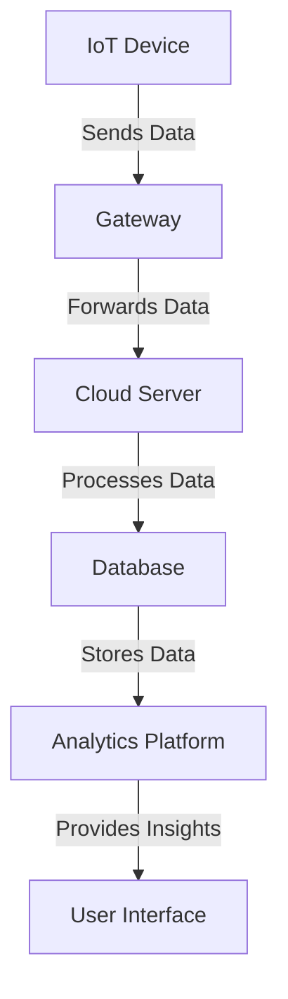

## 22.7 IoT Applications

The Internet of Things (IoT) is revolutionizing the way we interact with the world, connecting everyday objects to the internet and enabling them to send and receive data. As IoT continues to grow, the need for efficient, reliable, and scalable software solutions becomes paramount. Kotlin, with its modern language features and seamless interoperability with Java, presents a compelling option for developing IoT applications. In this section, we will explore how Kotlin can be used on small devices, focusing on interfacing with hardware and leveraging Kotlin's features for efficient development.

### Understanding IoT and Its Challenges

IoT involves a network of physical objects embedded with sensors, software, and other technologies to connect and exchange data with other devices and systems over the internet. These devices can range from simple sensors to complex machinery. The primary challenges in IoT development include:

- **Resource Constraints**: IoT devices often have limited processing power, memory, and storage.
- **Connectivity**: Ensuring reliable communication between devices and the cloud.
- **Security**: Protecting data and devices from unauthorized access.
- **Interoperability**: Integrating devices from different manufacturers and platforms.

### Why Kotlin for IoT?

Kotlin offers several advantages for IoT development:

- **Conciseness**: Kotlin's syntax is concise and expressive, reducing boilerplate code and improving readability.
- **Null Safety**: Kotlin's type system helps prevent null pointer exceptions, a common source of runtime errors.
- **Interoperability**: Kotlin can seamlessly integrate with existing Java libraries and frameworks, making it easier to leverage existing solutions.
- **Coroutines**: Kotlin's coroutines provide an efficient way to handle asynchronous programming, which is crucial for IoT applications that need to manage multiple tasks concurrently.

### Setting Up Kotlin for IoT Development

To get started with Kotlin for IoT, you'll need to set up your development environment. This typically involves:

1. **Choosing a Platform**: Decide on the IoT platform you'll be targeting, such as Raspberry Pi, Arduino, or ESP32.
2. **Installing Kotlin**: Ensure Kotlin is installed on your development machine. You can use IntelliJ IDEA or Android Studio for a seamless development experience.
3. **Selecting Libraries**: Choose libraries and frameworks that support IoT development, such as Ktor for networking or kotlinx.coroutines for concurrency.

### Interfacing with Hardware

Interfacing with hardware is a critical aspect of IoT development. This involves reading data from sensors, controlling actuators, and communicating with other devices. Kotlin's interoperability with Java allows you to use existing Java libraries for hardware interfacing.

#### Example: Reading Sensor Data

Let's consider a simple example of reading temperature data from a sensor connected to a Raspberry Pi. We'll use the Pi4J library, a popular Java library for interfacing with Raspberry Pi hardware.

```kotlin
import com.pi4j.io.gpio.GpioController
import com.pi4j.io.gpio.GpioFactory
import com.pi4j.io.gpio.GpioPinDigitalInput
import com.pi4j.io.gpio.PinPullResistance
import com.pi4j.io.gpio.RaspiPin

fun main() {
    // Create GPIO controller instance
    val gpio: GpioController = GpioFactory.getInstance()

    // Provision the GPIO pin as an input pin with pull-down resistance
    val sensorPin: GpioPinDigitalInput = gpio.provisionDigitalInputPin(RaspiPin.GPIO_01, PinPullResistance.PULL_DOWN)

    // Add a listener to handle sensor data
    sensorPin.addListener { event ->
        println("Sensor state changed: ${event.state}")
    }

    // Keep the program running to listen for events
    println("Listening for sensor data...")
    Thread.sleep(Long.MAX_VALUE)
}
```

In this example, we create a GPIO controller instance and provision a digital input pin to read data from a sensor. We then add a listener to handle changes in the sensor's state.

### Communicating with IoT Devices

IoT applications often require communication between devices and the cloud. This can be achieved using various protocols such as MQTT, HTTP, or WebSockets. Kotlin's Ktor library provides a flexible framework for building networked applications.

#### Example: Sending Data to a Server

Let's send temperature data from our sensor to a remote server using HTTP.

```kotlin
import io.ktor.client.*
import io.ktor.client.engine.cio.*
import io.ktor.client.request.*
import kotlinx.coroutines.*

fun main() = runBlocking {
    val client = HttpClient(CIO)

    // Simulate reading temperature data
    val temperature = readTemperature()

    // Send data to server
    val response: String = client.post("http://example.com/temperature") {
        body = "temperature=$temperature"
    }

    println("Server response: $response")

    client.close()
}

suspend fun readTemperature(): Double {
    // Simulate reading temperature from a sensor
    delay(1000)
    return 22.5
}
```

In this example, we use Ktor's HTTP client to send temperature data to a server. The `readTemperature` function simulates reading data from a sensor.

### Managing IoT Devices with Kotlin Coroutines

Kotlin coroutines provide a powerful mechanism for managing concurrency in IoT applications. They allow you to perform asynchronous tasks without blocking the main thread, which is essential for handling multiple devices or sensors simultaneously.

#### Example: Concurrent Sensor Data Collection

Let's collect data from multiple sensors concurrently using coroutines.

```kotlin
import kotlinx.coroutines.*

fun main() = runBlocking {
    val sensor1 = async { readSensorData("Sensor 1") }
    val sensor2 = async { readSensorData("Sensor 2") }
    val sensor3 = async { readSensorData("Sensor 3") }

    println("Sensor 1 data: ${sensor1.await()}")
    println("Sensor 2 data: ${sensor2.await()}")
    println("Sensor 3 data: ${sensor3.await()}")
}

suspend fun readSensorData(sensorName: String): Double {
    // Simulate reading data from a sensor
    delay(1000)
    return Math.random() * 100
}
```

In this example, we use the `async` coroutine builder to read data from three sensors concurrently. The `await` function is used to retrieve the results once the data collection is complete.

### Security Considerations for IoT Applications

Security is a critical concern in IoT applications. Devices are often deployed in untrusted environments, making them vulnerable to attacks. Here are some best practices for securing IoT applications:

- **Data Encryption**: Encrypt data in transit and at rest to protect it from unauthorized access.
- **Authentication and Authorization**: Implement strong authentication mechanisms to ensure only authorized devices and users can access the system.
- **Regular Updates**: Keep device firmware and software up to date to protect against known vulnerabilities.
- **Network Security**: Use secure communication protocols such as HTTPS or MQTT with TLS.

### Performance Optimization

IoT devices often have limited resources, making performance optimization crucial. Here are some tips for optimizing performance in IoT applications:

- **Efficient Data Handling**: Use efficient data structures and algorithms to minimize memory and CPU usage.
- **Batch Processing**: Process data in batches to reduce the frequency of network communication.
- **Resource Management**: Carefully manage resources such as memory and power to extend device lifespan.

### Visualizing IoT Architecture

To better understand the architecture of an IoT application, let's visualize the components and their interactions using a Mermaid.js diagram.



This diagram illustrates a typical IoT architecture where devices send data to a gateway, which forwards it to a cloud server for processing and storage. The data is then analyzed and presented to users through an interface.

### Try It Yourself

To deepen your understanding, try modifying the code examples provided:

- **Sensor Data Example**: Add additional sensors and implement a mechanism to average their readings.
- **HTTP Communication**: Modify the server URL and send additional data, such as humidity or pressure.
- **Concurrency Example**: Experiment with different numbers of sensors and observe how it affects performance.

### Knowledge Check

- What are the primary challenges in IoT development?
- How does Kotlin's null safety feature benefit IoT applications?
- What is the role of coroutines in managing concurrency in IoT applications?
- How can you secure data in IoT applications?

### Conclusion

Kotlin provides a powerful and flexible platform for developing IoT applications. Its modern language features, interoperability with Java, and support for asynchronous programming make it well-suited for the challenges of IoT development. By leveraging Kotlin's capabilities, developers can build efficient, secure, and scalable IoT solutions.

Remember, this is just the beginning. As you progress, you'll explore more complex IoT architectures and integrate advanced features. Keep experimenting, stay curious, and enjoy the journey!

## Quiz Time!



### What is a primary challenge in IoT development?

- [x] Resource Constraints
- [ ] Unlimited Connectivity
- [ ] Abundant Security
- [ ] Infinite Interoperability

> **Explanation:** IoT devices often have limited processing power, memory, and storage, which are resource constraints.

### How does Kotlin's null safety feature benefit IoT applications?

- [x] Prevents null pointer exceptions
- [ ] Increases code verbosity
- [ ] Reduces code readability
- [ ] Limits interoperability

> **Explanation:** Kotlin's null safety helps prevent null pointer exceptions, which are a common source of runtime errors.

### What is the role of coroutines in IoT applications?

- [x] Manage concurrency without blocking the main thread
- [ ] Increase code complexity
- [ ] Reduce code performance
- [ ] Limit asynchronous operations

> **Explanation:** Coroutines allow you to perform asynchronous tasks without blocking the main thread, which is essential for handling multiple devices or sensors simultaneously.

### Which protocol is commonly used for secure communication in IoT?

- [x] HTTPS
- [ ] HTTP
- [ ] FTP
- [ ] SMTP

> **Explanation:** HTTPS is commonly used for secure communication in IoT applications.

### What is a benefit of using Kotlin for IoT development?

- [x] Conciseness and expressiveness
- [ ] Increased boilerplate code
- [ ] Limited language features
- [ ] Poor interoperability

> **Explanation:** Kotlin's syntax is concise and expressive, reducing boilerplate code and improving readability.

### Which library is used for interfacing with Raspberry Pi hardware in Kotlin?

- [x] Pi4J
- [ ] Ktor
- [ ] kotlinx.coroutines
- [ ] Retrofit

> **Explanation:** Pi4J is a popular Java library for interfacing with Raspberry Pi hardware, and it can be used in Kotlin due to its interoperability with Java.

### What is a best practice for securing IoT applications?

- [x] Encrypt data in transit and at rest
- [ ] Use weak passwords
- [ ] Ignore software updates
- [ ] Disable authentication

> **Explanation:** Encrypting data in transit and at rest is a best practice for protecting it from unauthorized access.

### How can you optimize performance in IoT applications?

- [x] Use efficient data structures and algorithms
- [ ] Increase memory usage
- [ ] Reduce network communication
- [ ] Ignore resource management

> **Explanation:** Using efficient data structures and algorithms helps minimize memory and CPU usage, optimizing performance.

### What is an advantage of using Ktor in IoT applications?

- [x] Flexible framework for building networked applications
- [ ] Limited support for HTTP protocols
- [ ] Increased application size
- [ ] Poor performance

> **Explanation:** Ktor provides a flexible framework for building networked applications, making it suitable for IoT applications.

### True or False: Kotlin's interoperability with Java allows you to use existing Java libraries for hardware interfacing.

- [x] True
- [ ] False

> **Explanation:** Kotlin's interoperability with Java allows you to leverage existing Java libraries, such as Pi4J, for hardware interfacing.


