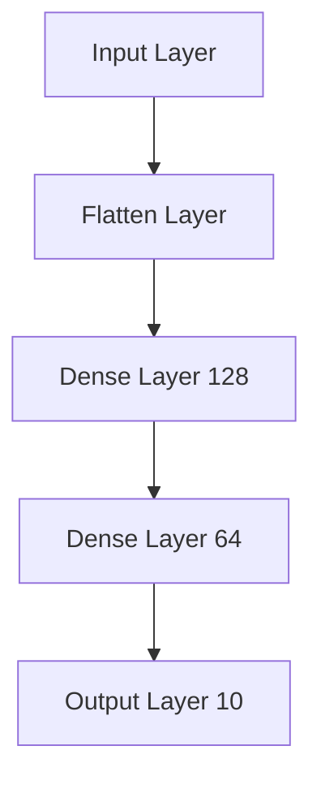

## 22.8 Integrating AI and Machine Learning

In this section, we delve into the fascinating world of integrating Artificial Intelligence (AI) and Machine Learning (ML) within Kotlin applications. As expert software engineers and architects, you are likely familiar with the potential of AI to transform applications by enabling them to learn from data and make intelligent decisions. Kotlin, with its modern language features and seamless interoperability with Java, provides a robust platform for building AI and ML solutions. We will explore how to leverage libraries like KotlinDL and DeepLearning4J to implement neural networks and other machine learning models.

### Introduction to AI and Machine Learning in Kotlin

AI and ML have become integral parts of modern software development, enabling applications to perform tasks such as image recognition, natural language processing, and predictive analytics. Kotlin, being a versatile and expressive language, is well-suited for developing AI applications. Its interoperability with Java allows developers to utilize a vast array of existing libraries and tools, while Kotlin-specific libraries like KotlinDL offer idiomatic ways to implement machine learning models.

#### Key Concepts

- **Artificial Intelligence (AI):** The simulation of human intelligence processes by machines, especially computer systems. AI applications include expert systems, natural language processing, and speech recognition.
- **Machine Learning (ML):** A subset of AI that involves the use of algorithms and statistical models to enable computers to improve their performance on a task through experience.
- **Neural Networks:** A series of algorithms that mimic the operations of a human brain to recognize relationships between vast amounts of data.

### Leveraging KotlinDL for Machine Learning

KotlinDL is a high-level deep learning library written in Kotlin, designed to simplify the creation and training of neural networks. It provides a user-friendly API for building, training, and deploying machine learning models.

#### Setting Up KotlinDL

To start using KotlinDL, you need to add the library to your project. You can do this by adding the following dependency to your `build.gradle.kts` file:

```kotlin
dependencies {
    implementation("org.jetbrains.kotlinx:kotlindl-api:0.3.0")
}
```

#### Building a Neural Network with KotlinDL

Let's walk through the process of building a simple neural network using KotlinDL. We'll create a model to classify handwritten digits from the MNIST dataset.

```kotlin
import org.jetbrains.kotlinx.dl.api.core.Sequential
import org.jetbrains.kotlinx.dl.api.core.layer.core.Dense
import org.jetbrains.kotlinx.dl.api.core.layer.reshaping.Flatten
import org.jetbrains.kotlinx.dl.api.core.loss.Losses
import org.jetbrains.kotlinx.dl.api.core.optimizer.Adam
import org.jetbrains.kotlinx.dl.dataset.mnist

fun main() {
    val (train, test) = mnist()

    val model = Sequential.of(
        Flatten(inputShape = intArrayOf(28, 28)),
        Dense(outputSize = 128, activation = "relu"),
        Dense(outputSize = 64, activation = "relu"),
        Dense(outputSize = 10, activation = "softmax")
    )

    model.use {
        it.compile(optimizer = Adam(), loss = Losses.SOFT_MAX_CROSS_ENTROPY_WITH_LOGITS)
        it.fit(dataset = train, epochs = 10, batchSize = 32)
        val accuracy = it.evaluate(dataset = test).metrics["accuracy"]
        println("Test accuracy: $accuracy")
    }
}
```

**Explanation:**
- **Sequential Model:** We define a sequential model, which is a linear stack of layers.
- **Flatten Layer:** Converts the input into a 1D array.
- **Dense Layers:** Fully connected layers with ReLU activation functions.
- **Output Layer:** A dense layer with a softmax activation function for classification.
- **Optimizer and Loss Function:** We use the Adam optimizer and softmax cross-entropy loss for training.

### DeepLearning4J: A Powerful Java-Based Library

DeepLearning4J (DL4J) is another powerful library for building AI models. It is a Java-based library that provides a comprehensive suite of tools for deep learning, including support for distributed computing.

#### Integrating DeepLearning4J with Kotlin

To use DL4J in a Kotlin project, add the following dependencies to your `build.gradle.kts` file:

```kotlin
dependencies {
    implementation("org.deeplearning4j:deeplearning4j-core:1.0.0-beta7")
    implementation("org.nd4j:nd4j-native-platform:1.0.0-beta7")
}
```

#### Implementing a Neural Network with DL4J

Here is an example of implementing a neural network using DL4J to classify the MNIST dataset:

```kotlin
import org.deeplearning4j.nn.conf.MultiLayerConfiguration
import org.deeplearning4j.nn.conf.NeuralNetConfiguration
import org.deeplearning4j.nn.conf.layers.DenseLayer
import org.deeplearning4j.nn.conf.layers.OutputLayer
import org.deeplearning4j.nn.multilayer.MultiLayerNetwork
import org.deeplearning4j.optimize.listeners.ScoreIterationListener
import org.nd4j.linalg.activations.Activation
import org.nd4j.linalg.dataset.api.iterator.DataSetIterator
import org.nd4j.linalg.factory.Nd4j
import org.nd4j.linalg.lossfunctions.LossFunctions

fun main() {
    val numRows = 28
    val numColumns = 28
    val outputNum = 10
    val batchSize = 64
    val rngSeed = 123
    val numEpochs = 10

    val conf: MultiLayerConfiguration = NeuralNetConfiguration.Builder()
        .seed(rngSeed.toLong())
        .updater(Nesterovs(0.006, 0.9))
        .list()
        .layer(0, DenseLayer.Builder()
            .nIn(numRows * numColumns)
            .nOut(1000)
            .activation(Activation.RELU)
            .build())
        .layer(1, OutputLayer.Builder(LossFunctions.LossFunction.NEGATIVELOGLIKELIHOOD)
            .nIn(1000)
            .nOut(outputNum)
            .activation(Activation.SOFTMAX)
            .build())
        .build()

    val model = MultiLayerNetwork(conf)
    model.init()
    model.setListeners(ScoreIterationListener(10))

    val mnistTrain: DataSetIterator = MnistDataSetIterator(batchSize, true, rngSeed)
    val mnistTest: DataSetIterator = MnistDataSetIterator(batchSize, false, rngSeed)

    for (i in 0 until numEpochs) {
        model.fit(mnistTrain)
    }

    val eval = model.evaluate(mnistTest)
    println(eval.stats())
}
```

**Explanation:**
- **Configuration:** We define the network configuration, specifying layers, activation functions, and loss functions.
- **Training:** The model is trained over multiple epochs using the MNIST dataset.
- **Evaluation:** The model's performance is evaluated on the test dataset.

### Visualizing Neural Network Architectures

Understanding the architecture of neural networks is crucial for designing effective models. We can use diagrams to visualize the structure of the networks we build.



**Diagram Description:** This diagram represents a simple neural network architecture with an input layer, two hidden dense layers, and an output layer for classification.

### Advanced Topics in AI and Machine Learning with Kotlin

#### Transfer Learning

Transfer learning involves taking a pre-trained model and fine-tuning it for a new task. This approach is particularly useful when you have limited data for the new task.

```kotlin
import org.jetbrains.kotlinx.dl.api.inference.keras.loaders.ModelHub
import org.jetbrains.kotlinx.dl.api.inference.keras.loaders.ModelType
import org.jetbrains.kotlinx.dl.api.inference.keras.loaders.onnx.ONNXModelHub

fun main() {
    val modelHub = ONNXModelHub(cacheDirectory = File("cache/pretrainedModels"))
    val model = modelHub.loadModel(ModelType.ResNet50)

    model.use {
        // Fine-tune the model on new data
    }
}
```

**Explanation:**
- **ModelHub:** We use the `ModelHub` to load a pre-trained model.
- **Fine-Tuning:** The model is fine-tuned on new data for the specific task.

#### Reinforcement Learning

Reinforcement learning (RL) is a type of machine learning where an agent learns to make decisions by interacting with an environment. Kotlin's interoperability with Java allows us to use RL libraries like RL4J.

```kotlin
import org.deeplearning4j.rl4j.learning.sync.qlearning.QLearningDiscreteDense
import org.deeplearning4j.rl4j.mdp.MDP
import org.deeplearning4j.rl4j.mdp.cartpole.CartpoleMDP
import org.deeplearning4j.rl4j.network.dqn.DQNFactoryStdDense
import org.deeplearning4j.rl4j.space.DiscreteSpace

fun main() {
    val mdp: MDP<*, Int, DiscreteSpace> = CartpoleMDP()
    val dqnFactory = DQNFactoryStdDense.Configuration.builder()
        .l2(0.001)
        .updater(Adam())
        .numLayer(3)
        .numHiddenNodes(16)
        .build()

    val qLearning = QLearningDiscreteDense(mdp, dqnFactory, QLearningDiscreteDense.Configuration.builder()
        .seed(123)
        .maxEpochStep(200)
        .maxStep(15000)
        .expRepMaxSize(1500)
        .batchSize(32)
        .targetDqnUpdateFreq(100)
        .updateStart(10)
        .rewardFactor(0.1)
        .gamma(0.99)
        .errorClamp(1.0)
        .minEpsilon(0.1f)
        .epsilonNbStep(1000)
        .doubleDQN(true)
        .build())

    qLearning.train()
}
```

**Explanation:**
- **MDP:** The Markov Decision Process (MDP) defines the environment.
- **DQNFactory:** Configures the Deep Q-Network (DQN) used for learning.
- **Training:** The agent is trained to solve the Cartpole problem.

### Best Practices for AI and Machine Learning in Kotlin

- **Data Preprocessing:** Ensure your data is clean and well-preprocessed before feeding it into a model. Use libraries like Apache Commons CSV or Kotlin's native capabilities for data manipulation.
- **Model Evaluation:** Regularly evaluate your models using appropriate metrics to ensure they are performing as expected.
- **Hyperparameter Tuning:** Experiment with different hyperparameters to optimize model performance.
- **Scalability:** Consider the scalability of your solution, especially if deploying in a production environment. Use distributed computing libraries if necessary.
- **Documentation:** Document your code and models thoroughly to ensure maintainability and ease of understanding for other developers.

### Try It Yourself

Now that we've covered the basics, it's time to experiment! Try modifying the neural network architectures we've discussed. For instance, change the number of layers or neurons, or experiment with different activation functions. Observe how these changes affect the model's performance.

### Conclusion

Integrating AI and machine learning into Kotlin applications opens up a world of possibilities for creating intelligent, data-driven solutions. By leveraging libraries like KotlinDL and DeepLearning4J, you can build powerful models that enhance your applications' capabilities. Remember, this is just the beginning. As you progress, you'll discover more advanced techniques and tools to refine your AI solutions. Keep experimenting, stay curious, and enjoy the journey!

## Quiz Time!



### What is KotlinDL?

- [x] A high-level deep learning library written in Kotlin.
- [ ] A Java-based library for deep learning.
- [ ] A tool for data preprocessing.
- [ ] A framework for building web applications.

> **Explanation:** KotlinDL is a high-level deep learning library specifically designed for Kotlin, providing an easy-to-use API for building and training neural networks.

### Which library is Java-based and provides tools for distributed computing in AI?

- [ ] KotlinDL
- [x] DeepLearning4J
- [ ] TensorFlow
- [ ] PyTorch

> **Explanation:** DeepLearning4J is a Java-based deep learning library that supports distributed computing, making it suitable for large-scale AI applications.

### What is the purpose of the Flatten layer in a neural network?

- [x] To convert multi-dimensional input into a 1D array.
- [ ] To add non-linearity to the model.
- [ ] To reduce the number of parameters.
- [ ] To increase the model's depth.

> **Explanation:** The Flatten layer is used to convert multi-dimensional input data into a 1D array, which is necessary before feeding it into fully connected (dense) layers.

### What is transfer learning?

- [x] Using a pre-trained model and fine-tuning it for a new task.
- [ ] Training a model from scratch.
- [ ] Using reinforcement learning to train an agent.
- [ ] Applying unsupervised learning techniques.

> **Explanation:** Transfer learning involves taking a model that has already been trained on one task and adapting it to perform a different, but related, task.

### Which Kotlin library can be used for reinforcement learning?

- [ ] KotlinDL
- [x] RL4J
- [ ] TensorFlow
- [ ] PyTorch

> **Explanation:** RL4J is a library that can be used for reinforcement learning in Java and Kotlin applications.

### What is the role of the Adam optimizer in training neural networks?

- [x] To adjust the learning rate during training for faster convergence.
- [ ] To initialize the weights of the network.
- [ ] To provide a loss function for the model.
- [ ] To evaluate the model's accuracy.

> **Explanation:** The Adam optimizer is an adaptive learning rate optimization algorithm used to adjust the learning rate during training, helping the model converge faster.

### Which activation function is commonly used in the output layer for classification tasks?

- [ ] ReLU
- [ ] Sigmoid
- [x] Softmax
- [ ] Tanh

> **Explanation:** The Softmax activation function is commonly used in the output layer of neural networks for classification tasks, as it converts the output into probabilities.

### What is the primary advantage of using Kotlin for AI and ML development?

- [x] Seamless interoperability with Java and modern language features.
- [ ] Built-in support for GPU acceleration.
- [ ] Extensive built-in libraries for AI.
- [ ] Native support for distributed computing.

> **Explanation:** Kotlin's primary advantage in AI and ML development is its seamless interoperability with Java, allowing developers to leverage existing Java libraries and tools, along with its modern language features.

### What does the `evaluate` function do in a machine learning model?

- [x] It assesses the model's performance on a test dataset.
- [ ] It trains the model on new data.
- [ ] It initializes the model's weights.
- [ ] It saves the model to disk.

> **Explanation:** The `evaluate` function is used to assess a machine learning model's performance on a test dataset, providing metrics like accuracy.

### True or False: KotlinDL can only be used for neural network models.

- [x] False
- [ ] True

> **Explanation:** While KotlinDL is primarily designed for neural networks, it can be extended and used for other types of machine learning models as well.


