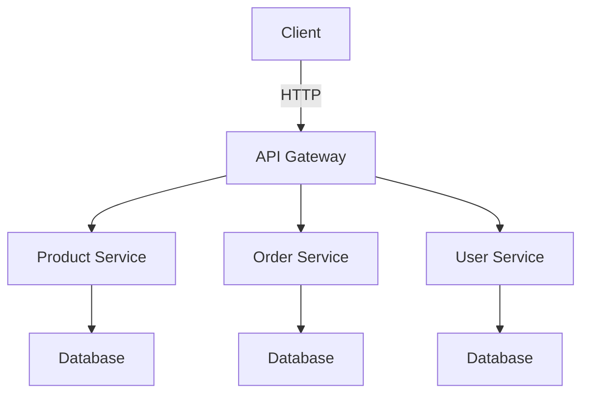

## 22.9 Microservices with Spring Boot

In the realm of modern software development, microservices architecture has emerged as a popular approach for building scalable and resilient applications. This section delves into the intricacies of developing microservices using Spring Boot with Kotlin, focusing on end-to-end architecture, scaling, and resilience.

### Understanding Microservices Architecture

Microservices architecture is a design pattern that structures an application as a collection of loosely coupled services. Each service is independent, responsible for a specific business capability, and can be developed, deployed, and scaled independently.

#### Key Characteristics of Microservices

- **Decentralization**: Microservices promote decentralized data management, allowing each service to manage its own database.
- **Independence**: Services are independently deployable and scalable, facilitating continuous delivery and deployment.
- **Resilience**: The architecture supports fault isolation, meaning a failure in one service does not affect the entire system.
- **Polyglot Persistence**: Different services can use different data storage technologies based on their needs.

### Why Use Spring Boot for Microservices?

Spring Boot is a popular choice for building microservices due to its simplicity, ease of use, and rich ecosystem. It provides a range of features that facilitate the development of microservices:

- **Auto-Configuration**: Spring Boot automatically configures your application based on the dependencies you have added, reducing boilerplate code.
- **Embedded Servers**: It allows you to run your application as a standalone service with embedded servers like Tomcat or Jetty.
- **Production-Ready Features**: Spring Boot includes features like health checks, metrics, and externalized configuration, which are crucial for microservices.
- **Integration with Spring Cloud**: Spring Boot seamlessly integrates with Spring Cloud, providing tools for service discovery, configuration management, and more.

### Setting Up a Spring Boot Microservice with Kotlin

Let's walk through setting up a simple microservice using Spring Boot with Kotlin. We'll create a RESTful service that manages a list of products.

#### Project Setup

1. **Initialize the Project**: Use Spring Initializr (https://start.spring.io/) to bootstrap your project. Select Kotlin as the language, and add dependencies like Spring Web, Spring Data JPA, and H2 Database.

2. **Configure the Build Script**: Ensure your `build.gradle.kts` file includes the necessary dependencies and plugins for Kotlin and Spring Boot.

```kotlin
plugins {
    id("org.springframework.boot") version "3.0.0"
    id("io.spring.dependency-management") version "1.0.15.RELEASE"
    kotlin("jvm") version "1.8.10"
    kotlin("plugin.spring") version "1.8.10"
}

dependencies {
    implementation("org.springframework.boot:spring-boot-starter-web")
    implementation("org.springframework.boot:spring-boot-starter-data-jpa")
    implementation("com.h2database:h2")
    implementation("org.jetbrains.kotlin:kotlin-reflect")
    implementation("org.jetbrains.kotlin:kotlin-stdlib-jdk8")
}
```

#### Creating the Product Entity

Define a simple `Product` entity with fields like `id`, `name`, and `price`.

```kotlin
import javax.persistence.Entity
import javax.persistence.GeneratedValue
import javax.persistence.GenerationType
import javax.persistence.Id

@Entity
data class Product(
    @Id @GeneratedValue(strategy = GenerationType.IDENTITY)
    val id: Long = 0,
    val name: String,
    val price: Double
)
```

#### Creating the Repository

Create a `ProductRepository` interface that extends `JpaRepository` to handle CRUD operations.

```kotlin
import org.springframework.data.jpa.repository.JpaRepository

interface ProductRepository : JpaRepository<Product, Long>
```

#### Creating the Service Layer

Implement a `ProductService` class to encapsulate business logic.

```kotlin
import org.springframework.stereotype.Service

@Service
class ProductService(private val productRepository: ProductRepository) {

    fun findAll(): List<Product> = productRepository.findAll()

    fun findById(id: Long): Product = productRepository.findById(id).orElseThrow { 
        RuntimeException("Product not found") 
    }

    fun save(product: Product): Product = productRepository.save(product)

    fun deleteById(id: Long) = productRepository.deleteById(id)
}
```

#### Creating the REST Controller

Create a `ProductController` to expose RESTful endpoints.

```kotlin
import org.springframework.web.bind.annotation.*

@RestController
@RequestMapping("/products")
class ProductController(private val productService: ProductService) {

    @GetMapping
    fun getAllProducts(): List<Product> = productService.findAll()

    @GetMapping("/{id}")
    fun getProductById(@PathVariable id: Long): Product = productService.findById(id)

    @PostMapping
    fun createProduct(@RequestBody product: Product): Product = productService.save(product)

    @DeleteMapping("/{id}")
    fun deleteProduct(@PathVariable id: Long) = productService.deleteById(id)
}
```

### Scaling Microservices

Scaling is a crucial aspect of microservices architecture. It involves adjusting the resources allocated to your services based on demand.

#### Horizontal vs. Vertical Scaling

- **Horizontal Scaling**: Involves adding more instances of a service. It's more cost-effective and provides better fault tolerance.
- **Vertical Scaling**: Involves adding more resources (CPU, RAM) to an existing instance. It's limited by the capacity of a single machine.

#### Load Balancing

Implement load balancing to distribute incoming requests across multiple instances of a service. Tools like NGINX, HAProxy, or cloud-native solutions like AWS Elastic Load Balancer can be used.

#### Service Discovery

Use service discovery to dynamically locate services. Spring Cloud provides tools like Eureka for service registration and discovery.

### Resilience in Microservices

Resilience ensures that your system can handle failures gracefully and continue to function.

#### Circuit Breaker Pattern

Implement the Circuit Breaker pattern to prevent cascading failures. Spring Cloud Circuit Breaker or Resilience4j can be used to implement this pattern.

```kotlin
import io.github.resilience4j.circuitbreaker.annotation.CircuitBreaker
import org.springframework.web.bind.annotation.GetMapping
import org.springframework.web.bind.annotation.RestController

@RestController
class ResilientController {

    @CircuitBreaker(name = "backendService", fallbackMethod = "fallback")
    @GetMapping("/resilient-endpoint")
    fun resilientEndpoint(): String {
        // Simulate a call to a remote service
        throw RuntimeException("Service failure")
    }

    fun fallback(ex: Throwable): String {
        return "Fallback response"
    }
}
```

#### Retry Pattern

Use the Retry pattern to automatically retry failed operations. Resilience4j provides a Retry module that can be easily integrated.

```kotlin
import io.github.resilience4j.retry.annotation.Retry
import org.springframework.web.bind.annotation.GetMapping
import org.springframework.web.bind.annotation.RestController

@RestController
class RetryController {

    @Retry(name = "backendService")
    @GetMapping("/retry-endpoint")
    fun retryEndpoint(): String {
        // Simulate a call to a remote service
        throw RuntimeException("Service failure")
    }
}
```

#### Bulkhead Pattern

The Bulkhead pattern isolates different parts of the system to prevent a failure in one part from affecting others. This can be achieved by limiting the number of concurrent requests to a service.

### Monitoring and Observability

Monitoring and observability are critical for understanding the health and performance of your microservices.

#### Logging

Implement structured logging using tools like Logback or SLF4J. Ensure logs are centralized and searchable.

#### Metrics

Use metrics to monitor the performance of your services. Spring Boot Actuator provides built-in metrics that can be extended with custom metrics.

#### Distributed Tracing

Implement distributed tracing to track requests across multiple services. Tools like Zipkin or Jaeger can be integrated with Spring Cloud Sleuth.

### Security in Microservices

Security is paramount in microservices architecture. Implement authentication and authorization to protect your services.

#### OAuth2 and JWT

Use OAuth2 and JWT for secure authentication. Spring Security provides comprehensive support for OAuth2.

```kotlin
import org.springframework.security.config.annotation.web.builders.HttpSecurity
import org.springframework.security.config.annotation.web.configuration.EnableWebSecurity
import org.springframework.security.config.annotation.web.configuration.WebSecurityConfigurerAdapter

@EnableWebSecurity
class SecurityConfig : WebSecurityConfigurerAdapter() {

    override fun configure(http: HttpSecurity) {
        http
            .authorizeRequests()
            .antMatchers("/public/**").permitAll()
            .anyRequest().authenticated()
            .and()
            .oauth2ResourceServer()
            .jwt()
    }
}
```

### Deployment Strategies

Deploying microservices involves several strategies to ensure smooth updates and minimal downtime.

#### Blue-Green Deployment

Blue-Green Deployment involves maintaining two identical environments. One is live (blue), and the other is idle (green). During deployment, the green environment is updated and tested before switching traffic from blue to green.

#### Canary Deployment

Canary Deployment involves gradually rolling out a new version to a small subset of users before rolling it out to the entire user base. This allows for monitoring and rollback if issues arise.

### Try It Yourself

Experiment with the code examples provided by modifying the `Product` entity to include additional fields like `description` or `category`. Implement additional endpoints in the `ProductController` for updating products or searching by name.

### Visualizing Microservices Architecture

Below is a simple diagram representing a microservices architecture with Spring Boot:



This diagram shows how a client interacts with an API Gateway, which routes requests to different services. Each service manages its own database, promoting independence and scalability.

### Knowledge Check

- Explain the difference between horizontal and vertical scaling.
- Describe the Circuit Breaker pattern and its importance.
- How does Spring Boot facilitate microservices development?
- What are the benefits of using Kotlin for microservices?
- How can you implement service discovery in a microservices architecture?

### Conclusion

Building microservices with Spring Boot and Kotlin offers a robust framework for developing scalable and resilient applications. By leveraging Spring Boot's features and Kotlin's expressive syntax, developers can create efficient microservices that are easy to maintain and extend. Remember, this is just the beginning. As you progress, you'll build more complex and interactive systems. Keep experimenting, stay curious, and enjoy the journey!

## Quiz Time!



### What is a key characteristic of microservices architecture?

- [x] Decentralization
- [ ] Monolithic structure
- [ ] Tight coupling
- [ ] Single database for all services

> **Explanation:** Microservices promote decentralized data management, allowing each service to manage its own database.

### Which tool can be used for service discovery in Spring Boot microservices?

- [x] Eureka
- [ ] Logback
- [ ] Spring Data JPA
- [ ] H2 Database

> **Explanation:** Eureka is a tool provided by Spring Cloud for service registration and discovery.

### What is the primary benefit of using the Circuit Breaker pattern?

- [x] Preventing cascading failures
- [ ] Improving database performance
- [ ] Enhancing UI responsiveness
- [ ] Reducing code complexity

> **Explanation:** The Circuit Breaker pattern prevents cascading failures by stopping the flow of requests to a failing service.

### How does Spring Boot simplify microservices development?

- [x] Auto-configuration and embedded servers
- [ ] Manual configuration of dependencies
- [ ] Complex build scripts
- [ ] Lack of production-ready features

> **Explanation:** Spring Boot simplifies development with auto-configuration and embedded servers, reducing boilerplate code.

### What is the role of an API Gateway in microservices architecture?

- [x] Routing requests to appropriate services
- [ ] Storing service data
- [ ] Managing service databases
- [ ] Performing data analytics

> **Explanation:** An API Gateway routes incoming requests to the appropriate microservices, acting as a single entry point.

### Which deployment strategy involves maintaining two identical environments?

- [x] Blue-Green Deployment
- [ ] Canary Deployment
- [ ] Rolling Deployment
- [ ] Continuous Deployment

> **Explanation:** Blue-Green Deployment involves maintaining two identical environments, one live and one idle.

### What is the purpose of distributed tracing in microservices?

- [x] Tracking requests across multiple services
- [ ] Enhancing UI performance
- [ ] Managing service databases
- [ ] Reducing code complexity

> **Explanation:** Distributed tracing tracks requests across multiple services, providing insights into system performance.

### How can you enhance resilience in a microservices architecture?

- [x] Implementing Circuit Breaker and Retry patterns
- [ ] Using a single database for all services
- [ ] Tight coupling of services
- [ ] Ignoring service failures

> **Explanation:** Resilience can be enhanced by implementing patterns like Circuit Breaker and Retry to handle failures gracefully.

### What is a benefit of using Kotlin for microservices?

- [x] Expressive syntax and null safety
- [ ] Limited library support
- [ ] Complex syntax
- [ ] Lack of interoperability

> **Explanation:** Kotlin offers expressive syntax and null safety, making it a suitable choice for microservices development.

### True or False: Vertical scaling involves adding more instances of a service.

- [ ] True
- [x] False

> **Explanation:** Vertical scaling involves adding more resources to an existing instance, while horizontal scaling involves adding more instances.


