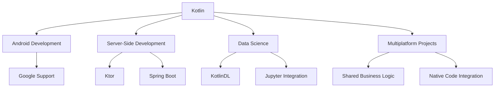

## 23.3 The Future of Kotlin

As we delve into the future of Kotlin, it's essential to understand the current landscape and the factors driving its evolution. Kotlin, a statically typed programming language developed by JetBrains, has rapidly gained popularity since its inception. Its seamless interoperability with Java, expressive syntax, and modern features have made it a preferred choice for Android development and beyond. In this section, we will explore the emerging trends, the roadmap for Kotlin, and the vibrant community that supports its growth.

### The Rise of Kotlin: A Brief Overview

Kotlin was introduced in 2011 by JetBrains, with the goal of creating a more expressive and safer language for the JVM. It gained significant traction in 2017 when Google announced official support for Kotlin on Android. Since then, Kotlin has expanded its reach to various domains, including server-side development, data science, and multiplatform projects.

#### Key Features Driving Kotlin's Popularity

- **Interoperability with Java**: Kotlin's ability to seamlessly integrate with existing Java codebases has facilitated its adoption in enterprises.
- **Concise Syntax**: Kotlin reduces boilerplate code, making it easier to read and maintain.
- **Null Safety**: Kotlin's type system eliminates null pointer exceptions, a common source of runtime errors in Java.
- **Coroutines**: Kotlin's support for coroutines simplifies asynchronous programming, making it more intuitive and efficient.

### Emerging Trends in Kotlin Development

As Kotlin continues to evolve, several trends are shaping its future. Let's explore these trends and their implications for developers and organizations.

#### 1. Kotlin Multiplatform Projects

Kotlin Multiplatform (KMP) is a significant trend that enables developers to share code across different platforms, including Android, iOS, web, and desktop. This approach reduces duplication and ensures consistency across platforms.

- **Shared Business Logic**: KMP allows developers to write common business logic once and reuse it across platforms, reducing development time and effort.
- **Platform-Specific Code**: While business logic is shared, platform-specific code can be written in native languages, ensuring optimal performance and user experience.

**Code Example: Shared Business Logic in Kotlin Multiplatform**

```kotlin
// Shared Code
expect fun getPlatformName(): String

fun greet(): String {
    return "Hello from ${getPlatformName()}"
}

// Android Implementation
actual fun getPlatformName(): String {
    return "Android"
}

// iOS Implementation
actual fun getPlatformName(): String {
    return "iOS"
}
```

#### 2. Kotlin for Data Science

Kotlin is making inroads into the data science domain, traditionally dominated by Python and R. With libraries like KotlinDL and integration with Jupyter notebooks, Kotlin is becoming a viable option for data analysis and machine learning.

- **KotlinDL**: A deep learning library that provides a simple API for building and training neural networks.
- **Jupyter Integration**: Kotlin's support for Jupyter notebooks allows data scientists to leverage Kotlin's features in an interactive environment.

#### 3. Kotlin/Native and Performance Optimization

Kotlin/Native allows developers to compile Kotlin code to native binaries, enabling its use in environments where a JVM is not available. This opens up new possibilities for Kotlin in areas like embedded systems and IoT.

- **Interoperability with C Libraries**: Kotlin/Native supports interoperability with C libraries, making it suitable for performance-critical applications.
- **Performance Improvements**: The Kotlin team is continuously working on optimizing the performance of Kotlin/Native, making it more competitive with other native languages.

#### 4. Kotlin in Server-Side Development

Kotlin is gaining traction in server-side development, with frameworks like Ktor and Spring Boot supporting Kotlin as a first-class citizen. Its expressive syntax and modern features make it an attractive choice for building robust server-side applications.

- **Ktor**: A lightweight framework for building asynchronous servers and microservices.
- **Spring Boot**: Kotlin's compatibility with Spring Boot allows developers to leverage the rich ecosystem of Spring while enjoying Kotlin's features.

### Kotlin's Roadmap: What's Next?

The Kotlin team at JetBrains has outlined a roadmap that focuses on improving the language, tooling, and ecosystem. Let's explore the key areas of focus for Kotlin's future development.

#### 1. Language Enhancements

Kotlin's language features are continuously evolving to improve developer productivity and code safety. Some of the upcoming enhancements include:

- **Improved Type Inference**: Enhancements to Kotlin's type inference will make the language even more expressive and reduce the need for explicit type declarations.
- **Sealed Interfaces**: Kotlin plans to introduce sealed interfaces, allowing developers to define restricted hierarchies for interfaces, similar to sealed classes.

#### 2. Tooling and IDE Support

JetBrains is committed to providing top-notch tooling and IDE support for Kotlin developers. Future improvements include:

- **Faster Compilation Times**: Optimizations to the Kotlin compiler will reduce build times, enhancing developer productivity.
- **Enhanced Debugging Tools**: Improved debugging tools will make it easier to diagnose and fix issues in Kotlin applications.

#### 3. Kotlin Multiplatform Improvements

The Kotlin team is focused on making Kotlin Multiplatform more accessible and robust. Key improvements include:

- **Better Gradle Support**: Enhancements to Gradle support will streamline the build process for multiplatform projects.
- **Improved Interoperability**: Efforts to improve interoperability with native platforms will make it easier to integrate Kotlin Multiplatform with existing native codebases.

### Community Growth and Ecosystem Expansion

Kotlin's success is not just due to its technical merits but also its vibrant community and ecosystem. Let's explore how the community is contributing to Kotlin's growth and what the future holds.

#### 1. Community Contributions

The Kotlin community plays a crucial role in the language's development and adoption. Community contributions include:

- **Open Source Libraries**: The community has developed a rich ecosystem of open-source libraries that extend Kotlin's capabilities.
- **Educational Resources**: Community members contribute to the growth of Kotlin by creating tutorials, courses, and documentation.

#### 2. KotlinConf and Community Events

KotlinConf, an annual conference dedicated to Kotlin, brings together developers from around the world to share knowledge and experiences. Community events like meetups and workshops further foster collaboration and learning.

#### 3. Industry Adoption

Kotlin's adoption by major tech companies is a testament to its capabilities. Companies like Google, Pinterest, and Square have embraced Kotlin for their development needs, setting an example for others to follow.

### Visualizing Kotlin's Growth and Future Prospects

To better understand Kotlin's growth and future prospects, let's visualize some key aspects using Mermaid.js diagrams.

#### Diagram: Kotlin's Ecosystem Growth



**Description**: This diagram illustrates the diverse domains where Kotlin is making an impact, highlighting its growth in Android development, server-side applications, data science, and multiplatform projects.

### Try It Yourself: Experimenting with Kotlin's Features

To truly appreciate Kotlin's capabilities, we encourage you to experiment with its features. Here are some suggestions:

- **Explore Kotlin Multiplatform**: Create a simple multiplatform project and share business logic between Android and iOS.
- **Experiment with Coroutines**: Implement asynchronous operations using Kotlin's coroutines and observe how they simplify concurrency.
- **Leverage KotlinDL**: Build a basic neural network using KotlinDL and train it on a simple dataset.

### Knowledge Check: Reinforcing Key Concepts

Before we conclude, let's reinforce some of the key concepts covered in this section:

- **What are the benefits of Kotlin Multiplatform projects?**
- **How is Kotlin making inroads into data science?**
- **What are some of the upcoming language enhancements in Kotlin?**
- **How does the community contribute to Kotlin's growth?**

### Embrace the Journey: The Future is Bright

As we look to the future, it's clear that Kotlin is poised for continued growth and success. Its modern features, strong community support, and diverse applications make it a language worth investing in. Remember, this is just the beginning. As you explore Kotlin's capabilities, you'll discover new ways to solve complex problems and build innovative solutions. Keep experimenting, stay curious, and enjoy the journey!

## Quiz Time!



### What is a key feature of Kotlin that contributes to its popularity?

- [x] Interoperability with Java
- [ ] Lack of null safety
- [ ] Complex syntax
- [ ] Limited platform support

> **Explanation:** Kotlin's interoperability with Java allows it to seamlessly integrate with existing Java codebases, making it a popular choice for developers.

### What is Kotlin Multiplatform used for?

- [x] Sharing code across different platforms
- [ ] Writing platform-specific code only
- [ ] Developing only Android applications
- [ ] Creating non-native applications

> **Explanation:** Kotlin Multiplatform allows developers to share code across different platforms, including Android, iOS, web, and desktop.

### Which library is associated with Kotlin's use in data science?

- [x] KotlinDL
- [ ] Spring Boot
- [ ] Ktor
- [ ] RxJava

> **Explanation:** KotlinDL is a deep learning library that provides a simple API for building and training neural networks, making it suitable for data science applications.

### What is a focus area in Kotlin's roadmap for future development?

- [x] Language enhancements
- [ ] Reducing community involvement
- [ ] Limiting platform support
- [ ] Removing coroutine support

> **Explanation:** Kotlin's roadmap includes language enhancements to improve developer productivity and code safety.

### How does the Kotlin community contribute to its growth?

- [x] Developing open-source libraries
- [ ] Restricting access to resources
- [ ] Discouraging new developers
- [ ] Limiting educational content

> **Explanation:** The Kotlin community contributes to its growth by developing open-source libraries and creating educational resources.

### What is Kotlin/Native used for?

- [x] Compiling Kotlin code to native binaries
- [ ] Writing Java-only applications
- [ ] Developing web applications exclusively
- [ ] Creating JVM-only applications

> **Explanation:** Kotlin/Native allows developers to compile Kotlin code to native binaries, enabling its use in environments where a JVM is not available.

### Which framework supports Kotlin for server-side development?

- [x] Ktor
- [ ] Android Studio
- [ ] KotlinDL
- [ ] Jupyter

> **Explanation:** Ktor is a lightweight framework for building asynchronous servers and microservices, supporting Kotlin for server-side development.

### What is a benefit of using Kotlin's coroutines?

- [x] Simplifying asynchronous programming
- [ ] Increasing code complexity
- [ ] Reducing code readability
- [ ] Limiting concurrency

> **Explanation:** Kotlin's coroutines simplify asynchronous programming, making it more intuitive and efficient.

### True or False: Kotlin's type system eliminates null pointer exceptions.

- [x] True
- [ ] False

> **Explanation:** Kotlin's type system includes null safety features that eliminate null pointer exceptions, a common source of runtime errors in Java.

### What is KotlinConf?

- [x] An annual conference dedicated to Kotlin
- [ ] A Java development tool
- [ ] A Kotlin debugging tool
- [ ] A type of Kotlin library

> **Explanation:** KotlinConf is an annual conference dedicated to Kotlin, bringing together developers to share knowledge and experiences.


