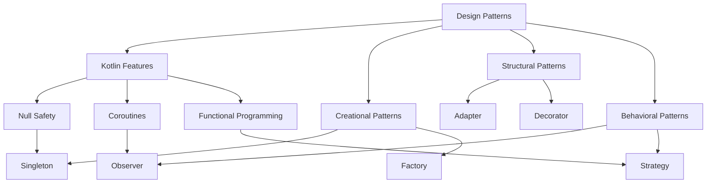

## 23.4 Final Thoughts on Design Patterns in Kotlin

As we reach the conclusion of our comprehensive guide on Kotlin design patterns, it's essential to reflect on the journey we've taken through the intricate landscape of software architecture and design. This section aims to consolidate the insights gained, highlight the unique advantages of using design patterns in Kotlin, and offer encouragement for continued exploration and mastery of these concepts.

### The Essence of Design Patterns in Kotlin

Design patterns are more than just templates for solving common problems; they are the embodiment of best practices that have stood the test of time. In Kotlin, these patterns take on a new dimension, thanks to the language's expressive syntax and powerful features. Let's revisit some key concepts and see how they integrate into the Kotlin ecosystem.

#### Understanding the Role of Design Patterns

Design patterns serve as a bridge between theoretical concepts and practical implementation. They provide a shared language for developers to communicate complex ideas succinctly. In Kotlin, patterns such as Singleton, Factory, and Observer are not just theoretical constructs but are implemented using language-specific features like `object` declarations, extension functions, and coroutines.

**Example: Singleton Pattern in Kotlin**

```kotlin
object DatabaseConnection {
    init {
        println("Initializing Database Connection")
    }

    fun connect() {
        println("Connected to the database")
    }
}

// Usage
fun main() {
    DatabaseConnection.connect()
}
```

In this example, the `object` keyword in Kotlin simplifies the implementation of the Singleton pattern, ensuring a single instance of `DatabaseConnection` is created.

### Kotlin's Unique Contributions to Design Patterns

Kotlin's modern language features enhance the implementation of traditional design patterns. Let's explore some of these features and their impact on design patterns.

#### Null Safety and Type System

Kotlin's null safety is a game-changer in avoiding null pointer exceptions, a common pitfall in many design patterns. By leveraging nullable types and safe calls, developers can create more robust and error-free code.

**Example: Using Null Safety in Factory Pattern**

```kotlin
interface Shape {
    fun draw()
}

class Circle : Shape {
    override fun draw() {
        println("Drawing a Circle")
    }
}

class Square : Shape {
    override fun draw() {
        println("Drawing a Square")
    }
}

object ShapeFactory {
    fun createShape(type: String?): Shape? {
        return when (type) {
            "Circle" -> Circle()
            "Square" -> Square()
            else -> null
        }
    }
}

// Usage
fun main() {
    val shape: Shape? = ShapeFactory.createShape("Circle")
    shape?.draw()
}
```

In this Factory pattern example, the use of nullable types ensures that the code handles unknown shape types gracefully.

#### Coroutines and Asynchronous Programming

Kotlin's coroutines offer a powerful way to handle asynchronous programming, making patterns like Observer and Mediator more efficient and responsive. Coroutines allow for non-blocking operations, which is crucial in modern applications.

**Example: Observer Pattern with Coroutines**

```kotlin
import kotlinx.coroutines.*
import kotlinx.coroutines.flow.*

class NewsPublisher {
    private val _newsFlow = MutableSharedFlow<String>()
    val newsFlow: SharedFlow<String> get() = _newsFlow

    suspend fun publishNews(news: String) {
        _newsFlow.emit(news)
    }
}

fun main() = runBlocking {
    val publisher = NewsPublisher()

    val job = launch {
        publisher.newsFlow.collect { news ->
            println("Received news: $news")
        }
    }

    publisher.publishNews("Kotlin 1.5 Released!")
    publisher.publishNews("New Features in Kotlin")

    delay(1000)
    job.cancel()
}
```

In this example, coroutines and flows are used to implement the Observer pattern, allowing for efficient and scalable event handling.

### Embracing Kotlin's Functional Paradigms

Kotlin's support for functional programming paradigms, such as higher-order functions and immutability, allows developers to implement patterns in a more concise and expressive manner.

#### Higher-Order Functions and Lambdas

Higher-order functions and lambdas simplify the implementation of patterns like Strategy and Command, enabling more flexible and reusable code.

**Example: Strategy Pattern with Lambdas**

```kotlin
fun performOperation(x: Int, y: Int, operation: (Int, Int) -> Int): Int {
    return operation(x, y)
}

fun main() {
    val add: (Int, Int) -> Int = { a, b -> a + b }
    val multiply: (Int, Int) -> Int = { a, b -> a * b }

    println("Addition: ${performOperation(5, 3, add)}")
    println("Multiplication: ${performOperation(5, 3, multiply)}")
}
```

In this Strategy pattern example, lambdas are used to define different operations, showcasing Kotlin's functional capabilities.

### The Future of Kotlin in Software Architecture

As Kotlin continues to evolve, its role in software architecture becomes increasingly significant. The language's adaptability and growing ecosystem make it an ideal choice for modern software development.

#### Kotlin Multiplatform and Cross-Platform Development

Kotlin Multiplatform is revolutionizing how developers approach cross-platform development. By sharing code across platforms, developers can implement design patterns consistently, reducing redundancy and improving maintainability.

**Example: Shared Code in Kotlin Multiplatform**

```kotlin
expect fun platformName(): String

fun createWelcomeMessage(): String {
    return "Welcome to ${platformName()}"
}
```

This example demonstrates how shared code in Kotlin Multiplatform can be used to implement consistent patterns across different platforms.

#### Integration with Modern Frameworks

Kotlin's seamless integration with frameworks like Spring Boot and Ktor enhances its applicability in building scalable and resilient applications. These frameworks leverage Kotlin's features to implement design patterns efficiently.

**Example: Spring Boot with Kotlin**

```kotlin
import org.springframework.boot.autoconfigure.SpringBootApplication
import org.springframework.boot.runApplication

@SpringBootApplication
class Application

fun main(args: Array<String>) {
    runApplication<Application>(*args)
}
```

In this Spring Boot example, Kotlin's concise syntax simplifies the setup and configuration of a robust application.

### Encouragement for Continued Learning

As we conclude this guide, it's important to emphasize that mastering design patterns in Kotlin is a journey, not a destination. The landscape of software development is ever-changing, and staying updated with the latest trends and practices is crucial.

#### Embrace Experimentation

Experiment with different patterns and explore how Kotlin's features can enhance their implementation. Don't hesitate to try new approaches and learn from both successes and failures.

#### Engage with the Community

The Kotlin community is vibrant and supportive. Engage with fellow developers, contribute to open-source projects, and participate in discussions to broaden your understanding and gain new perspectives.

#### Stay Curious and Keep Learning

The world of software development is vast, and there is always something new to learn. Stay curious, seek out new challenges, and continue to expand your knowledge and skills.

### Visualizing the Journey

To encapsulate the journey through design patterns in Kotlin, let's visualize the relationships and interactions between different patterns and Kotlin features.



This diagram illustrates how Kotlin features enhance the implementation of various design patterns, creating a cohesive and powerful toolkit for developers.

### Conclusion

In conclusion, design patterns in Kotlin offer a robust framework for building scalable, maintainable, and efficient applications. By leveraging Kotlin's unique features, developers can implement these patterns in a way that maximizes code clarity and performance. As you continue your journey in software development, remember that the mastery of design patterns is a continuous process of learning, experimentation, and adaptation. Embrace the challenges, engage with the community, and keep pushing the boundaries of what's possible with Kotlin.

## Quiz Time!



### Which Kotlin feature simplifies the implementation of the Singleton pattern?

- [x] `object` declarations
- [ ] Extension functions
- [ ] Coroutines
- [ ] Data classes

> **Explanation:** The `object` keyword in Kotlin creates a singleton instance, simplifying the implementation of the Singleton pattern.

### How does Kotlin's null safety enhance the Factory pattern?

- [x] By allowing nullable types to handle unknown cases
- [ ] By using coroutines for asynchronous creation
- [ ] By leveraging data classes for object creation
- [ ] By using extension functions for factory methods

> **Explanation:** Kotlin's null safety allows the Factory pattern to handle unknown or invalid types gracefully using nullable types.

### What advantage do coroutines provide in the Observer pattern?

- [x] Non-blocking event handling
- [ ] Simplified object creation
- [ ] Enhanced type safety
- [ ] Improved data encapsulation

> **Explanation:** Coroutines allow for non-blocking operations, making the Observer pattern more efficient and responsive.

### Which Kotlin feature is crucial for implementing the Strategy pattern with flexibility?

- [x] Higher-order functions and lambdas
- [ ] Sealed classes
- [ ] Companion objects
- [ ] Inline functions

> **Explanation:** Higher-order functions and lambdas enable flexible and reusable implementations of the Strategy pattern.

### What is a key benefit of Kotlin Multiplatform in design patterns?

- [x] Consistent pattern implementation across platforms
- [ ] Enhanced coroutine support
- [ ] Improved null safety
- [ ] Simplified syntax for object creation

> **Explanation:** Kotlin Multiplatform allows for consistent implementation of design patterns across different platforms, reducing redundancy.

### How does Kotlin's integration with Spring Boot benefit design patterns?

- [x] By leveraging concise syntax for setup and configuration
- [ ] By providing enhanced coroutine support
- [ ] By improving null safety
- [ ] By simplifying object creation

> **Explanation:** Kotlin's concise syntax simplifies the setup and configuration of applications using Spring Boot, enhancing the implementation of design patterns.

### What should developers do to continue mastering design patterns in Kotlin?

- [x] Experiment with different patterns and approaches
- [ ] Focus solely on theoretical knowledge
- [ ] Avoid engaging with the community
- [ ] Stick to a single pattern for all problems

> **Explanation:** Experimentation and engagement with the community are crucial for mastering design patterns in Kotlin.

### Which diagram type is used to visualize the relationships between Kotlin features and design patterns?

- [x] Mermaid.js flowchart
- [ ] UML class diagram
- [ ] Sequence diagram
- [ ] DOM tree

> **Explanation:** A Mermaid.js flowchart is used to visualize the relationships between Kotlin features and design patterns.

### What is the primary focus of functional programming paradigms in Kotlin?

- [x] Higher-order functions and immutability
- [ ] Object-oriented inheritance
- [ ] Asynchronous programming
- [ ] Null safety

> **Explanation:** Functional programming in Kotlin focuses on higher-order functions and immutability, enhancing pattern implementation.

### True or False: Mastering design patterns in Kotlin is a one-time achievement.

- [ ] True
- [x] False

> **Explanation:** Mastering design patterns is a continuous process of learning, experimentation, and adaptation.


