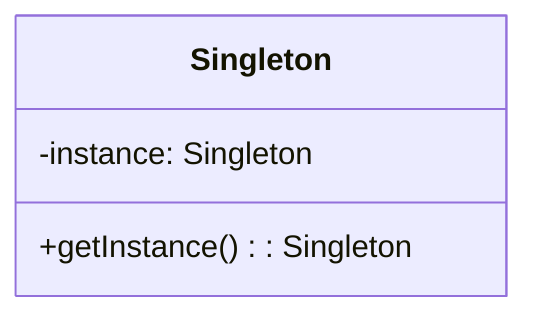
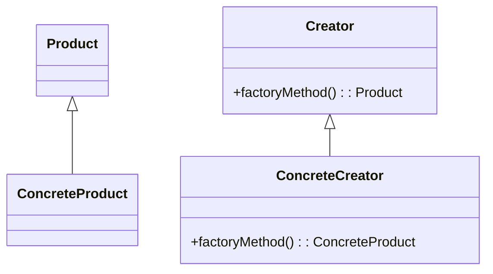
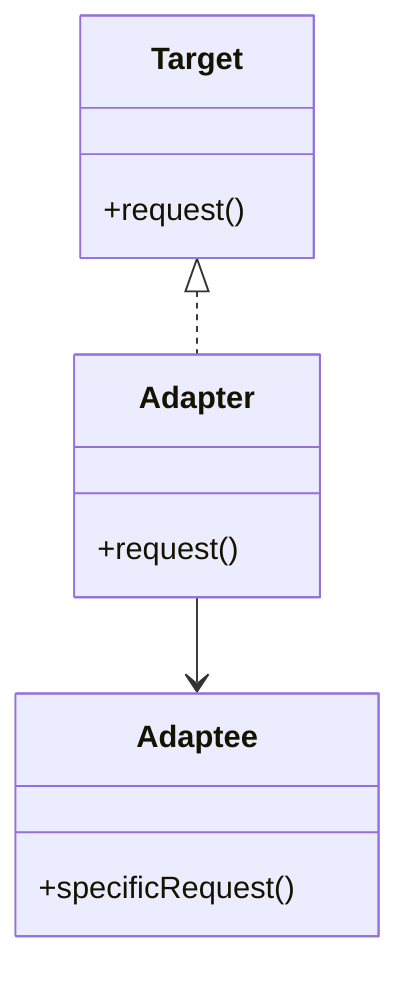
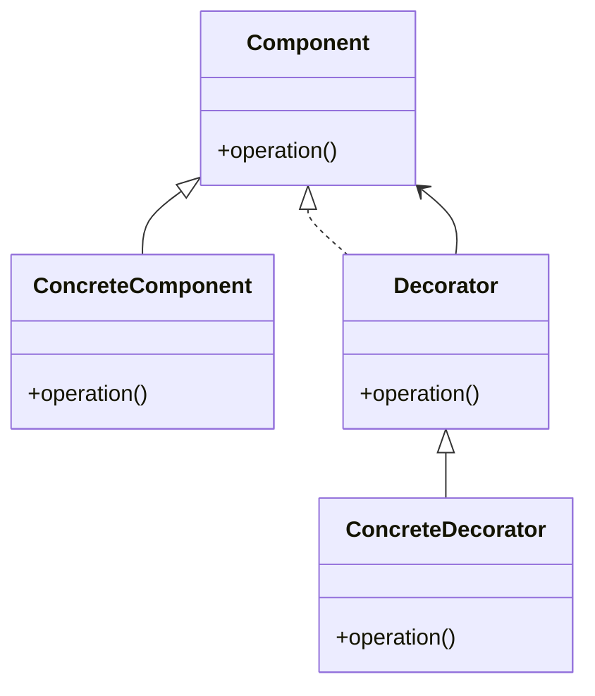
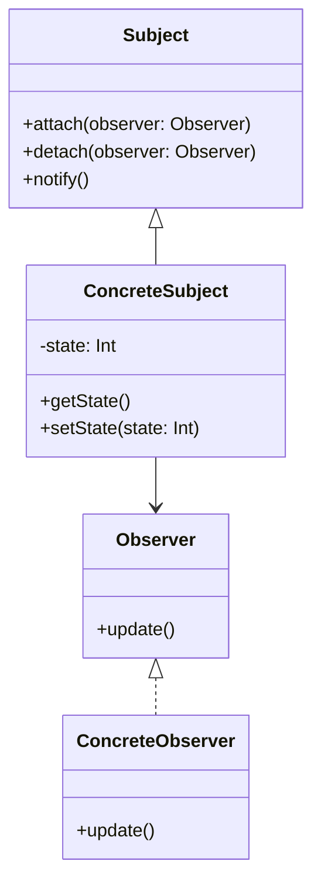
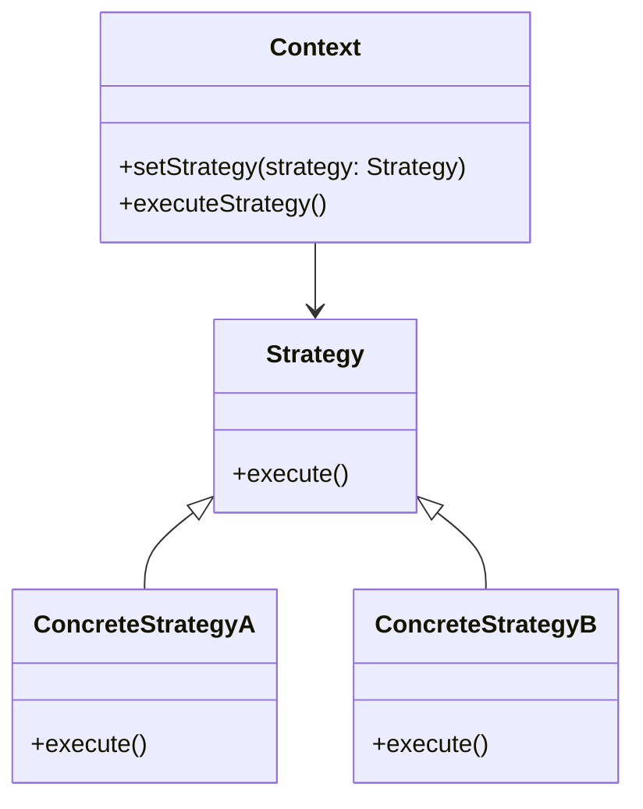

## 24.3 Pattern Reference Cheat Sheet

Welcome to the Pattern Reference Cheat Sheet, a comprehensive guide to design patterns in Kotlin. This section provides a concise overview of each pattern, including its intent, applicability, and primary features. Whether you're an expert software engineer or an architect, this guide will help you understand and implement design patterns effectively in Kotlin.

### Creational Patterns

#### Singleton Pattern

- **Category**: Creational
- **Intent**: Ensure a class has only one instance and provide a global point of access to it.
- **Structure Diagram**:



- **Key Participants**: Singleton class
- **Applicability**: Use when exactly one instance of a class is needed, and it must be accessible from a well-known access point.
- **Sample Code Snippet**:

```kotlin
object Singleton {
    fun showMessage() {
        println("Hello, I am a Singleton!")
    }
}
```

- **Design Considerations**: Use Kotlin's `object` keyword for a simple and thread-safe singleton implementation. Be cautious of overusing singletons as they can introduce global state.
- **Differences and Similarities**: Similar to the Multiton pattern but limited to a single instance.

#### Factory Method Pattern

- **Category**: Creational
- **Intent**: Define an interface for creating an object, but let subclasses alter the type of objects that will be created.
- **Structure Diagram**:



- **Key Participants**: Creator, ConcreteCreator, Product, ConcreteProduct
- **Applicability**: Use when a class can't anticipate the class of objects it must create.
- **Sample Code Snippet**:

```kotlin
interface Product {
    fun use()
}

class ConcreteProduct : Product {
    override fun use() {
        println("Using ConcreteProduct")
    }
}

abstract class Creator {
    abstract fun factoryMethod(): Product
}

class ConcreteCreator : Creator() {
    override fun factoryMethod(): Product = ConcreteProduct()
}
```

- **Design Considerations**: Use Kotlin's sealed classes for a more type-safe approach. Consider using the Factory pattern when you need flexibility in object creation.
- **Differences and Similarities**: Often confused with the Abstract Factory pattern, which involves multiple factories.

### Structural Patterns

#### Adapter Pattern

- **Category**: Structural
- **Intent**: Convert the interface of a class into another interface clients expect. Adapter lets classes work together that couldn't otherwise because of incompatible interfaces.
- **Structure Diagram**:



- **Key Participants**: Target, Adapter, Adaptee
- **Applicability**: Use when you want to use an existing class, and its interface does not match the one you need.
- **Sample Code Snippet**:

```kotlin
interface Target {
    fun request()
}

class Adaptee {
    fun specificRequest() {
        println("Specific request")
    }
}

class Adapter(private val adaptee: Adaptee) : Target {
    override fun request() {
        adaptee.specificRequest()
    }
}
```

- **Design Considerations**: Use extension functions in Kotlin for a more idiomatic approach to adapting interfaces. Be mindful of performance overhead when adapting interfaces.
- **Differences and Similarities**: Similar to the Decorator pattern, but Adapter changes the interface, while Decorator enhances it.

#### Decorator Pattern

- **Category**: Structural
- **Intent**: Attach additional responsibilities to an object dynamically. Decorators provide a flexible alternative to subclassing for extending functionality.
- **Structure Diagram**:



- **Key Participants**: Component, ConcreteComponent, Decorator, ConcreteDecorator
- **Applicability**: Use to add responsibilities to individual objects dynamically and transparently, without affecting other objects.
- **Sample Code Snippet**:

```kotlin
interface Component {
    fun operation()
}

class ConcreteComponent : Component {
    override fun operation() {
        println("ConcreteComponent operation")
    }
}

class Decorator(private val component: Component) : Component {
    override fun operation() {
        component.operation()
    }
}

class ConcreteDecorator(component: Component) : Decorator(component) {
    override fun operation() {
        super.operation()
        println("ConcreteDecorator operation")
    }
}
```

- **Design Considerations**: Use Kotlin's delegation to simplify decorator implementations. Avoid excessive use of decorators as they can complicate the codebase.
- **Differences and Similarities**: Similar to the Adapter pattern, but Decorator focuses on adding behavior rather than changing interfaces.

### Behavioral Patterns

#### Observer Pattern

- **Category**: Behavioral
- **Intent**: Define a one-to-many dependency between objects so that when one object changes state, all its dependents are notified and updated automatically.
- **Structure Diagram**:



- **Key Participants**: Subject, Observer, ConcreteSubject, ConcreteObserver
- **Applicability**: Use when a change to one object requires changing others, and you don't know how many objects need to be changed.
- **Sample Code Snippet**:

```kotlin
interface Observer {
    fun update(state: Int)
}

class ConcreteObserver : Observer {
    override fun update(state: Int) {
        println("Observer updated with state: $state")
    }
}

class Subject {
    private val observers = mutableListOf<Observer>()
    private var state: Int = 0

    fun attach(observer: Observer) {
        observers.add(observer)
    }

    fun detach(observer: Observer) {
        observers.remove(observer)
    }

    fun setState(state: Int) {
        this.state = state
        notifyObservers()
    }

    private fun notifyObservers() {
        observers.forEach { it.update(state) }
    }
}
```

- **Design Considerations**: Use Kotlin's `Flow` for a more reactive approach to the Observer pattern. Ensure that observers are properly managed to avoid memory leaks.
- **Differences and Similarities**: Similar to the Mediator pattern, but Observer focuses on notifying dependents, while Mediator centralizes communication.

#### Strategy Pattern

- **Category**: Behavioral
- **Intent**: Define a family of algorithms, encapsulate each one, and make them interchangeable. Strategy lets the algorithm vary independently from clients that use it.
- **Structure Diagram**:



- **Key Participants**: Context, Strategy, ConcreteStrategyA, ConcreteStrategyB
- **Applicability**: Use when you have multiple algorithms for a specific task and want to switch between them.
- **Sample Code Snippet**:

```kotlin
interface Strategy {
    fun execute()
}

class ConcreteStrategyA : Strategy {
    override fun execute() {
        println("Executing Strategy A")
    }
}

class ConcreteStrategyB : Strategy {
    override fun execute() {
        println("Executing Strategy B")
    }
}

class Context(private var strategy: Strategy) {
    fun setStrategy(strategy: Strategy) {
        this.strategy = strategy
    }

    fun executeStrategy() {
        strategy.execute()
    }
}
```

- **Design Considerations**: Use Kotlin's higher-order functions to simplify strategy implementations. Be mindful of the overhead of switching strategies frequently.
- **Differences and Similarities**: Similar to the State pattern, but Strategy focuses on interchangeable algorithms, while State focuses on behavior changes due to state.

### Try It Yourself

Encourage experimentation by suggesting modifications to the code examples. For instance, try adding a new strategy in the Strategy pattern or a new observer in the Observer pattern to see how the design adapts.

### Visualizing Patterns

Use the provided Mermaid.js diagrams to visualize the structure and relationships within each pattern. This will help you understand the flow and interaction between different components.

### References and Links

For further reading, consider exploring [Design Patterns: Elements of Reusable Object-Oriented Software](https://en.wikipedia.org/wiki/Design_Patterns) and the [Kotlin documentation](https://kotlinlang.org/docs/reference/).

### Knowledge Check

Pose questions or small challenges to engage readers. For example, ask how the Adapter pattern can be used to integrate a third-party library into an existing system.

### Embrace the Journey

Remember, mastering design patterns is a journey. Keep experimenting, stay curious, and enjoy the process of building robust and scalable applications with Kotlin.

### Quiz Time!



### What is the primary intent of the Singleton pattern?

- [x] Ensure a class has only one instance and provide a global point of access to it.
- [ ] Convert the interface of a class into another interface clients expect.
- [ ] Define a family of algorithms, encapsulate each one, and make them interchangeable.
- [ ] Attach additional responsibilities to an object dynamically.

> **Explanation:** The Singleton pattern ensures a class has only one instance and provides a global point of access to it.

### Which pattern is used to convert the interface of a class into another interface clients expect?

- [ ] Singleton
- [x] Adapter
- [ ] Strategy
- [ ] Observer

> **Explanation:** The Adapter pattern is used to convert the interface of a class into another interface clients expect.

### In the Factory Method pattern, what is the role of the ConcreteCreator?

- [ ] Define an interface for creating an object.
- [x] Alter the type of objects that will be created.
- [ ] Attach additional responsibilities to an object dynamically.
- [ ] Ensure a class has only one instance.

> **Explanation:** In the Factory Method pattern, the ConcreteCreator alters the type of objects that will be created.

### Which pattern is suitable for adding responsibilities to individual objects dynamically and transparently?

- [ ] Singleton
- [ ] Adapter
- [x] Decorator
- [ ] Observer

> **Explanation:** The Decorator pattern is suitable for adding responsibilities to individual objects dynamically and transparently.

### What is the primary intent of the Observer pattern?

- [ ] Define a family of algorithms, encapsulate each one, and make them interchangeable.
- [ ] Convert the interface of a class into another interface clients expect.
- [x] Define a one-to-many dependency between objects so that when one object changes state, all its dependents are notified and updated automatically.
- [ ] Attach additional responsibilities to an object dynamically.

> **Explanation:** The Observer pattern defines a one-to-many dependency between objects so that when one object changes state, all its dependents are notified and updated automatically.

### Which pattern focuses on interchangeable algorithms?

- [ ] Singleton
- [ ] Adapter
- [x] Strategy
- [ ] Observer

> **Explanation:** The Strategy pattern focuses on interchangeable algorithms.

### What is the key difference between the Adapter and Decorator patterns?

- [x] Adapter changes the interface, while Decorator enhances it.
- [ ] Adapter enhances the interface, while Decorator changes it.
- [ ] Both Adapter and Decorator change the interface.
- [ ] Both Adapter and Decorator enhance the interface.

> **Explanation:** The key difference is that Adapter changes the interface, while Decorator enhances it.

### Which pattern is often confused with the Abstract Factory pattern?

- [ ] Singleton
- [x] Factory Method
- [ ] Adapter
- [ ] Observer

> **Explanation:** The Factory Method pattern is often confused with the Abstract Factory pattern, which involves multiple factories.

### What is a common pitfall of overusing the Singleton pattern?

- [ ] It can introduce global state.
- [ ] It enhances the interface.
- [ ] It provides a flexible alternative to subclassing.
- [ ] It defines a one-to-many dependency between objects.

> **Explanation:** A common pitfall of overusing the Singleton pattern is that it can introduce global state.

### True or False: The Strategy pattern and State pattern are the same.

- [ ] True
- [x] False

> **Explanation:** False. The Strategy pattern focuses on interchangeable algorithms, while the State pattern focuses on behavior changes due to state.



Remember, this cheat sheet is just the beginning. As you progress, you'll build more complex and interactive applications. Keep experimenting, stay curious, and enjoy the journey!
