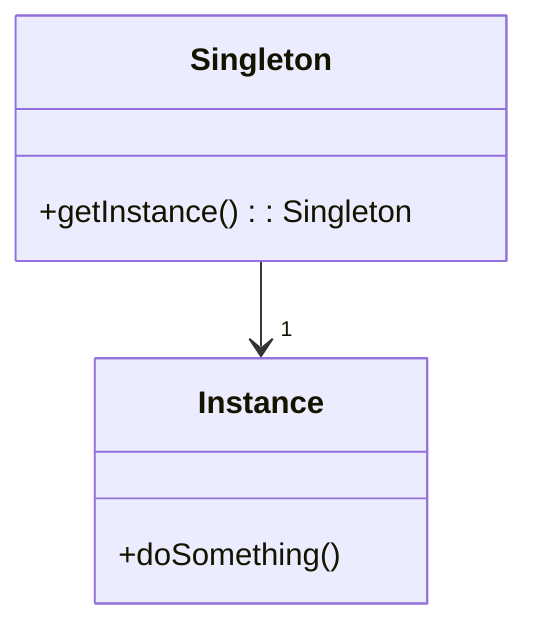
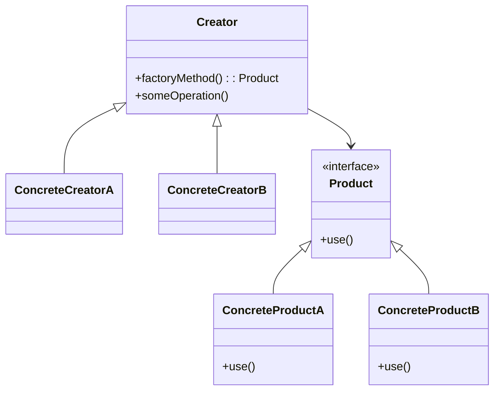

## 24.4 Common Interview Questions

Preparing for a technical interview can be daunting, especially when it involves complex topics like Kotlin design patterns. This guide aims to equip you with the knowledge and confidence needed to tackle interview questions on this subject. We'll cover a range of questions, from basic concepts to advanced applications, ensuring you have a well-rounded understanding of Kotlin design patterns.

### Introduction to Kotlin Design Patterns

Before diving into specific questions, it's essential to have a solid grasp of what design patterns are and how they apply to Kotlin. Design patterns are reusable solutions to common software design problems. They provide a template for solving issues in a way that has been proven effective. In Kotlin, these patterns can be implemented using the language's unique features, such as null safety, coroutines, and extension functions.

### Common Interview Questions

#### 1. What are design patterns, and why are they important in software development?

**Explanation:** Design patterns are standardized solutions to common problems in software design. They help developers create flexible, reusable, and maintainable code. By understanding design patterns, developers can avoid reinventing the wheel and instead rely on proven solutions.

#### 2. Can you explain the Singleton pattern and how it's implemented in Kotlin?

**Explanation:** The Singleton pattern ensures a class has only one instance and provides a global point of access to it. In Kotlin, this can be achieved using the `object` keyword, which creates a thread-safe singleton without additional synchronization.

```kotlin
object Singleton {
    fun doSomething() {
        println("Singleton instance is doing something.")
    }
}
```

**Try It Yourself:** Modify the `doSomething` function to accept a parameter and print it. This will help you understand how to extend the functionality of a singleton.

#### 3. How does Kotlin's null safety feature influence design pattern implementation?

**Explanation:** Kotlin's null safety reduces the risk of null pointer exceptions, which can affect how certain patterns are implemented. For example, the Null Object pattern can be more easily implemented using Kotlin's `object` keyword and nullable types.

#### 4. Describe the Factory Method pattern and provide a Kotlin example.

**Explanation:** The Factory Method pattern defines an interface for creating an object but lets subclasses alter the type of objects that will be created. This pattern is useful for decoupling the creation of objects from their usage.

```kotlin
interface Product {
    fun use()
}

class ConcreteProductA : Product {
    override fun use() {
        println("Using ConcreteProductA")
    }
}

class ConcreteProductB : Product {
    override fun use() {
        println("Using ConcreteProductB")
    }
}

abstract class Creator {
    abstract fun factoryMethod(): Product

    fun someOperation() {
        val product = factoryMethod()
        product.use()
    }
}

class ConcreteCreatorA : Creator() {
    override fun factoryMethod(): Product = ConcreteProductA()
}

class ConcreteCreatorB : Creator() {
    override fun factoryMethod(): Product = ConcreteProductB()
}
```

**Try It Yourself:** Implement a new product type and a corresponding creator class to see how the Factory Method pattern can be extended.

#### 5. What is the Observer pattern, and how can it be implemented using Kotlin's coroutines?

**Explanation:** The Observer pattern defines a one-to-many dependency between objects so that when one object changes state, all its dependents are notified. Kotlin's coroutines and flows can be used to implement this pattern in a reactive way.

```kotlin
import kotlinx.coroutines.*
import kotlinx.coroutines.flow.*

fun main() = runBlocking {
    val observable = MutableSharedFlow<Int>()

    launch {
        observable.collect { value ->
            println("Observer 1 received: $value")
        }
    }

    launch {
        observable.collect { value ->
            println("Observer 2 received: $value")
        }
    }

    observable.emit(1)
    observable.emit(2)
}
```

**Try It Yourself:** Add a third observer and see how the flow of data changes. This will help you understand the scalability of the Observer pattern with coroutines.

#### 6. Explain the Builder pattern and how Kotlin's `apply` function can be used to implement it.

**Explanation:** The Builder pattern is used to construct complex objects step by step. Kotlin's `apply` function can simplify the implementation by allowing you to configure an object in a concise and readable manner.

```kotlin
class Car {
    var color: String = ""
    var seats: Int = 0

    fun build(): Car {
        return this
    }
}

fun main() {
    val car = Car().apply {
        color = "Red"
        seats = 4
    }.build()

    println("Car color: ${car.color}, Seats: ${car.seats}")
}
```

**Try It Yourself:** Add more properties to the `Car` class and use the `apply` function to set them. This will demonstrate how the Builder pattern can handle complex objects.

#### 7. How does the Strategy pattern work, and how can it be implemented using Kotlin's higher-order functions?

**Explanation:** The Strategy pattern defines a family of algorithms, encapsulates each one, and makes them interchangeable. In Kotlin, this can be achieved using higher-order functions, which allow you to pass functions as parameters.

```kotlin
fun executeStrategy(strategy: (Int, Int) -> Int, a: Int, b: Int): Int {
    return strategy(a, b)
}

fun main() {
    val addStrategy = { a: Int, b: Int -> a + b }
    val multiplyStrategy = { a: Int, b: Int -> a * b }

    println("Addition: ${executeStrategy(addStrategy, 2, 3)}")
    println("Multiplication: ${executeStrategy(multiplyStrategy, 2, 3)}")
}
```

**Try It Yourself:** Create a new strategy for subtraction and integrate it into the `executeStrategy` function. This will help you understand how to extend the Strategy pattern.

#### 8. What is the Adapter pattern, and how can it be implemented using Kotlin's extension functions?

**Explanation:** The Adapter pattern allows incompatible interfaces to work together. Kotlin's extension functions can be used to add new functionality to existing classes without modifying their source code.

```kotlin
class OldSystem {
    fun oldMethod() {
        println("Old system method")
    }
}

fun OldSystem.newMethod() {
    println("Adapter: New system method")
}

fun main() {
    val oldSystem = OldSystem()
    oldSystem.oldMethod()
    oldSystem.newMethod()
}
```

**Try It Yourself:** Add another extension function to the `OldSystem` class and see how it can be used to adapt the class to new requirements.

#### 9. Discuss the importance of the Decorator pattern and provide an example using Kotlin's delegation.

**Explanation:** The Decorator pattern allows behavior to be added to individual objects, either statically or dynamically, without affecting the behavior of other objects from the same class. Kotlin's delegation can be used to implement this pattern efficiently.

```kotlin
interface Coffee {
    fun cost(): Double
}

class SimpleCoffee : Coffee {
    override fun cost() = 5.0
}

class MilkDecorator(private val coffee: Coffee) : Coffee by coffee {
    override fun cost() = coffee.cost() + 1.5
}

fun main() {
    val coffee = SimpleCoffee()
    val milkCoffee = MilkDecorator(coffee)

    println("Simple coffee cost: ${coffee.cost()}")
    println("Milk coffee cost: ${milkCoffee.cost()}")
}
```

**Try It Yourself:** Create another decorator for sugar and apply it to the coffee. This will help you understand how decorators can be stacked to add multiple behaviors.

#### 10. How can the Command pattern be used in Kotlin, and what are its benefits?

**Explanation:** The Command pattern encapsulates a request as an object, thereby allowing for parameterization of clients with queues, requests, and operations. It also provides support for undoable operations.

```kotlin
interface Command {
    fun execute()
}

class Light {
    fun on() {
        println("Light is on")
    }

    fun off() {
        println("Light is off")
    }
}

class LightOnCommand(private val light: Light) : Command {
    override fun execute() {
        light.on()
    }
}

class LightOffCommand(private val light: Light) : Command {
    override fun execute() {
        light.off()
    }
}

fun main() {
    val light = Light()
    val lightOn = LightOnCommand(light)
    val lightOff = LightOffCommand(light)

    lightOn.execute()
    lightOff.execute()
}
```

**Try It Yourself:** Implement a new command for dimming the light and integrate it into the command pattern. This will help you understand how to extend the pattern for additional functionality.

### Visualizing Design Patterns

To better understand how these patterns fit together, let's visualize the relationships and interactions between different components using Mermaid.js diagrams.

#### Singleton Pattern



**Description:** This diagram illustrates the Singleton pattern, showing the single instance and its method.

#### Factory Method Pattern



**Description:** This diagram represents the Factory Method pattern, highlighting the relationship between creators and products.

### Knowledge Check

To reinforce your understanding, consider the following questions:

- How does Kotlin's `object` keyword simplify the implementation of the Singleton pattern?
- What are the advantages of using higher-order functions in the Strategy pattern?
- How can Kotlin's extension functions be leveraged in the Adapter pattern?

### Embrace the Journey

Remember, mastering design patterns is a journey. As you continue to explore and apply these patterns, you'll develop a deeper understanding of their nuances and applications. Keep experimenting, stay curious, and enjoy the process of becoming a more proficient Kotlin developer.

## Quiz Time!



### What is the primary purpose of design patterns in software development?

- [x] To provide reusable solutions to common design problems
- [ ] To increase code complexity
- [ ] To replace programming languages
- [ ] To eliminate the need for testing

> **Explanation:** Design patterns offer standardized solutions to recurring design issues, promoting code reuse and maintainability.

### How is the Singleton pattern implemented in Kotlin?

- [x] Using the `object` keyword
- [ ] Using the `class` keyword
- [ ] Using the `interface` keyword
- [ ] Using the `enum` keyword

> **Explanation:** The `object` keyword in Kotlin creates a thread-safe singleton instance.

### What Kotlin feature is particularly useful for implementing the Builder pattern?

- [x] The `apply` function
- [ ] The `lazy` keyword
- [ ] The `companion object`
- [ ] The `sealed class`

> **Explanation:** The `apply` function allows for concise configuration of objects, making it ideal for the Builder pattern.

### Which pattern is best suited for allowing incompatible interfaces to work together?

- [x] Adapter pattern
- [ ] Singleton pattern
- [ ] Observer pattern
- [ ] Factory Method pattern

> **Explanation:** The Adapter pattern enables incompatible interfaces to collaborate by acting as a bridge.

### In Kotlin, how can the Strategy pattern be implemented?

- [x] Using higher-order functions
- [ ] Using sealed classes
- [ ] Using data classes
- [ ] Using inline classes

> **Explanation:** Higher-order functions allow passing algorithms as parameters, facilitating the Strategy pattern.

### What is the primary benefit of the Decorator pattern?

- [x] Adding behavior to objects dynamically
- [ ] Ensuring a class has only one instance
- [ ] Encapsulating a request as an object
- [ ] Defining a family of algorithms

> **Explanation:** The Decorator pattern enables dynamic addition of behavior to objects without affecting others.

### Which Kotlin feature can be used to implement the Observer pattern reactively?

- [x] Coroutines and Flows
- [ ] Companion objects
- [ ] Data classes
- [ ] Inline functions

> **Explanation:** Coroutines and Flows provide a reactive approach to implementing the Observer pattern.

### How does the Command pattern benefit software design?

- [x] By encapsulating requests as objects
- [ ] By providing a global point of access
- [ ] By defining a family of algorithms
- [ ] By allowing incompatible interfaces to work together

> **Explanation:** The Command pattern encapsulates requests, enabling parameterization and support for undoable operations.

### What is the role of the `factoryMethod` in the Factory Method pattern?

- [x] To define an interface for creating objects
- [ ] To add behavior to objects dynamically
- [ ] To encapsulate a request as an object
- [ ] To ensure a class has only one instance

> **Explanation:** The `factoryMethod` defines an interface for creating objects, allowing subclasses to specify the type.

### True or False: Kotlin's null safety feature does not affect design pattern implementation.

- [ ] True
- [x] False

> **Explanation:** Kotlin's null safety feature influences design pattern implementation by reducing null pointer exceptions and enabling safer code.



By familiarizing yourself with these questions and concepts, you'll be well-prepared to tackle technical interviews focused on Kotlin design patterns. Keep practicing and exploring, and you'll continue to grow as a proficient software engineer.
