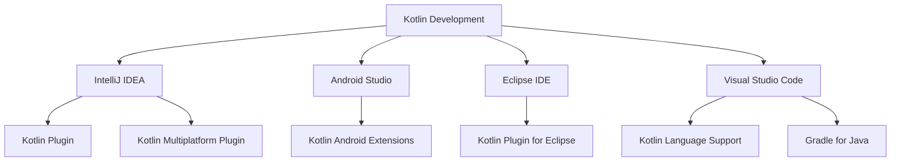

## 24.7 Tools and IDEs for Kotlin Development

In the ever-evolving landscape of software development, choosing the right tools and Integrated Development Environments (IDEs) is crucial for maximizing productivity and efficiency. Kotlin, with its modern syntax and seamless interoperability with Java, has become a popular choice for developers across various domains. This section delves into the essential tools and IDEs that enhance Kotlin development, providing expert software engineers and architects with the knowledge needed to make informed decisions.

### Overview of Development Environments

Kotlin development can be performed in a variety of environments, each offering unique features and capabilities. The choice of IDE often depends on the specific requirements of the project, such as the need for Android development, server-side applications, or multiplatform projects. Let's explore some of the most popular IDEs and development environments for Kotlin.

#### IntelliJ IDEA

IntelliJ IDEA, developed by JetBrains, is the official IDE for Kotlin and offers comprehensive support for the language. It is renowned for its intelligent code completion, refactoring tools, and deep integration with Kotlin's features.

- **Key Features:**
  - **Smart Code Completion:** IntelliJ IDEA provides context-aware suggestions, making coding faster and more efficient.
  - **Refactoring Support:** Seamlessly refactor Kotlin code with confidence, thanks to IntelliJ's robust refactoring capabilities.
  - **Kotlin-Specific Inspections:** The IDE offers inspections and quick-fixes tailored for Kotlin, ensuring code quality and consistency.
  - **Version Control Integration:** IntelliJ IDEA integrates with Git, Mercurial, and other version control systems, facilitating collaborative development.

```kotlin
// Example of using IntelliJ IDEA's smart code completion
fun main() {
    val numbers = listOf(1, 2, 3, 4, 5)
    numbers.forEach { number ->
        println(number) // IntelliJ suggests `number` as the variable name
    }
}
```

- **Plugins and Extensions:**
  - **Kotlin Plugin:** Pre-installed in IntelliJ IDEA, this plugin provides first-class support for Kotlin development.
  - **Kotlin Multiplatform Plugin:** Facilitates the development of Kotlin multiplatform projects, enabling code sharing across JVM, JS, and Native platforms.

#### Android Studio

Android Studio, also developed by JetBrains in collaboration with Google, is the go-to IDE for Android development with Kotlin. It offers a rich set of tools specifically designed for building Android applications.

- **Key Features:**
  - **Layout Editor:** A powerful visual editor for designing Android UIs.
  - **APK Analyzer:** Helps in optimizing the size of APK files.
  - **Android Emulator:** Allows testing applications on various virtual devices.

```kotlin
// Sample Android Activity using Kotlin
class MainActivity : AppCompatActivity() {
    override fun onCreate(savedInstanceState: Bundle?) {
        super.onCreate(savedInstanceState)
        setContentView(R.layout.activity_main)
        
        // Using synthetic properties for view binding
        val button: Button = findViewById(R.id.button)
        button.setOnClickListener {
            Toast.makeText(this, "Button clicked!", Toast.LENGTH_SHORT).show()
        }
    }
}
```

- **Plugins and Extensions:**
  - **Kotlin Android Extensions:** Simplifies view binding and layout access in Android apps.
  - **Firebase Plugin:** Integrates Firebase services for Android applications.

#### Eclipse IDE

While not as popular as IntelliJ IDEA for Kotlin development, Eclipse IDE can be configured to support Kotlin through plugins.

- **Key Features:**
  - **Modular Architecture:** Eclipse's plugin-based architecture allows for extensive customization.
  - **Cross-Platform Support:** Available on Windows, macOS, and Linux.

- **Plugins and Extensions:**
  - **Kotlin Plugin for Eclipse:** Adds Kotlin support to Eclipse, enabling Kotlin project creation and management.

#### Visual Studio Code

Visual Studio Code (VS Code) is a lightweight, cross-platform code editor that can be extended to support Kotlin development.

- **Key Features:**
  - **Integrated Terminal:** Run Kotlin scripts directly from the terminal within VS Code.
  - **Extensive Marketplace:** Access a wide range of extensions to enhance functionality.

- **Plugins and Extensions:**
  - **Kotlin Language Support:** Provides syntax highlighting, code completion, and debugging capabilities for Kotlin.
  - **Gradle for Java:** Facilitates building and managing Kotlin projects using Gradle.

### Plugins and Extensions

Plugins and extensions play a vital role in enhancing the capabilities of IDEs for Kotlin development. They provide additional functionalities, streamline workflows, and integrate with various tools and services.

#### Kotlin Plugin for IntelliJ IDEA

The Kotlin Plugin is essential for developing Kotlin applications in IntelliJ IDEA. It offers a seamless experience with features like code completion, syntax highlighting, and debugging.

- **Installation:** The plugin is pre-installed in IntelliJ IDEA, but can be updated via the JetBrains Plugin Repository.

#### Kotlin Multiplatform Plugin

This plugin enables the development of Kotlin multiplatform projects, allowing code sharing across different platforms such as JVM, JavaScript, and Native.

- **Key Features:**
  - **Common Code Sharing:** Write common code once and reuse it across platforms.
  - **Platform-Specific Implementations:** Define platform-specific code when necessary.

```kotlin
// Example of a multiplatform project structure
// commonMain source set
expect fun platformName(): String

// JVM-specific implementation
actual fun platformName(): String = "JVM"

// JS-specific implementation
actual fun platformName(): String = "JavaScript"
```

#### Kotlin Android Extensions

Kotlin Android Extensions simplify Android development by eliminating the need for `findViewById()` calls. They provide a more concise way to access views in Android layouts.

- **Key Features:**
  - **Synthetic Properties:** Access views directly using their IDs as properties.
  - **Parcelize Annotation:** Simplifies Parcelable implementation in Kotlin.

```kotlin
// Using synthetic properties in an Android Activity
class MainActivity : AppCompatActivity() {
    override fun onCreate(savedInstanceState: Bundle?) {
        super.onCreate(savedInstanceState)
        setContentView(R.layout.activity_main)
        
        button.setOnClickListener {
            Toast.makeText(this, "Button clicked!", Toast.LENGTH_SHORT).show()
        }
    }
}
```

#### Gradle Kotlin DSL

Gradle Kotlin DSL allows developers to write build scripts using Kotlin instead of Groovy. This provides better type safety and IDE support.

- **Key Features:**
  - **Type-Safe Build Scripts:** Leverage Kotlin's type system for safer build configurations.
  - **IDE Support:** Enjoy code completion and syntax highlighting in build scripts.

```kotlin
// Example of a Gradle build script using Kotlin DSL
plugins {
    kotlin("jvm") version "1.5.31"
}

dependencies {
    implementation(kotlin("stdlib"))
}
```

### Visualizing the IDE Ecosystem

To better understand the relationships between different tools and plugins in the Kotlin development ecosystem, let's visualize the connections using a diagram.



### Try It Yourself

To get hands-on experience with Kotlin development tools and IDEs, try the following exercises:

1. **Set Up a Kotlin Project in IntelliJ IDEA:**
   - Create a new Kotlin project and explore the code completion and refactoring features.
   - Experiment with the Kotlin Multiplatform Plugin by creating a simple multiplatform project.

2. **Develop an Android App in Android Studio:**
   - Build a basic Android app using Kotlin and utilize the Kotlin Android Extensions for view binding.
   - Integrate Firebase services using the Firebase Plugin.

3. **Explore Kotlin in Visual Studio Code:**
   - Install the Kotlin Language Support extension and create a Kotlin script.
   - Use the integrated terminal to run the script and observe the output.

### Knowledge Check

Before moving on, consider these questions to reinforce your understanding:

- What are the key features of IntelliJ IDEA that make it suitable for Kotlin development?
- How do Kotlin Android Extensions simplify Android development?
- What advantages does Gradle Kotlin DSL offer over traditional Groovy-based build scripts?

### Embrace the Journey

Remember, mastering Kotlin development tools and IDEs is a journey. As you explore different environments, you'll discover new features and workflows that enhance your productivity. Keep experimenting, stay curious, and enjoy the process of building amazing applications with Kotlin!

### References and Links

For further reading and exploration, consider the following resources:

- [JetBrains IntelliJ IDEA](https://www.jetbrains.com/idea/)
- [Android Studio](https://developer.android.com/studio)
- [Eclipse IDE](https://www.eclipse.org/ide/)
- [Visual Studio Code](https://code.visualstudio.com/)

## Quiz Time!



### Which IDE is the official development environment for Kotlin?

- [x] IntelliJ IDEA
- [ ] Eclipse IDE
- [ ] Visual Studio Code
- [ ] NetBeans

> **Explanation:** IntelliJ IDEA, developed by JetBrains, is the official IDE for Kotlin development, offering comprehensive support and features tailored for the language.

### What is the primary advantage of using Kotlin Android Extensions?

- [x] Simplifies view binding in Android apps
- [ ] Provides advanced debugging tools
- [ ] Enhances code completion for Java
- [ ] Integrates with cloud services

> **Explanation:** Kotlin Android Extensions simplify view binding by allowing developers to access views directly using their IDs as properties, eliminating the need for `findViewById()` calls.

### Which plugin enables Kotlin multiplatform project development in IntelliJ IDEA?

- [x] Kotlin Multiplatform Plugin
- [ ] Kotlin Android Extensions
- [ ] Gradle Kotlin DSL
- [ ] Firebase Plugin

> **Explanation:** The Kotlin Multiplatform Plugin facilitates the development of Kotlin multiplatform projects, allowing code sharing across JVM, JS, and Native platforms.

### What is a key benefit of using Gradle Kotlin DSL for build scripts?

- [x] Type-safe build configurations
- [ ] Faster build times
- [ ] Enhanced UI design tools
- [ ] Cloud deployment integration

> **Explanation:** Gradle Kotlin DSL allows developers to write type-safe build scripts using Kotlin, providing better IDE support and reducing errors compared to Groovy-based scripts.

### Which IDE is primarily used for Android development with Kotlin?

- [x] Android Studio
- [ ] IntelliJ IDEA
- [ ] Eclipse IDE
- [ ] Visual Studio Code

> **Explanation:** Android Studio, developed by JetBrains in collaboration with Google, is the primary IDE for Android development with Kotlin, offering a rich set of tools for building Android applications.

### What feature does IntelliJ IDEA offer for seamless version control integration?

- [x] Integration with Git, Mercurial, and other systems
- [ ] Built-in cloud storage
- [ ] Advanced UI design tools
- [ ] Real-time collaboration features

> **Explanation:** IntelliJ IDEA integrates with various version control systems like Git and Mercurial, facilitating collaborative development and version management.

### Which tool is used for writing build scripts in Kotlin instead of Groovy?

- [x] Gradle Kotlin DSL
- [ ] Kotlin Multiplatform Plugin
- [ ] Kotlin Android Extensions
- [ ] Firebase Plugin

> **Explanation:** Gradle Kotlin DSL allows developers to write build scripts using Kotlin, offering type safety and better IDE support compared to Groovy.

### What is the purpose of the Kotlin Plugin for Eclipse?

- [x] Adds Kotlin support to Eclipse IDE
- [ ] Enhances Java code completion
- [ ] Integrates cloud services
- [ ] Provides advanced debugging tools

> **Explanation:** The Kotlin Plugin for Eclipse adds support for Kotlin development in the Eclipse IDE, enabling project creation and management in Kotlin.

### Which tool provides a visual editor for designing Android UIs?

- [x] Android Studio Layout Editor
- [ ] IntelliJ IDEA Code Editor
- [ ] Eclipse Visual Designer
- [ ] Visual Studio Code UI Designer

> **Explanation:** The Layout Editor in Android Studio is a powerful visual editor specifically designed for creating and designing Android user interfaces.

### True or False: Visual Studio Code is a cross-platform IDE that can be extended to support Kotlin development.

- [x] True
- [ ] False

> **Explanation:** Visual Studio Code is a lightweight, cross-platform code editor that can be extended with plugins and extensions to support Kotlin development.


