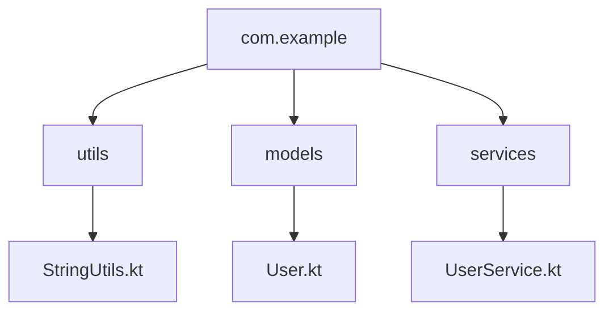

## 3.1 Packages and Imports

In Kotlin, organizing code effectively is crucial for building maintainable and scalable applications. This section delves into the concepts of packages and imports, which are fundamental to structuring Kotlin code. We will explore how to use packages to group related classes and functions, how imports facilitate code reuse, and the role of visibility modifiers in controlling access to code elements.

### Understanding Packages in Kotlin

Packages in Kotlin serve as containers for classes, interfaces, functions, and other declarations. They help organize code into logical units, making it easier to manage and navigate large codebases. Let's explore how packages work in Kotlin:

#### Defining Packages

In Kotlin, a package is defined at the top of a Kotlin file using the `package` keyword. Here's a simple example:

```kotlin
// File: src/com/example/utils/StringUtils.kt

package com.example.utils

fun capitalizeFirstLetter(input: String): String {
    return input.replaceFirstChar { if (it.isLowerCase()) it.titlecase() else it.toString() }
}
```

In this example, the `capitalizeFirstLetter` function is part of the `com.example.utils` package. The package name typically follows the reverse domain name notation, which helps avoid naming conflicts.

#### Package Structure

A well-structured package hierarchy is essential for organizing code effectively. Here's a typical package structure for a Kotlin project:

```
src/
└── com/
    └── example/
        ├── utils/
        │   └── StringUtils.kt
        ├── models/
        │   └── User.kt
        └── services/
            └── UserService.kt
```

This structure groups related classes and functions into packages, making it easier to locate and manage code.

#### Default Package

If a Kotlin file does not specify a package, it belongs to the default package. However, using the default package is generally discouraged in larger projects, as it can lead to naming conflicts and make code organization more challenging.

### Importing Packages and Classes

Imports in Kotlin allow you to use classes, functions, and other declarations from different packages without fully qualifying their names. This simplifies code and enhances readability.

#### Basic Imports

To import a class or function from another package, use the `import` keyword. Here's an example:

```kotlin
// File: src/com/example/Main.kt

package com.example

import com.example.utils.capitalizeFirstLetter

fun main() {
    val name = "kotlin"
    println(capitalizeFirstLetter(name)) // Output: Kotlin
}
```

In this example, the `capitalizeFirstLetter` function is imported from the `com.example.utils` package, allowing it to be used directly in the `main` function.

#### Wildcard Imports

Kotlin supports wildcard imports, which allow you to import all declarations from a package:

```kotlin
import com.example.utils.*
```

While wildcard imports can be convenient, they may lead to naming conflicts and make it harder to identify the source of imported declarations. Use them judiciously.

#### Static Imports

Kotlin also supports static imports, which allow you to import individual members of a class. This is particularly useful for importing constants or utility functions:

```kotlin
import kotlin.math.PI
import kotlin.math.sqrt

fun calculateCircleArea(radius: Double): Double {
    return PI * sqrt(radius)
}
```

In this example, the `PI` constant and `sqrt` function are imported from the `kotlin.math` package.

### Visibility Modifiers in Kotlin

Visibility modifiers in Kotlin control the accessibility of classes, functions, and properties. They play a crucial role in encapsulating code and defining clear interfaces.

#### Public Modifier

The `public` modifier is the default visibility in Kotlin. Declarations marked as `public` are accessible from anywhere in the project:

```kotlin
package com.example.models

public class User(val name: String, val email: String)
```

In this example, the `User` class is publicly accessible.

#### Internal Modifier

The `internal` modifier restricts access to the same module. A module is a set of Kotlin files compiled together:

```kotlin
package com.example.services

internal class UserService {
    fun getUserById(id: Int): User? {
        // Implementation
    }
}
```

The `UserService` class is accessible only within the same module.

#### Protected Modifier

The `protected` modifier is used for members of a class and makes them accessible only within the class and its subclasses:

```kotlin
package com.example.models

open class Person(protected val name: String)

class Employee(name: String, val position: String) : Person(name) {
    fun printName() {
        println(name) // Accessible here
    }
}
```

In this example, the `name` property is accessible within the `Employee` class, which is a subclass of `Person`.

#### Private Modifier

The `private` modifier restricts access to the same file or class. It's useful for encapsulating implementation details:

```kotlin
package com.example.utils

private fun formatString(input: String): String {
    // Implementation
}

fun capitalizeFirstLetter(input: String): String {
    return formatString(input).replaceFirstChar { it.uppercase() }
}
```

Here, the `formatString` function is private and can only be accessed within the same file.

### Best Practices for Packages and Imports

To effectively organize code and manage dependencies, consider the following best practices:

- **Use Meaningful Package Names:** Choose package names that reflect the functionality or purpose of the code they contain. This improves code readability and maintainability.
  
- **Avoid Wildcard Imports:** Prefer explicit imports to avoid naming conflicts and improve code clarity.
  
- **Leverage Visibility Modifiers:** Use visibility modifiers to encapsulate implementation details and define clear interfaces.
  
- **Group Related Code:** Organize related classes and functions into packages to improve code organization and navigation.

### Visualizing Package and Import Structure

To better understand the relationship between packages and imports, let's visualize a simple package structure using a diagram:



**Figure 1:** Package Structure Visualization

This diagram illustrates a typical package structure, with packages `utils`, `models`, and `services` under the `com.example` root package.

### Try It Yourself

Experiment with the concepts covered in this section by creating a small Kotlin project. Define your own packages and classes, and practice using imports and visibility modifiers. Try modifying the visibility of different classes and observe how it affects access from other parts of the project.

### Knowledge Check

To reinforce your understanding of packages and imports in Kotlin, consider the following questions:

- What is the purpose of using packages in Kotlin?
- How do visibility modifiers affect access to classes and functions?
- What are the advantages and disadvantages of using wildcard imports?

### Summary

In this section, we've explored the fundamentals of packages and imports in Kotlin. We've learned how to define packages, use imports to simplify code, and control access with visibility modifiers. By organizing code effectively and leveraging these features, you can build maintainable and scalable Kotlin applications.

Remember, this is just the beginning. As you progress, you'll build more complex and interactive applications. Keep experimenting, stay curious, and enjoy the journey!

## Quiz Time!



### What is the primary purpose of using packages in Kotlin?

- [x] To organize code into logical units
- [ ] To increase code execution speed
- [ ] To reduce the size of the compiled application
- [ ] To automatically import all necessary classes

> **Explanation:** Packages in Kotlin help organize code into logical units, making it easier to manage and navigate large codebases.

### Which visibility modifier allows access only within the same module?

- [ ] public
- [ ] private
- [x] internal
- [ ] protected

> **Explanation:** The `internal` modifier restricts access to the same module, allowing declarations to be accessed only within the module they are defined in.

### What is the default visibility modifier in Kotlin?

- [x] public
- [ ] private
- [ ] internal
- [ ] protected

> **Explanation:** The default visibility modifier in Kotlin is `public`, which means the declaration is accessible from anywhere in the project.

### How can you import all declarations from a package in Kotlin?

- [ ] Use the `import all` keyword
- [x] Use a wildcard import with `*`
- [ ] Use the `import package` keyword
- [ ] Use the `import all from` keyword

> **Explanation:** You can import all declarations from a package in Kotlin using a wildcard import, which is done with the `*` symbol.

### What is the disadvantage of using wildcard imports?

- [x] They can lead to naming conflicts
- [ ] They increase code readability
- [ ] They improve code performance
- [ ] They reduce code size

> **Explanation:** Wildcard imports can lead to naming conflicts and make it harder to identify the source of imported declarations.

### Which visibility modifier restricts access to the same file or class?

- [ ] public
- [x] private
- [ ] internal
- [ ] protected

> **Explanation:** The `private` modifier restricts access to the same file or class, encapsulating implementation details.

### What is the recommended practice for naming packages?

- [x] Use meaningful names that reflect functionality
- [ ] Use short and cryptic names
- [ ] Use random names
- [ ] Use the developer's name

> **Explanation:** It's recommended to use meaningful package names that reflect the functionality or purpose of the code they contain.

### Which visibility modifier is used for members of a class and is accessible within subclasses?

- [ ] public
- [ ] private
- [ ] internal
- [x] protected

> **Explanation:** The `protected` modifier is used for members of a class and makes them accessible within the class and its subclasses.

### What is the effect of not specifying a package in a Kotlin file?

- [x] The file belongs to the default package
- [ ] The file cannot be compiled
- [ ] The file is automatically placed in a `misc` package
- [ ] The file is ignored by the compiler

> **Explanation:** If a Kotlin file does not specify a package, it belongs to the default package, which is generally discouraged in larger projects.

### True or False: Using the `internal` modifier allows access across different modules.

- [ ] True
- [x] False

> **Explanation:** The `internal` modifier restricts access to the same module, so it does not allow access across different modules.


