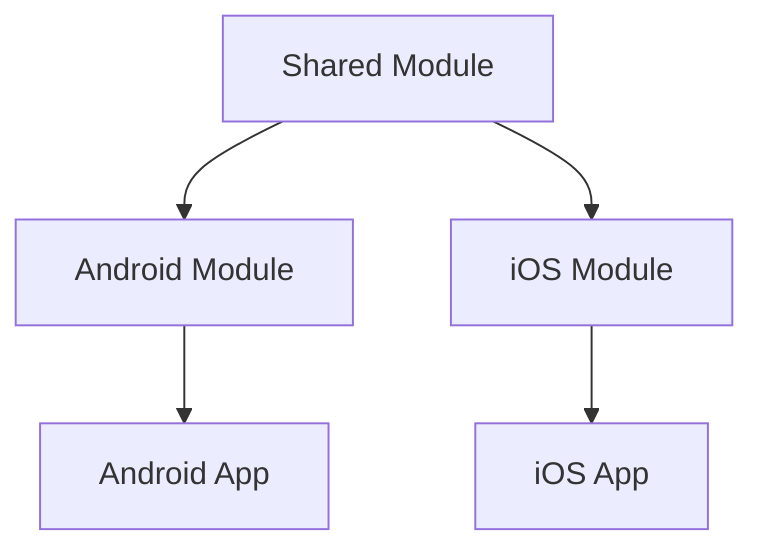

## 3.10 Multiplatform Projects

Kotlin Multiplatform Projects (KMP) represent a significant advancement in software development, enabling developers to share code across different platforms such as Android, iOS, web, and desktop. This approach not only enhances code reusability but also reduces development time and effort. In this section, we will delve into the intricacies of Kotlin Multiplatform Projects, exploring how to structure multiplatform modules, leverage Kotlin Multiplatform Mobile (KMM) for iOS and Android, and adopt best practices for effective multiplatform development.

### Introduction to Kotlin Multiplatform Projects

Kotlin Multiplatform is a feature of the Kotlin programming language that allows developers to write code that can run on multiple platforms. This capability is particularly beneficial in today's diverse technological landscape, where applications often need to support multiple operating systems and devices.

#### Key Concepts

- **Shared Code**: The core idea behind Kotlin Multiplatform is to write code once and share it across different platforms. This shared code typically includes business logic, data models, and other non-UI components.
- **Platform-Specific Code**: While the shared code can be reused, platform-specific code is necessary to handle platform-specific APIs and UI components.
- **Gradle Multiplatform Plugin**: This plugin facilitates the configuration and management of multiplatform projects, allowing developers to define shared and platform-specific source sets.

### Structuring Multiplatform Modules

Structuring multiplatform modules effectively is crucial for maintaining a clean and scalable codebase. Let's explore the key components and best practices for structuring these modules.

#### Project Structure

A typical Kotlin Multiplatform project consists of the following modules:

1. **Shared Module**: Contains the common code that can be reused across platforms. This module is usually written in pure Kotlin and includes business logic, data models, and utility functions.

2. **Platform-Specific Modules**: These modules contain code that is specific to a particular platform, such as Android or iOS. They handle platform-specific APIs, UI components, and other functionalities that cannot be shared.

3. **Application Modules**: These modules are responsible for building the final application for each platform. They depend on both the shared and platform-specific modules.

#### Example Project Structure

Here's an example of how a Kotlin Multiplatform project might be structured:

```
rootProject
│
├── shared
│   ├── src
│   │   ├── commonMain
│   │   ├── commonTest
│   │   ├── androidMain
│   │   ├── iosMain
│   │   └── iosTest
│   └── build.gradle.kts
│
├── androidApp
│   ├── src
│   └── build.gradle.kts
│
└── iosApp
    ├── src
    └── build.gradle.kts
```

#### Gradle Configuration

Configuring the Gradle build system for a multiplatform project involves setting up the `kotlin-multiplatform` plugin and defining source sets for shared and platform-specific code.

```kotlin
plugins {
    kotlin("multiplatform") version "1.8.0"
}

kotlin {
    android()
    iosX64()
    iosArm64()

    sourceSets {
        val commonMain by getting {
            dependencies {
                // Common dependencies
            }
        }
        val androidMain by getting {
            dependencies {
                // Android-specific dependencies
            }
        }
        val iosMain by getting {
            dependencies {
                // iOS-specific dependencies
            }
        }
    }
}
```

### Kotlin Multiplatform Mobile (KMM) for iOS and Android

Kotlin Multiplatform Mobile (KMM) is a specific implementation of Kotlin Multiplatform that focuses on sharing code between Android and iOS applications. KMM allows developers to write common code for both platforms, reducing duplication and ensuring consistency.

#### Setting Up KMM

To set up a KMM project, follow these steps:

1. **Install the Kotlin Plugin**: Ensure that you have the latest version of the Kotlin plugin installed in your IDE.

2. **Create a New KMM Project**: Use the KMM project template provided by the Kotlin plugin to create a new project. This template includes the necessary configurations for a multiplatform project.

3. **Configure the Shared Module**: Define the shared code in the `commonMain` source set. This code will be compiled for both Android and iOS.

4. **Implement Platform-Specific Code**: Use the `androidMain` and `iosMain` source sets to implement platform-specific functionalities.

#### Example: Sharing Business Logic

Let's consider an example where we share business logic between Android and iOS using KMM.

**Shared Code (commonMain)**

```kotlin
// shared/src/commonMain/kotlin/com/example/Calculator.kt

package com.example

class Calculator {
    fun add(a: Int, b: Int): Int = a + b
    fun subtract(a: Int, b: Int): Int = a - b
}
```

**Android-Specific Code (androidMain)**

```kotlin
// shared/src/androidMain/kotlin/com/example/Platform.kt

package com.example

actual fun getPlatformName(): String = "Android"
```

**iOS-Specific Code (iosMain)**

```kotlin
// shared/src/iosMain/kotlin/com/example/Platform.kt

package com.example

actual fun getPlatformName(): String = "iOS"
```

#### Integrating with Android and iOS

To integrate the shared code with Android and iOS applications, follow these steps:

- **Android Integration**: Add the shared module as a dependency in the Android app's `build.gradle.kts` file. Use the shared code in your Android activities or fragments.

- **iOS Integration**: Use the Kotlin/Native framework to integrate the shared code with the iOS app. Import the shared module in your Swift or Objective-C code.

### Best Practices for Multiplatform Development

Adopting best practices is essential for successful multiplatform development. Here are some key practices to consider:

#### Code Organization

- **Modularize Your Code**: Break down your code into smaller, reusable modules. This approach improves maintainability and scalability.

- **Use Interfaces and Abstractions**: Define interfaces and abstractions for platform-specific functionalities. This practice allows you to switch implementations easily.

#### Testing

- **Write Unit Tests for Shared Code**: Ensure that your shared code is thoroughly tested. Use the `commonTest` source set to write unit tests.

- **Test Platform-Specific Code**: Write platform-specific tests to verify the integration of shared code with platform-specific components.

#### Performance Optimization

- **Optimize for Each Platform**: While sharing code is beneficial, it's important to optimize your application for each platform. Consider platform-specific performance optimizations.

- **Profile and Monitor**: Use profiling tools to monitor the performance of your application on different platforms. Identify and address performance bottlenecks.

#### Continuous Integration and Deployment

- **Automate Builds**: Set up continuous integration pipelines to automate the build process for both Android and iOS applications.

- **Deploy Consistently**: Ensure that your deployment process is consistent across platforms. Use tools like Fastlane to automate deployment tasks.

### Visualizing Multiplatform Architecture

To better understand the architecture of a Kotlin Multiplatform project, let's visualize the relationships between shared and platform-specific modules using a Mermaid.js diagram.



**Diagram Description**: This diagram illustrates the architecture of a Kotlin Multiplatform project. The shared module is connected to both the Android and iOS modules, which in turn are connected to their respective applications.

### Try It Yourself

To gain hands-on experience with Kotlin Multiplatform Projects, try the following exercises:

1. **Modify the Shared Code**: Add a new function to the `Calculator` class in the shared module. Implement platform-specific logic for this function in both the Android and iOS modules.

2. **Create a New Shared Module**: Create a new shared module for handling network requests. Use a common library like Ktor for making HTTP requests.

3. **Implement a Simple UI**: Implement a simple UI in both the Android and iOS applications that uses the shared business logic. Experiment with different UI components and layouts.

### Knowledge Check

Before moving on, let's review some key concepts:

- What are the benefits of using Kotlin Multiplatform Projects?
- How do you structure a multiplatform project?
- What is the role of the `commonMain` source set?
- How do you integrate shared code with Android and iOS applications?

### Conclusion

Kotlin Multiplatform Projects offer a powerful solution for sharing code across different platforms. By structuring your projects effectively, leveraging KMM, and adopting best practices, you can create robust, scalable applications that deliver a consistent experience across devices. Remember, this is just the beginning. As you progress, you'll discover new ways to optimize and enhance your multiplatform projects. Keep experimenting, stay curious, and enjoy the journey!

## Quiz Time!



### What is the primary benefit of Kotlin Multiplatform Projects?

- [x] Sharing code across different platforms
- [ ] Writing platform-specific UI components
- [ ] Enhancing UI design
- [ ] Reducing code readability

> **Explanation:** Kotlin Multiplatform Projects allow developers to share code across different platforms, which is the primary benefit.

### Which module contains the shared code in a multiplatform project?

- [x] Shared Module
- [ ] Android Module
- [ ] iOS Module
- [ ] Application Module

> **Explanation:** The Shared Module contains the code that can be reused across different platforms.

### What is the purpose of the `commonMain` source set?

- [x] To define shared code for all platforms
- [ ] To define Android-specific code
- [ ] To define iOS-specific code
- [ ] To manage dependencies

> **Explanation:** The `commonMain` source set is used to define shared code that is compiled for all platforms.

### How do you integrate shared code with an Android application?

- [x] Add the shared module as a dependency in the Android app's `build.gradle.kts` file
- [ ] Use the shared module in Swift code
- [ ] Write platform-specific code in the shared module
- [ ] Use the shared module in Objective-C code

> **Explanation:** To integrate shared code with an Android application, you add the shared module as a dependency in the Android app's `build.gradle.kts` file.

### What is Kotlin Multiplatform Mobile (KMM)?

- [x] A specific implementation of Kotlin Multiplatform for sharing code between Android and iOS
- [ ] A tool for building web applications
- [ ] A library for UI design
- [ ] A framework for server-side development

> **Explanation:** Kotlin Multiplatform Mobile (KMM) is a specific implementation of Kotlin Multiplatform that focuses on sharing code between Android and iOS applications.

### Which tool can be used to automate deployment tasks for both Android and iOS?

- [x] Fastlane
- [ ] Gradle
- [ ] Maven
- [ ] Jenkins

> **Explanation:** Fastlane is a tool that can be used to automate deployment tasks for both Android and iOS applications.

### What is the role of platform-specific modules in a multiplatform project?

- [x] To handle platform-specific APIs and UI components
- [ ] To contain shared business logic
- [ ] To manage common dependencies
- [ ] To define shared data models

> **Explanation:** Platform-specific modules handle platform-specific APIs and UI components that cannot be shared.

### Which of the following is a best practice for multiplatform development?

- [x] Modularize your code
- [ ] Write all code in the shared module
- [ ] Avoid using interfaces
- [ ] Ignore platform-specific optimizations

> **Explanation:** Modularizing your code is a best practice for multiplatform development as it improves maintainability and scalability.

### True or False: Kotlin Multiplatform allows you to write UI components in the shared module.

- [ ] True
- [x] False

> **Explanation:** Kotlin Multiplatform is primarily used for sharing non-UI code such as business logic and data models. UI components are typically platform-specific.

### Which diagram tool is used to visualize multiplatform architecture in this guide?

- [x] Mermaid.js
- [ ] PlantUML
- [ ] Graphviz
- [ ] Lucidchart

> **Explanation:** Mermaid.js is used in this guide to visualize multiplatform architecture.


