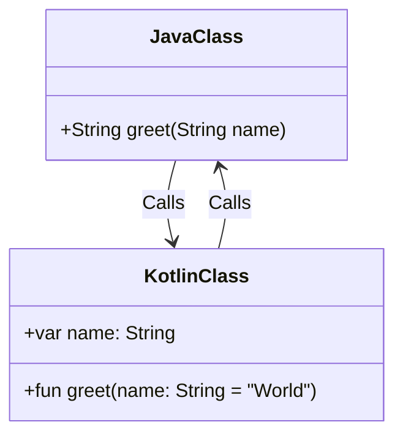

## 3.11 Interoperability with Java

Kotlin's seamless interoperability with Java is one of its most compelling features, allowing developers to leverage existing Java libraries and frameworks while enjoying Kotlin's modern language features. In this section, we'll explore how Kotlin and Java can work together, focusing on handling Java nullability in Kotlin and calling Kotlin from Java. We'll also delve into best practices and techniques for effective interoperability, ensuring that your code remains clean, efficient, and maintainable.

### Seamlessly Integrating Kotlin and Java Code

Kotlin is designed to be fully interoperable with Java, meaning you can call Java code from Kotlin and vice versa without any issues. This interoperability allows developers to gradually migrate Java codebases to Kotlin or use Kotlin alongside Java in new projects. Let's explore how this integration works and the key considerations involved.

#### Calling Java from Kotlin

Calling Java code from Kotlin is straightforward. Kotlin can access Java classes, methods, and fields just as if they were Kotlin's own. Here's a simple example:

```java
// Java class
public class JavaClass {
    public String greet(String name) {
        return "Hello, " + name;
    }
}
```

```kotlin
// Kotlin code
fun main() {
    val javaClass = JavaClass()
    println(javaClass.greet("Kotlin"))
}
```

In this example, we create an instance of the `JavaClass` in Kotlin and call its `greet` method. Kotlin handles the Java method call seamlessly.

#### Handling Java Nullability in Kotlin

One of the challenges of working with Java code in Kotlin is dealing with nullability. Java does not have built-in null safety, which can lead to `NullPointerException` (NPE) issues. Kotlin addresses this with its type system, which distinguishes between nullable and non-nullable types.

##### Nullable Types in Kotlin

Kotlin uses nullable types to represent values that can be null. When calling Java code, Kotlin treats all Java types as platform types, which means they can be either nullable or non-nullable. You can explicitly specify the nullability of Java types in Kotlin:

```kotlin
val nullableString: String? = javaClass.greet(null)
```

In this example, `nullableString` is declared as a nullable type (`String?`), allowing it to hold a null value.

##### Using Annotations for Nullability

Java 8 introduced annotations like `@Nullable` and `@NotNull` to indicate nullability. Kotlin can interpret these annotations to provide better null safety:

```java
// Java class with annotations
public class AnnotatedJavaClass {
    @Nullable
    public String getNullableString() {
        return null;
    }

    @NotNull
    public String getNonNullString() {
        return "Hello";
    }
}
```

```kotlin
// Kotlin code
fun main() {
    val javaClass = AnnotatedJavaClass()
    val nullableString: String? = javaClass.getNullableString()
    val nonNullString: String = javaClass.getNonNullString()
}
```

In this example, Kotlin recognizes the `@Nullable` and `@NotNull` annotations, allowing us to handle nullability more effectively.

#### Calling Kotlin from Java

Calling Kotlin code from Java is also straightforward, but there are some nuances to consider, especially regarding Kotlin's features that do not have direct equivalents in Java.

##### Accessing Kotlin Properties

Kotlin properties are accessed in Java using getter and setter methods. Here's an example:

```kotlin
// Kotlin class
class KotlinClass {
    var name: String = "Kotlin"
}
```

```java
// Java code
public class Main {
    public static void main(String[] args) {
        KotlinClass kotlinClass = new KotlinClass();
        System.out.println(kotlinClass.getName());
        kotlinClass.setName("Java");
        System.out.println(kotlinClass.getName());
    }
}
```

In this example, the Kotlin property `name` is accessed in Java using the `getName` and `setName` methods.

##### Handling Kotlin's Nullability in Java

When calling Kotlin code from Java, you need to be aware of Kotlin's nullability. Kotlin's non-nullable types are treated as regular Java types, while nullable types are treated as Java's nullable types. Here's an example:

```kotlin
// Kotlin class
class NullableKotlinClass {
    fun getNullableString(): String? {
        return null
    }

    fun getNonNullString(): String {
        return "Hello"
    }
}
```

```java
// Java code
public class Main {
    public static void main(String[] args) {
        NullableKotlinClass kotlinClass = new NullableKotlinClass();
        String nullableString = kotlinClass.getNullableString();
        String nonNullString = kotlinClass.getNonNullString();
    }
}
```

In this example, `getNullableString` returns a nullable type, which Java handles as a regular nullable type.

### Best Practices for Kotlin and Java Interoperability

To ensure smooth interoperability between Kotlin and Java, consider the following best practices:

#### Use Kotlin's Null Safety Features

Leverage Kotlin's null safety features to avoid null-related issues. Use nullable types and safe calls (`?.`) to handle potential null values gracefully.

#### Annotate Java Code

Use nullability annotations (`@Nullable`, `@NotNull`) in your Java code to help Kotlin understand the nullability of Java types. This practice improves the safety and readability of your Kotlin code.

#### Avoid Kotlin-Specific Features in Java-Exposed APIs

When designing APIs that will be accessed from Java, avoid using Kotlin-specific features that do not have direct equivalents in Java, such as extension functions and default parameter values.

#### Use `JvmOverloads` for Default Parameters

Kotlin supports default parameter values, but Java does not. Use the `@JvmOverloads` annotation to generate overloaded methods for Java compatibility:

```kotlin
// Kotlin function with default parameters
class DefaultParams {
    @JvmOverloads
    fun greet(name: String = "World") {
        println("Hello, $name!")
    }
}
```

```java
// Java code
public class Main {
    public static void main(String[] args) {
        DefaultParams params = new DefaultParams();
        params.greet(); // Calls the overloaded method
        params.greet("Java");
    }
}
```

In this example, the `@JvmOverloads` annotation generates overloaded methods for Java compatibility.

#### Use `JvmName` for Naming Conflicts

If you encounter naming conflicts between Kotlin and Java, use the `@JvmName` annotation to specify an alternative name for Java:

```kotlin
// Kotlin function with JvmName
class NamingConflict {
    @JvmName("greetJava")
    fun greet() {
        println("Hello from Kotlin!")
    }
}
```

```java
// Java code
public class Main {
    public static void main(String[] args) {
        NamingConflict conflict = new NamingConflict();
        conflict.greetJava(); // Calls the renamed method
    }
}
```

In this example, the `@JvmName` annotation resolves the naming conflict.

### Visualizing Kotlin and Java Interoperability

To better understand how Kotlin and Java interact, let's visualize the process using a class diagram:



This diagram illustrates the bidirectional interaction between Java and Kotlin classes, highlighting how methods and properties are accessed across languages.

### Knowledge Check

Before we move on, let's reinforce your understanding with a few questions:

- How does Kotlin handle Java's nullability?
- What are some best practices for ensuring smooth interoperability between Kotlin and Java?
- How can you resolve naming conflicts between Kotlin and Java?

### Embrace the Journey

Remember, mastering interoperability between Kotlin and Java is a journey. As you continue to explore and experiment with these languages, you'll discover new ways to leverage their strengths and create powerful, efficient applications. Keep experimenting, stay curious, and enjoy the journey!

### References and Links

- [Kotlin Documentation: Java Interoperability](https://kotlinlang.org/docs/java-interop.html)
- [Java Annotations for Nullability](https://docs.oracle.com/javase/tutorial/java/annotations/predefined.html)
- [Kotlin Annotations](https://kotlinlang.org/docs/annotations.html)

### Quiz Time!



### How does Kotlin handle Java's nullability?

- [x] Treats Java types as platform types, which can be nullable or non-nullable
- [ ] Converts all Java types to non-nullable types
- [ ] Converts all Java types to nullable types
- [ ] Ignores nullability

> **Explanation:** Kotlin treats Java types as platform types, allowing them to be either nullable or non-nullable, depending on the context.

### What annotation can you use in Java to indicate a method returns a non-null value?

- [ ] @Nullable
- [x] @NotNull
- [ ] @NonNull
- [ ] @NullSafe

> **Explanation:** The `@NotNull` annotation is used to indicate that a method returns a non-null value.

### How can you generate overloaded methods for Java compatibility in Kotlin?

- [x] Use the @JvmOverloads annotation
- [ ] Use the @JvmName annotation
- [ ] Use the @JvmStatic annotation
- [ ] Use the @JvmField annotation

> **Explanation:** The `@JvmOverloads` annotation generates overloaded methods for Java compatibility when using default parameters in Kotlin.

### What is a best practice for designing APIs that will be accessed from Java?

- [x] Avoid using Kotlin-specific features that do not have direct equivalents in Java
- [ ] Use Kotlin extension functions extensively
- [ ] Rely on Kotlin's default parameter values
- [ ] Use Kotlin's sealed classes

> **Explanation:** When designing APIs for Java access, avoid using Kotlin-specific features that Java cannot directly interpret, such as extension functions and default parameter values.

### How can you resolve naming conflicts between Kotlin and Java?

- [x] Use the @JvmName annotation
- [ ] Use the @JvmStatic annotation
- [ ] Use the @JvmField annotation
- [ ] Use the @JvmOverloads annotation

> **Explanation:** The `@JvmName` annotation allows you to specify an alternative name for Java, resolving naming conflicts.

### What is the purpose of the @JvmStatic annotation in Kotlin?

- [x] To expose Kotlin companion object members as static members in Java
- [ ] To generate overloaded methods for Java compatibility
- [ ] To indicate a method returns a non-null value
- [ ] To specify an alternative name for Java

> **Explanation:** The `@JvmStatic` annotation exposes Kotlin companion object members as static members in Java.

### How does Kotlin treat Java's nullable types?

- [x] As platform types, which can be nullable or non-nullable
- [ ] As non-nullable types
- [ ] As nullable types
- [ ] As primitive types

> **Explanation:** Kotlin treats Java's nullable types as platform types, allowing them to be either nullable or non-nullable.

### What is a key benefit of Kotlin's null safety features?

- [x] Reduces the risk of NullPointerException (NPE) issues
- [ ] Increases code complexity
- [ ] Requires more boilerplate code
- [ ] Limits interoperability with Java

> **Explanation:** Kotlin's null safety features reduce the risk of NullPointerException (NPE) issues by distinguishing between nullable and non-nullable types.

### What should you do when calling Kotlin code from Java?

- [x] Be aware of Kotlin's nullability and handle it appropriately
- [ ] Ignore Kotlin's nullability
- [ ] Use Kotlin extension functions
- [ ] Rely on Kotlin's default parameter values

> **Explanation:** When calling Kotlin code from Java, be aware of Kotlin's nullability and handle it appropriately to avoid issues.

### True or False: Kotlin can call Java code without any issues.

- [x] True
- [ ] False

> **Explanation:** True. Kotlin is designed to be fully interoperable with Java, allowing it to call Java code seamlessly.


