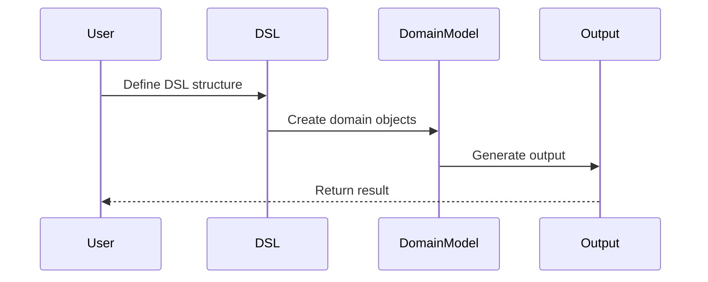

## 3.12 DSL Construction

Designing domain-specific languages (DSLs) is a powerful technique in software engineering, allowing developers to create expressive and intuitive APIs tailored to specific problem domains. Kotlin, with its flexible syntax and language features, provides an excellent platform for building both internal and external DSLs. In this section, we will delve into the intricacies of DSL construction in Kotlin, exploring techniques, syntax features, and best practices to craft elegant and efficient DSLs.

### Understanding Domain-Specific Languages

**Domain-Specific Languages (DSLs)** are specialized mini-languages designed to solve problems within a specific domain. Unlike general-purpose programming languages, DSLs offer higher abstraction levels, making them more expressive and easier to use for domain experts. DSLs can be classified into two main types:

1. **Internal DSLs**: Embedded within a host language, leveraging its syntax and semantics. Kotlin is particularly well-suited for creating internal DSLs due to its expressive syntax and features like extension functions, lambdas with receivers, and infix notation.

2. **External DSLs**: Standalone languages with their own syntax and parsers. While Kotlin can be used to implement external DSLs, this section focuses on internal DSLs.

### Why Use DSLs?

- **Expressiveness**: DSLs allow developers to write code that closely resembles natural language, making it easier to understand and maintain.
- **Abstraction**: By abstracting complex logic, DSLs simplify the codebase and reduce the likelihood of errors.
- **Domain Alignment**: DSLs are tailored to specific domains, enabling domain experts to contribute directly to the codebase without deep programming knowledge.

### Key Features of Kotlin for DSL Construction

Kotlin's language features make it an ideal choice for constructing internal DSLs:

- **Extension Functions**: Add new functionality to existing classes without modifying their source code.
- **Lambdas with Receivers**: Enable the creation of concise and readable builder-style APIs.
- **Infix Notation**: Allow functions to be called in a more natural, operator-like manner.
- **Named and Default Arguments**: Enhance readability and flexibility in function calls.
- **Operator Overloading**: Customize the behavior of operators for specific types.

### Techniques for Building Internal DSLs in Kotlin

#### 1. Extension Functions

Extension functions are a cornerstone of DSL construction in Kotlin. They allow you to add new methods to existing classes, enabling a more fluent and expressive API design.

```kotlin
// Example of an extension function
fun String.isPalindrome(): Boolean {
    return this == this.reversed()
}

fun main() {
    println("madam".isPalindrome()) // Output: true
}
```

**Key Points:**
- Extension functions do not modify the original class; they are syntactic sugar for static methods.
- They can be used to enhance readability and provide domain-specific functionality.

#### 2. Lambdas with Receivers

Lambdas with receivers are a powerful feature that allows you to define a lambda expression with a receiver object, enabling a builder-style syntax.

```kotlin
// Example of a lambda with receiver
class Html {
    private val elements = mutableListOf<String>()

    fun body(init: Body.() -> Unit) {
        val body = Body()
        body.init()
        elements.add(body.toString())
    }

    override fun toString(): String {
        return elements.joinToString("\n")
    }
}

class Body {
    private val elements = mutableListOf<String>()

    fun p(text: String) {
        elements.add("<p>$text</p>")
    }

    override fun toString(): String {
        return elements.joinToString("\n")
    }
}

fun html(init: Html.() -> Unit): Html {
    val html = Html()
    html.init()
    return html
}

fun main() {
    val document = html {
        body {
            p("Hello, World!")
            p("Welcome to Kotlin DSLs.")
        }
    }
    println(document)
}
```

**Key Points:**
- The receiver object (`this`) allows you to call methods directly within the lambda.
- This pattern is commonly used in DSLs to create a hierarchical structure.

#### 3. Infix Notation

Infix notation allows you to call functions in a more natural, operator-like way. This can enhance the readability of your DSL.

```kotlin
// Example of infix notation
infix fun Int.times(str: String): String {
    return str.repeat(this)
}

fun main() {
    println(3 times "Hello ") // Output: Hello Hello Hello 
}
```

**Key Points:**
- Infix functions must be member functions or extension functions with a single parameter.
- They improve the readability of expressions, especially in DSLs.

#### 4. Named and Default Arguments

Named and default arguments provide flexibility and clarity in function calls, which is particularly useful in DSLs.

```kotlin
// Example of named and default arguments
fun greet(name: String = "Guest", greeting: String = "Hello") {
    println("$greeting, $name!")
}

fun main() {
    greet() // Output: Hello, Guest!
    greet(name = "Alice") // Output: Hello, Alice!
    greet(greeting = "Welcome", name = "Bob") // Output: Welcome, Bob!
}
```

**Key Points:**
- Named arguments improve readability by making the purpose of each argument clear.
- Default arguments reduce boilerplate code by providing sensible defaults.

#### 5. Operator Overloading

Operator overloading allows you to define custom behavior for operators, making your DSL more intuitive.

```kotlin
// Example of operator overloading
data class Vector(val x: Int, val y: Int) {
    operator fun plus(other: Vector) = Vector(x + other.x, y + other.y)
}

fun main() {
    val v1 = Vector(1, 2)
    val v2 = Vector(3, 4)
    val v3 = v1 + v2
    println(v3) // Output: Vector(x=4, y=6)
}
```

**Key Points:**
- Operator overloading should be used judiciously to avoid confusing code.
- It can enhance the expressiveness of your DSL by aligning with mathematical or domain-specific operations.

### Building a Simple DSL: A Step-by-Step Guide

Let's build a simple DSL for constructing SQL queries. This example will demonstrate how to leverage Kotlin's features to create a fluent and expressive API.

#### Step 1: Define the Domain Model

Start by defining the domain model for SQL queries. This includes classes for tables, columns, and queries.

```kotlin
// Domain model for SQL queries
class Table(val name: String) {
    val columns = mutableListOf<Column>()

    fun column(name: String, type: String) {
        columns.add(Column(name, type))
    }
}

class Column(val name: String, val type: String)

class Query(val table: Table) {
    private val selectedColumns = mutableListOf<Column>()

    fun select(vararg columns: Column) {
        selectedColumns.addAll(columns)
    }

    override fun toString(): String {
        val columnsStr = selectedColumns.joinToString(", ") { it.name }
        return "SELECT $columnsStr FROM ${table.name}"
    }
}
```

#### Step 2: Create the DSL Functions

Next, create functions that use Kotlin's features to provide a fluent API for constructing queries.

```kotlin
// DSL functions for SQL queries
fun table(name: String, init: Table.() -> Unit): Table {
    val table = Table(name)
    table.init()
    return table
}

fun query(table: Table, init: Query.() -> Unit): Query {
    val query = Query(table)
    query.init()
    return query
}
```

#### Step 3: Use the DSL

Finally, use the DSL to construct a query. Notice how the DSL provides a clear and concise way to express the query logic.

```kotlin
fun main() {
    val usersTable = table("Users") {
        column("id", "INT")
        column("name", "VARCHAR")
        column("email", "VARCHAR")
    }

    val selectQuery = query(usersTable) {
        select(usersTable.columns[0], usersTable.columns[1])
    }

    println(selectQuery) // Output: SELECT id, name FROM Users
}
```

### Advanced Techniques for DSL Construction

#### 1. Type-Safe Builders

Type-safe builders are a powerful technique for constructing complex objects in a type-safe manner. They leverage Kotlin's type system to ensure that the constructed objects are valid.

```kotlin
// Example of a type-safe builder
class Email {
    var subject: String = ""
    var body: String = ""
    var recipient: String = ""

    override fun toString(): String {
        return "To: $recipient\nSubject: $subject\n\n$body"
    }
}

fun email(init: Email.() -> Unit): Email {
    val email = Email()
    email.init()
    return email
}

fun main() {
    val emailMessage = email {
        subject = "Meeting Reminder"
        body = "Don't forget about the meeting tomorrow at 10 AM."
        recipient = "john.doe@example.com"
    }

    println(emailMessage)
}
```

**Key Points:**
- Type-safe builders ensure that all required properties are set before the object is used.
- They provide a fluent and intuitive API for constructing complex objects.

#### 2. DSL for Configuration

DSLs are often used for configuration purposes, allowing users to define settings in a concise and readable manner.

```kotlin
// Example of a configuration DSL
class Config {
    var host: String = "localhost"
    var port: Int = 80

    override fun toString(): String {
        return "Host: $host, Port: $port"
    }
}

fun config(init: Config.() -> Unit): Config {
    val config = Config()
    config.init()
    return config
}

fun main() {
    val serverConfig = config {
        host = "example.com"
        port = 8080
    }

    println(serverConfig) // Output: Host: example.com, Port: 8080
}
```

**Key Points:**
- Configuration DSLs simplify the process of setting up complex configurations.
- They improve readability and reduce the likelihood of errors.

#### 3. Combining DSLs

In some cases, you may want to combine multiple DSLs to create a more comprehensive solution. This involves integrating different DSLs in a seamless manner.

```kotlin
// Example of combining DSLs
class Server {
    var config: Config? = null
    var routes = mutableListOf<Route>()

    fun config(init: Config.() -> Unit) {
        config = Config().apply(init)
    }

    fun route(path: String, init: Route.() -> Unit) {
        val route = Route(path)
        route.init()
        routes.add(route)
    }

    override fun toString(): String {
        return "Server(config=$config, routes=$routes)"
    }
}

class Route(val path: String) {
    var handler: String = ""

    override fun toString(): String {
        return "Route(path='$path', handler='$handler')"
    }
}

fun server(init: Server.() -> Unit): Server {
    val server = Server()
    server.init()
    return server
}

fun main() {
    val myServer = server {
        config {
            host = "api.example.com"
            port = 443
        }
        route("/users") {
            handler = "UserHandler"
        }
        route("/posts") {
            handler = "PostHandler"
        }
    }

    println(myServer)
}
```

**Key Points:**
- Combining DSLs allows you to create more powerful and flexible solutions.
- Ensure that the combined DSLs maintain a consistent and intuitive API.

### Visualizing DSL Construction

To better understand the flow of DSL construction, let's visualize the process using a sequence diagram. This diagram illustrates the interaction between different components of a DSL.



**Diagram Explanation:**
- The user defines the DSL structure using the provided API.
- The DSL creates domain objects based on the user's input.
- The domain model generates the output, which is returned to the user.

### Design Considerations for DSL Construction

When designing a DSL, consider the following:

- **Clarity and Simplicity**: Ensure that the DSL is easy to understand and use. Avoid unnecessary complexity.
- **Consistency**: Maintain a consistent style and naming conventions throughout the DSL.
- **Error Handling**: Provide meaningful error messages and validation to help users identify and fix issues.
- **Performance**: Optimize the DSL for performance, especially if it will be used in performance-critical applications.

### Differences and Similarities with Other Patterns

DSL construction shares similarities with other design patterns, such as the Builder pattern and Fluent Interface pattern. However, DSLs are more focused on creating a mini-language tailored to a specific domain, whereas builders and fluent interfaces are more general-purpose.

### Try It Yourself

Now that we've explored the basics of DSL construction in Kotlin, try modifying the examples to suit your needs. Experiment with different domain models, syntax features, and design patterns to create your own DSLs.

### Knowledge Check

- What are the key benefits of using DSLs in software development?
- How do extension functions contribute to DSL construction in Kotlin?
- What is the purpose of lambdas with receivers in DSLs?
- How can infix notation enhance the readability of a DSL?
- What are some advanced techniques for building DSLs in Kotlin?

### Embrace the Journey

Remember, this is just the beginning. As you progress, you'll discover new ways to leverage Kotlin's features to create even more powerful and expressive DSLs. Keep experimenting, stay curious, and enjoy the journey!

## Quiz Time!



### What is a Domain-Specific Language (DSL)?

- [x] A specialized mini-language designed for a specific domain.
- [ ] A general-purpose programming language.
- [ ] A type of database query language.
- [ ] A graphical user interface tool.

> **Explanation:** DSLs are specialized languages tailored to specific domains, providing higher abstraction levels and expressiveness.

### Which Kotlin feature is essential for creating internal DSLs?

- [x] Extension functions
- [ ] Multithreading
- [ ] Reflection
- [ ] Annotations

> **Explanation:** Extension functions allow adding new functionality to existing classes, which is crucial for creating fluent and expressive DSLs.

### What is the purpose of lambdas with receivers in DSLs?

- [x] To enable a builder-style syntax for creating hierarchical structures.
- [ ] To perform asynchronous operations.
- [ ] To handle exceptions in a DSL.
- [ ] To manage memory allocation.

> **Explanation:** Lambdas with receivers allow defining a lambda with a receiver object, enabling a builder-style syntax for creating hierarchical structures in DSLs.

### How does infix notation improve DSL readability?

- [x] By allowing functions to be called in a more natural, operator-like manner.
- [ ] By enabling parallel execution of functions.
- [ ] By providing detailed error messages.
- [ ] By reducing the need for comments.

> **Explanation:** Infix notation allows functions to be called in a more natural, operator-like manner, enhancing the readability of DSL expressions.

### What is a type-safe builder?

- [x] A technique for constructing complex objects in a type-safe manner.
- [ ] A tool for optimizing code performance.
- [ ] A method for handling concurrency issues.
- [ ] A framework for building web applications.

> **Explanation:** Type-safe builders leverage Kotlin's type system to ensure that constructed objects are valid, providing a fluent API for constructing complex objects.

### What is the primary advantage of using named and default arguments in DSLs?

- [x] They improve readability and flexibility in function calls.
- [ ] They increase the execution speed of the DSL.
- [ ] They reduce the memory footprint of the application.
- [ ] They enable dynamic typing.

> **Explanation:** Named and default arguments enhance readability by making the purpose of each argument clear and providing flexibility in function calls.

### How can operator overloading enhance a DSL?

- [x] By aligning with mathematical or domain-specific operations to make the DSL more intuitive.
- [ ] By increasing the security of the DSL.
- [ ] By enabling real-time data processing.
- [ ] By reducing the size of the codebase.

> **Explanation:** Operator overloading allows defining custom behavior for operators, making the DSL more intuitive by aligning with mathematical or domain-specific operations.

### What is the role of configuration DSLs?

- [x] To simplify the process of setting up complex configurations.
- [ ] To handle network communication.
- [ ] To manage database transactions.
- [ ] To perform data analysis.

> **Explanation:** Configuration DSLs simplify the process of setting up complex configurations, improving readability and reducing the likelihood of errors.

### What is a key consideration when designing a DSL?

- [x] Clarity and simplicity
- [ ] Maximum code reuse
- [ ] High computational complexity
- [ ] Extensive use of global variables

> **Explanation:** Clarity and simplicity are crucial when designing a DSL to ensure it is easy to understand and use.

### True or False: DSLs are only useful for experienced programmers.

- [ ] True
- [x] False

> **Explanation:** DSLs are designed to be accessible to domain experts and non-programmers, allowing them to contribute directly to the codebase without deep programming knowledge.


