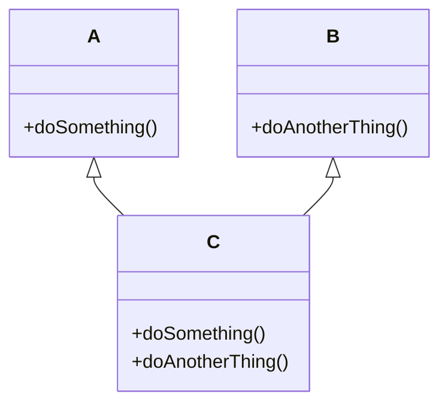
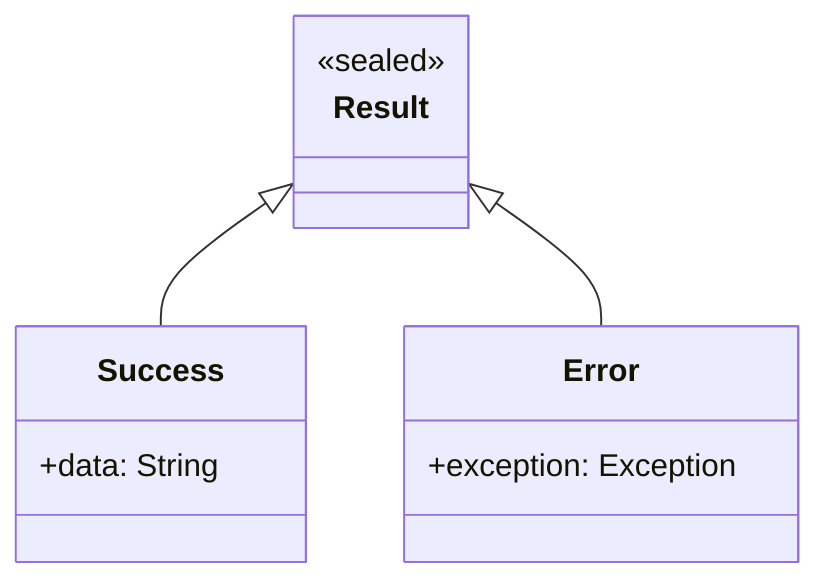
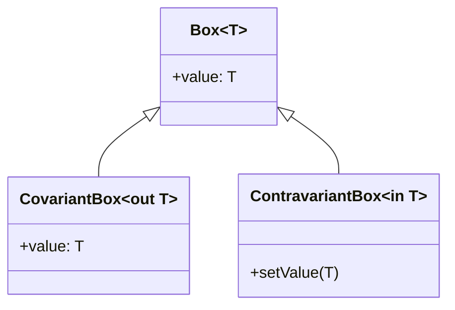
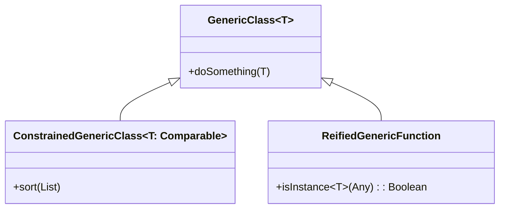

## 3.13 Advanced Type System Features

Kotlin, as a modern programming language, offers a rich type system that allows developers to write expressive, safe, and maintainable code. In this section, we delve into some of the more advanced features of Kotlin's type system, including intersection and union types, type projections, and advanced generics. These features enable developers to handle complex type scenarios and ensure type safety across various use cases.

### Intersection and Union Types

#### Understanding Intersection Types

Intersection types represent a type that simultaneously satisfies multiple type constraints. In Kotlin, intersection types are not explicitly defined but are inferred by the compiler when a variable or expression must conform to multiple types. This feature is particularly useful when working with multiple interfaces or type constraints.

**Example:**

```kotlin
interface A {
    fun doSomething()
}

interface B {
    fun doAnotherThing()
}

fun performAction(obj: A & B) {
    obj.doSomething()
    obj.doAnotherThing()
}

class C : A, B {
    override fun doSomething() {
        println("Doing something")
    }

    override fun doAnotherThing() {
        println("Doing another thing")
    }
}

fun main() {
    val c = C()
    performAction(c) // C satisfies both A and B
}
```

In this example, the function `performAction` expects an object that is both `A` and `B`. The class `C` implements both interfaces, making it a valid argument for `performAction`.

#### Visualizing Intersection Types



*Diagram: Class `C` implementing interfaces `A` and `B`.*

#### Understanding Union Types

Union types, on the other hand, represent a type that can be one of several types. Kotlin does not natively support union types, but similar behavior can be achieved using sealed classes or type hierarchies.

**Example using Sealed Classes:**

```kotlin
sealed class Result {
    data class Success(val data: String) : Result()
    data class Error(val exception: Exception) : Result()
}

fun handleResult(result: Result) {
    when (result) {
        is Result.Success -> println("Success: ${result.data}")
        is Result.Error -> println("Error: ${result.exception.message}")
    }
}

fun main() {
    val success = Result.Success("Data loaded")
    val error = Result.Error(Exception("Failed to load data"))

    handleResult(success)
    handleResult(error)
}
```

In this example, `Result` acts as a union type, where it can be either `Success` or `Error`.

#### Visualizing Union Types



*Diagram: Sealed class `Result` with subclasses `Success` and `Error`.*

### Type Projections

Type projections in Kotlin allow you to control how generics are used in function parameters and return types. They are particularly useful when dealing with variance in generics, such as covariant (`out`) and contravariant (`in`) types.

#### Covariance and Contravariance

- **Covariance (`out`)**: Allows a generic type to be a subtype of another generic type. This is useful when you want to read from a generic type.
- **Contravariance (`in`)**: Allows a generic type to be a supertype of another generic type. This is useful when you want to write to a generic type.

**Example:**

```kotlin
class Box<out T>(val value: T)

fun printBox(box: Box<Any>) {
    println(box.value)
}

fun main() {
    val stringBox: Box<String> = Box("Hello, Kotlin!")
    printBox(stringBox) // Covariance allows Box<String> to be used as Box<Any>
}
```

In this example, `Box` is covariant in `T`, allowing a `Box<String>` to be passed to a function expecting a `Box<Any>`.

#### Type Projections with `in` and `out`

Type projections can be used to specify variance at the call site, allowing for more flexible and type-safe code.

**Example:**

```kotlin
fun copy(from: Array<out Any>, to: Array<Any>) {
    for (i in from.indices) {
        to[i] = from[i]
    }
}

fun main() {
    val source: Array<Int> = arrayOf(1, 2, 3)
    val destination: Array<Any> = arrayOf(0, 0, 0)
    copy(source, destination)
    println(destination.joinToString()) // Prints: 1, 2, 3
}
```

Here, `Array<out Any>` allows `copy` to accept arrays of any type, as long as they are subtypes of `Any`.

#### Visualizing Type Projections



*Diagram: Covariant and contravariant boxes.*

### Leveraging Advanced Generics for Type-Safe Code

Generics in Kotlin are a powerful tool for creating reusable and type-safe code. By leveraging advanced features such as type constraints and reified types, you can write more expressive and flexible code.

#### Type Constraints

Type constraints allow you to restrict the types that can be used as type arguments for a generic class or function.

**Example:**

```kotlin
fun <T : Comparable<T>> sort(list: List<T>) {
    // Sorting logic here
}

fun main() {
    val numbers = listOf(3, 1, 4, 1, 5, 9)
    sort(numbers) // Works because Int is Comparable<Int>
}
```

In this example, the `sort` function is constrained to types that implement `Comparable`.

#### Reified Types

Reified types allow you to access the type arguments of a generic function at runtime. This is particularly useful for operations that require type information, such as reflection or type casting.

**Example:**

```kotlin
inline fun <reified T> isInstance(value: Any): Boolean {
    return value is T
}

fun main() {
    println(isInstance<String>("Hello")) // Prints: true
    println(isInstance<Int>("Hello")) // Prints: false
}
```

Here, `reified` allows the function `isInstance` to check the type of `value` at runtime.

#### Visualizing Advanced Generics



*Diagram: Generic classes with constraints and reified types.*

### Design Considerations

When working with advanced type system features in Kotlin, consider the following:

- **Type Safety**: Ensure that your use of generics and type projections maintains type safety and prevents runtime errors.
- **Readability**: While advanced type features can make code more flexible, they can also make it harder to read. Use them judiciously and provide comments or documentation as needed.
- **Performance**: Be aware of the performance implications of using features like reified types, which may involve additional runtime checks or operations.

### Differences and Similarities

- **Intersection vs. Union Types**: Intersection types require a type to satisfy multiple constraints, while union types allow a type to be one of several options.
- **Covariance vs. Contravariance**: Covariance allows a generic type to be a subtype, while contravariance allows it to be a supertype.
- **Type Constraints vs. Reified Types**: Type constraints restrict the types that can be used with generics, while reified types allow access to type information at runtime.

### Try It Yourself

Experiment with the code examples provided in this section. Try modifying the types and constraints to see how they affect the behavior of the code. For example, you can:

- Add additional interfaces to the intersection type example and implement them in class `C`.
- Create a new sealed class hierarchy to explore union types further.
- Modify the `copy` function to use contravariance and observe the effects.
- Implement a generic function with multiple type constraints.

### Knowledge Check

- What are intersection types, and how do they differ from union types?
- How can type projections be used to achieve covariance and contravariance?
- What are the benefits of using reified types in Kotlin?

### Embrace the Journey

Remember, mastering advanced type system features in Kotlin is a journey. As you explore these concepts, you'll gain a deeper understanding of how to write type-safe and expressive code. Keep experimenting, stay curious, and enjoy the journey!

## Quiz Time!



### What is an intersection type in Kotlin?

- [x] A type that satisfies multiple type constraints simultaneously.
- [ ] A type that can be one of several types.
- [ ] A type that is used to project types in generics.
- [ ] A type that is only used in sealed classes.

> **Explanation:** Intersection types represent a type that satisfies multiple constraints, allowing an object to conform to multiple interfaces or type requirements.

### How can union types be represented in Kotlin?

- [x] Using sealed classes to define a hierarchy of types.
- [ ] Using the `&` operator between types.
- [ ] Using type projections.
- [ ] Using reified types.

> **Explanation:** Union types can be represented using sealed classes, where a sealed class can have multiple subclasses representing different types.

### What is covariance in Kotlin generics?

- [x] Allows a generic type to be a subtype of another generic type.
- [ ] Allows a generic type to be a supertype of another generic type.
- [ ] Restricts the types that can be used as type arguments.
- [ ] Allows access to type information at runtime.

> **Explanation:** Covariance, denoted by `out`, allows a generic type to be a subtype, making it possible to read from the generic type.

### What is contravariance in Kotlin generics?

- [x] Allows a generic type to be a supertype of another generic type.
- [ ] Allows a generic type to be a subtype of another generic type.
- [ ] Restricts the types that can be used as type arguments.
- [ ] Allows access to type information at runtime.

> **Explanation:** Contravariance, denoted by `in`, allows a generic type to be a supertype, making it possible to write to the generic type.

### Which keyword is used to access type arguments at runtime in Kotlin?

- [x] `reified`
- [ ] `out`
- [ ] `in`
- [ ] `sealed`

> **Explanation:** The `reified` keyword allows access to type arguments at runtime, enabling operations like type checking and casting.

### What is the purpose of type constraints in Kotlin generics?

- [x] To restrict the types that can be used as type arguments.
- [ ] To allow access to type information at runtime.
- [ ] To enable covariance and contravariance.
- [ ] To represent union types.

> **Explanation:** Type constraints restrict the types that can be used as type arguments, ensuring that they conform to certain interfaces or classes.

### How can you achieve covariance in a Kotlin generic class?

- [x] By using the `out` keyword in the class declaration.
- [ ] By using the `in` keyword in the class declaration.
- [ ] By using sealed classes.
- [ ] By using reified types.

> **Explanation:** Covariance is achieved by using the `out` keyword, allowing the generic type to be a subtype.

### What is the role of sealed classes in representing union types?

- [x] They define a closed hierarchy of types that can be used as union types.
- [ ] They allow access to type arguments at runtime.
- [ ] They enable covariance and contravariance.
- [ ] They restrict the types that can be used as type arguments.

> **Explanation:** Sealed classes define a closed hierarchy, allowing them to represent union types where a type can be one of several options.

### What is the benefit of using reified types in Kotlin?

- [x] Allows access to type information at runtime.
- [ ] Restricts the types that can be used as type arguments.
- [ ] Enables covariance and contravariance.
- [ ] Represents intersection types.

> **Explanation:** Reified types allow access to type information at runtime, which is useful for operations like reflection and type casting.

### True or False: Intersection types in Kotlin are explicitly defined using a special syntax.

- [ ] True
- [x] False

> **Explanation:** Intersection types in Kotlin are not explicitly defined; they are inferred by the compiler when a type must satisfy multiple constraints.


