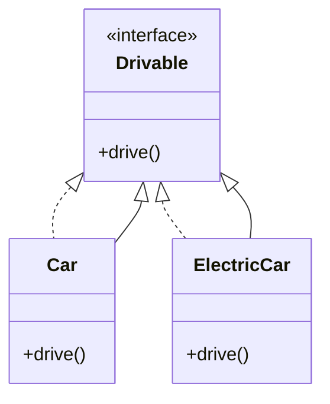

## 3.14 Best Practices for Writing Idiomatic Kotlin

Kotlin, with its expressive syntax and powerful features, allows developers to write concise and readable code. However, to truly harness the potential of Kotlin, it's crucial to adhere to idiomatic practices. This section explores best practices for writing idiomatic Kotlin code, focusing on adopting Kotlin coding conventions, avoiding common pitfalls, and ensuring code is clean and maintainable.

### Adopting Kotlin Coding Conventions

Kotlin's conventions are designed to enhance readability and consistency across codebases. By adhering to these conventions, developers can ensure their code is not only functional but also easy to understand and maintain.

#### Naming Conventions

- **Classes and Objects**: Use PascalCase for class and object names. For example, `class UserProfile`.
- **Functions and Properties**: Use camelCase for function and property names. For example, `fun calculateTotal()`.
- **Constants**: Use uppercase letters with underscores for constants. For example, `const val MAX_USERS`.

#### Formatting

- **Indentation**: Use four spaces for indentation. Avoid tabs to maintain consistency across different environments.
- **Line Length**: Aim to keep lines under 100 characters. This improves readability, especially on smaller screens.
- **Braces**: Place opening braces on the same line as the declaration. For example:
  ```kotlin
  fun greet() {
      println("Hello, World!")
  }
  ```

#### Code Structure

- **Package Naming**: Use lowercase letters and separate words with dots. For example, `com.example.myapp`.
- **File Organization**: Group related classes and functions within the same file to improve discoverability.

### Common Pitfalls and How to Avoid Them

Even experienced developers can fall into certain traps when working with Kotlin. Here are some common pitfalls and strategies to avoid them.

#### Ignoring Null Safety

Kotlin's null safety is one of its most powerful features. However, misusing nullable types can lead to unexpected null pointer exceptions.

- **Avoid Overusing `!!`**: The `!!` operator should be used sparingly. Instead, use safe calls (`?.`) and the Elvis operator (`?:`) to handle nullability gracefully.
  ```kotlin
  val length = name?.length ?: 0
  ```

- **Leverage `let` and `also`**: Use these functions to safely operate on nullable types.
  ```kotlin
  name?.let {
      println("Name length: ${it.length}")
  }
  ```

#### Overusing Inheritance

Inheritance can lead to tightly coupled code and make maintenance difficult. Favor composition over inheritance to promote flexibility and reusability.

- **Use Interfaces and Delegation**: Instead of extending classes, implement interfaces and use delegation to share behavior.
  ```kotlin
  interface Drivable {
      fun drive()
  }

  class Car : Drivable {
      override fun drive() {
          println("Driving a car")
      }
  }
  ```

#### Misusing `var` Instead of `val`

Kotlin encourages immutability by default. Use `val` instead of `var` whenever possible to prevent unintended side effects.

- **Prefer `val` for Local Variables**: This ensures that variables are not reassigned, leading to more predictable code.
  ```kotlin
  val name = "Kotlin"
  ```

- **Use `var` Only When Necessary**: Reserve `var` for cases where mutability is required.

### Writing Clean, Maintainable Kotlin Code

Clean code is not just about aesthetics; it's about writing code that is easy to understand, modify, and extend. Here are some practices to achieve this in Kotlin.

#### Use Data Classes for Simple Data Structures

Data classes in Kotlin provide a concise way to create classes that primarily hold data. They automatically generate useful methods like `equals()`, `hashCode()`, and `toString()`.

- **Define Data Classes for Immutable Data**: Use data classes to represent immutable data structures.
  ```kotlin
  data class User(val name: String, val age: Int)
  ```

#### Leverage Extension Functions

Extension functions allow you to add functionality to existing classes without modifying their source code. This promotes cleaner and more modular code.

- **Create Utility Functions as Extensions**: Use extension functions to encapsulate common operations.
  ```kotlin
  fun String.isEmailValid(): Boolean {
      return this.contains("@")
  }
  ```

#### Embrace Functional Programming Concepts

Kotlin supports functional programming paradigms, which can lead to more expressive and concise code.

- **Use Higher-Order Functions**: Pass functions as parameters to create flexible and reusable code.
  ```kotlin
  fun performOperation(x: Int, operation: (Int) -> Int): Int {
      return operation(x)
  }
  ```

- **Utilize Lambdas and Collections**: Use lambdas to work with collections in a functional style.
  ```kotlin
  val numbers = listOf(1, 2, 3, 4)
  val doubled = numbers.map { it * 2 }
  ```

#### Apply Consistent Error Handling

Consistent error handling ensures that your application behaves predictably in the face of errors.

- **Use `try-catch` Blocks Wisely**: Handle exceptions at appropriate levels and provide meaningful messages.
  ```kotlin
  try {
      val result = riskyOperation()
  } catch (e: Exception) {
      println("Operation failed: ${e.message}")
  }
  ```

- **Leverage `Result` Type for Functional Error Handling**: Use the `Result` type to represent success or failure in a functional style.
  ```kotlin
  fun divide(a: Int, b: Int): Result<Int> {
      return if (b != 0) {
          Result.success(a / b)
      } else {
          Result.failure(IllegalArgumentException("Division by zero"))
      }
  }
  ```

### Try It Yourself

To reinforce these concepts, try modifying the following code examples:

1. **Null Safety**: Modify a function to handle nullable types using safe calls and the Elvis operator.
2. **Inheritance vs. Composition**: Refactor a class hierarchy to use interfaces and delegation instead of inheritance.
3. **Data Classes**: Create a data class for a simple data structure and use it in a collection operation.
4. **Extension Functions**: Write an extension function for a standard library class and use it in a small program.

### Visualizing Kotlin's Features

To better understand how Kotlin's features work together, consider the following diagram that illustrates the relationships between classes, interfaces, and extension functions.



**Diagram Description**: This diagram shows a simple class hierarchy where `Car` and `ElectricCar` implement the `Drivable` interface. This demonstrates the use of interfaces to promote composition over inheritance.

### References and Links

- [Kotlin Coding Conventions](https://kotlinlang.org/docs/coding-conventions.html)
- [Effective Kotlin: Best Practices](https://www.amazon.com/Effective-Kotlin-Best-practices-Professional/dp/8395452822)
- [Kotlin Documentation](https://kotlinlang.org/docs/home.html)

### Knowledge Check

To test your understanding of idiomatic Kotlin practices, consider the following questions:

1. What is the preferred naming convention for Kotlin classes?
2. How can you avoid null pointer exceptions in Kotlin?
3. Why should you favor `val` over `var`?
4. What is the advantage of using data classes in Kotlin?
5. How do extension functions enhance code modularity?

### Embrace the Journey

Remember, mastering idiomatic Kotlin is a journey. As you continue to explore and apply these best practices, you'll find your code becoming more expressive, maintainable, and enjoyable to work with. Keep experimenting, stay curious, and enjoy the journey!

### Quiz Time!



### What is the preferred naming convention for Kotlin classes?

- [x] PascalCase
- [ ] camelCase
- [ ] snake_case
- [ ] kebab-case

> **Explanation:** Kotlin classes should be named using PascalCase, where each word is capitalized.

### How can you avoid null pointer exceptions in Kotlin?

- [x] Use safe calls and the Elvis operator
- [ ] Use the `!!` operator frequently
- [ ] Avoid using nullable types
- [ ] Use `var` instead of `val`

> **Explanation:** Safe calls (`?.`) and the Elvis operator (`?:`) help handle nullable types gracefully, avoiding null pointer exceptions.

### Why should you favor `val` over `var`?

- [x] To ensure immutability and predictability
- [ ] To allow variable reassignment
- [ ] To increase code complexity
- [ ] To avoid using constants

> **Explanation:** Using `val` ensures that variables are immutable, leading to more predictable and safer code.

### What is the advantage of using data classes in Kotlin?

- [x] They automatically generate useful methods like `equals()`, `hashCode()`, and `toString()`.
- [ ] They allow for mutable data structures.
- [ ] They replace the need for interfaces.
- [ ] They increase code verbosity.

> **Explanation:** Data classes in Kotlin provide a concise way to create classes that primarily hold data, with automatically generated methods.

### How do extension functions enhance code modularity?

- [x] By adding functionality to existing classes without modifying their source code
- [ ] By increasing the number of classes
- [ ] By replacing inheritance
- [ ] By making code less readable

> **Explanation:** Extension functions allow you to add functionality to existing classes, promoting cleaner and more modular code.

### What is a common pitfall when handling nullability in Kotlin?

- [x] Overusing the `!!` operator
- [ ] Using safe calls
- [ ] Utilizing the Elvis operator
- [ ] Leveraging `let` and `also`

> **Explanation:** Overusing the `!!` operator can lead to unexpected null pointer exceptions, defeating Kotlin's null safety.

### How can you promote flexibility and reusability in Kotlin?

- [x] Favor composition over inheritance
- [ ] Use inheritance extensively
- [ ] Avoid using interfaces
- [ ] Rely on mutable state

> **Explanation:** Favoring composition over inheritance promotes flexibility and reusability in code design.

### What is the purpose of using higher-order functions in Kotlin?

- [x] To pass functions as parameters for flexible and reusable code
- [ ] To increase code complexity
- [ ] To avoid using lambdas
- [ ] To replace data classes

> **Explanation:** Higher-order functions allow you to pass functions as parameters, creating flexible and reusable code.

### Why is consistent error handling important in Kotlin?

- [x] It ensures predictable application behavior in the face of errors
- [ ] It increases code verbosity
- [ ] It replaces the need for exception handling
- [ ] It complicates debugging

> **Explanation:** Consistent error handling ensures that your application behaves predictably, even when errors occur.

### True or False: Kotlin encourages the use of mutable variables by default.

- [ ] True
- [x] False

> **Explanation:** Kotlin encourages immutability by default, promoting the use of `val` over `var` for variables.


