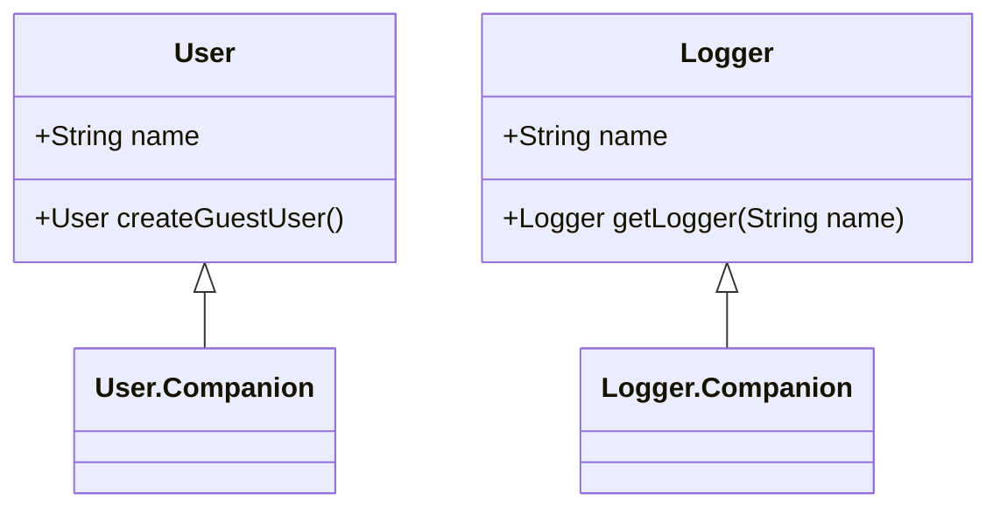

## 3.2 Companion Objects and Object Declarations

In Kotlin, companion objects and object declarations are powerful features that enable developers to create singletons and utility methods with ease. These constructs not only simplify code but also enhance its readability and maintainability. In this section, we will delve into the intricacies of companion objects and object declarations, explore their use cases, and provide best practices for leveraging these features effectively.

### Understanding Object Declarations

Object declarations in Kotlin provide a straightforward way to create singletons. A singleton is a design pattern that restricts the instantiation of a class to a single instance. This pattern is particularly useful when you need to coordinate actions across a system or manage shared resources.

#### Creating a Singleton with Object Declarations

To declare a singleton in Kotlin, you use the `object` keyword. This creates a class that has only one instance, which is created lazily and is thread-safe by default.

```kotlin
object DatabaseConnection {
    init {
        println("Initializing Database Connection")
    }

    fun connect() {
        println("Connecting to the database")
    }
}

fun main() {
    DatabaseConnection.connect()
    DatabaseConnection.connect()
}
```

In the example above, `DatabaseConnection` is a singleton object. The `init` block is executed only once, ensuring that the connection is initialized a single time. The `connect` method can be called multiple times, but the initialization occurs only once.

#### Advantages of Using Object Declarations

- **Simplicity**: Object declarations provide a simple syntax for creating singletons without the need for additional boilerplate code.
- **Thread Safety**: The instance is created in a thread-safe manner, ensuring that concurrent access does not lead to race conditions.
- **Lazy Initialization**: The instance is created only when it is first accessed, which can improve performance by delaying initialization until it is necessary.

### Companion Objects: Bridging the Gap Between Static and Instance Members

Companion objects in Kotlin serve as a bridge between static and instance members. While Kotlin does not have static members like Java, companion objects allow you to define members that belong to the class itself rather than to any particular instance.

#### Defining a Companion Object

A companion object is declared within a class using the `companion object` keyword. It can hold methods and properties that are associated with the class rather than with instances of the class.

```kotlin
class User(val name: String) {
    companion object {
        fun createGuestUser(): User {
            return User("Guest")
        }
    }
}

fun main() {
    val guest = User.createGuestUser()
    println(guest.name)
}
```

In this example, the `createGuestUser` method is defined within the companion object of the `User` class. It can be called without creating an instance of `User`, similar to a static method in Java.

#### Using Companion Objects for Factory Methods

Companion objects are often used to implement factory methods, which are methods that create instances of a class. This pattern is useful when you need to control the instantiation process or when you want to provide multiple ways to create an instance.

```kotlin
class Logger private constructor(val name: String) {
    companion object {
        fun getLogger(name: String): Logger {
            return Logger(name)
        }
    }
}

fun main() {
    val logger = Logger.getLogger("MainLogger")
    println(logger.name)
}
```

Here, the `Logger` class has a private constructor, and the `getLogger` method in the companion object serves as a factory method for creating instances of `Logger`.

### Best Practices for Using Companion Objects and Object Declarations

#### Keep Companion Objects Minimal

While companion objects are useful, it's important to keep them minimal and focused. Avoid placing too much logic inside a companion object, as this can lead to code that is difficult to test and maintain.

#### Use Object Declarations for Stateless Utility Classes

When you need a utility class that does not maintain state, consider using an object declaration. This approach is cleaner and more idiomatic in Kotlin compared to creating a class with a private constructor and a static instance.

```kotlin
object MathUtils {
    fun square(x: Int): Int {
        return x * x
    }
}

fun main() {
    println(MathUtils.square(4))
}
```

#### Avoid Overusing Companion Objects

While companion objects can be convenient, overusing them can lead to tightly coupled code. Consider whether a companion object is truly necessary, or if a regular class or interface might be a better choice.

### Visualizing Companion Objects and Object Declarations

To better understand how companion objects and object declarations fit into the Kotlin language, let's visualize their relationships using a class diagram.



In the diagram above, `User` and `Logger` are classes with companion objects. The companion objects contain static-like methods that can be called without creating an instance of the class.

### Differences and Similarities with Other Patterns

#### Singleton Pattern

The singleton pattern is a common design pattern used to ensure that a class has only one instance. In Kotlin, object declarations provide a concise and idiomatic way to implement singletons without the need for additional boilerplate code.

#### Factory Pattern

The factory pattern is used to create objects without specifying the exact class of object that will be created. Companion objects are often used to implement factory methods, providing a clean and idiomatic way to create instances in Kotlin.

### Try It Yourself: Experimenting with Companion Objects and Object Declarations

To gain a deeper understanding of companion objects and object declarations, try modifying the examples provided in this section. Here are a few suggestions:

- **Create a Singleton Logger**: Modify the `Logger` class to include a singleton instance that can be accessed without calling the `getLogger` method.
- **Add Utility Methods**: Add additional utility methods to the `MathUtils` object, such as `cube` or `factorial`, and test them in the `main` function.
- **Implement a Factory Method**: Create a new class with a private constructor and implement a factory method in the companion object to control the instantiation process.

### Conclusion

Companion objects and object declarations are powerful features in Kotlin that enable developers to create singletons and utility methods with ease. By understanding how to use these constructs effectively, you can write cleaner, more maintainable code. Remember to keep companion objects minimal, use object declarations for stateless utility classes, and avoid overusing these features to maintain a clean and idiomatic codebase.

## Quiz Time!



### What is the primary purpose of a companion object in Kotlin?

- [x] To define members that belong to the class itself rather than to any particular instance.
- [ ] To create multiple instances of a class.
- [ ] To manage state within an instance of a class.
- [ ] To replace the need for constructors.

> **Explanation:** Companion objects in Kotlin allow you to define methods and properties that belong to the class itself, similar to static members in Java.

### How is a singleton created in Kotlin using object declarations?

- [x] By using the `object` keyword to declare a class with only one instance.
- [ ] By using the `class` keyword with a private constructor.
- [ ] By using the `companion object` keyword within a class.
- [ ] By using the `interface` keyword.

> **Explanation:** In Kotlin, the `object` keyword is used to declare a singleton, which ensures that only one instance of the class is created.

### Which of the following is a benefit of using object declarations in Kotlin?

- [x] Thread safety by default.
- [ ] Ability to create multiple instances.
- [ ] Increased complexity in code.
- [ ] Requires additional boilerplate code.

> **Explanation:** Object declarations in Kotlin provide thread safety by default, ensuring that the singleton instance is created in a thread-safe manner.

### What is a common use case for companion objects in Kotlin?

- [x] Implementing factory methods.
- [ ] Managing instance-specific state.
- [ ] Creating multiple instances of a class.
- [ ] Replacing the need for constructors.

> **Explanation:** Companion objects are commonly used to implement factory methods, which provide a way to create instances of a class.

### How can you access a method within a companion object?

- [x] By calling the method directly on the class name.
- [ ] By creating an instance of the class.
- [ ] By using the `new` keyword.
- [ ] By using the `this` keyword.

> **Explanation:** Methods within a companion object can be accessed directly using the class name, similar to static methods in Java.

### What is a best practice when using companion objects?

- [x] Keep them minimal and focused.
- [ ] Place all logic inside the companion object.
- [ ] Use them to manage instance-specific state.
- [ ] Avoid using them for factory methods.

> **Explanation:** It's best to keep companion objects minimal and focused to maintain clean and maintainable code.

### What is the difference between an object declaration and a companion object?

- [x] An object declaration creates a singleton, while a companion object is associated with a class.
- [ ] An object declaration is used for instance-specific methods, while a companion object is for static methods.
- [ ] An object declaration requires a constructor, while a companion object does not.
- [ ] An object declaration is used for factory methods, while a companion object is not.

> **Explanation:** An object declaration creates a singleton, whereas a companion object is a special object associated with a class for defining static-like methods.

### Which keyword is used to declare a companion object in Kotlin?

- [x] `companion object`
- [ ] `static object`
- [ ] `singleton object`
- [ ] `class object`

> **Explanation:** The `companion object` keyword is used to declare a companion object within a class in Kotlin.

### Can a companion object implement an interface in Kotlin?

- [x] True
- [ ] False

> **Explanation:** A companion object can implement an interface, allowing it to provide implementations for the interface's methods.

### What is the advantage of using object declarations for utility classes?

- [x] They provide a cleaner and more idiomatic approach for stateless utility classes.
- [ ] They allow for managing instance-specific state.
- [ ] They require additional boilerplate code.
- [ ] They increase the complexity of the code.

> **Explanation:** Object declarations provide a cleaner and more idiomatic approach for creating stateless utility classes in Kotlin.


