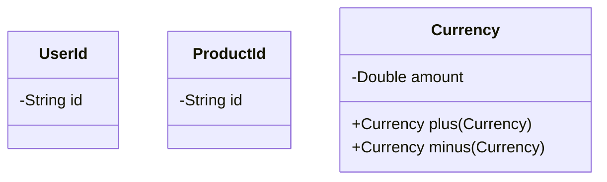

## 3.3 Inline Classes (Value Classes)

In this section, we delve into Kotlin's inline classes, also known as value classes, a powerful feature that allows developers to reduce object overhead and create type-safe wrappers. By understanding and effectively utilizing inline classes, you can enhance the performance and maintainability of your Kotlin applications.

### Introduction to Inline Classes

Inline classes in Kotlin are a feature that allows you to create a type that wraps a single value, providing a way to define a new type without the overhead of an additional object. This is particularly useful for creating type-safe wrappers around primitive types or other objects, ensuring that your code is both efficient and expressive.

#### Key Concepts

- **Object Overhead**: In traditional object-oriented programming, creating a new object involves memory allocation and garbage collection overhead. Inline classes help mitigate this by avoiding the creation of an additional object at runtime.
- **Type Safety**: Inline classes allow you to define distinct types for different concepts, even if they are represented by the same underlying type, enhancing type safety and reducing the risk of errors.

### Benefits of Using Inline Classes

1. **Performance Optimization**: Inline classes reduce the memory footprint by avoiding unnecessary object creation. This can lead to significant performance improvements, especially in performance-critical applications.
2. **Type Safety**: By wrapping a primitive type or another object, inline classes provide a way to create distinct types, reducing the risk of mixing up values that should be treated differently.
3. **Code Clarity**: Inline classes can make your code more readable and maintainable by providing meaningful names for wrapped values.

### Creating Inline Classes

To define an inline class in Kotlin, use the `value` keyword followed by the class name and a single property. Here's a basic example:

```kotlin
@JvmInline
value class UserId(val id: String)
```

In this example, `UserId` is an inline class that wraps a `String`. The `@JvmInline` annotation is used to indicate that this is an inline class.

#### Code Example: Inline Class for Type Safety

Let's consider a scenario where you need to handle user IDs and product IDs separately, even though both are represented as strings. Using inline classes, you can ensure type safety:

```kotlin
@JvmInline
value class UserId(val id: String)

@JvmInline
value class ProductId(val id: String)

fun processUser(userId: UserId) {
    println("Processing user with ID: ${userId.id}")
}

fun processProduct(productId: ProductId) {
    println("Processing product with ID: ${productId.id}")
}

fun main() {
    val userId = UserId("user123")
    val productId = ProductId("product456")

    processUser(userId)
    processProduct(productId)

    // The following would cause a compile-time error
    // processUser(productId)
}
```

### Reducing Object Overhead

Inline classes help reduce object overhead by eliminating the need for an additional wrapper object at runtime. The Kotlin compiler optimizes inline classes by substituting the wrapped value directly where possible.

#### Performance Considerations

- **Inlining**: When an inline class is used, the compiler attempts to inline the wrapped value, avoiding the creation of an additional object. This can lead to performance gains, especially in tight loops or frequently called functions.
- **Boxing and Unboxing**: In some cases, such as when using inline classes with generics or reflection, the compiler may need to box the value. Be mindful of these scenarios to avoid potential performance pitfalls.

### Creating Type-Safe Wrappers

Inline classes are ideal for creating type-safe wrappers around primitive types or other objects. This is particularly useful when you want to enforce domain-specific constraints or provide additional functionality.

#### Code Example: Type-Safe Wrapper for Currency

Consider a scenario where you need to handle monetary values safely. You can use an inline class to create a type-safe wrapper for currency:

```kotlin
@JvmInline
value class Currency(val amount: Double) {
    init {
        require(amount >= 0) { "Amount must be non-negative" }
    }

    operator fun plus(other: Currency): Currency {
        return Currency(this.amount + other.amount)
    }

    operator fun minus(other: Currency): Currency {
        require(this.amount >= other.amount) { "Insufficient funds" }
        return Currency(this.amount - other.amount)
    }
}

fun main() {
    val balance = Currency(100.0)
    val withdrawal = Currency(30.0)

    val newBalance = balance - withdrawal
    println("New balance: ${newBalance.amount}")

    // The following would cause an exception
    // val negativeBalance = balance - Currency(150.0)
}
```

### Design Considerations

When using inline classes, consider the following:

- **Single Property**: Inline classes can only have one property. If you need to wrap multiple values, consider using a data class instead.
- **Immutability**: Inline classes are inherently immutable, which aligns well with functional programming principles and helps prevent unintended side effects.
- **Interoperability**: Inline classes are fully interoperable with Java, but be aware of potential boxing when using them in Java code.

### Differences and Similarities with Other Patterns

Inline classes are similar to data classes in that they provide a concise way to define a type. However, inline classes are optimized for performance and type safety, whereas data classes are designed for representing complex data structures with multiple properties.

#### Comparison with Data Classes

- **Inline Classes**: Focus on reducing overhead and providing type safety for a single value.
- **Data Classes**: Designed for representing structured data with multiple properties and provide features like `copy()` and `equals()`.

### Visualizing Inline Classes

To better understand how inline classes work, let's visualize the concept using a diagram.



*Diagram: Inline Classes for UserId, ProductId, and Currency*

### Try It Yourself

Experiment with inline classes by modifying the code examples provided. Try creating inline classes for different scenarios, such as wrapping integers or booleans, and observe how they enhance type safety and performance.

### References and Links

- [Kotlin Inline Classes Documentation](https://kotlinlang.org/docs/inline-classes.html)
- [Kotlin Language Reference](https://kotlinlang.org/docs/reference/)
- [Effective Kotlin: Best Practices](https://effectivekotlin.com/)

### Knowledge Check

- What are the benefits of using inline classes in Kotlin?
- How do inline classes help reduce object overhead?
- What are some scenarios where inline classes are particularly useful?

### Embrace the Journey

Remember, mastering inline classes is just one step in your Kotlin journey. As you continue to explore Kotlin's features, you'll discover new ways to write efficient, expressive, and maintainable code. Keep experimenting, stay curious, and enjoy the journey!

### Quiz Time!



### What is the primary purpose of inline classes in Kotlin?

- [x] To reduce object overhead and provide type-safe wrappers
- [ ] To replace all data classes
- [ ] To create complex data structures
- [ ] To handle exceptions more efficiently

> **Explanation:** Inline classes are designed to reduce object overhead by avoiding unnecessary object creation and to provide type-safe wrappers around primitive types or other objects.

### How many properties can an inline class have?

- [x] One
- [ ] Two
- [ ] Three
- [ ] Unlimited

> **Explanation:** Inline classes can only have one property, which is the value they wrap.

### What annotation is used to define an inline class in Kotlin?

- [x] @JvmInline
- [ ] @Inline
- [ ] @Value
- [ ] @Data

> **Explanation:** The `@JvmInline` annotation is used to define an inline class in Kotlin.

### Which of the following is a benefit of using inline classes?

- [x] Performance optimization
- [x] Type safety
- [ ] Increased code complexity
- [ ] Reduced readability

> **Explanation:** Inline classes optimize performance by reducing object overhead and enhance type safety by providing distinct types for wrapped values.

### Can inline classes be used with generics in Kotlin?

- [x] Yes, but with potential boxing
- [ ] No, they cannot be used with generics
- [ ] Yes, without any limitations
- [ ] Only with primitive types

> **Explanation:** Inline classes can be used with generics, but there may be potential boxing, which can affect performance.

### What is a key difference between inline classes and data classes?

- [x] Inline classes wrap a single value, while data classes can have multiple properties
- [ ] Inline classes are more complex than data classes
- [ ] Data classes are always faster than inline classes
- [ ] Inline classes are used for collections

> **Explanation:** Inline classes are designed to wrap a single value, whereas data classes can have multiple properties and are used for representing structured data.

### Which of the following is a valid use case for inline classes?

- [x] Creating type-safe wrappers for primitive types
- [ ] Replacing all classes in a project
- [ ] Handling exceptions
- [ ] Managing collections

> **Explanation:** Inline classes are ideal for creating type-safe wrappers around primitive types or other objects.

### How do inline classes contribute to code clarity?

- [x] By providing meaningful names for wrapped values
- [ ] By increasing the number of lines of code
- [ ] By making code more complex
- [ ] By removing all comments

> **Explanation:** Inline classes enhance code clarity by providing meaningful names for wrapped values, making the code more readable and maintainable.

### What is a potential drawback of using inline classes with reflection?

- [x] Potential boxing of values
- [ ] Increased memory usage
- [ ] Reduced type safety
- [ ] Incompatibility with Java

> **Explanation:** When using inline classes with reflection, there may be potential boxing of values, which can affect performance.

### True or False: Inline classes are fully interoperable with Java.

- [x] True
- [ ] False

> **Explanation:** Inline classes are fully interoperable with Java, but developers should be aware of potential boxing when using them in Java code.




