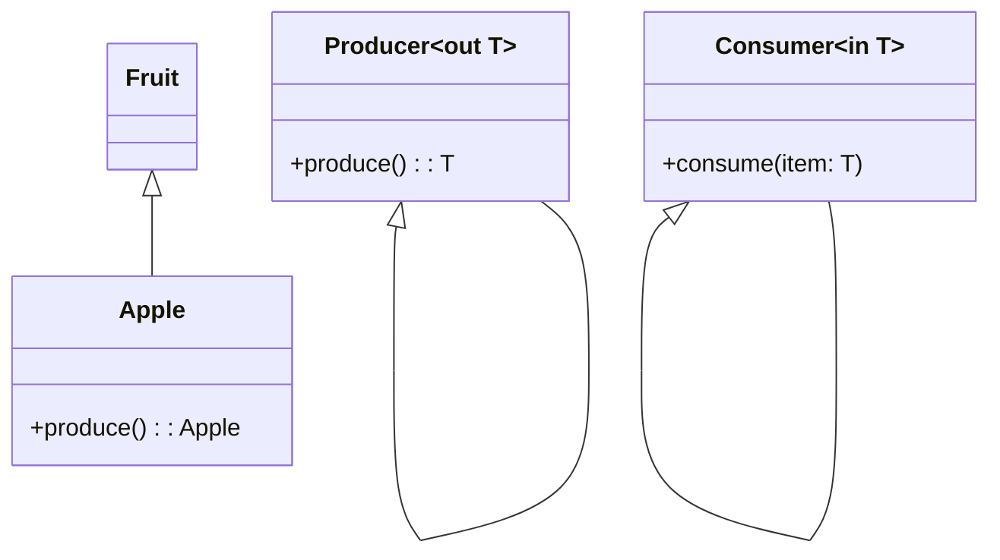

## 3.4 Variance and Generics

In the realm of Kotlin programming, understanding variance and generics is crucial for crafting flexible and reusable code. This section delves into the concepts of covariance, contravariance, and best practices for using generics in Kotlin. By the end of this guide, you'll have a comprehensive understanding of how to leverage these features to enhance your software design and architecture.

### Introduction to Generics

Generics allow you to write flexible and reusable code by parameterizing types. In Kotlin, generics are used to define classes, interfaces, and functions that can operate on any type while maintaining type safety. This means you can write a single method or class that works with different types of data, reducing code duplication and increasing code reusability.

#### Why Use Generics?

- **Type Safety**: Generics ensure that you catch type errors at compile time, reducing runtime exceptions.
- **Code Reusability**: Write a single piece of code that works with different data types.
- **Flexibility**: Easily adapt your code to work with new types without rewriting existing logic.

### Basic Syntax of Generics

Let's start with a simple example of a generic class in Kotlin:

```kotlin
class Box<T>(var content: T)

fun main() {
    val intBox = Box(1)
    val stringBox = Box("Hello")
    println(intBox.content)  // Outputs: 1
    println(stringBox.content)  // Outputs: Hello
}
```

In this example, `Box` is a generic class with a type parameter `T`. This allows `Box` to hold any type of content, whether it's an `Int`, `String`, or any other type.

### Variance in Kotlin

Variance is a concept that describes how subtyping between more complex types relates to subtyping between their components. Kotlin provides three variance annotations to handle this: `in`, `out`, and `invariant`.

#### Covariance (`out`)

Covariance allows a type to be a subtype of another type. In Kotlin, covariance is declared using the `out` keyword. This means you can pass a subtype where a supertype is expected.

**Example of Covariance:**

```kotlin
interface Producer<out T> {
    fun produce(): T
}

class Fruit
class Apple : Fruit()

fun main() {
    val appleProducer: Producer<Apple> = object : Producer<Apple> {
        override fun produce(): Apple = Apple()
    }
    val fruitProducer: Producer<Fruit> = appleProducer
    println(fruitProducer.produce())  // Outputs: Apple instance
}
```

In this example, `Producer<Apple>` is a subtype of `Producer<Fruit>` because `Apple` is a subtype of `Fruit`. The `out` keyword allows this relationship.

#### Contravariance (`in`)

Contravariance allows a type to be a supertype of another type. In Kotlin, contravariance is declared using the `in` keyword. This means you can pass a supertype where a subtype is expected.

**Example of Contravariance:**

```kotlin
interface Consumer<in T> {
    fun consume(item: T)
}

fun main() {
    val fruitConsumer: Consumer<Fruit> = object : Consumer<Fruit> {
        override fun consume(item: Fruit) {
            println("Consuming fruit")
        }
    }
    val appleConsumer: Consumer<Apple> = fruitConsumer
    appleConsumer.consume(Apple())  // Outputs: Consuming fruit
}
```

In this example, `Consumer<Fruit>` is a supertype of `Consumer<Apple>` because `Fruit` is a supertype of `Apple`. The `in` keyword allows this relationship.

#### Invariance

Invariance means that a type cannot be substituted with its subtypes or supertypes. In Kotlin, if you don't specify `in` or `out`, the type is invariant.

**Example of Invariance:**

```kotlin
class Box<T>(var content: T)

fun main() {
    val intBox: Box<Int> = Box(1)
    // val numberBox: Box<Number> = intBox  // Error: Type mismatch
}
```

In this example, `Box<Int>` is not a subtype of `Box<Number>`, even though `Int` is a subtype of `Number`. This is because `Box` is invariant in its type parameter `T`.

### Best Practices with Kotlin Generics

1. **Use Variance Annotations Wisely**: Apply `out` for producers and `in` for consumers to ensure type safety and flexibility.
2. **Avoid Overusing Generics**: While generics are powerful, overusing them can lead to complex and hard-to-read code. Use them where they provide clear benefits.
3. **Leverage Type Inference**: Kotlin's type inference can often deduce the type parameters for you, making your code cleaner and more concise.
4. **Consider Type Erasure**: Remember that Kotlin, like Java, uses type erasure for generics, meaning type information is not available at runtime. Plan your design accordingly.
5. **Use `reified` for Inline Functions**: When you need to access type information at runtime, use `reified` type parameters with inline functions.

### Advanced Concepts in Generics

#### Reified Type Parameters

In Kotlin, generics are erased at runtime, meaning the type information is not available. However, you can use `reified` type parameters with inline functions to retain type information.

**Example of Reified Type Parameters:**

```kotlin
inline fun <reified T> isInstance(value: Any): Boolean {
    return value is T
}

fun main() {
    println(isInstance<String>("Hello"))  // Outputs: true
    println(isInstance<Int>("Hello"))  // Outputs: false
}
```

In this example, the `isInstance` function checks if a value is an instance of a specific type. The `reified` keyword allows us to use the type parameter `T` at runtime.

#### Type Projections

Type projections allow you to use variance annotations on type parameters when calling functions or using classes.

**Example of Type Projections:**

```kotlin
fun copy(from: Array<out Any>, to: Array<Any>) {
    for (i in from.indices) {
        to[i] = from[i]
    }
}

fun main() {
    val ints: Array<Int> = arrayOf(1, 2, 3)
    val anys: Array<Any> = arrayOf(1, "Hello", 3.0)
    copy(ints, anys)
    println(anys.joinToString())  // Outputs: 1, 2, 3
}
```

In this example, `Array<out Any>` is a type projection that allows us to pass an `Array<Int>` to the `copy` function.

### Visualizing Variance and Generics

To better understand variance and generics, let's visualize these concepts using Mermaid.js diagrams.

#### Covariance and Contravariance Diagram



**Diagram Description**: This diagram illustrates the relationship between `Fruit`, `Apple`, `Producer`, and `Consumer` classes. `Apple` is a subtype of `Fruit`, and `Producer<Apple>` is a subtype of `Producer<Fruit>` due to covariance. Conversely, `Consumer<Fruit>` is a supertype of `Consumer<Apple>` due to contravariance.

### Practical Applications of Variance and Generics

#### Designing Flexible APIs

Generics and variance are essential for designing flexible APIs that can handle various data types without sacrificing type safety. Consider a function that processes a list of items:

```kotlin
fun <T> processItems(items: List<T>, processor: (T) -> Unit) {
    for (item in items) {
        processor(item)
    }
}

fun main() {
    val strings = listOf("Kotlin", "Java", "Scala")
    processItems(strings) { println(it) }  // Outputs: Kotlin, Java, Scala
}
```

In this example, `processItems` is a generic function that can process a list of any type, making it highly reusable.

#### Implementing Design Patterns

Generics and variance play a crucial role in implementing design patterns such as the Factory Pattern, Observer Pattern, and more. They allow you to create flexible and type-safe implementations that can adapt to different types.

**Example of Factory Pattern with Generics:**

```kotlin
interface Factory<T> {
    fun create(): T
}

class StringFactory : Factory<String> {
    override fun create(): String = "New String"
}

fun main() {
    val stringFactory: Factory<String> = StringFactory()
    println(stringFactory.create())  // Outputs: New String
}
```

In this example, the `Factory` interface is generic, allowing you to create factories for different types.

### Common Pitfalls and How to Avoid Them

1. **Ignoring Variance Annotations**: Failing to use `in` and `out` can lead to type safety issues. Always consider the direction of data flow when designing your APIs.
2. **Overcomplicating with Generics**: While generics are powerful, overusing them can make your code difficult to read and maintain. Use them judiciously.
3. **Misunderstanding Type Erasure**: Remember that type information is erased at runtime. Use `reified` type parameters when you need type information at runtime.
4. **Neglecting Type Projections**: Type projections can help you work around variance issues. Use them to ensure type safety when dealing with complex types.

### Try It Yourself

Experiment with the code examples provided in this guide. Try modifying the `Box` class to add a method that only works with certain types, or create your own generic class with variance annotations. This hands-on practice will reinforce your understanding of variance and generics in Kotlin.

### Conclusion

Understanding variance and generics in Kotlin is essential for writing flexible, reusable, and type-safe code. By mastering these concepts, you'll be better equipped to design robust software architectures and implement advanced design patterns. Remember, this is just the beginning. As you progress, you'll discover even more powerful ways to leverage Kotlin's type system. Keep experimenting, stay curious, and enjoy the journey!

## Quiz Time!



### What is the main purpose of using generics in Kotlin?

- [x] To write flexible and reusable code
- [ ] To increase runtime performance
- [ ] To simplify syntax
- [ ] To avoid using classes

> **Explanation:** Generics allow you to write flexible and reusable code by parameterizing types, ensuring type safety and reducing code duplication.

### Which keyword is used to declare covariance in Kotlin?

- [ ] in
- [x] out
- [ ] var
- [ ] val

> **Explanation:** The `out` keyword is used to declare covariance in Kotlin, allowing a type to be a subtype of another type.

### What does contravariance allow in Kotlin?

- [ ] A subtype to be a supertype
- [x] A supertype to be a subtype
- [ ] Types to be interchangeable
- [ ] Types to be invariant

> **Explanation:** Contravariance allows a type to be a supertype of another type, declared using the `in` keyword in Kotlin.

### What is the result of using `reified` type parameters in Kotlin?

- [x] Retaining type information at runtime
- [ ] Improving compile-time performance
- [ ] Simplifying syntax
- [ ] Allowing type erasure

> **Explanation:** `Reified` type parameters allow you to retain type information at runtime, which is otherwise erased in Kotlin generics.

### Which of the following is NOT a variance annotation in Kotlin?

- [ ] in
- [ ] out
- [x] var
- [ ] invariant

> **Explanation:** `var` is not a variance annotation in Kotlin. The variance annotations are `in`, `out`, and `invariant`.

### What is the role of type projections in Kotlin?

- [x] To ensure type safety with complex types
- [ ] To improve runtime performance
- [ ] To simplify syntax
- [ ] To allow type erasure

> **Explanation:** Type projections help ensure type safety when dealing with complex types, allowing you to use variance annotations on type parameters.

### Which concept describes how subtyping between complex types relates to subtyping between their components?

- [x] Variance
- [ ] Generics
- [ ] Type inference
- [ ] Type erasure

> **Explanation:** Variance describes how subtyping between complex types relates to subtyping between their components, using covariance and contravariance.

### What is the main benefit of using `reified` type parameters with inline functions?

- [x] Accessing type information at runtime
- [ ] Improving compile-time performance
- [ ] Simplifying syntax
- [ ] Allowing type erasure

> **Explanation:** The main benefit of using `reified` type parameters with inline functions is accessing type information at runtime, which is otherwise erased.

### Which of the following is a common pitfall when using generics in Kotlin?

- [x] Ignoring variance annotations
- [ ] Overusing inline functions
- [ ] Simplifying syntax
- [ ] Avoiding type erasure

> **Explanation:** Ignoring variance annotations can lead to type safety issues. It's important to consider the direction of data flow when designing APIs.

### True or False: Invariance means that a type can be substituted with its subtypes or supertypes.

- [ ] True
- [x] False

> **Explanation:** False. Invariance means that a type cannot be substituted with its subtypes or supertypes. If you don't specify `in` or `out`, the type is invariant.


