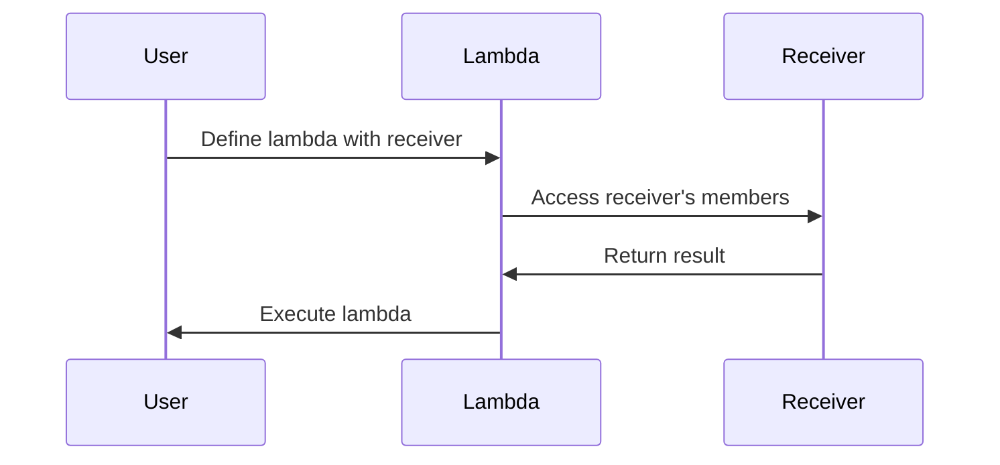

## 3.5 Lambdas with Receivers

In Kotlin, one of the most powerful features that sets it apart from many other programming languages is its support for lambdas with receivers. This feature allows developers to create more expressive and intuitive Domain-Specific Languages (DSLs) and APIs, enhancing code readability and maintainability. In this section, we will delve into the concept of lambdas with receivers, explore their applications, and provide practical examples to illustrate their use.

### Understanding Lambdas with Receivers

Lambdas with receivers are a special type of lambda expression in Kotlin that allow you to call methods on an implicit receiver object within the lambda body. This feature is particularly useful for building DSLs and APIs where you want to provide a more fluent and natural syntax.

#### Key Concepts

- **Receiver Object:** The object on which the lambda operates. Within the lambda, you can access the receiver's members directly without any qualifiers.
- **Extension Function:** A function that is defined outside of a class but can be called as if it were a member of that class. Lambdas with receivers are similar in concept to extension functions.

#### Syntax

The syntax for a lambda with a receiver involves using the `with` or `apply` functions, among others. Here's a basic example:

```kotlin
class Greeter {
    fun greet() {
        println("Hello, World!")
    }
}

fun main() {
    val greeter = Greeter()
    greeter.apply {
        greet() // 'this' refers to the 'greeter' object
    }
}
```

In this example, `apply` is used to create a lambda with the receiver `greeter`, allowing us to call `greet()` directly.

### Leveraging DSL Capabilities

DSLs, or Domain-Specific Languages, are specialized mini-languages tailored to a specific problem domain. Kotlin's lambdas with receivers are instrumental in building DSLs that are both powerful and easy to read.

#### Building a Simple DSL

Let's consider a simple example of a DSL for building HTML documents. We want to create a structure that allows us to define HTML in a more natural way:

```kotlin
class HTML {
    private val elements = mutableListOf<String>()

    fun body(init: BODY.() -> Unit) {
        val body = BODY().apply(init)
        elements.add(body.toString())
    }

    override fun toString() = elements.joinToString("\n")
}

class BODY {
    private val elements = mutableListOf<String>()

    fun p(text: String) {
        elements.add("<p>$text</p>")
    }

    override fun toString() = "<body>\n${elements.joinToString("\n")}\n</body>"
}

fun html(init: HTML.() -> Unit): HTML {
    return HTML().apply(init)
}

fun main() {
    val document = html {
        body {
            p("This is a paragraph.")
            p("This is another paragraph.")
        }
    }
    println(document)
}
```

In this example, the `html` function takes a lambda with a receiver of type `HTML`. Inside the lambda, you can call `body` and `p` directly, creating a clear and expressive syntax for defining HTML content.

#### Advantages of Using Lambdas with Receivers in DSLs

- **Readability:** The code closely resembles the structure of the domain it represents, making it easier to understand.
- **Fluency:** The syntax is natural and intuitive, reducing the cognitive load on developers.
- **Encapsulation:** The DSL can hide complex logic behind a simple interface, allowing users to focus on the high-level structure.

### Building More Expressive APIs

Lambdas with receivers are not limited to DSLs; they can also be used to create more expressive and flexible APIs. By allowing users to define behavior in a concise and readable manner, you can enhance the usability of your libraries and frameworks.

#### Example: Configuring a Network Client

Consider a scenario where you need to configure a network client with various settings. Using lambdas with receivers, you can provide a clean and flexible API for configuration:

```kotlin
class NetworkClient {
    var host: String = "localhost"
    var port: Int = 80

    fun connect() {
        println("Connecting to $host on port $port")
    }
}

fun networkClient(init: NetworkClient.() -> Unit): NetworkClient {
    return NetworkClient().apply(init)
}

fun main() {
    val client = networkClient {
        host = "example.com"
        port = 8080
    }
    client.connect()
}
```

In this example, the `networkClient` function uses a lambda with a receiver to allow users to configure the `NetworkClient` instance in a natural and readable way.

#### Benefits of Using Lambdas with Receivers in APIs

- **Flexibility:** Users can customize behavior without needing to understand the underlying implementation details.
- **Conciseness:** Configuration and setup code is reduced, making it easier to manage.
- **Consistency:** The API provides a consistent way to define behavior across different parts of the application.

### Advanced Concepts and Techniques

As you become more familiar with lambdas with receivers, you can explore more advanced techniques to further enhance your DSLs and APIs.

#### Nested Lambdas with Receivers

You can nest lambdas with receivers to create more complex structures. This is particularly useful in DSLs where you need to represent hierarchical data:

```kotlin
class Table {
    private val rows = mutableListOf<Row>()

    fun row(init: Row.() -> Unit) {
        rows.add(Row().apply(init))
    }

    override fun toString() = rows.joinToString("\n") { it.toString() }
}

class Row {
    private val cells = mutableListOf<String>()

    fun cell(content: String) {
        cells.add("<td>$content</td>")
    }

    override fun toString() = "<tr>${cells.joinToString("")}</tr>"
}

fun table(init: Table.() -> Unit): Table {
    return Table().apply(init)
}

fun main() {
    val htmlTable = table {
        row {
            cell("Row 1, Cell 1")
            cell("Row 1, Cell 2")
        }
        row {
            cell("Row 2, Cell 1")
            cell("Row 2, Cell 2")
        }
    }
    println(htmlTable)
}
```

In this example, the `table` function allows for nested `row` and `cell` definitions, creating a clear and hierarchical representation of a table.

#### Combining Lambdas with Receivers and Extension Functions

You can combine lambdas with receivers and extension functions to create even more powerful abstractions. This allows you to extend existing classes with new functionality in a concise manner:

```kotlin
fun StringBuilder.appendLineWithPrefix(prefix: String, line: String) {
    this.append("$prefix: $line\n")
}

fun main() {
    val builder = StringBuilder()
    builder.apply {
        appendLineWithPrefix("INFO", "This is an informational message.")
        appendLineWithPrefix("ERROR", "This is an error message.")
    }
    println(builder.toString())
}
```

Here, `appendLineWithPrefix` is an extension function that uses a lambda with a receiver to add prefixed lines to a `StringBuilder`.

### Design Considerations and Best Practices

When using lambdas with receivers, there are several design considerations and best practices to keep in mind:

- **Clarity vs. Complexity:** While lambdas with receivers can make code more readable, overuse or misuse can lead to complexity and confusion. Use them judiciously.
- **Performance:** Although lambdas with receivers are generally efficient, be mindful of performance implications in performance-critical code.
- **Documentation:** Clearly document the intended use of lambdas with receivers in your APIs and DSLs to guide users.

### Differences and Similarities with Other Patterns

Lambdas with receivers share similarities with other Kotlin features, such as extension functions and higher-order functions. However, they offer unique advantages in terms of readability and expressiveness, particularly in DSLs and APIs.

- **Extension Functions:** Both allow you to add functionality to existing classes, but lambdas with receivers provide a more fluent syntax.
- **Higher-Order Functions:** Lambdas with receivers are a type of higher-order function, but they specifically focus on enhancing the readability and expressiveness of code.

### Visualizing Lambdas with Receivers

To better understand how lambdas with receivers work, let's visualize the process using a Mermaid.js diagram:



In this sequence diagram, the user defines a lambda with a receiver, which then accesses the receiver's members and returns a result.

### Try It Yourself

Experiment with the code examples provided in this section. Try modifying the HTML DSL to add new elements, or extend the network client example with additional configuration options. This hands-on practice will deepen your understanding of lambdas with receivers and their applications.

### Knowledge Check

- What is a lambda with a receiver, and how does it differ from a regular lambda?
- How can lambdas with receivers enhance the readability of DSLs?
- What are some best practices for using lambdas with receivers in APIs?

### Embrace the Journey

Remember, mastering lambdas with receivers is just one step in your journey to becoming a Kotlin expert. As you continue to explore and experiment, you'll discover new ways to leverage this powerful feature in your projects. Keep pushing the boundaries, stay curious, and enjoy the process!

## Quiz Time!



### What is a lambda with a receiver in Kotlin?

- [x] A lambda that operates on an implicit receiver object.
- [ ] A lambda that takes multiple parameters.
- [ ] A lambda that returns a value.
- [ ] A lambda that is used for asynchronous programming.

> **Explanation:** A lambda with a receiver allows you to access the members of an implicit receiver object within the lambda body.

### How can lambdas with receivers enhance DSLs?

- [x] By providing a more fluent and natural syntax.
- [ ] By increasing the performance of the code.
- [ ] By reducing the number of lines of code.
- [ ] By making the code more secure.

> **Explanation:** Lambdas with receivers allow for a more fluent and natural syntax, which enhances the readability and expressiveness of DSLs.

### What is a key advantage of using lambdas with receivers in APIs?

- [x] They allow for flexible and concise configuration.
- [ ] They improve the security of the API.
- [ ] They reduce the need for documentation.
- [ ] They increase the execution speed of the API.

> **Explanation:** Lambdas with receivers enable flexible and concise configuration, making APIs easier to use and understand.

### Which function is commonly used to create a lambda with a receiver?

- [x] `apply`
- [ ] `map`
- [ ] `filter`
- [ ] `reduce`

> **Explanation:** The `apply` function is commonly used to create a lambda with a receiver, allowing you to configure an object within the lambda.

### What is a potential downside of overusing lambdas with receivers?

- [x] Increased complexity and confusion.
- [ ] Reduced code readability.
- [ ] Decreased performance.
- [ ] Increased security vulnerabilities.

> **Explanation:** Overusing lambdas with receivers can lead to increased complexity and confusion, making the code harder to understand.

### How do lambdas with receivers relate to extension functions?

- [x] Both allow adding functionality to existing classes.
- [ ] Both are used for asynchronous programming.
- [ ] Both improve the performance of the code.
- [ ] Both are used for error handling.

> **Explanation:** Lambdas with receivers and extension functions both allow you to add functionality to existing classes, enhancing code expressiveness.

### What should be documented when using lambdas with receivers in APIs?

- [x] The intended use and behavior of the lambdas.
- [ ] The performance benchmarks of the lambdas.
- [ ] The security implications of the lambdas.
- [ ] The memory usage of the lambdas.

> **Explanation:** It's important to document the intended use and behavior of lambdas with receivers to guide users in using the API correctly.

### What is a common use case for nested lambdas with receivers?

- [x] Representing hierarchical data structures.
- [ ] Performing asynchronous operations.
- [ ] Handling exceptions.
- [ ] Optimizing performance.

> **Explanation:** Nested lambdas with receivers are commonly used to represent hierarchical data structures, such as in DSLs for HTML or XML.

### Can lambdas with receivers be combined with extension functions?

- [x] True
- [ ] False

> **Explanation:** Lambdas with receivers can be combined with extension functions to create powerful abstractions and enhance code expressiveness.

### What is the main purpose of using lambdas with receivers in Kotlin?

- [x] To enhance the readability and expressiveness of code.
- [ ] To improve the performance of the application.
- [ ] To increase the security of the code.
- [ ] To simplify error handling.

> **Explanation:** The main purpose of using lambdas with receivers is to enhance the readability and expressiveness of code, particularly in DSLs and APIs.


