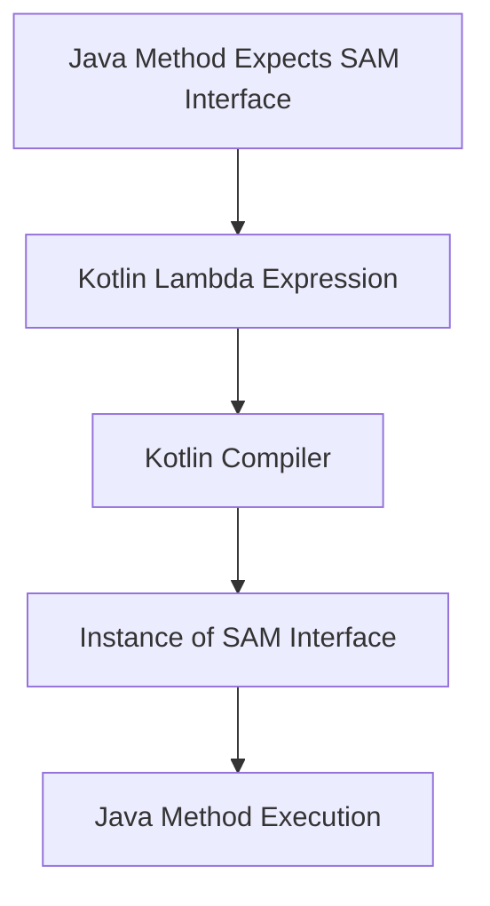

## 3.6 SAM Conversions

In the world of Kotlin programming, interoperability with Java is a key feature that allows developers to leverage existing Java libraries and frameworks seamlessly. One of the most powerful tools in this interoperability toolkit is SAM (Single Abstract Method) conversions. This feature simplifies the process of working with Java interfaces that have a single abstract method, making event handling and callbacks in Kotlin much more concise and expressive.

### Understanding SAM Conversions

#### What is a SAM Interface?

A SAM interface is an interface that contains exactly one abstract method. In Java, these interfaces are often used for defining callbacks or event listeners. Common examples include `Runnable`, `Callable`, and various listener interfaces in GUI frameworks.

#### How SAM Conversions Work in Kotlin

Kotlin provides a feature known as SAM conversions, which allows you to implement a SAM interface using a lambda expression. This means that whenever a Java method expects an instance of a SAM interface, you can pass a lambda expression instead of creating an anonymous class. This not only reduces boilerplate code but also enhances readability.

### Benefits of SAM Conversions

- **Conciseness**: Reduces the need for verbose anonymous class implementations.
- **Readability**: Makes the code more readable and expressive by using lambda expressions.
- **Interoperability**: Facilitates seamless integration with Java libraries and frameworks.

### Implementing SAM Conversions

Let's explore how SAM conversions can be implemented in Kotlin with practical examples.

#### Example 1: Using SAM Conversion with Runnable

Consider a scenario where you need to create a new thread using Java's `Runnable` interface. In Java, you would typically write:

```java
new Thread(new Runnable() {
    @Override
    public void run() {
        System.out.println("Running in a thread");
    }
}).start();
```

In Kotlin, thanks to SAM conversions, this can be simplified to:

```kotlin
Thread {
    println("Running in a thread")
}.start()
```

Here, the lambda expression `{ println("Running in a thread") }` is automatically converted to an instance of `Runnable`.

#### Example 2: SAM Conversion with ActionListener

Let's say you are working with a Java Swing application and need to add an `ActionListener` to a button. In Java, you might write:

```java
button.addActionListener(new ActionListener() {
    @Override
    public void actionPerformed(ActionEvent e) {
        System.out.println("Button clicked");
    }
});
```

In Kotlin, you can use a lambda expression:

```kotlin
button.addActionListener {
    println("Button clicked")
}
```

The lambda expression is converted to an instance of `ActionListener`, and the `actionPerformed` method is automatically implemented.

### Key Participants in SAM Conversions

- **SAM Interface**: The Java interface with a single abstract method.
- **Lambda Expression**: The Kotlin lambda that implements the SAM interface.
- **Kotlin Compiler**: The component that performs the conversion from lambda to SAM interface instance.

### Applicability of SAM Conversions

SAM conversions are applicable whenever you need to work with Java interfaces that have a single abstract method. They are particularly useful in scenarios involving:

- **Event Handling**: Simplifying the implementation of event listeners.
- **Callbacks**: Reducing boilerplate in callback interfaces.
- **Threading**: Creating concise thread implementations with `Runnable`.

### Design Considerations

When using SAM conversions, consider the following:

- **Readability vs. Explicitness**: While SAM conversions improve readability, they may obscure the fact that a lambda is being converted to a specific interface. Ensure that the intent is clear to other developers.
- **Performance**: SAM conversions are efficient, but be mindful of the overhead in performance-critical sections of code.
- **Compatibility**: Ensure that the Java interfaces you are working with are compatible with SAM conversions.

### Differences and Similarities with Other Patterns

SAM conversions are often compared to:

- **Anonymous Classes**: SAM conversions provide a more concise alternative to anonymous classes for implementing single-method interfaces.
- **Higher-Order Functions**: While both involve passing functions as parameters, SAM conversions specifically target Java interoperability.

### Visualizing SAM Conversions

To better understand how SAM conversions work, let's visualize the process using a diagram.



**Diagram Description**: This diagram illustrates the flow of SAM conversions in Kotlin. A Java method expects a SAM interface, which is provided as a Kotlin lambda expression. The Kotlin compiler converts the lambda into an instance of the SAM interface, which is then executed by the Java method.

### Try It Yourself

To get hands-on experience with SAM conversions, try modifying the following code examples:

1. **Runnable Example**: Change the message printed by the `Runnable` lambda and observe the output.
2. **ActionListener Example**: Add additional logic to the `ActionListener` lambda, such as updating a UI component.

### References and Links

For further reading on SAM conversions and Java interoperability, consider the following resources:

- [Kotlin Documentation on SAM Conversions](https://kotlinlang.org/docs/java-interop.html#sam-conversions)
- [Java Lambda Expressions and Functional Interfaces](https://docs.oracle.com/javase/tutorial/java/javaOO/lambdaexpressions.html)

### Knowledge Check

- What is a SAM interface, and why is it important in Java interoperability?
- How do SAM conversions improve code readability in Kotlin?
- Can SAM conversions be used with any Java interface? Why or why not?

### Embrace the Journey

Remember, mastering SAM conversions is just one step in your Kotlin journey. As you continue to explore Kotlin's features, you'll discover more ways to write clean, efficient, and expressive code. Keep experimenting, stay curious, and enjoy the process!

### Quiz Time!



### What is a SAM interface?

- [x] An interface with a single abstract method.
- [ ] An interface with multiple abstract methods.
- [ ] An interface with no methods.
- [ ] An interface with only default methods.

> **Explanation:** A SAM interface is defined as an interface that contains exactly one abstract method, making it suitable for lambda expressions in Kotlin.

### How does Kotlin handle SAM conversions?

- [x] By converting a lambda expression into an instance of a SAM interface.
- [ ] By converting a lambda expression into a class with multiple methods.
- [ ] By converting a lambda expression into a Java class.
- [ ] By converting a lambda expression into a Kotlin object.

> **Explanation:** Kotlin converts a lambda expression into an instance of a SAM interface, allowing it to be used where a Java method expects a SAM interface.

### Which of the following is a benefit of SAM conversions?

- [x] Reduces boilerplate code.
- [x] Enhances code readability.
- [ ] Increases code complexity.
- [ ] Requires additional libraries.

> **Explanation:** SAM conversions reduce boilerplate code and enhance readability by allowing the use of lambda expressions instead of verbose anonymous classes.

### Can SAM conversions be used with any Java interface?

- [ ] Yes, with any Java interface.
- [x] No, only with interfaces that have a single abstract method.
- [ ] Yes, but only with interfaces that have default methods.
- [ ] No, only with interfaces that extend `Runnable`.

> **Explanation:** SAM conversions can only be used with interfaces that have a single abstract method, as they are specifically designed for this purpose.

### What is a common use case for SAM conversions?

- [x] Simplifying event handling.
- [x] Implementing callbacks.
- [ ] Creating complex data structures.
- [ ] Managing database connections.

> **Explanation:** SAM conversions are commonly used to simplify event handling and implement callbacks by reducing the need for verbose anonymous classes.

### Which Kotlin feature is primarily used in SAM conversions?

- [x] Lambda expressions.
- [ ] Extension functions.
- [ ] Data classes.
- [ ] Sealed classes.

> **Explanation:** Lambda expressions are the primary feature used in SAM conversions, allowing concise implementation of SAM interfaces.

### How does SAM conversion improve interoperability with Java?

- [x] By allowing Kotlin lambdas to be used where Java expects a SAM interface.
- [ ] By converting Java classes into Kotlin objects.
- [ ] By allowing Java methods to call Kotlin functions directly.
- [ ] By enabling Kotlin to use Java's default methods.

> **Explanation:** SAM conversion improves interoperability by allowing Kotlin lambdas to be used in place of Java's SAM interfaces, facilitating seamless integration.

### What is a potential drawback of using SAM conversions?

- [ ] Increased code verbosity.
- [x] Reduced explicitness of interface implementation.
- [ ] Incompatibility with Java 8.
- [ ] Requirement of additional annotations.

> **Explanation:** While SAM conversions improve readability, they may reduce the explicitness of interface implementation, potentially obscuring the underlying interface being implemented.

### How can you visualize the process of SAM conversions?

- [x] Using a flowchart to show the conversion from lambda to SAM interface.
- [ ] Using a class diagram to show the structure of the SAM interface.
- [ ] Using a sequence diagram to show the interaction between objects.
- [ ] Using a state diagram to show the state transitions.

> **Explanation:** A flowchart is an effective way to visualize the process of SAM conversions, illustrating the conversion from a lambda expression to a SAM interface instance.

### True or False: SAM conversions are only applicable to Kotlin's standard library.

- [ ] True
- [x] False

> **Explanation:** False. SAM conversions are applicable to any Java interface with a single abstract method, not just those in Kotlin's standard library.



By understanding and utilizing SAM conversions, you can write more concise and expressive Kotlin code while maintaining seamless interoperability with Java. Keep exploring and experimenting with these concepts to enhance your Kotlin programming skills!
