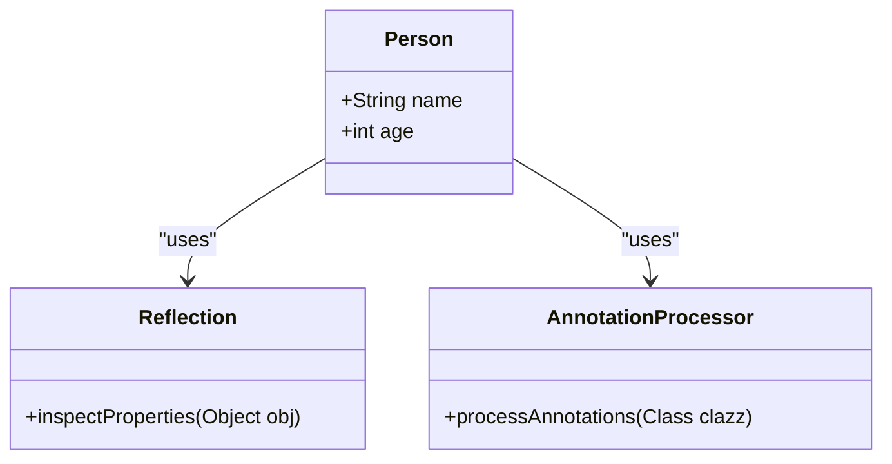

## 3.7 Annotations and Reflection

In the world of Kotlin programming, annotations and reflection are powerful tools that allow developers to add metadata to their code and to introspect and manipulate code at runtime. This section will delve into these concepts, providing expert insights into their usage, benefits, and best practices. We'll explore how annotations can be used to enhance code readability and maintainability, and how reflection can be leveraged for dynamic behavior and advanced design patterns.

### Understanding Annotations in Kotlin

Annotations in Kotlin are a form of metadata that can be attached to code elements such as classes, functions, properties, and parameters. They provide additional information that can be used by the compiler or runtime to influence behavior or processing.

#### Key Concepts of Annotations

- **Metadata**: Annotations serve as metadata, providing information about the code that can be used by tools and frameworks.
- **Custom Annotations**: Kotlin allows the creation of custom annotations to suit specific needs.
- **Retention Policies**: Annotations can have different retention policies, determining whether they are available at runtime or only at compile-time.

#### Common Annotations in Kotlin

Kotlin provides several built-in annotations that serve various purposes:

- `@JvmStatic`: Marks a method in a companion object as static.
- `@JvmOverloads`: Generates overloads for a function with default parameters.
- `@JvmField`: Exposes a property as a field in Java.
- `@Deprecated`: Marks a code element as deprecated.
- `@Target`: Specifies the possible kinds of elements which can be annotated.

#### Creating Custom Annotations

To create a custom annotation in Kotlin, use the `annotation` keyword:

```kotlin
@Target(AnnotationTarget.CLASS, AnnotationTarget.FUNCTION)
@Retention(AnnotationRetention.RUNTIME)
annotation class MyCustomAnnotation(val description: String)
```

- **`@Target`**: Specifies where the annotation can be applied (e.g., class, function).
- **`@Retention`**: Determines how long the annotation is retained (e.g., source, binary, runtime).

### Reflection in Kotlin

Reflection is a powerful feature that allows a program to inspect and modify its structure at runtime. In Kotlin, reflection is provided through the `kotlin.reflect` package.

#### Key Concepts of Reflection

- **Introspection**: Accessing information about classes, methods, and properties at runtime.
- **Dynamic Invocation**: Invoking methods and accessing properties dynamically.
- **Type Safety**: Kotlin reflection is type-safe, reducing runtime errors.

#### Using Reflection in Kotlin

To use reflection in Kotlin, you need to include the `kotlin-reflect` library in your project. Here's a basic example of using reflection to access a property:

```kotlin
import kotlin.reflect.full.memberProperties

data class Person(val name: String, val age: Int)

fun main() {
    val person = Person("Alice", 30)
    val kClass = person::class
    val properties = kClass.memberProperties
    for (property in properties) {
        println("${property.name} = ${property.get(person)}")
    }
}
```

- **`memberProperties`**: Retrieves all properties of the class.
- **`property.get(instance)`**: Accesses the value of the property for a given instance.

### Annotation Processing

Annotation processing involves analyzing and processing annotations at compile-time or runtime. This can be used to generate code, validate code structure, or configure frameworks.

#### Compile-Time Processing with KAPT

Kotlin Annotation Processing Tool (KAPT) is used for compile-time annotation processing. It allows you to generate code based on annotations.

To use KAPT, add the following to your `build.gradle.kts`:

```kotlin
plugins {
    kotlin("kapt")
}

dependencies {
    kapt("com.example:annotation-processor:1.0")
}
```

#### Runtime Processing

Runtime processing involves using reflection to inspect annotations and perform actions based on them. This is useful for frameworks that need to configure themselves based on annotations.

### Practical Applications of Annotations and Reflection

Annotations and reflection can be used in various scenarios to enhance the functionality and flexibility of your applications:

#### Dependency Injection

Annotations are often used in dependency injection frameworks to mark injectable components. Reflection is used to resolve dependencies at runtime.

```kotlin
@Target(AnnotationTarget.CONSTRUCTOR)
@Retention(AnnotationRetention.RUNTIME)
annotation class Inject

class Service

class Client @Inject constructor(val service: Service)
```

#### Serialization and Deserialization

Annotations can specify how objects should be serialized or deserialized. Reflection can dynamically access properties to convert objects to and from JSON, XML, etc.

```kotlin
@Target(AnnotationTarget.PROPERTY)
@Retention(AnnotationRetention.RUNTIME)
annotation class JsonName(val name: String)

data class User(@JsonName("user_name") val name: String, val age: Int)
```

#### Validation Frameworks

Annotations can define validation rules for data classes, and reflection can be used to enforce these rules at runtime.

```kotlin
@Target(AnnotationTarget.PROPERTY)
@Retention(AnnotationRetention.RUNTIME)
annotation class NotEmpty

data class Form(val username: String, @NotEmpty val password: String)
```

### Best Practices for Using Annotations and Reflection

- **Use Annotations Judiciously**: Avoid overusing annotations, as they can make code harder to read and maintain.
- **Leverage Reflection Sparingly**: Reflection can impact performance, so use it only when necessary.
- **Document Custom Annotations**: Provide clear documentation for custom annotations to ensure they are used correctly.
- **Consider Alternatives**: Before using reflection, consider if there are simpler alternatives that achieve the same goal.

### Visualizing Annotations and Reflection

To better understand the relationship between annotations, reflection, and code elements, let's visualize the process using a class diagram.



- **Person**: Represents a data class with properties.
- **Reflection**: Represents the process of inspecting properties.
- **AnnotationProcessor**: Represents the process of handling annotations.

### Try It Yourself

To solidify your understanding, try modifying the code examples provided. For instance, create a custom annotation that specifies a default value for a property, and use reflection to apply this default value if the property is null.

### References and Links

- [Kotlin Annotations](https://kotlinlang.org/docs/annotations.html)
- [Kotlin Reflection](https://kotlinlang.org/docs/reflection.html)
- [KAPT](https://kotlinlang.org/docs/kapt.html)

### Knowledge Check

- What is the purpose of annotations in Kotlin?
- How does reflection enable dynamic behavior in Kotlin?
- What are the potential drawbacks of using reflection?
- How can annotations be used in dependency injection frameworks?
- What are some best practices for using annotations and reflection?

### Embrace the Journey

Remember, mastering annotations and reflection in Kotlin is a journey. As you explore these concepts, you'll discover new ways to enhance your applications and solve complex problems. Keep experimenting, stay curious, and enjoy the journey!

## Quiz Time!



### What is the primary purpose of annotations in Kotlin?

- [x] To provide metadata about code elements
- [ ] To execute code at compile-time
- [ ] To replace comments in code
- [ ] To enhance code performance

> **Explanation:** Annotations are used to provide metadata about code elements, which can be utilized by tools and frameworks for various purposes.

### Which Kotlin annotation specifies where an annotation can be applied?

- [x] `@Target`
- [ ] `@Retention`
- [ ] `@JvmStatic`
- [ ] `@Deprecated`

> **Explanation:** The `@Target` annotation specifies the possible kinds of elements which can be annotated.

### What is the role of the Kotlin Annotation Processing Tool (KAPT)?

- [x] To process annotations at compile-time
- [ ] To execute annotations at runtime
- [ ] To convert annotations into comments
- [ ] To enhance code readability

> **Explanation:** KAPT is used for compile-time annotation processing, allowing code generation based on annotations.

### How does reflection in Kotlin differ from reflection in Java?

- [x] Kotlin reflection is type-safe
- [ ] Kotlin reflection is faster
- [ ] Kotlin reflection is only available at compile-time
- [ ] Kotlin reflection does not support method invocation

> **Explanation:** Kotlin reflection is type-safe, which helps reduce runtime errors compared to Java reflection.

### What is a potential drawback of using reflection in Kotlin?

- [x] It can impact performance
- [ ] It makes code more readable
- [ ] It simplifies code structure
- [ ] It enhances code security

> **Explanation:** Reflection can impact performance, so it should be used judiciously.

### Which annotation is used to mark a method in a companion object as static?

- [x] `@JvmStatic`
- [ ] `@JvmField`
- [ ] `@JvmOverloads`
- [ ] `@Deprecated`

> **Explanation:** The `@JvmStatic` annotation is used to mark a method in a companion object as static.

### How can annotations be used in serialization frameworks?

- [x] To specify how objects should be serialized or deserialized
- [ ] To execute serialization at compile-time
- [ ] To replace JSON keys with annotation names
- [ ] To enhance serialization performance

> **Explanation:** Annotations can specify how objects should be serialized or deserialized, guiding the serialization framework.

### What is the purpose of the `@Retention` annotation in Kotlin?

- [x] To determine how long the annotation is retained
- [ ] To specify where the annotation can be applied
- [ ] To mark a method as deprecated
- [ ] To enhance code readability

> **Explanation:** The `@Retention` annotation determines how long the annotation is retained (e.g., source, binary, runtime).

### Which Kotlin package provides reflection capabilities?

- [x] `kotlin.reflect`
- [ ] `kotlin.annotation`
- [ ] `kotlin.runtime`
- [ ] `kotlin.metadata`

> **Explanation:** The `kotlin.reflect` package provides reflection capabilities in Kotlin.

### True or False: Reflection can be used to modify code structure at runtime.

- [x] True
- [ ] False

> **Explanation:** Reflection allows a program to inspect and modify its structure at runtime.


