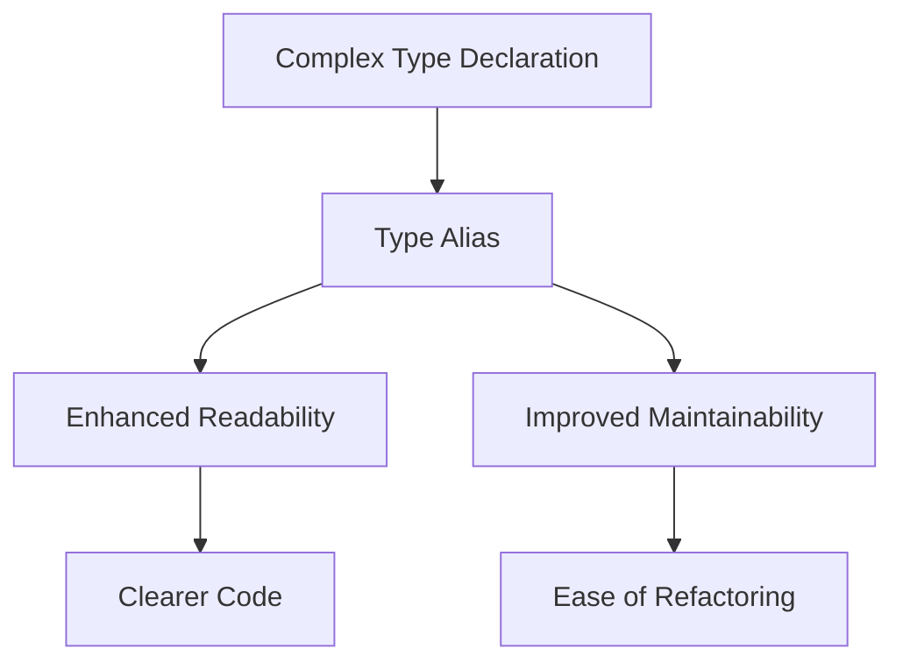

## 3.8 Type Aliases

In the ever-evolving landscape of software engineering, clarity and maintainability of code are paramount. Kotlin, with its modern features, offers a powerful tool known as **type aliases** to simplify complex type declarations and enhance code readability. In this section, we will delve into the concept of type aliases, explore their applications, and demonstrate how they can be leveraged to create more maintainable and understandable codebases.

### Understanding Type Aliases

Type aliases in Kotlin allow developers to create alternative names for existing types. This feature is particularly useful when dealing with complex type declarations, such as function types or generic types, which can become cumbersome and difficult to read. By introducing a type alias, you can provide a more descriptive name that conveys the intent of the type, making the code easier to understand.

#### Syntax and Basic Usage

The syntax for defining a type alias in Kotlin is straightforward:

```kotlin
typealias AliasName = ExistingType
```

Here, `AliasName` becomes an alternative name for `ExistingType`. Let's consider a simple example:

```kotlin
typealias UserId = String

fun getUserById(id: UserId): User {
    // Implementation here
}
```

In this example, `UserId` is a type alias for `String`. While technically `UserId` is still a `String`, using the alias makes the code more expressive by indicating that the string represents a user identifier.

### Benefits of Using Type Aliases

#### Simplifying Complex Type Declarations

One of the primary advantages of type aliases is their ability to simplify complex type declarations. Consider a scenario where you have a function type with multiple parameters and a return type:

```kotlin
typealias Callback = (Int, String) -> Boolean

fun registerCallback(callback: Callback) {
    // Implementation here
}
```

By using a type alias, the function type `(Int, String) -> Boolean` is given a meaningful name `Callback`, which makes the code more readable and easier to understand.

#### Enhancing Code Readability

Type aliases can significantly enhance code readability by providing context to otherwise generic types. For instance, when working with collections, you might encounter complex nested types:

```kotlin
typealias UserMap = Map<Int, List<String>>

val users: UserMap = mapOf(
    1 to listOf("Alice", "Bob"),
    2 to listOf("Charlie", "David")
)
```

Here, `UserMap` is a type alias for `Map<Int, List<String>>`, which represents a mapping of user IDs to lists of user names. The alias makes it immediately clear what the map is intended to represent.

#### Improving Maintainability

By using type aliases, you can improve the maintainability of your code. If the underlying type changes, you only need to update the type alias definition, rather than every instance where the type is used. This can be particularly beneficial in large codebases where types are used extensively.

### Advanced Applications of Type Aliases

#### Type Aliases with Generics

Type aliases can also be used with generic types, providing a way to simplify complex generic type declarations:

```kotlin
typealias StringList = List<String>

val names: StringList = listOf("Alice", "Bob", "Charlie")
```

In this example, `StringList` is a type alias for `List<String>`, making it clear that the list contains strings.

#### Type Aliases for Function Types

Function types can often become complex, especially when they involve multiple parameters and return types. Type aliases can simplify these declarations:

```kotlin
typealias Operation = (Int, Int) -> Int

fun performOperation(a: Int, b: Int, operation: Operation): Int {
    return operation(a, b)
}

val sum: Operation = { x, y -> x + y }
val result = performOperation(3, 4, sum)
```

Here, `Operation` is a type alias for a function type that takes two integers and returns an integer. This makes the `performOperation` function signature more concise and easier to read.

#### Type Aliases in Domain-Specific Languages (DSLs)

Type aliases can play a crucial role in designing domain-specific languages (DSLs) by providing meaningful names for types used within the DSL:

```kotlin
typealias Json = Map<String, Any>

fun parseJson(json: Json) {
    // Implementation here
}

val jsonData: Json = mapOf("name" to "Alice", "age" to 30)
parseJson(jsonData)
```

In this example, `Json` is a type alias for `Map<String, Any>`, which represents a JSON object. This alias makes the DSL more expressive and easier to use.

### Design Considerations

#### When to Use Type Aliases

While type aliases can enhance readability and maintainability, they should be used judiciously. Overuse of type aliases can lead to confusion, especially if the aliases are not well-documented or if they obscure the underlying type. Consider using type aliases when:

- The type declaration is complex and used frequently.
- The alias provides meaningful context to the type.
- The alias improves the readability of the code.

#### Potential Pitfalls

- **Obscuring Types**: Overusing type aliases can obscure the underlying types, making it difficult for developers to understand the code without additional context.
- **Naming Conflicts**: Ensure that type alias names do not conflict with existing class or interface names to avoid confusion.
- **Documentation**: Provide clear documentation for type aliases to ensure that their purpose and usage are well-understood by other developers.

### Differences and Similarities with Other Features

Type aliases are often compared to other features such as `typedef` in C/C++ or `using` in C#. While they serve a similar purpose, there are key differences:

- **Type Safety**: Type aliases in Kotlin do not create new types; they are simply alternative names for existing types. This means that type safety is not enforced by the alias.
- **No Runtime Overhead**: Type aliases do not introduce any runtime overhead, as they are purely a compile-time feature.

### Code Examples

Let's explore some practical examples to illustrate the use of type aliases in different scenarios.

#### Example 1: Simplifying Function Types

```kotlin
typealias StringTransformer = (String) -> String

fun applyTransformation(input: String, transformer: StringTransformer): String {
    return transformer(input)
}

val toUpperCase: StringTransformer = { it.uppercase() }
val result = applyTransformation("hello", toUpperCase)
println(result) // Output: HELLO
```

#### Example 2: Enhancing Readability with Collections

```kotlin
typealias ProductList = List<Pair<String, Double>>

val products: ProductList = listOf(
    "Apple" to 1.99,
    "Banana" to 0.99,
    "Cherry" to 2.99
)

fun printProducts(products: ProductList) {
    for ((name, price) in products) {
        println("$name: $$price")
    }
}

printProducts(products)
```

#### Example 3: Using Type Aliases in DSLs

```kotlin
typealias HtmlTag = String

fun renderHtml(tag: HtmlTag, content: String): String {
    return "<$tag>$content</$tag>"
}

val html = renderHtml("p", "Hello, World!")
println(html) // Output: <p>Hello, World!</p>
```

### Try It Yourself

Now that we've explored the concept of type aliases, let's encourage you to experiment with them. Try modifying the code examples above by:

- Creating a new type alias for a complex generic type.
- Using a type alias to simplify a function type with multiple parameters.
- Designing a small DSL using type aliases to enhance readability.

### Visualizing Type Aliases

To better understand how type aliases work, let's visualize their role in simplifying complex type declarations.



**Diagram Description:** This diagram illustrates how complex type declarations can be simplified using type aliases, leading to enhanced readability and improved maintainability. The result is clearer code and ease of refactoring.

### References and Links

- [Kotlin Official Documentation on Type Aliases](https://kotlinlang.org/docs/type-aliases.html)
- [Kotlin Language Reference](https://kotlinlang.org/docs/reference/)
- [Effective Kotlin: Best Practices](https://www.effectivekotlin.com/)

### Knowledge Check

To reinforce your understanding of type aliases, consider the following questions:

- How do type aliases improve code readability?
- When should you use a type alias instead of a regular type declaration?
- What are the potential pitfalls of overusing type aliases?

### Embrace the Journey

Remember, mastering type aliases is just one step on your journey to becoming a Kotlin expert. As you continue to explore Kotlin's features, you'll discover new ways to write clean, maintainable, and expressive code. Keep experimenting, stay curious, and enjoy the journey!

### Summary

In this section, we've explored the concept of type aliases in Kotlin and how they can simplify complex type declarations, enhance code readability, and improve maintainability. By understanding when and how to use type aliases, you can create more expressive and maintainable codebases. As you continue to work with Kotlin, consider incorporating type aliases into your projects to take advantage of their benefits.

## Quiz Time!



### What is a type alias in Kotlin?

- [x] An alternative name for an existing type
- [ ] A new type created from an existing type
- [ ] A way to create a subclass
- [ ] A method for converting types

> **Explanation:** A type alias is an alternative name for an existing type, not a new type or subclass.

### How can type aliases improve code readability?

- [x] By providing meaningful names for complex types
- [ ] By creating new types
- [ ] By reducing the number of lines of code
- [ ] By enforcing type safety

> **Explanation:** Type aliases improve readability by providing meaningful names for complex types, making the code easier to understand.

### When should you use a type alias?

- [x] When a type declaration is complex and used frequently
- [ ] When you want to create a new type
- [ ] When you need to enforce type safety
- [ ] When you want to reduce the number of classes

> **Explanation:** Type aliases are useful when a type declaration is complex and used frequently, providing a more readable alternative.

### What is a potential pitfall of using type aliases?

- [x] Obscuring the underlying type
- [ ] Increasing runtime overhead
- [ ] Creating new types
- [ ] Reducing code readability

> **Explanation:** Overusing type aliases can obscure the underlying type, making it difficult to understand the code.

### Can type aliases be used with generic types?

- [x] Yes
- [ ] No

> **Explanation:** Type aliases can be used with generic types to simplify complex generic type declarations.

### What is the syntax for defining a type alias in Kotlin?

- [x] `typealias AliasName = ExistingType`
- [ ] `alias AliasName = ExistingType`
- [ ] `typedef AliasName = ExistingType`
- [ ] `alias ExistingType as AliasName`

> **Explanation:** The correct syntax for defining a type alias in Kotlin is `typealias AliasName = ExistingType`.

### Do type aliases introduce runtime overhead?

- [x] No
- [ ] Yes

> **Explanation:** Type aliases are purely a compile-time feature and do not introduce any runtime overhead.

### Can type aliases enforce type safety?

- [x] No
- [ ] Yes

> **Explanation:** Type aliases do not create new types and therefore do not enforce type safety; they are simply alternative names for existing types.

### How can type aliases aid in designing DSLs?

- [x] By providing meaningful names for types used within the DSL
- [ ] By creating new types for the DSL
- [ ] By reducing the number of functions in the DSL
- [ ] By enforcing stricter type checks

> **Explanation:** Type aliases provide meaningful names for types used within the DSL, enhancing expressiveness and readability.

### Type aliases can be used to simplify which of the following?

- [x] Function types
- [x] Generic types
- [ ] Class hierarchies
- [ ] Package structures

> **Explanation:** Type aliases can simplify function types and generic types by providing more readable names.


