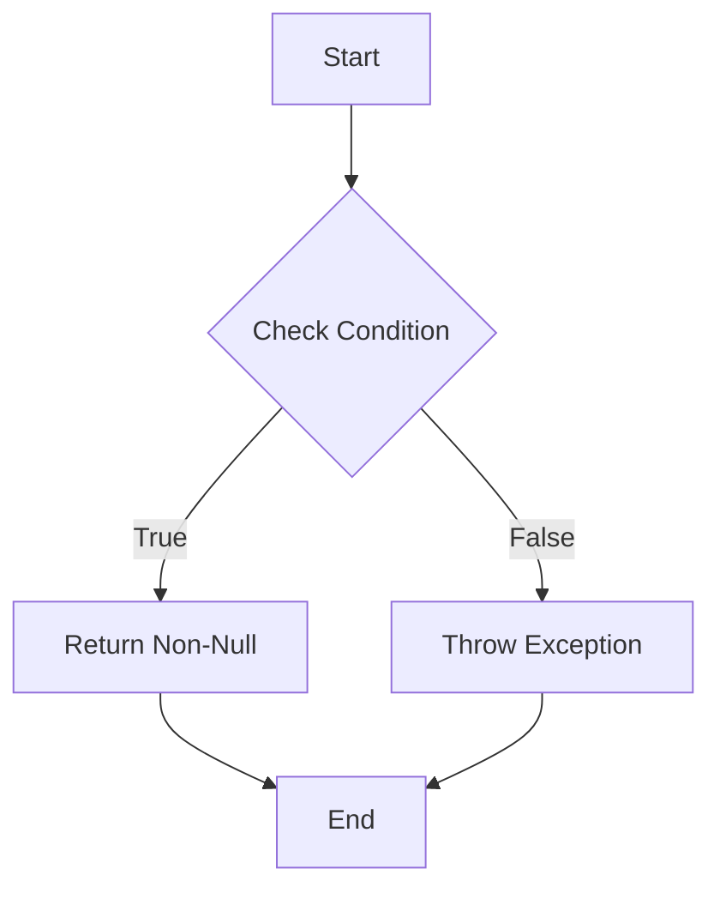

## 3.9 Contracts (Experimental)

In the realm of software development, ensuring that code is both safe and efficient is paramount. Kotlin, with its robust type system and null safety features, has already made significant strides in this direction. However, the Kotlin team continues to push the boundaries with experimental features designed to further enhance code safety and performance. One such feature is **Kotlin Contracts**. Contracts provide a way to inform the Kotlin compiler about the behavior of functions, enabling it to perform more advanced flow analysis and improve null safety. In this section, we'll delve into the intricacies of Kotlin Contracts, exploring how they work, their benefits, and how to implement them effectively in your code.

### Understanding Kotlin Contracts

Kotlin Contracts are an experimental feature introduced to enhance the compiler's understanding of code. They allow developers to specify certain behaviors or guarantees about functions, which the compiler can then use to perform more accurate flow analysis. This, in turn, can lead to improved null safety and more optimized code.

#### What Are Contracts?

At their core, contracts are a way to describe the behavior of a function beyond its signature. They provide metadata that the compiler can use to make more informed decisions about code execution. For example, a contract can specify that a function will return a non-null value if a certain condition is met, or that a function will not modify a particular variable.

#### Why Use Contracts?

Contracts are particularly useful in scenarios where the compiler's default flow analysis might be insufficient. By providing additional information about a function's behavior, contracts can help the compiler make better decisions, leading to:

- **Improved Null Safety**: Contracts can inform the compiler about conditions under which a value is guaranteed to be non-null, reducing the risk of null pointer exceptions.
- **Enhanced Flow Analysis**: With contracts, the compiler can perform more sophisticated flow analysis, potentially optimizing code execution paths and improving performance.
- **Better Code Readability**: Contracts can serve as documentation, making it clear to other developers what guarantees a function provides.

### Implementing Contracts in Kotlin

To implement contracts in Kotlin, you use the `contract` function, which is part of the `kotlin.contracts` package. Contracts are defined within the body of a function and describe the relationship between the function's inputs and outputs.

#### Basic Syntax

Here's a simple example of a contract in Kotlin:

```kotlin
import kotlin.contracts.*

fun requireNonNull(value: Any?): Any {
    contract {
        returns() implies (value != null)
    }
    if (value == null) {
        throw IllegalArgumentException("Value cannot be null")
    }
    return value
}
```

In this example, the contract specifies that if the function `requireNonNull` returns normally (i.e., without throwing an exception), then the input `value` must be non-null. This allows the compiler to assume that `value` is non-null after the function call, improving null safety.

#### Key Components of a Contract

- **Returns**: Specifies the conditions under which the function will return normally. This can be used to indicate that a function will return if a certain condition is met.
- **Implies**: Used to specify a condition that must be true if the function returns normally. This is often used to assert non-null conditions.
- **CallsInPlace**: Indicates that a lambda or function is called a certain number of times within the function body. This can be used to optimize flow analysis for higher-order functions.

### Advanced Contract Use Cases

Contracts can be used in a variety of scenarios to enhance code safety and performance. Let's explore some advanced use cases.

#### Ensuring Non-Null Values

Contracts can be particularly useful for functions that perform null checks. By specifying that a function returns only if a value is non-null, you can eliminate unnecessary null checks later in the code.

```kotlin
fun <T> checkNotNull(value: T?): T {
    contract {
        returns() implies (value != null)
    }
    return value ?: throw IllegalArgumentException("Value cannot be null")
}
```

In this example, the contract ensures that `value` is non-null after the function call, allowing the compiler to optimize subsequent code.

#### Optimizing Flow Analysis with CallsInPlace

For higher-order functions, the `callsInPlace` contract can be used to inform the compiler about the execution of lambdas or function parameters. This can lead to more efficient code execution.

```kotlin
inline fun <T> runOnce(block: () -> T): T {
    contract {
        callsInPlace(block, InvocationKind.EXACTLY_ONCE)
    }
    return block()
}
```

Here, the contract specifies that the `block` lambda is called exactly once, allowing the compiler to optimize the flow analysis and potentially inline the lambda.

### Visualizing Contracts in Kotlin

To better understand how contracts work in Kotlin, let's visualize the flow of a simple contract using a Mermaid.js diagram.



This diagram represents a function with a contract that returns a non-null value if a condition is true, and throws an exception otherwise. The contract informs the compiler that if the function returns, the condition must have been true.

### Benefits and Limitations of Contracts

While contracts offer significant benefits, they also come with certain limitations that developers should be aware of.

#### Benefits

- **Improved Compiler Optimizations**: By providing additional information about function behavior, contracts enable the compiler to perform more sophisticated optimizations.
- **Enhanced Code Safety**: Contracts can help prevent null pointer exceptions and other runtime errors by ensuring that certain conditions are met.
- **Better Documentation**: Contracts serve as a form of documentation, making it clear what guarantees a function provides.

#### Limitations

- **Experimental Feature**: As an experimental feature, contracts may change in future Kotlin releases, and their use in production code should be approached with caution.
- **Complexity**: Contracts can add complexity to code, and their benefits may not always outweigh the added complexity.
- **Limited Support**: Not all scenarios can be expressed with contracts, and their use is limited to certain patterns.

### Practical Examples and Exercises

Let's explore some practical examples of using contracts in Kotlin, and provide exercises to reinforce learning.

#### Example: Validating Input Parameters

Consider a function that validates input parameters and throws an exception if they are invalid. Using a contract, we can inform the compiler about the conditions under which the function returns normally.

```kotlin
fun validateInput(input: String?) {
    contract {
        returns() implies (input != null && input.isNotEmpty())
    }
    if (input == null || input.isEmpty()) {
        throw IllegalArgumentException("Input cannot be null or empty")
    }
}
```

In this example, the contract specifies that the function returns only if `input` is non-null and not empty, allowing the compiler to optimize subsequent code.

#### Exercise: Implementing a Custom Contract

Try implementing a custom contract for a function that checks if a list is not empty and returns the first element. Use the contract to inform the compiler about the conditions under which the function returns.

```kotlin
fun <T> firstElement(list: List<T>?): T {
    contract {
        returns() implies (list != null && list.isNotEmpty())
    }
    if (list == null || list.isEmpty()) {
        throw IllegalArgumentException("List cannot be null or empty")
    }
    return list.first()
}
```

### Knowledge Check

To reinforce your understanding of Kotlin Contracts, consider the following questions:

1. What is the primary purpose of Kotlin Contracts?
2. How do contracts improve null safety in Kotlin?
3. What are the key components of a contract in Kotlin?
4. How can contracts be used to optimize flow analysis for higher-order functions?
5. What are some limitations of using contracts in Kotlin?

### Embrace the Journey

Remember, this is just the beginning of your journey with Kotlin Contracts. As you explore this experimental feature, you'll discover new ways to enhance your code's safety and performance. Keep experimenting, stay curious, and enjoy the journey!

### References and Further Reading

- [Kotlin Contracts Documentation](https://kotlinlang.org/docs/contracts.html)
- [Kotlin Language Reference](https://kotlinlang.org/docs/reference/)
- [Kotlin GitHub Repository](https://github.com/JetBrains/kotlin)

## Quiz Time!



### What is the primary purpose of Kotlin Contracts?

- [x] To enhance the compiler's understanding of code
- [ ] To replace null safety features
- [ ] To improve code readability only
- [ ] To provide runtime error handling

> **Explanation:** Kotlin Contracts are designed to enhance the compiler's understanding of code, allowing for improved null safety and flow analysis.

### How do contracts improve null safety in Kotlin?

- [x] By informing the compiler about conditions under which a value is non-null
- [ ] By eliminating all null checks
- [ ] By replacing the need for null safety operators
- [ ] By providing runtime null checks

> **Explanation:** Contracts improve null safety by informing the compiler about conditions under which a value is guaranteed to be non-null, reducing the risk of null pointer exceptions.

### What are the key components of a contract in Kotlin?

- [x] Returns, Implies, CallsInPlace
- [ ] Returns, Throws, Catches
- [ ] Implies, Throws, Catches
- [ ] CallsInPlace, Throws, Catches

> **Explanation:** The key components of a contract in Kotlin are Returns, Implies, and CallsInPlace, which describe the behavior of functions.

### How can contracts be used to optimize flow analysis for higher-order functions?

- [x] By using the CallsInPlace component to inform the compiler about lambda execution
- [ ] By eliminating the need for higher-order functions
- [ ] By providing runtime optimizations
- [ ] By reducing the number of function calls

> **Explanation:** Contracts can use the CallsInPlace component to inform the compiler about how many times a lambda or function parameter is called, optimizing flow analysis.

### What are some limitations of using contracts in Kotlin?

- [x] Experimental feature, complexity, limited support
- [ ] Only available in Kotlin 1.0
- [ ] Cannot be used with null safety
- [ ] Requires additional libraries

> **Explanation:** Contracts are an experimental feature, can add complexity, and have limited support for certain patterns.

### Which component of a contract specifies conditions for normal function return?

- [x] Returns
- [ ] Implies
- [ ] CallsInPlace
- [ ] Throws

> **Explanation:** The Returns component of a contract specifies the conditions under which a function will return normally.

### Which contract component is used to assert non-null conditions?

- [x] Implies
- [ ] Returns
- [ ] CallsInPlace
- [ ] Throws

> **Explanation:** The Implies component is used to assert conditions, such as non-null guarantees, when a function returns.

### What does the CallsInPlace component indicate in a contract?

- [x] The number of times a lambda or function is called
- [ ] The return type of a function
- [ ] The exception handling mechanism
- [ ] The variable scope

> **Explanation:** The CallsInPlace component indicates how many times a lambda or function parameter is called within the function body.

### Can contracts be used to eliminate all null checks in Kotlin?

- [ ] True
- [x] False

> **Explanation:** Contracts cannot eliminate all null checks but can inform the compiler about conditions under which values are non-null, reducing the need for some checks.

### Are contracts a stable feature in Kotlin?

- [ ] True
- [x] False

> **Explanation:** Contracts are currently an experimental feature in Kotlin and may change in future releases.


