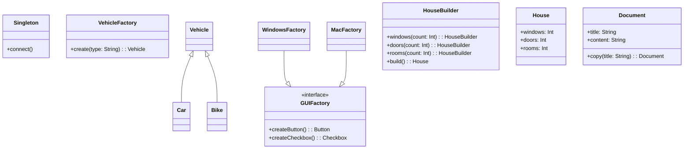

## 4.1 Adapting Creational Patterns to Kotlin

In the world of software design, creational patterns play a crucial role in object creation mechanisms, aiming to create objects in a manner suitable to the situation. Kotlin, with its expressive syntax and powerful features, offers unique ways to implement these patterns. In this section, we will explore how to adapt traditional creational design patterns to Kotlin, leveraging its unique features for efficient software design.

### Understanding Creational Patterns

Creational design patterns abstract the instantiation process. They help in making the system independent of how its objects are created, composed, and represented. The main creational patterns include:

- **Singleton Pattern**: Ensures a class has only one instance and provides a global point of access to it.
- **Factory Method Pattern**: Defines an interface for creating an object but lets subclasses alter the type of objects that will be created.
- **Abstract Factory Pattern**: Provides an interface for creating families of related or dependent objects without specifying their concrete classes.
- **Builder Pattern**: Separates the construction of a complex object from its representation, allowing the same construction process to create different representations.
- **Prototype Pattern**: Specifies the kinds of objects to create using a prototypical instance and creates new objects by copying this prototype.

### Adapting Creational Patterns to Kotlin

Kotlin's language features such as `object` declarations, data classes, and extension functions provide elegant solutions for implementing these patterns. Let's delve into each pattern and see how Kotlin's features can be leveraged.

#### Singleton Pattern

**Intent**: Ensure a class has only one instance and provide a global point of access to it.

Kotlin simplifies the Singleton pattern with the `object` keyword, which creates a singleton instance of a class without the need for additional boilerplate code.

```kotlin
object DatabaseConnection {
    init {
        // Initialization code here
    }

    fun connect() {
        println("Connected to the database.")
    }
}
```

**Key Participants**:
- Singleton: The `object` declaration in Kotlin.

**Applicability**: Use when you need exactly one instance of a class and it must be accessible to clients from a well-known access point.

**Design Considerations**: 
- Thread safety is inherently managed by Kotlin's `object` declaration.
- Lazy initialization can be achieved using `lazy` if needed.

**Try It Yourself**: Modify the `DatabaseConnection` object to include a method that retrieves data from a mock database.

#### Factory Method Pattern

**Intent**: Define an interface for creating an object, but let subclasses decide which class to instantiate.

Kotlin's sealed classes and companion objects can be used to implement the Factory Method pattern.

```kotlin
sealed class Vehicle {
    class Car : Vehicle()
    class Bike : Vehicle()
}

object VehicleFactory {
    fun create(type: String): Vehicle {
        return when (type) {
            "Car" -> Vehicle.Car()
            "Bike" -> Vehicle.Bike()
            else -> throw IllegalArgumentException("Unknown vehicle type")
        }
    }
}
```

**Key Participants**:
- Creator: The `VehicleFactory` object.
- Product: The `Vehicle` sealed class and its subclasses.

**Applicability**: Use when a class can't anticipate the class of objects it must create.

**Design Considerations**: 
- Sealed classes provide a closed hierarchy, ensuring type safety and exhaustive `when` expressions.
- Companion objects can be used to encapsulate factory methods.

**Try It Yourself**: Extend the `Vehicle` class with a `Truck` type and update the factory method accordingly.

#### Abstract Factory Pattern

**Intent**: Provide an interface for creating families of related or dependent objects without specifying their concrete classes.

Kotlin's interface and object capabilities can be used to implement the Abstract Factory pattern.

```kotlin
interface GUIFactory {
    fun createButton(): Button
    fun createCheckbox(): Checkbox
}

class WindowsFactory : GUIFactory {
    override fun createButton(): Button = WindowsButton()
    override fun createCheckbox(): Checkbox = WindowsCheckbox()
}

class MacFactory : GUIFactory {
    override fun createButton(): Button = MacButton()
    override fun createCheckbox(): Checkbox = MacCheckbox()
}
```

**Key Participants**:
- AbstractFactory: The `GUIFactory` interface.
- ConcreteFactory: The `WindowsFactory` and `MacFactory` classes.
- Product: The `Button` and `Checkbox` interfaces and their implementations.

**Applicability**: Use when a system should be independent of how its products are created, composed, and represented.

**Design Considerations**: 
- Interfaces and inheritance are used to define and implement product families.
- Factories can be singletons using Kotlin's `object` if needed.

**Try It Yourself**: Add a new product type, `Slider`, and implement it in the factories.

#### Builder Pattern

**Intent**: Separate the construction of a complex object from its representation so that the same construction process can create different representations.

Kotlin's `apply`, `also`, `let`, and `run` functions, along with data classes, can be used to implement the Builder pattern.

```kotlin
data class House(
    var windows: Int = 0,
    var doors: Int = 0,
    var rooms: Int = 0
)

class HouseBuilder {
    private val house = House()

    fun windows(count: Int) = apply { house.windows = count }
    fun doors(count: Int) = apply { house.doors = count }
    fun rooms(count: Int) = apply { house.rooms = count }
    fun build(): House = house
}

val house = HouseBuilder()
    .windows(4)
    .doors(2)
    .rooms(3)
    .build()
```

**Key Participants**:
- Builder: The `HouseBuilder` class.
- Product: The `House` data class.

**Applicability**: Use when the algorithm for creating a complex object should be independent of the parts that make up the object and how they're assembled.

**Design Considerations**: 
- The `apply` function allows for a fluent API style.
- Data classes provide a concise way to define the product.

**Try It Yourself**: Add a `garage` property to the `House` class and update the builder accordingly.

#### Prototype Pattern

**Intent**: Specify the kinds of objects to create using a prototypical instance, and create new objects by copying this prototype.

Kotlin's `copy` method in data classes provides a straightforward way to implement the Prototype pattern.

```kotlin
data class Document(val title: String, val content: String)

fun main() {
    val original = Document("Original", "This is the original document.")
    val copy = original.copy(title = "Copy")

    println(original)
    println(copy)
}
```

**Key Participants**:
- Prototype: The `Document` data class.

**Applicability**: Use when a system should be independent of how its products are created, composed, and represented.

**Design Considerations**: 
- Data classes automatically provide a `copy` method for shallow copies.
- Deep copies require manual implementation.

**Try It Yourself**: Implement a deep copy mechanism for a data class containing a list.

### Visualizing Creational Patterns in Kotlin

To better understand how these patterns interact, let's visualize the relationships using a class diagram.



### Differences and Similarities

While adapting these patterns to Kotlin, it's important to note the differences and similarities with traditional implementations:

- **Singleton vs. Object Declaration**: Kotlin's `object` declaration simplifies the Singleton pattern by managing instance creation and thread safety.
- **Factory Method vs. Companion Object**: Companion objects can encapsulate factory methods, providing a clean and idiomatic way to implement the Factory Method pattern.
- **Builder Pattern and Fluent API**: Kotlin's scope functions (`apply`, `also`, etc.) facilitate a fluent API style, enhancing the Builder pattern.
- **Prototype Pattern and Data Classes**: Kotlin's data classes provide built-in support for shallow copies, simplifying the Prototype pattern.

### Knowledge Check

Before we conclude, let's reinforce our understanding with a few questions:

- How does Kotlin's `object` keyword simplify the Singleton pattern?
- What are the benefits of using sealed classes in the Factory Method pattern?
- How can Kotlin's scope functions enhance the Builder pattern?
- What are the limitations of using data classes for the Prototype pattern?

### Embrace the Journey

Remember, mastering design patterns is a journey. As you continue to explore and implement these patterns in Kotlin, you'll discover new ways to enhance your software design. Keep experimenting, stay curious, and enjoy the journey!

## Quiz Time!



### What Kotlin feature simplifies the Singleton pattern?

- [x] `object` declaration
- [ ] `class` keyword
- [ ] `interface` keyword
- [ ] `data` class

> **Explanation:** Kotlin's `object` declaration automatically creates a singleton instance, managing instance creation and thread safety.

### Which Kotlin feature is beneficial for implementing the Factory Method pattern?

- [x] Sealed classes
- [ ] Data classes
- [ ] Extension functions
- [ ] Inline functions

> **Explanation:** Sealed classes provide a closed hierarchy, ensuring type safety and exhaustive `when` expressions, which is beneficial for the Factory Method pattern.

### How does Kotlin's `apply` function enhance the Builder pattern?

- [x] It allows for a fluent API style.
- [ ] It provides thread safety.
- [ ] It enforces immutability.
- [ ] It simplifies inheritance.

> **Explanation:** The `apply` function allows for a fluent API style, making the Builder pattern more expressive and concise.

### What is a limitation of using data classes for the Prototype pattern?

- [x] They provide only shallow copies.
- [ ] They are not thread-safe.
- [ ] They cannot be inherited.
- [ ] They require manual memory management.

> **Explanation:** Data classes provide a `copy` method for shallow copies, but deep copies require manual implementation.

### Which pattern benefits from Kotlin's companion objects?

- [x] Factory Method
- [ ] Singleton
- [ ] Builder
- [ ] Prototype

> **Explanation:** Companion objects can encapsulate factory methods, providing a clean and idiomatic way to implement the Factory Method pattern.

### What is the main advantage of using `object` declarations for singletons?

- [x] Automatic thread safety
- [ ] Enhanced performance
- [ ] Easier inheritance
- [ ] Better encapsulation

> **Explanation:** `object` declarations in Kotlin automatically manage thread safety for singleton instances.

### How can sealed classes enhance the Factory Method pattern?

- [x] By ensuring type safety and exhaustive `when` expressions
- [ ] By providing deep copies
- [ ] By enforcing immutability
- [ ] By simplifying inheritance

> **Explanation:** Sealed classes ensure type safety and allow for exhaustive `when` expressions, which is beneficial for the Factory Method pattern.

### What is a key benefit of using Kotlin's scope functions in the Builder pattern?

- [x] They enable a fluent API style.
- [ ] They enforce immutability.
- [ ] They provide thread safety.
- [ ] They simplify inheritance.

> **Explanation:** Scope functions like `apply` enable a fluent API style, making the Builder pattern more expressive and concise.

### Which Kotlin feature is not directly related to the Prototype pattern?

- [x] Extension functions
- [ ] Data classes
- [ ] `copy` method
- [ ] Shallow copies

> **Explanation:** Extension functions are not directly related to the Prototype pattern, which relies on data classes and the `copy` method for shallow copies.

### True or False: Kotlin's `object` declaration automatically provides lazy initialization for singletons.

- [ ] True
- [x] False

> **Explanation:** While `object` declarations provide automatic instance creation and thread safety, they do not inherently provide lazy initialization. Lazy initialization can be achieved using the `lazy` keyword if needed.


