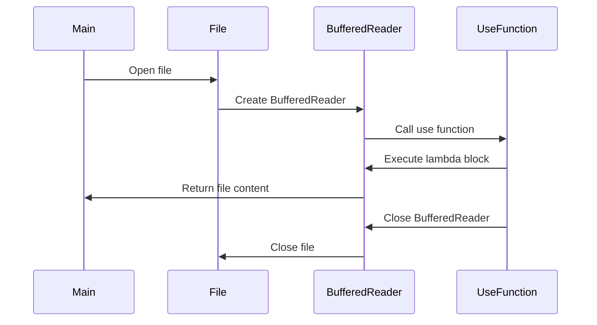

## 4.10 Resource Acquisition Is Initialization (RAII) Pattern

In the world of software development, managing resources efficiently is crucial for building robust and reliable applications. The Resource Acquisition Is Initialization (RAII) pattern is a powerful design pattern that provides a systematic approach to resource management. Originally popularized in C++, RAII ensures that resources such as memory, file handles, and network connections are properly acquired and released, reducing the risk of resource leaks and enhancing code reliability.

In this section, we will explore how the RAII pattern can be effectively applied in Kotlin, leveraging Kotlin's unique features and idioms. We'll delve into the use of Kotlin's `use` function for managing closable resources and demonstrate how to implement try-with-resources in Kotlin. By the end of this section, you'll have a comprehensive understanding of how to manage resources with deterministic cleanup in Kotlin applications.

### Intent

The primary intent of the RAII pattern is to bind the lifecycle of a resource to the lifetime of an object. This ensures that resources are automatically released when the object goes out of scope, preventing resource leaks and simplifying resource management.

### Key Participants

1. **Resource Holder**: An object that acquires a resource during its initialization and releases it during its destruction.
2. **Resource**: The entity being managed, such as a file, network connection, or memory allocation.
3. **Scope**: The block of code within which the resource is valid and can be used.

### Applicability

The RAII pattern is applicable in scenarios where resources need to be managed deterministically, such as:

- Managing file I/O operations.
- Handling network connections.
- Allocating and deallocating memory.
- Managing locks and synchronization primitives.

### Using `use` Function with Closable Resources

Kotlin provides a convenient `use` function that simplifies resource management by automatically closing resources when they are no longer needed. The `use` function is an extension function on the `Closeable` interface, which is implemented by classes such as `FileInputStream`, `BufferedReader`, and `Socket`.

#### Sample Code Snippet

Let's start with a simple example of using the `use` function to manage a file resource:

```kotlin
import java.io.File

fun readFile(fileName: String): String {
    return File(fileName).bufferedReader().use { reader ->
        reader.readText()
    }
}

fun main() {
    val content = readFile("example.txt")
    println(content)
}
```

**Explanation:**

- **Resource Acquisition**: The `bufferedReader()` function acquires a `BufferedReader` resource.
- **Resource Usage**: The `use` function executes the lambda block, allowing us to read the file content.
- **Resource Release**: Once the lambda block completes, the `use` function automatically closes the `BufferedReader`, ensuring deterministic cleanup.

### Implementing Try-With-Resources in Kotlin

In Java, the try-with-resources statement is a powerful construct for managing resources. Kotlin provides similar functionality through the `use` function, but we can also implement a custom try-with-resources mechanism using Kotlin's language features.

#### Sample Code Snippet

Let's implement a custom try-with-resources mechanism in Kotlin:

```kotlin
inline fun <T : Closeable?, R> T.useResource(block: (T) -> R): R {
    var closed = false
    try {
        return block(this)
    } catch (e: Exception) {
        closed = true
        try {
            this?.close()
        } catch (closeException: Exception) {
            e.addSuppressed(closeException)
        }
        throw e
    } finally {
        if (!closed) {
            this?.close()
        }
    }
}

fun main() {
    File("example.txt").bufferedReader().useResource { reader ->
        println(reader.readText())
    }
}
```

**Explanation:**

- **Inline Function**: The `useResource` function is an inline function that accepts a `Closeable` resource and a lambda block.
- **Exception Handling**: The function handles exceptions that may occur during resource usage and ensures that the resource is closed even if an exception is thrown.
- **Suppressed Exceptions**: If an exception occurs during resource closure, it is added as a suppressed exception to the original exception.

### Diagrams

To better understand the RAII pattern and its implementation in Kotlin, let's visualize the process using a sequence diagram.



**Diagram Description:**

- The sequence diagram illustrates the flow of resource acquisition, usage, and release using the `use` function.
- The `Main` participant opens a file and creates a `BufferedReader`.
- The `use` function is called, executing the lambda block and returning the file content.
- Finally, the `BufferedReader` and the file are closed, ensuring deterministic cleanup.

### Design Considerations

When using the RAII pattern in Kotlin, consider the following design considerations:

- **Kotlin-Specific Features**: Leverage Kotlin's `use` function for managing `Closeable` resources. This simplifies resource management and reduces boilerplate code.
- **Exception Safety**: Ensure that resources are properly closed even in the presence of exceptions. The `use` function handles this automatically, but custom implementations should also account for exception safety.
- **Resource Scope**: Limit the scope of resource usage to the smallest possible block of code. This reduces the risk of resource leaks and improves code readability.

### Differences and Similarities

The RAII pattern is often compared to the try-with-resources statement in Java. While both mechanisms provide deterministic resource management, there are some key differences:

- **RAII in C++**: In C++, RAII relies on destructors to release resources, whereas Kotlin uses the `use` function to achieve similar behavior.
- **Try-With-Resources in Java**: Java's try-with-resources statement is a language construct, while Kotlin's `use` function is an extension function on `Closeable`.
- **Resource Management**: Both mechanisms ensure that resources are released when they are no longer needed, reducing the risk of resource leaks.

### Try It Yourself

To deepen your understanding of the RAII pattern in Kotlin, try modifying the code examples provided:

1. **Experiment with Different Resources**: Use the `use` function with different `Closeable` resources, such as `Socket` or `FileOutputStream`.
2. **Implement Custom Resource Management**: Create a custom resource management function similar to `useResource` for a non-`Closeable` resource.
3. **Handle Multiple Resources**: Modify the code to manage multiple resources simultaneously, ensuring that all resources are properly released.

### Knowledge Check

To reinforce your understanding of the RAII pattern in Kotlin, consider the following questions:

- How does the `use` function ensure deterministic cleanup of resources?
- What are the benefits of using the RAII pattern in Kotlin applications?
- How can you implement a custom try-with-resources mechanism in Kotlin?

### Embrace the Journey

Remember, mastering resource management is a crucial skill for building robust and reliable applications. As you continue to explore the RAII pattern in Kotlin, keep experimenting, stay curious, and enjoy the journey!

## Quiz Time!



### What is the primary intent of the RAII pattern?

- [x] To bind the lifecycle of a resource to the lifetime of an object.
- [ ] To manage memory allocation and deallocation.
- [ ] To provide a mechanism for exception handling.
- [ ] To simplify code readability.

> **Explanation:** The RAII pattern aims to bind the lifecycle of a resource to the lifetime of an object, ensuring deterministic cleanup.

### Which Kotlin function simplifies resource management by automatically closing resources?

- [x] `use`
- [ ] `close`
- [ ] `dispose`
- [ ] `release`

> **Explanation:** The `use` function is an extension function on `Closeable` that automatically closes resources when they are no longer needed.

### How does the `use` function handle exceptions during resource usage?

- [x] It ensures the resource is closed even if an exception is thrown.
- [ ] It suppresses all exceptions.
- [ ] It logs the exception and continues execution.
- [ ] It terminates the program.

> **Explanation:** The `use` function ensures that the resource is closed even if an exception occurs during resource usage.

### What is a key difference between RAII in C++ and Kotlin?

- [x] RAII in C++ relies on destructors, while Kotlin uses the `use` function.
- [ ] RAII in C++ is not applicable to file resources.
- [ ] RAII in Kotlin is a language construct, while C++ uses functions.
- [ ] RAII in Kotlin requires manual resource release.

> **Explanation:** In C++, RAII relies on destructors to release resources, whereas Kotlin uses the `use` function.

### What is the purpose of the `useResource` function in the provided code example?

- [x] To implement a custom try-with-resources mechanism.
- [ ] To manage memory allocation.
- [ ] To handle exceptions during resource usage.
- [ ] To simplify code readability.

> **Explanation:** The `useResource` function implements a custom try-with-resources mechanism for managing `Closeable` resources.

### Which of the following is a benefit of using the RAII pattern in Kotlin?

- [x] Reduces the risk of resource leaks.
- [ ] Increases code complexity.
- [ ] Requires manual resource management.
- [ ] Limits the scope of resource usage.

> **Explanation:** The RAII pattern reduces the risk of resource leaks by ensuring that resources are released when they are no longer needed.

### How can you handle multiple resources simultaneously in Kotlin?

- [x] Use nested `use` functions for each resource.
- [ ] Use a single `use` function for all resources.
- [ ] Implement a custom resource manager.
- [ ] Use the `close` function for each resource.

> **Explanation:** You can handle multiple resources simultaneously by using nested `use` functions for each resource.

### What is a key consideration when using the RAII pattern in Kotlin?

- [x] Ensure exception safety during resource management.
- [ ] Use global variables for resource management.
- [ ] Avoid using `Closeable` resources.
- [ ] Suppress all exceptions.

> **Explanation:** Ensuring exception safety is crucial when using the RAII pattern to prevent resource leaks.

### Which of the following is an example of a `Closeable` resource in Kotlin?

- [x] `BufferedReader`
- [ ] `String`
- [ ] `Int`
- [ ] `List`

> **Explanation:** `BufferedReader` is a `Closeable` resource that can be managed using the `use` function.

### True or False: The RAII pattern is only applicable to file resources.

- [ ] True
- [x] False

> **Explanation:** The RAII pattern is applicable to various resources, including memory, network connections, and synchronization primitives.


