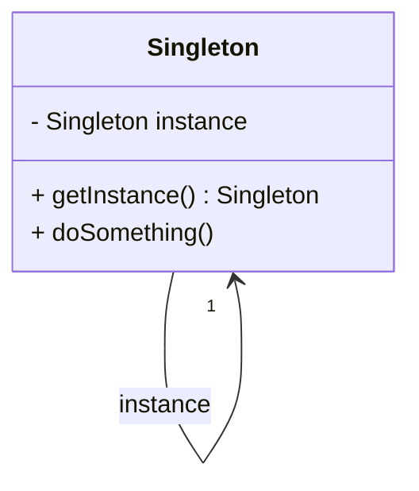

## 4.2 Singleton Pattern

The Singleton Pattern is a creational design pattern that ensures a class has only one instance and provides a global point of access to that instance. This pattern is particularly useful when exactly one object is needed to coordinate actions across the system. In this section, we will explore the Singleton Pattern in Kotlin, focusing on its implementation using Kotlin's `object` declarations, initialization, and thread safety considerations.

### Intent

The intent of the Singleton Pattern is to:

- Ensure that a class has only one instance.
- Provide a global point of access to that instance.

### Key Participants

- **Singleton Class**: The class that is restricted to a single instance.
- **Global Access Point**: A method or property that allows access to the singleton instance.

### Applicability

Use the Singleton Pattern when:

- There must be exactly one instance of a class, and it must be accessible to clients from a well-known access point.
- The sole instance should be extensible by subclassing, and clients should be able to use an extended instance without modifying their code.

### Implementing Singletons with `object` Declarations

Kotlin provides a straightforward way to implement the Singleton Pattern using `object` declarations. An `object` declaration in Kotlin creates a class and an instance of that class simultaneously. This instance is thread-safe and initialized lazily, making it an ideal choice for implementing singletons.

```kotlin
// Singleton using Kotlin's object declaration
object Singleton {
    init {
        println("Singleton instance created.")
    }

    fun doSomething() {
        println("Doing something with the singleton instance.")
    }
}

fun main() {
    // Accessing the singleton instance
    Singleton.doSomething()
}
```

In this example, the `Singleton` object is created when it is first accessed. The `init` block is executed once, ensuring that the instance is initialized only once.

### Initialization and Thread Safety Considerations

Kotlin's `object` declarations are inherently thread-safe. The instance is created at the time of first access, and the initialization is synchronized, ensuring that only one instance is created even in a multithreaded environment.

#### Lazy Initialization

Lazy initialization is a technique where the creation of an object is deferred until it is first needed. Kotlin's `object` declarations inherently support lazy initialization, but you can also achieve lazy initialization using the `lazy` delegate for more control.

```kotlin
class LazySingleton private constructor() {
    init {
        println("LazySingleton instance created.")
    }

    companion object {
        val instance: LazySingleton by lazy {
            LazySingleton()
        }
    }

    fun doSomething() {
        println("Doing something with the lazy singleton instance.")
    }
}

fun main() {
    // Accessing the lazy singleton instance
    LazySingleton.instance.doSomething()
}
```

In this example, the `LazySingleton` instance is created only when `instance` is accessed for the first time. The `by lazy` delegate ensures that the initialization is thread-safe.

#### Thread Safety Considerations

While Kotlin's `object` declarations are thread-safe, there are scenarios where additional synchronization might be necessary, especially when dealing with mutable state within the singleton. In such cases, you can use synchronization mechanisms like `synchronized` blocks or `Mutex` from `kotlinx.coroutines`.

```kotlin
import kotlinx.coroutines.sync.Mutex
import kotlinx.coroutines.sync.withLock

object ThreadSafeSingleton {
    private val mutex = Mutex()
    private var counter = 0

    suspend fun incrementCounter() {
        mutex.withLock {
            counter++
            println("Counter incremented: $counter")
        }
    }
}
```

In this example, the `Mutex` is used to ensure that the `counter` is incremented safely in a concurrent environment.

### Design Considerations

When implementing the Singleton Pattern in Kotlin, consider the following:

- **Initialization**: Ensure that the singleton is initialized only when needed. Use `object` declarations or lazy initialization to achieve this.
- **Thread Safety**: If the singleton manages mutable state, ensure that access to this state is synchronized.
- **Global Access**: Provide a clear and consistent way to access the singleton instance, typically through a public method or property.

### Differences and Similarities

The Singleton Pattern is often compared to other creational patterns, such as Factory and Builder. While all these patterns deal with object creation, the Singleton Pattern is unique in its focus on ensuring a single instance.

- **Singleton vs. Factory**: The Factory Pattern is used to create objects, while the Singleton Pattern ensures a single instance.
- **Singleton vs. Builder**: The Builder Pattern is used to construct complex objects step by step, whereas the Singleton Pattern focuses on a single instance.

### Try It Yourself

To better understand the Singleton Pattern, try modifying the code examples:

- Add a method to the `Singleton` object that maintains a count of how many times it has been accessed.
- Implement a singleton that reads configuration settings from a file and caches them for future access.

### Visualizing the Singleton Pattern

Below is a class diagram representing the Singleton Pattern using Mermaid.js:



This diagram illustrates the Singleton class with a private instance and a public method to access that instance.

### Knowledge Check

- Why is the Singleton Pattern useful in software design?
- How does Kotlin's `object` declaration facilitate the implementation of the Singleton Pattern?
- What are the thread safety considerations when implementing a singleton in Kotlin?

### Embrace the Journey

Remember, mastering design patterns like the Singleton Pattern is a journey. As you continue to explore and apply these patterns, you'll gain a deeper understanding of software design principles. Keep experimenting, stay curious, and enjoy the process!

## Quiz Time!



### What is the primary purpose of the Singleton Pattern?

- [x] To ensure a class has only one instance and provide a global access point.
- [ ] To create multiple instances of a class.
- [ ] To separate the construction of a complex object from its representation.
- [ ] To define a family of algorithms.

> **Explanation:** The Singleton Pattern ensures a class has only one instance and provides a global access point to it.

### How does Kotlin's `object` declaration help in implementing the Singleton Pattern?

- [x] It creates a class and an instance simultaneously, ensuring thread safety and lazy initialization.
- [ ] It allows multiple instances of a class to be created.
- [ ] It separates the construction of an object from its representation.
- [ ] It defines a family of interchangeable algorithms.

> **Explanation:** Kotlin's `object` declaration creates a class and its instance simultaneously, ensuring thread safety and lazy initialization, which is ideal for implementing singletons.

### What is lazy initialization?

- [x] A technique where the creation of an object is deferred until it is first needed.
- [ ] A method of creating multiple instances of a class.
- [ ] A way to separate the construction of an object from its representation.
- [ ] A pattern to define a family of algorithms.

> **Explanation:** Lazy initialization is a technique where the creation of an object is deferred until it is first needed, which can improve performance and reduce resource usage.

### What is a potential issue when using singletons with mutable state?

- [x] Thread safety concerns.
- [ ] Increased memory usage.
- [ ] Difficulty in creating multiple instances.
- [ ] Complexity in object construction.

> **Explanation:** When singletons manage mutable state, thread safety concerns can arise, requiring synchronization mechanisms to ensure safe access.

### Which of the following is a benefit of using the Singleton Pattern?

- [x] Controlled access to a single instance.
- [ ] Ability to create multiple instances.
- [x] Reduced memory footprint.
- [ ] Increased complexity in object creation.

> **Explanation:** The Singleton Pattern provides controlled access to a single instance, which can reduce memory footprint and simplify access to shared resources.

### What is the role of the `Mutex` in the ThreadSafeSingleton example?

- [x] To ensure safe access to shared resources in a concurrent environment.
- [ ] To create multiple instances of a class.
- [ ] To separate the construction of an object from its representation.
- [ ] To define a family of interchangeable algorithms.

> **Explanation:** The `Mutex` ensures safe access to shared resources in a concurrent environment by providing mutual exclusion.

### How can you modify the Singleton Pattern to handle configuration settings?

- [x] Implement a method to read and cache configuration settings.
- [ ] Create multiple instances for different configurations.
- [ ] Use a factory method to create configuration objects.
- [ ] Separate the construction of configuration objects from their representation.

> **Explanation:** You can modify the Singleton Pattern to handle configuration settings by implementing a method to read and cache these settings for future access.

### What is a common misconception about the Singleton Pattern?

- [x] That it is always thread-safe without additional synchronization.
- [ ] That it provides a global access point to a single instance.
- [ ] That it ensures a class has only one instance.
- [ ] That it is a creational design pattern.

> **Explanation:** A common misconception is that the Singleton Pattern is always thread-safe without additional synchronization, especially when managing mutable state.

### True or False: The Singleton Pattern is only applicable in object-oriented programming.

- [ ] True
- [x] False

> **Explanation:** The Singleton Pattern can be applied in various programming paradigms, not just object-oriented programming.

### What is the main difference between the Singleton and Factory Patterns?

- [x] Singleton ensures a single instance, while Factory creates multiple instances.
- [ ] Singleton creates multiple instances, while Factory ensures a single instance.
- [ ] Singleton separates construction from representation, while Factory defines algorithms.
- [ ] Singleton defines a family of algorithms, while Factory separates construction from representation.

> **Explanation:** The main difference is that the Singleton Pattern ensures a single instance, while the Factory Pattern is used to create multiple instances.



By understanding and applying the Singleton Pattern in Kotlin, you can effectively manage instances and ensure thread safety in your applications. Keep exploring and experimenting with design patterns to enhance your software design skills!
