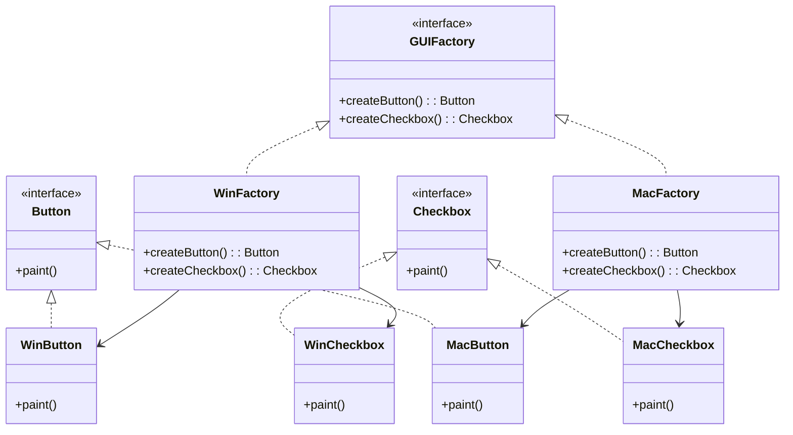

## 4.3 Factory Patterns

Factory patterns are a cornerstone of creational design patterns in object-oriented programming. They provide a way to encapsulate the instantiation of objects, allowing for more flexible and maintainable code. In Kotlin, factory patterns leverage the language's features to create efficient and expressive solutions. In this section, we will explore three main types of factory patterns: the Simple Factory Pattern, the Factory Method Pattern, and the Abstract Factory Pattern.

### Simple Factory Pattern

#### Intent
The Simple Factory Pattern aims to encapsulate the creation logic of objects in a single place, providing a centralized way to instantiate objects. This pattern is not a part of the Gang of Four (GoF) design patterns but is a common introductory pattern used to understand the concept of factories.

#### Key Participants
- **Factory**: The central class responsible for creating instances of other classes.
- **Product**: The interface or abstract class that defines the type of objects the factory will create.
- **Concrete Products**: The specific implementations of the product interface.

#### Applicability
Use the Simple Factory Pattern when:
- You have a complex object creation process that you want to centralize.
- You want to avoid exposing the instantiation logic to the client.
- You need a single point of control for object creation.

#### Sample Code Snippet

```kotlin
// Define an interface for the product
interface Car {
    fun drive()
}

// Implement concrete products
class Sedan : Car {
    override fun drive() {
        println("Driving a sedan")
    }
}

class SUV : Car {
    override fun drive() {
        println("Driving an SUV")
    }
}

// Create a simple factory to produce cars
object CarFactory {
    fun createCar(type: String): Car {
        return when (type) {
            "Sedan" -> Sedan()
            "SUV" -> SUV()
            else -> throw IllegalArgumentException("Unknown car type")
        }
    }
}

// Usage
fun main() {
    val sedan = CarFactory.createCar("Sedan")
    sedan.drive()

    val suv = CarFactory.createCar("SUV")
    suv.drive()
}
```

#### Design Considerations
- **Pros**: Centralizes object creation, making it easier to manage and modify.
- **Cons**: Can become a large class if too many product types are added, violating the Single Responsibility Principle.

#### Differences and Similarities
The Simple Factory Pattern is often confused with the Factory Method Pattern. The key difference is that the Simple Factory Pattern uses a single factory class, while the Factory Method Pattern involves subclasses to create objects.

### Factory Method Pattern

#### Intent
The Factory Method Pattern defines an interface for creating an object but lets subclasses alter the type of objects that will be created. This pattern is part of the Gang of Four design patterns and is used to delegate the instantiation logic to subclasses.

#### Key Participants
- **Product**: The interface or abstract class for the objects the factory method creates.
- **Concrete Product**: The specific implementations of the product interface.
- **Creator**: The abstract class or interface that declares the factory method.
- **Concrete Creator**: Subclasses that implement the factory method to create concrete products.

#### Applicability
Use the Factory Method Pattern when:
- A class cannot anticipate the class of objects it must create.
- A class wants its subclasses to specify the objects it creates.
- You want to localize the logic of instantiation to subclasses.

#### Sample Code Snippet

```kotlin
// Define an interface for the product
interface Button {
    fun render()
}

// Implement concrete products
class WindowsButton : Button {
    override fun render() {
        println("Rendering a Windows button")
    }
}

class MacOSButton : Button {
    override fun render() {
        println("Rendering a MacOS button")
    }
}

// Create an abstract creator class
abstract class Dialog {
    abstract fun createButton(): Button

    fun renderWindow() {
        val button = createButton()
        button.render()
    }
}

// Implement concrete creators
class WindowsDialog : Dialog() {
    override fun createButton(): Button {
        return WindowsButton()
    }
}

class MacOSDialog : Dialog() {
    override fun createButton(): Button {
        return MacOSButton()
    }
}

// Usage
fun main() {
    val windowsDialog: Dialog = WindowsDialog()
    windowsDialog.renderWindow()

    val macDialog: Dialog = MacOSDialog()
    macDialog.renderWindow()
}
```

#### Design Considerations
- **Pros**: Promotes code reuse and flexibility by allowing subclasses to specify the type of objects created.
- **Cons**: Can lead to a proliferation of classes, increasing complexity.

#### Differences and Similarities
The Factory Method Pattern is similar to the Simple Factory Pattern but provides more flexibility by allowing subclasses to define the instantiation logic.

### Abstract Factory Pattern

#### Intent
The Abstract Factory Pattern provides an interface for creating families of related or dependent objects without specifying their concrete classes. This pattern is part of the Gang of Four design patterns and is used when a system needs to be independent of how its objects are created.

#### Key Participants
- **Abstract Factory**: Declares an interface for operations that create abstract product objects.
- **Concrete Factory**: Implements the operations to create concrete product objects.
- **Abstract Product**: Declares an interface for a type of product object.
- **Concrete Product**: Defines a product object to be created by the corresponding concrete factory.
- **Client**: Uses only interfaces declared by the abstract factory and abstract products.

#### Applicability
Use the Abstract Factory Pattern when:
- A system should be independent of how its products are created, composed, and represented.
- A system should be configured with one of multiple families of products.
- You want to enforce constraints on related products.

#### Sample Code Snippet

```kotlin
// Define interfaces for abstract products
interface GUIFactory {
    fun createButton(): Button
    fun createCheckbox(): Checkbox
}

interface Button {
    fun paint()
}

interface Checkbox {
    fun paint()
}

// Implement concrete products
class WinButton : Button {
    override fun paint() {
        println("Painting a Windows button")
    }
}

class WinCheckbox : Checkbox {
    override fun paint() {
        println("Painting a Windows checkbox")
    }
}

class MacButton : Button {
    override fun paint() {
        println("Painting a MacOS button")
    }
}

class MacCheckbox : Checkbox {
    override fun paint() {
        println("Painting a MacOS checkbox")
    }
}

// Implement concrete factories
class WinFactory : GUIFactory {
    override fun createButton(): Button {
        return WinButton()
    }

    override fun createCheckbox(): Checkbox {
        return WinCheckbox()
    }
}

class MacFactory : GUIFactory {
    override fun createButton(): Button {
        return MacButton()
    }

    override fun createCheckbox(): Checkbox {
        return MacCheckbox()
    }
}

// Usage
fun main() {
    val factory: GUIFactory = WinFactory()
    val button = factory.createButton()
    val checkbox = factory.createCheckbox()

    button.paint()
    checkbox.paint()
}
```

#### Design Considerations
- **Pros**: Ensures consistency among products and provides a way to enforce constraints on related products.
- **Cons**: Can be complex to implement and maintain, especially with many product variations.

#### Differences and Similarities
The Abstract Factory Pattern is similar to the Factory Method Pattern but is used to create families of related objects, whereas the Factory Method Pattern is used to create a single product.

### Visualizing Factory Patterns

To better understand the relationships and flow of factory patterns, let's visualize them using Mermaid.js diagrams.

#### Simple Factory Pattern Diagram


#### Factory Method Pattern Diagram


#### Abstract Factory Pattern Diagram



### Try It Yourself

To deepen your understanding of factory patterns, try modifying the code examples provided:

1. **Simple Factory Pattern**: Add a new car type, such as a "Truck", and update the `CarFactory` to handle this new type.
2. **Factory Method Pattern**: Create a new type of dialog, such as a "LinuxDialog", and implement the necessary button rendering logic.
3. **Abstract Factory Pattern**: Add a new product type, such as "Slider", and update the factories to support this new product.

### Knowledge Check

- What are the main differences between the Simple Factory Pattern and the Factory Method Pattern?
- How does the Abstract Factory Pattern ensure consistency among related products?
- In what scenarios would you choose the Factory Method Pattern over the Simple Factory Pattern?

### Embrace the Journey

Remember, mastering design patterns is a journey. As you explore these patterns, you'll gain insights into creating more flexible and maintainable code. Keep experimenting, stay curious, and enjoy the journey!

## Quiz Time!



### What is the main purpose of the Simple Factory Pattern?

- [x] To encapsulate object creation logic in a single place.
- [ ] To define an interface for creating objects in subclasses.
- [ ] To create families of related objects without specifying concrete classes.
- [ ] To provide a way to enforce constraints on related products.

> **Explanation:** The Simple Factory Pattern centralizes the object creation process, making it easier to manage and modify.

### Which pattern allows subclasses to specify the objects they create?

- [ ] Simple Factory Pattern
- [x] Factory Method Pattern
- [ ] Abstract Factory Pattern
- [ ] Singleton Pattern

> **Explanation:** The Factory Method Pattern lets subclasses define the instantiation logic, providing flexibility in object creation.

### What is a key benefit of the Abstract Factory Pattern?

- [ ] It reduces the number of classes needed.
- [x] It ensures consistency among related products.
- [ ] It simplifies the object creation process.
- [ ] It allows for dynamic object creation.

> **Explanation:** The Abstract Factory Pattern provides a way to enforce constraints and ensure consistency among related products.

### In the Factory Method Pattern, what role does the Creator play?

- [x] It declares the factory method.
- [ ] It implements the concrete product.
- [ ] It uses the product interface.
- [ ] It defines the product interface.

> **Explanation:** The Creator declares the factory method, which is implemented by subclasses to create concrete products.

### How does the Simple Factory Pattern differ from the Factory Method Pattern?

- [x] The Simple Factory uses a single factory class, while the Factory Method involves subclasses.
- [ ] The Simple Factory allows for dynamic object creation, while the Factory Method does not.
- [ ] The Simple Factory is part of the GoF patterns, while the Factory Method is not.
- [ ] The Simple Factory is more complex to implement than the Factory Method.

> **Explanation:** The Simple Factory Pattern centralizes object creation in one class, whereas the Factory Method Pattern delegates it to subclasses.

### What is a potential drawback of the Simple Factory Pattern?

- [ ] It makes code less flexible.
- [x] It can violate the Single Responsibility Principle.
- [ ] It requires too many classes.
- [ ] It is difficult to implement.

> **Explanation:** The Simple Factory Pattern can become a large class if too many product types are added, violating the Single Responsibility Principle.

### Which pattern is best suited for creating a single product?

- [ ] Abstract Factory Pattern
- [ ] Singleton Pattern
- [x] Factory Method Pattern
- [ ] Composite Pattern

> **Explanation:** The Factory Method Pattern is designed to create a single product, allowing subclasses to define the instantiation logic.

### What does the Abstract Factory Pattern provide?

- [ ] A way to create a single product.
- [x] An interface for creating families of related objects.
- [ ] A centralized object creation logic.
- [ ] A method for dynamic object creation.

> **Explanation:** The Abstract Factory Pattern provides an interface for creating families of related or dependent objects.

### Can the Factory Method Pattern lead to a proliferation of classes?

- [x] True
- [ ] False

> **Explanation:** The Factory Method Pattern can lead to a proliferation of classes, as each subclass implements the factory method to create concrete products.

### What is a common use case for the Abstract Factory Pattern?

- [ ] To create a single product.
- [ ] To centralize object creation logic.
- [x] To configure a system with one of multiple families of products.
- [ ] To simplify the object creation process.

> **Explanation:** The Abstract Factory Pattern is used when a system should be configured with one of multiple families of products.




