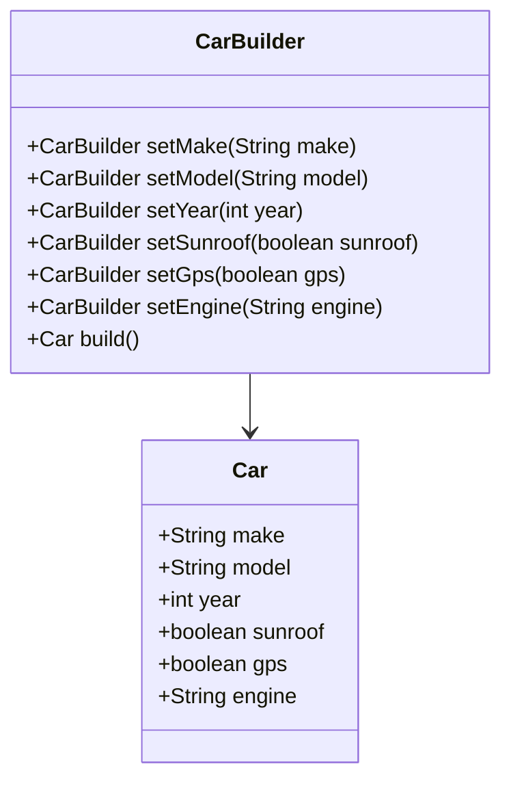

## 4.4 Builder Pattern

The Builder Pattern is a creational design pattern that provides a flexible solution for constructing complex objects. It allows for the step-by-step creation of objects, enabling the construction process to be more controlled and customizable. This pattern is particularly useful when an object needs to be created with many optional parameters or when the construction process involves multiple steps.

### Intent

The primary intent of the Builder Pattern is to separate the construction of a complex object from its representation, allowing the same construction process to create different representations. This pattern is especially useful in scenarios where the construction of an object is complex and involves multiple steps or configurations.

### Key Participants

1. **Builder**: Specifies an abstract interface for creating parts of a Product object.
2. **ConcreteBuilder**: Provides an implementation of the Builder interface to construct and assemble parts of the product.
3. **Director**: Constructs an object using the Builder interface.
4. **Product**: Represents the complex object under construction.

### Applicability

- Use the Builder Pattern when the construction process of an object is complex and involves multiple steps.
- When you need to create different representations of a complex object.
- When an object needs to be created with many optional parameters.

### Sample Code Snippet

Let's consider a scenario where we need to construct a `Car` object with various optional features such as a sunroof, GPS, and a powerful engine. Using the Builder Pattern, we can create a flexible and readable way to construct such objects.

```kotlin
// Product class
class Car(
    val make: String,
    val model: String,
    val year: Int,
    val sunroof: Boolean,
    val gps: Boolean,
    val engine: String
) {
    override fun toString(): String {
        return "Car(make='$make', model='$model', year=$year, sunroof=$sunroof, gps=$gps, engine='$engine')"
    }
}

// Builder interface
interface CarBuilder {
    fun setMake(make: String): CarBuilder
    fun setModel(model: String): CarBuilder
    fun setYear(year: Int): CarBuilder
    fun setSunroof(sunroof: Boolean): CarBuilder
    fun setGps(gps: Boolean): CarBuilder
    fun setEngine(engine: String): CarBuilder
    fun build(): Car
}

// ConcreteBuilder class
class ConcreteCarBuilder : CarBuilder {
    private var make: String = ""
    private var model: String = ""
    private var year: Int = 0
    private var sunroof: Boolean = false
    private var gps: Boolean = false
    private var engine: String = ""

    override fun setMake(make: String) = apply { this.make = make }
    override fun setModel(model: String) = apply { this.model = model }
    override fun setYear(year: Int) = apply { this.year = year }
    override fun setSunroof(sunroof: Boolean) = apply { this.sunroof = sunroof }
    override fun setGps(gps: Boolean) = apply { this.gps = gps }
    override fun setEngine(engine: String) = apply { this.engine = engine }

    override fun build(): Car {
        return Car(make, model, year, sunroof, gps, engine)
    }
}

// Usage
fun main() {
    val car = ConcreteCarBuilder()
        .setMake("Toyota")
        .setModel("Camry")
        .setYear(2023)
        .setSunroof(true)
        .setGps(true)
        .setEngine("V6")
        .build()

    println(car)
}
```

### Design Considerations

- **Fluent Interface**: The Builder Pattern often uses a fluent interface, which allows for method chaining. This makes the code more readable and expressive.
- **Immutability**: Consider making the constructed object immutable. This can prevent accidental changes after the object is created.
- **Kotlin's `apply`, `also`, `let`, and `run`**: These functions can be used to simplify the builder pattern in Kotlin, making the code more concise and expressive.

### Using Kotlin's `apply`, `also`, `let`, and `run`

Kotlin provides several scope functions that can be used to simplify the implementation of the Builder Pattern. These functions allow you to perform operations on an object within a certain scope, making the code more readable and concise.

- **`apply`**: Used to configure an object. It returns the object itself.
- **`also`**: Similar to `apply`, but it returns the object itself and is used for additional operations.
- **`let`**: Used to perform operations on a nullable object. It returns the result of the lambda expression.
- **`run`**: Combines the functionality of `let` and `apply`. It returns the result of the lambda expression.

#### Example with `apply`

```kotlin
class CarBuilder {
    var make: String = ""
    var model: String = ""
    var year: Int = 0
    var sunroof: Boolean = false
    var gps: Boolean = false
    var engine: String = ""

    fun build() = Car(make, model, year, sunroof, gps, engine)
}

fun main() {
    val car = CarBuilder().apply {
        make = "Toyota"
        model = "Camry"
        year = 2023
        sunroof = true
        gps = true
        engine = "V6"
    }.build()

    println(car)
}
```

### Creating Fluent APIs with Extension Functions

Kotlin's extension functions can be used to create fluent APIs, making the builder pattern more expressive and readable. By extending the builder class, you can add custom methods that enhance the construction process.

#### Example with Extension Functions

```kotlin
fun CarBuilder.withLuxuryPackage(): CarBuilder {
    this.sunroof = true
    this.gps = true
    this.engine = "V8"
    return this
}

fun main() {
    val car = CarBuilder().apply {
        make = "Toyota"
        model = "Camry"
        year = 2023
    }.withLuxuryPackage().build()

    println(car)
}
```

### Implementing Builders with Data Classes and Default Parameters

Kotlin's data classes and default parameters provide a powerful way to implement the Builder Pattern. Data classes automatically provide `copy()` methods, which can be used to create modified copies of objects, and default parameters allow for flexible object construction.

#### Example with Data Classes

```kotlin
data class Car(
    val make: String,
    val model: String,
    val year: Int,
    val sunroof: Boolean = false,
    val gps: Boolean = false,
    val engine: String = "V4"
)

fun main() {
    val car = Car(make = "Toyota", model = "Camry", year = 2023, sunroof = true, gps = true, engine = "V6")
    println(car)
}
```

### Differences and Similarities

- **Builder vs. Factory**: The Builder Pattern is used for constructing complex objects step by step, while the Factory Pattern is used for creating objects without exposing the instantiation logic.
- **Builder vs. Prototype**: The Builder Pattern constructs a new object each time, while the Prototype Pattern creates a new object by copying an existing one.

### Visualizing the Builder Pattern



### Try It Yourself

Experiment with the code examples provided. Try adding new features to the `Car` class and update the builder to include these features. You can also try using different Kotlin scope functions like `also` and `run` to see how they affect the builder implementation.

### Knowledge Check

- What is the primary intent of the Builder Pattern?
- How can Kotlin's `apply` function simplify the Builder Pattern?
- What are the key differences between the Builder Pattern and the Factory Pattern?

### Embrace the Journey

Remember, mastering design patterns is a journey. The Builder Pattern is just one of many tools in your software development toolkit. As you continue to explore and experiment, you'll discover new ways to apply these patterns to solve complex problems. Keep experimenting, stay curious, and enjoy the journey!

## Quiz Time!



### What is the primary intent of the Builder Pattern?

- [x] To separate the construction of a complex object from its representation.
- [ ] To create a single instance of a class.
- [ ] To provide a simplified interface to a complex subsystem.
- [ ] To allow an object to alter its behavior when its internal state changes.

> **Explanation:** The Builder Pattern's primary intent is to separate the construction of a complex object from its representation, allowing the same construction process to create different representations.

### Which Kotlin function is used to configure an object and returns the object itself?

- [x] apply
- [ ] let
- [ ] run
- [ ] also

> **Explanation:** The `apply` function in Kotlin is used to configure an object and returns the object itself, allowing for method chaining.

### What is a key advantage of using the Builder Pattern?

- [x] It allows for the step-by-step creation of complex objects.
- [ ] It ensures a class has only one instance.
- [ ] It provides a way to access the elements of an aggregate object sequentially.
- [ ] It defines a family of algorithms, encapsulates each one, and makes them interchangeable.

> **Explanation:** The Builder Pattern allows for the step-by-step creation of complex objects, making the construction process more controlled and customizable.

### How can Kotlin's `let` function be used in the Builder Pattern?

- [x] To perform operations on a nullable object and return the result of the lambda expression.
- [ ] To configure an object and return the object itself.
- [ ] To perform additional operations and return the object itself.
- [ ] To combine the functionality of `let` and `apply`.

> **Explanation:** Kotlin's `let` function is used to perform operations on a nullable object and returns the result of the lambda expression.

### What is the difference between the Builder Pattern and the Factory Pattern?

- [x] The Builder Pattern constructs complex objects step by step, while the Factory Pattern creates objects without exposing the instantiation logic.
- [ ] The Builder Pattern creates a single instance of a class, while the Factory Pattern creates multiple instances.
- [ ] The Builder Pattern provides a simplified interface to a complex subsystem, while the Factory Pattern alters an object's behavior.
- [ ] The Builder Pattern defines a family of algorithms, while the Factory Pattern encapsulates each algorithm.

> **Explanation:** The Builder Pattern constructs complex objects step by step, while the Factory Pattern creates objects without exposing the instantiation logic.

### Which Kotlin function combines the functionality of `let` and `apply`?

- [x] run
- [ ] apply
- [ ] let
- [ ] also

> **Explanation:** The `run` function in Kotlin combines the functionality of `let` and `apply`, allowing operations on an object and returning the result of the lambda expression.

### How can extension functions be used in the Builder Pattern?

- [x] To create fluent APIs and enhance the construction process.
- [ ] To ensure a class has only one instance.
- [ ] To provide a way to access the elements of an aggregate object sequentially.
- [ ] To define a family of algorithms, encapsulate each one, and make them interchangeable.

> **Explanation:** Extension functions can be used in the Builder Pattern to create fluent APIs, making the construction process more expressive and readable.

### What is a benefit of using data classes in the Builder Pattern?

- [x] They automatically provide `copy()` methods for creating modified copies of objects.
- [ ] They ensure a class has only one instance.
- [ ] They provide a simplified interface to a complex subsystem.
- [ ] They allow an object to alter its behavior when its internal state changes.

> **Explanation:** Data classes automatically provide `copy()` methods, which can be used to create modified copies of objects, making them useful in the Builder Pattern.

### How can default parameters be used in the Builder Pattern?

- [x] To allow for flexible object construction with optional parameters.
- [ ] To ensure a class has only one instance.
- [ ] To provide a way to access the elements of an aggregate object sequentially.
- [ ] To define a family of algorithms, encapsulate each one, and make them interchangeable.

> **Explanation:** Default parameters allow for flexible object construction with optional parameters, making them useful in the Builder Pattern.

### True or False: The Builder Pattern is only useful for constructing simple objects.

- [ ] True
- [x] False

> **Explanation:** False. The Builder Pattern is particularly useful for constructing complex objects that require multiple steps or configurations.


