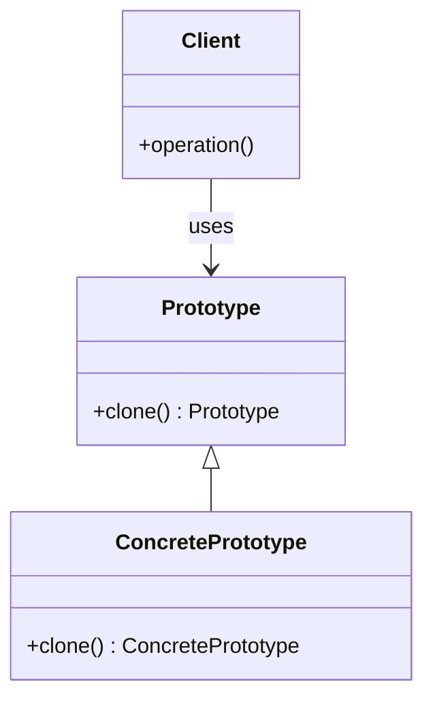

## 4.5 Prototype Pattern

The Prototype Pattern is a creational design pattern that allows you to create new objects by copying existing ones. This pattern is particularly useful when the cost of creating a new instance of a class is more expensive than copying an existing one. In Kotlin, the Prototype Pattern can be elegantly implemented using data classes, which provide a built-in `copy()` function. In this section, we will explore the Prototype Pattern in depth, focusing on cloning with data classes, understanding deep vs. shallow copies, and customizing clone behavior.

### Intent

The primary intent of the Prototype Pattern is to enable the creation of new objects by duplicating existing instances, thereby reducing the overhead associated with object creation. This pattern is especially beneficial when dealing with complex objects or when the instantiation process is resource-intensive.

### Key Participants

1. **Prototype Interface**: Defines the method for cloning objects.
2. **Concrete Prototype**: Implements the cloning method to return a copy of itself.
3. **Client**: Requests a clone from the prototype.

### Applicability

Use the Prototype Pattern when:
- The cost of creating a new instance of a class is more expensive than copying an existing one.
- You need to avoid subclasses of an object creator in the client application, like in the Factory Method Pattern.
- Instances of a class can have one of only a few different combinations of state.

### Implementing Cloning with `copy()` in Data Classes

Kotlin's data classes provide a convenient way to implement the Prototype Pattern through the `copy()` function. Data classes automatically generate a `copy()` method that allows for the creation of a new instance with the same properties as the original.

#### Example: Basic Cloning with Data Classes

```kotlin
data class Person(val name: String, val age: Int)

fun main() {
    val original = Person("Alice", 30)
    val clone = original.copy()

    println("Original: $original")
    println("Clone: $clone")
}
```

In this example, the `Person` class is a data class with two properties: `name` and `age`. The `copy()` method is used to create a new `Person` instance with the same property values as the `original`.

### Deep vs. Shallow Copies

Understanding the difference between deep and shallow copies is crucial when implementing the Prototype Pattern.

- **Shallow Copy**: A shallow copy of an object is a new object whose instance variables are identical to the original. However, if the original object contains references to mutable objects, the shallow copy will reference the same objects.
- **Deep Copy**: A deep copy duplicates everything. The new object is completely independent of the original, including any objects referenced by the original.

#### Example: Shallow Copy

```kotlin
data class Address(val street: String, val city: String)

data class Employee(val name: String, val address: Address)

fun main() {
    val originalAddress = Address("123 Main St", "Springfield")
    val originalEmployee = Employee("John Doe", originalAddress)

    val shallowCopy = originalEmployee.copy()

    println("Original Address: ${originalEmployee.address.street}")
    println("Shallow Copy Address: ${shallowCopy.address.street}")

    // Modifying the address in the shallow copy
    shallowCopy.address.street = "456 Elm St"

    println("Original Address after modification: ${originalEmployee.address.street}")
    println("Shallow Copy Address after modification: ${shallowCopy.address.street}")
}
```

In this example, both the original and the shallow copy of `Employee` share the same `Address` instance. Modifying the address in the shallow copy also affects the original.

#### Example: Deep Copy

To achieve a deep copy, you need to manually copy mutable objects.

```kotlin
data class Address(val street: String, val city: String)

data class Employee(val name: String, val address: Address) {
    fun deepCopy(): Employee {
        val copiedAddress = Address(address.street, address.city)
        return Employee(name, copiedAddress)
    }
}

fun main() {
    val originalAddress = Address("123 Main St", "Springfield")
    val originalEmployee = Employee("John Doe", originalAddress)

    val deepCopy = originalEmployee.deepCopy()

    println("Original Address: ${originalEmployee.address.street}")
    println("Deep Copy Address: ${deepCopy.address.street}")

    // Modifying the address in the deep copy
    deepCopy.address.street = "456 Elm St"

    println("Original Address after modification: ${originalEmployee.address.street}")
    println("Deep Copy Address after modification: ${deepCopy.address.street}")
}
```

In this deep copy example, the `deepCopy()` function creates a new `Address` instance, ensuring that changes to the deep copy do not affect the original.

### Customizing Clone Behavior

While the `copy()` method in data classes provides a straightforward way to clone objects, there are scenarios where you might need to customize the cloning process. This can involve adding additional logic to the cloning process or handling specific properties differently.

#### Example: Custom Clone Method

```kotlin
data class Document(val title: String, val content: String, val author: String) {
    fun customClone(newAuthor: String): Document {
        return this.copy(author = newAuthor)
    }
}

fun main() {
    val originalDocument = Document("Design Patterns", "Content of the document", "Alice")
    val clonedDocument = originalDocument.customClone("Bob")

    println("Original Document: $originalDocument")
    println("Cloned Document: $clonedDocument")
}
```

In this example, the `customClone()` method allows for the creation of a new `Document` instance with a different author while keeping the title and content the same.

### Design Considerations

When using the Prototype Pattern, consider the following:
- **Performance**: Cloning can be more efficient than creating a new instance, especially for complex objects.
- **Complexity**: Implementing deep copies can be complex, especially when dealing with nested objects or collections.
- **Mutability**: Be cautious with mutable objects. Ensure that changes to a clone do not inadvertently affect the original.

### Differences and Similarities with Other Patterns

The Prototype Pattern is often compared with the Factory Method Pattern. While both patterns deal with object creation, the Prototype Pattern uses an existing instance as a template, whereas the Factory Method Pattern involves subclassing and creating instances through a factory interface.

### Try It Yourself

Experiment with the following modifications to deepen your understanding of the Prototype Pattern:
- Modify the `deepCopy()` method to handle a list of addresses.
- Implement a prototype registry that stores and retrieves prototypes.
- Explore how the Prototype Pattern can be used in conjunction with other creational patterns, such as the Builder Pattern.

### Visualizing the Prototype Pattern

Let's visualize the Prototype Pattern using a class diagram to understand the relationships between the components.



**Diagram Description**: This class diagram illustrates the Prototype Pattern. The `Prototype` interface defines the `clone()` method. `ConcretePrototype` implements this method to return a copy of itself. The `Client` uses the `Prototype` interface to clone objects.

### Knowledge Check

Before we conclude, let's reinforce what we've learned with a few questions:
- What is the primary benefit of using the Prototype Pattern?
- How does a deep copy differ from a shallow copy?
- Why might you need to customize the cloning process?

### Embrace the Journey

Remember, mastering design patterns is a journey. As you continue to explore and apply the Prototype Pattern, you'll gain a deeper understanding of its nuances and benefits. Keep experimenting, stay curious, and enjoy the process of learning and growing as a developer.

## Quiz Time!



### What is the primary intent of the Prototype Pattern?

- [x] To create new objects by duplicating existing instances.
- [ ] To define a family of interchangeable algorithms.
- [ ] To provide a simplified interface to a complex subsystem.
- [ ] To separate abstraction from implementation.

> **Explanation:** The Prototype Pattern's primary intent is to create new objects by duplicating existing instances, reducing the overhead of object creation.

### Which Kotlin feature is particularly useful for implementing the Prototype Pattern?

- [x] Data classes with the `copy()` method.
- [ ] Sealed classes.
- [ ] Extension functions.
- [ ] Companion objects.

> **Explanation:** Kotlin's data classes provide a built-in `copy()` method, making them particularly useful for implementing the Prototype Pattern.

### What is a shallow copy?

- [x] A copy where the new object shares references to the same mutable objects as the original.
- [ ] A copy where all objects are duplicated, including nested objects.
- [ ] A copy that includes only primitive data types.
- [ ] A copy that is read-only.

> **Explanation:** A shallow copy creates a new object with references to the same mutable objects as the original, meaning changes to these objects affect both the original and the copy.

### How can you achieve a deep copy in Kotlin?

- [x] By manually copying all mutable objects within the original object.
- [ ] By using the `copy()` method of data classes.
- [ ] By using the `clone()` method of the `Object` class.
- [ ] By using extension functions.

> **Explanation:** Achieving a deep copy requires manually copying all mutable objects within the original object to ensure independence between the original and the copy.

### Why might you need to customize the cloning process?

- [x] To handle specific properties differently or add additional logic.
- [ ] To reduce the size of the cloned object.
- [ ] To prevent cloning of any object.
- [ ] To ensure the clone is an exact replica without any changes.

> **Explanation:** Customizing the cloning process allows you to handle specific properties differently or add additional logic, such as changing certain fields during cloning.

### What is a key consideration when using the Prototype Pattern?

- [x] Ensuring that changes to a clone do not affect the original.
- [ ] Avoiding the use of interfaces.
- [ ] Using only immutable objects.
- [ ] Ensuring all objects are singletons.

> **Explanation:** A key consideration is ensuring that changes to a clone do not affect the original, especially when dealing with mutable objects.

### How does the Prototype Pattern differ from the Factory Method Pattern?

- [x] The Prototype Pattern uses an existing instance as a template, while the Factory Method Pattern involves subclassing.
- [ ] The Prototype Pattern is used for creating singletons, while the Factory Method Pattern is not.
- [ ] The Prototype Pattern is only applicable to immutable objects, while the Factory Method Pattern is not.
- [ ] The Prototype Pattern requires the use of interfaces, while the Factory Method Pattern does not.

> **Explanation:** The Prototype Pattern uses an existing instance as a template for creating new objects, whereas the Factory Method Pattern involves subclassing and creating instances through a factory interface.

### What is the role of the `Client` in the Prototype Pattern?

- [x] To request a clone from the prototype.
- [ ] To define the cloning method.
- [ ] To implement the prototype interface.
- [ ] To manage the lifecycle of the prototype.

> **Explanation:** The `Client` in the Prototype Pattern is responsible for requesting a clone from the prototype, using the prototype interface to create new instances.

### What does the `copy()` method in Kotlin's data classes do?

- [x] It creates a new instance with the same property values as the original.
- [ ] It creates a deep copy of the original instance.
- [ ] It creates a singleton instance of the original class.
- [ ] It modifies the original instance.

> **Explanation:** The `copy()` method in Kotlin's data classes creates a new instance with the same property values as the original, providing a straightforward way to clone objects.

### True or False: A deep copy duplicates everything, including any objects referenced by the original.

- [x] True
- [ ] False

> **Explanation:** True. A deep copy duplicates everything, including any objects referenced by the original, ensuring complete independence between the original and the copy.


