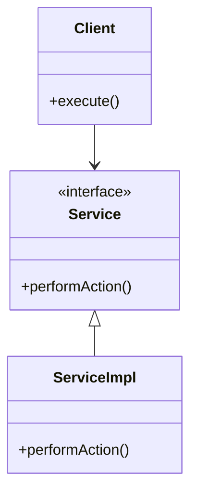

## 4.6 Dependency Injection

Dependency Injection (DI) is a fundamental design pattern in software engineering that facilitates the decoupling of components, making your code more modular, testable, and maintainable. In Kotlin, DI can be implemented in various ways, from simple constructor injection to using sophisticated frameworks like Koin, Dagger, and Hilt. This section will guide you through the intricacies of DI in Kotlin, offering insights into its implementation and best practices.

### Understanding Dependency Injection

**Dependency Injection** is a technique where an object receives its dependencies from an external source rather than creating them itself. This pattern helps in achieving Inversion of Control (IoC), where the control of creating and managing dependencies is transferred from the dependent object to an external entity.

#### Key Benefits of Dependency Injection

- **Decoupling**: By injecting dependencies, components become less dependent on each other, promoting loose coupling.
- **Testability**: DI makes it easier to test components in isolation by allowing the injection of mock dependencies.
- **Maintainability**: Changes in one part of the system have minimal impact on others, enhancing maintainability.
- **Flexibility**: DI allows for easy swapping of implementations, enabling flexible system configurations.

### Implementing DI with Constructors and Interfaces

One of the simplest and most effective ways to implement DI is through constructors and interfaces. This approach is straightforward and does not require any external libraries or frameworks.

#### Constructor Injection

Constructor injection involves passing dependencies through the constructor of a class. This method ensures that a class is always initialized with its required dependencies.

```kotlin
// Define an interface for a service
interface Service {
    fun performAction()
}

// Implement the service interface
class ServiceImpl : Service {
    override fun performAction() {
        println("Service action performed")
    }
}

// Class that depends on the Service
class Client(private val service: Service) {
    fun execute() {
        service.performAction()
    }
}

// Usage
fun main() {
    val service = ServiceImpl()
    val client = Client(service)
    client.execute()
}
```

In this example, `Client` depends on the `Service` interface, and the actual implementation `ServiceImpl` is injected via the constructor.

#### Interface Injection

Interface injection is less common in Kotlin but can be useful in certain scenarios. It involves defining a method in the interface to inject dependencies.

```kotlin
// Define a dependency injector interface
interface ServiceInjector {
    fun injectService(service: Service)
}

// Implement the service interface
class ServiceImpl : Service {
    override fun performAction() {
        println("Service action performed")
    }
}

// Class that depends on the Service
class Client : ServiceInjector {
    private lateinit var service: Service

    override fun injectService(service: Service) {
        this.service = service
    }

    fun execute() {
        service.performAction()
    }
}

// Usage
fun main() {
    val service = ServiceImpl()
    val client = Client()
    client.injectService(service)
    client.execute()
}
```

Here, the `Client` class implements `ServiceInjector` to receive its dependency.

### Using DI Frameworks: Koin, Dagger, and Hilt

While constructor and interface injection are effective, DI frameworks provide more powerful and flexible solutions for managing dependencies, especially in larger applications.

#### Koin: A Pragmatic DI Framework for Kotlin

Koin is a lightweight and easy-to-use DI framework designed specifically for Kotlin. It leverages Kotlin's DSL capabilities to define and manage dependencies.

##### Setting Up Koin

To use Koin, add the following dependencies to your `build.gradle.kts` file:

```kotlin
dependencies {
    implementation("io.insert-koin:koin-core:3.x.x")
    implementation("io.insert-koin:koin-android:3.x.x") // For Android projects
}
```

##### Defining Modules and Injecting Dependencies

Koin uses modules to define how dependencies are provided. Here's an example of defining and using a Koin module:

```kotlin
import org.koin.core.context.startKoin
import org.koin.dsl.module
import org.koin.android.ext.koin.androidContext
import org.koin.androidx.viewmodel.dsl.viewModel

// Define a Koin module
val appModule = module {
    single<Service> { ServiceImpl() }
    factory { Client(get()) }
}

// Start Koin
fun main() {
    startKoin {
        modules(appModule)
    }

    // Retrieve and use the Client
    val client: Client = getKoin().get()
    client.execute()
}
```

In this example, `ServiceImpl` is defined as a singleton, while `Client` is defined as a factory, meaning a new instance is created each time it's requested.

#### Dagger: A Compile-Time DI Framework

Dagger is a popular DI framework that generates code at compile time, providing fast and efficient dependency injection.

##### Setting Up Dagger

Add the following dependencies to your `build.gradle.kts` file:

```kotlin
dependencies {
    implementation("com.google.dagger:dagger:2.x")
    kapt("com.google.dagger:dagger-compiler:2.x")
}
```

##### Defining Components and Modules

Dagger uses components and modules to manage dependencies. Here's an example:

```kotlin
import dagger.Component
import dagger.Module
import dagger.Provides
import javax.inject.Inject

// Define a service interface
interface Service {
    fun performAction()
}

// Implement the service
class ServiceImpl @Inject constructor() : Service {
    override fun performAction() {
        println("Service action performed")
    }
}

// Define a module to provide dependencies
@Module
class AppModule {
    @Provides
    fun provideService(): Service = ServiceImpl()
}

// Define a component to inject dependencies
@Component(modules = [AppModule::class])
interface AppComponent {
    fun inject(client: Client)
}

// Class that depends on the Service
class Client @Inject constructor(private val service: Service) {
    fun execute() {
        service.performAction()
    }
}

// Usage
fun main() {
    val appComponent = DaggerAppComponent.create()
    val client = Client()
    appComponent.inject(client)
    client.execute()
}
```

In this example, Dagger automatically generates the necessary code to inject dependencies based on the annotations provided.

#### Hilt: A Simplified DI Framework for Android

Hilt is built on top of Dagger and provides a more streamlined experience for Android development.

##### Setting Up Hilt

Add the following dependencies to your `build.gradle.kts` file:

```kotlin
dependencies {
    implementation("com.google.dagger:hilt-android:2.x")
    kapt("com.google.dagger:hilt-compiler:2.x")
}
```

##### Using Hilt in an Android Application

Hilt simplifies the process of injecting dependencies into Android components such as activities and fragments.

```kotlin
import android.os.Bundle
import androidx.activity.viewModels
import androidx.appcompat.app.AppCompatActivity
import dagger.hilt.android.AndroidEntryPoint
import javax.inject.Inject

// Define a service interface
interface Service {
    fun performAction()
}

// Implement the service
class ServiceImpl @Inject constructor() : Service {
    override fun performAction() {
        println("Service action performed")
    }
}

// Define a ViewModel that depends on the Service
class MyViewModel @Inject constructor(private val service: Service) : ViewModel() {
    fun execute() {
        service.performAction()
    }
}

// Annotate the activity with @AndroidEntryPoint
@AndroidEntryPoint
class MainActivity : AppCompatActivity() {

    private val viewModel: MyViewModel by viewModels()

    override fun onCreate(savedInstanceState: Bundle?) {
        super.onCreate(savedInstanceState)
        setContentView(R.layout.activity_main)

        viewModel.execute()
    }
}
```

In this example, Hilt automatically injects the `ServiceImpl` into `MyViewModel`, which is then used in `MainActivity`.

### Service Locator Pattern

The Service Locator pattern is another way to manage dependencies. It provides a centralized registry where dependencies can be registered and retrieved.

#### Implementing a Simple Service Locator

```kotlin
// Define a service interface
interface Service {
    fun performAction()
}

// Implement the service
class ServiceImpl : Service {
    override fun performAction() {
        println("Service action performed")
    }
}

// Service Locator
object ServiceLocator {
    private val services = mutableMapOf<Class<*>, Any>()

    fun <T> registerService(clazz: Class<T>, service: T) {
        services[clazz] = service
    }

    @Suppress("UNCHECKED_CAST")
    fun <T> getService(clazz: Class<T>): T {
        return services[clazz] as T
    }
}

// Usage
fun main() {
    val service = ServiceImpl()
    ServiceLocator.registerService(Service::class.java, service)

    val retrievedService: Service = ServiceLocator.getService(Service::class.java)
    retrievedService.performAction()
}
```

While the Service Locator pattern can be useful, it is generally less favored compared to DI frameworks due to its potential to introduce hidden dependencies and make testing more difficult.

### Design Considerations

When implementing DI, consider the following:

- **Simplicity vs. Complexity**: For small projects, constructor injection might suffice. For larger projects, consider using a DI framework.
- **Performance**: DI frameworks like Dagger offer compile-time dependency resolution, which can be more performant than runtime solutions.
- **Testability**: Ensure that your DI setup allows for easy testing by supporting mock dependencies.
- **Kotlin Features**: Leverage Kotlin's features such as extension functions and DSLs to enhance your DI implementation.

### Differences and Similarities

- **Constructor Injection vs. DI Frameworks**: Constructor injection is simple and effective for small projects, while DI frameworks offer more features and flexibility for larger projects.
- **Service Locator vs. DI**: Service Locator provides a centralized registry, but can lead to hidden dependencies, whereas DI promotes explicit dependency declaration.

### Try It Yourself

Experiment with the code examples provided. Try modifying the implementations, such as changing the service implementation or adding new dependencies. Explore how DI frameworks like Koin and Dagger handle dependency scopes and lifecycle management.

### Visualizing Dependency Injection

To better understand the flow of dependency injection, consider the following class diagram representing the relationships between components using DI:



This diagram illustrates how `Client` depends on the `Service` interface, and `ServiceImpl` provides the implementation.

### References and Links

- [Koin Documentation](https://insert-koin.io/docs/reference/koin-core/)
- [Dagger Documentation](https://dagger.dev/)
- [Hilt Documentation](https://developer.android.com/training/dependency-injection/hilt-android)

### Knowledge Check

- What are the key benefits of using Dependency Injection?
- How does constructor injection differ from interface injection?
- What are the advantages of using DI frameworks like Koin, Dagger, and Hilt?
- How does the Service Locator pattern differ from Dependency Injection?

### Embrace the Journey

Remember, mastering Dependency Injection is a journey. As you progress, you'll find more efficient ways to manage dependencies and enhance your application's architecture. Keep experimenting, stay curious, and enjoy the process!

## Quiz Time!



### What is Dependency Injection?

- [x] A design pattern that allows an object to receive its dependencies from an external source.
- [ ] A method for creating new objects within a class.
- [ ] A pattern that promotes tight coupling between components.
- [ ] A way to implement singleton objects.

> **Explanation:** Dependency Injection is a design pattern that allows an object to receive its dependencies from an external source, promoting loose coupling and enhancing testability.

### Which of the following is a benefit of Dependency Injection?

- [x] Improved testability
- [x] Enhanced maintainability
- [ ] Increased coupling
- [ ] Reduced code complexity

> **Explanation:** Dependency Injection improves testability and maintainability by decoupling components and allowing for easier swapping of implementations.

### What is constructor injection?

- [x] Passing dependencies through the constructor of a class.
- [ ] Injecting dependencies via a method in the interface.
- [ ] Using a centralized registry to provide dependencies.
- [ ] Automatically generating code for dependency management.

> **Explanation:** Constructor injection involves passing dependencies through the constructor of a class, ensuring that a class is always initialized with its required dependencies.

### Which DI framework is specifically designed for Kotlin?

- [x] Koin
- [ ] Dagger
- [ ] Hilt
- [ ] Spring

> **Explanation:** Koin is a lightweight and easy-to-use DI framework designed specifically for Kotlin, leveraging Kotlin's DSL capabilities.

### How does the Service Locator pattern differ from Dependency Injection?

- [x] Service Locator provides a centralized registry for dependencies.
- [ ] Service Locator promotes explicit dependency declaration.
- [ ] Dependency Injection hides dependencies within a centralized registry.
- [ ] Service Locator is more testable than Dependency Injection.

> **Explanation:** The Service Locator pattern provides a centralized registry for dependencies, whereas Dependency Injection promotes explicit dependency declaration.

### What is the primary advantage of using Hilt in Android development?

- [x] Simplified dependency injection for Android components.
- [ ] Compile-time dependency resolution.
- [ ] Centralized registry for dependencies.
- [ ] Automatic code generation for all dependencies.

> **Explanation:** Hilt simplifies dependency injection for Android components, providing a more streamlined experience for Android development.

### Which DI framework uses compile-time code generation?

- [x] Dagger
- [ ] Koin
- [ ] Hilt
- [ ] Spring

> **Explanation:** Dagger is a popular DI framework that generates code at compile time, providing fast and efficient dependency injection.

### What is an advantage of using constructor injection?

- [x] Ensures a class is always initialized with its required dependencies.
- [ ] Allows for runtime swapping of dependencies.
- [ ] Provides a centralized registry for dependencies.
- [ ] Hides dependencies from the class.

> **Explanation:** Constructor injection ensures that a class is always initialized with its required dependencies, promoting better design and testability.

### What is the role of a Koin module?

- [x] To define how dependencies are provided.
- [ ] To generate code for dependency injection.
- [ ] To centralize dependency management.
- [ ] To provide a registry for all dependencies.

> **Explanation:** A Koin module is used to define how dependencies are provided, using Kotlin's DSL capabilities to manage dependencies.

### True or False: Interface injection is more common in Kotlin than constructor injection.

- [ ] True
- [x] False

> **Explanation:** Interface injection is less common in Kotlin compared to constructor injection, which is more straightforward and widely used.


