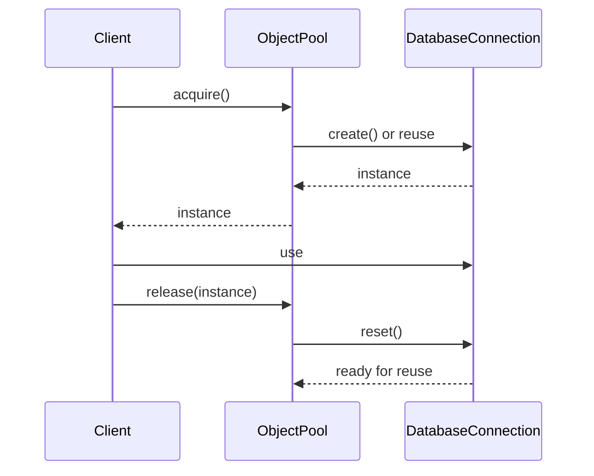

## 4.7 Object Pool Pattern

In the realm of software engineering, performance optimization is a key concern, especially when dealing with resource-intensive operations. The Object Pool Pattern is a creational design pattern that addresses this concern by reusing instances of objects rather than creating and destroying them repeatedly. This pattern is particularly useful in scenarios where the cost of initializing a class instance is high, and the number of instances needed at any given time is limited.

### Intent

The primary intent of the Object Pool Pattern is to manage the reuse of objects that are expensive to create. By maintaining a pool of reusable objects, the pattern reduces the overhead associated with object creation and destruction, thereby enhancing application performance.

### Key Participants

1. **Object Pool**: Manages the pool of reusable objects. It handles the allocation and deallocation of objects, ensuring that they are reused efficiently.
2. **Reusable Object**: The actual object that is being managed by the pool. It must be reset to a clean state before being reused.
3. **Client**: The code that uses the objects from the pool. It requests objects from the pool and returns them after use.

### Applicability

The Object Pool Pattern is applicable in scenarios where:

- Object creation is expensive and time-consuming.
- The system frequently needs a large number of objects for short periods.
- Memory management is a concern, and object reuse can help reduce memory footprint.
- Thread safety is crucial, and managing object access can prevent race conditions.

### Implementing Object Pools in Kotlin

Let's delve into how we can implement an Object Pool in Kotlin. We'll create a simple example of an object pool that manages database connections, a common use case for this pattern.

#### Step 1: Define the Reusable Object

First, define the class that represents the reusable object. In this example, we'll use a `DatabaseConnection` class.

```kotlin
class DatabaseConnection {
    fun connect() {
        println("Connecting to the database...")
    }

    fun disconnect() {
        println("Disconnecting from the database...")
    }

    fun reset() {
        println("Resetting connection state...")
    }
}
```

#### Step 2: Create the Object Pool

Next, create the `ObjectPool` class that manages the pool of `DatabaseConnection` objects.

```kotlin
class ObjectPool<T>(private val create: () -> T, private val reset: (T) -> Unit, private val maxPoolSize: Int) {
    private val availableObjects = mutableListOf<T>()
    private val inUseObjects = mutableSetOf<T>()

    @Synchronized
    fun acquire(): T {
        return if (availableObjects.isNotEmpty()) {
            val instance = availableObjects.removeAt(availableObjects.size - 1)
            inUseObjects.add(instance)
            instance
        } else if (inUseObjects.size < maxPoolSize) {
            val instance = create()
            inUseObjects.add(instance)
            instance
        } else {
            throw IllegalStateException("No available objects in the pool")
        }
    }

    @Synchronized
    fun release(instance: T) {
        if (inUseObjects.remove(instance)) {
            reset(instance)
            availableObjects.add(instance)
        } else {
            throw IllegalArgumentException("Instance not recognized")
        }
    }
}
```

#### Step 3: Utilize the Object Pool

Finally, demonstrate how to use the `ObjectPool` with `DatabaseConnection` objects.

```kotlin
fun main() {
    val connectionPool = ObjectPool(
        create = { DatabaseConnection() },
        reset = { it.reset() },
        maxPoolSize = 5
    )

    val connection1 = connectionPool.acquire()
    connection1.connect()

    connectionPool.release(connection1)
}
```

### Managing Resource-Intensive Objects

When dealing with resource-intensive objects, it's crucial to ensure that they are properly initialized and reset before reuse. This prevents any residual state from affecting subsequent operations. In our example, the `reset` method in the `DatabaseConnection` class is responsible for clearing any state before the connection is returned to the pool.

### Thread Safety Considerations

Thread safety is a critical aspect of implementing an object pool, especially in a multi-threaded environment. The `ObjectPool` class uses the `@Synchronized` annotation to ensure that access to the pool is thread-safe. This prevents race conditions and ensures that objects are not simultaneously accessed by multiple threads.

### Design Considerations

- **Initialization Cost**: Consider the cost of initializing objects. If the cost is low, the benefits of using an object pool may not outweigh the complexity.
- **Pool Size**: Determine the optimal pool size based on the application's needs and resource constraints.
- **Timeouts and Blocking**: Implement timeouts or blocking mechanisms to handle scenarios where the pool is exhausted.
- **Monitoring and Logging**: Include monitoring and logging to track pool usage and identify potential bottlenecks.

### Differences and Similarities

The Object Pool Pattern is often confused with the Flyweight Pattern. While both patterns aim to reduce memory usage, the Flyweight Pattern focuses on sharing immutable data, whereas the Object Pool Pattern emphasizes reusing mutable objects.

### Try It Yourself

To gain a deeper understanding of the Object Pool Pattern, try modifying the code examples:

- **Experiment with Different Pool Sizes**: Change the `maxPoolSize` and observe how it affects performance and resource usage.
- **Add Timeout Logic**: Implement a timeout mechanism to handle scenarios where the pool is exhausted.
- **Extend the Reusable Object**: Add additional methods or properties to the `DatabaseConnection` class and ensure they are reset correctly.

### Visualizing the Object Pool Pattern

To better understand the flow of the Object Pool Pattern, let's visualize it using a Mermaid.js sequence diagram.



This diagram illustrates the interaction between the client, the object pool, and the reusable object. The client acquires an object from the pool, uses it, and then releases it back to the pool for future reuse.

### Knowledge Check

- **What is the primary benefit of using the Object Pool Pattern?**
- **How does the Object Pool Pattern differ from the Flyweight Pattern?**
- **Why is thread safety important in an object pool implementation?**

### Embrace the Journey

Remember, mastering design patterns is a journey. As you continue to explore and apply these patterns, you'll gain a deeper understanding of their nuances and benefits. Keep experimenting, stay curious, and enjoy the process of enhancing your software design skills.

## Quiz Time!



### What is the primary purpose of the Object Pool Pattern?

- [x] To reuse instances of objects to improve performance.
- [ ] To create new instances of objects on demand.
- [ ] To manage immutable data sharing.
- [ ] To simplify object creation logic.

> **Explanation:** The Object Pool Pattern is designed to reuse instances of objects to improve performance, particularly when object creation is expensive.

### Which of the following is a key participant in the Object Pool Pattern?

- [x] Object Pool
- [ ] Singleton
- [ ] Adapter
- [ ] Decorator

> **Explanation:** The Object Pool is a key participant that manages the pool of reusable objects.

### What is a common use case for the Object Pool Pattern?

- [x] Managing database connections.
- [ ] Implementing user interfaces.
- [ ] Handling configuration files.
- [ ] Parsing JSON data.

> **Explanation:** The Object Pool Pattern is commonly used to manage database connections due to their resource-intensive nature.

### How does the Object Pool Pattern differ from the Flyweight Pattern?

- [x] The Object Pool Pattern reuses mutable objects, while the Flyweight Pattern shares immutable data.
- [ ] The Object Pool Pattern shares immutable data, while the Flyweight Pattern reuses mutable objects.
- [ ] Both patterns focus on sharing immutable data.
- [ ] Both patterns focus on reusing mutable objects.

> **Explanation:** The Object Pool Pattern focuses on reusing mutable objects, whereas the Flyweight Pattern is about sharing immutable data.

### Why is thread safety important in an object pool implementation?

- [x] To prevent race conditions and ensure safe access to objects.
- [ ] To enhance the performance of object creation.
- [ ] To simplify the object pool logic.
- [ ] To reduce memory usage.

> **Explanation:** Thread safety is crucial to prevent race conditions and ensure that objects are accessed safely in a multi-threaded environment.

### What method is used to reset an object before it is returned to the pool?

- [x] reset()
- [ ] initialize()
- [ ] configure()
- [ ] setup()

> **Explanation:** The `reset()` method is used to clear any state and prepare the object for reuse.

### What should be considered when determining the pool size?

- [x] Application needs and resource constraints.
- [ ] The number of classes in the project.
- [ ] The size of the source code.
- [ ] The number of developers on the team.

> **Explanation:** The pool size should be determined based on the application's needs and available resources.

### What is a potential pitfall of using an object pool?

- [x] Complexity in managing object states.
- [ ] Increased memory usage.
- [ ] Simplified object creation.
- [ ] Reduced performance.

> **Explanation:** Managing object states and ensuring they are reset correctly can add complexity to the implementation.

### Which Kotlin feature is used to ensure thread safety in the Object Pool example?

- [x] @Synchronized annotation
- [ ] lateinit keyword
- [ ] by lazy delegation
- [ ] inline functions

> **Explanation:** The `@Synchronized` annotation is used to ensure thread-safe access to the object pool.

### True or False: The Object Pool Pattern is only useful for managing database connections.

- [ ] True
- [x] False

> **Explanation:** False. The Object Pool Pattern is useful for managing any resource-intensive objects, not just database connections.


