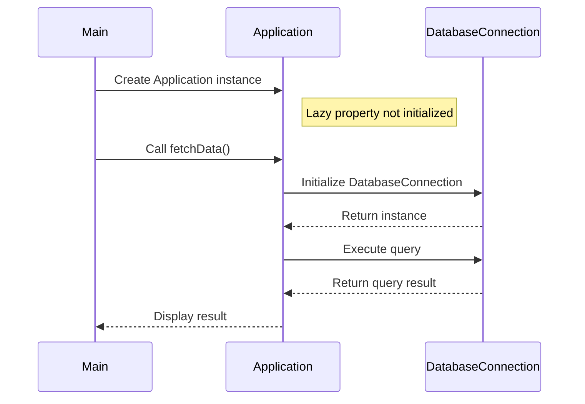

## 4.8 Lazy Initialization

Lazy Initialization is a powerful design pattern that defers the creation of an object until it is actually needed. This approach can significantly enhance performance and resource management, especially in applications where certain objects are resource-intensive or rarely used. In this section, we will delve into the intricacies of Lazy Initialization in Kotlin, exploring its implementation using Kotlin's `lazy` delegation, examining thread safety considerations, and comparing eager versus lazy initialization.

### Intent

The primary intent of Lazy Initialization is to optimize resource usage by delaying the creation of an object until it is required. This can lead to improved application performance, reduced memory footprint, and more efficient resource management.

### Key Participants

- **Lazy Property**: A property that is initialized only once when accessed for the first time.
- **Lazy Delegate**: A mechanism in Kotlin that handles the lazy initialization logic.
- **Thread Safety Modes**: Different modes provided by Kotlin to ensure thread safety during lazy initialization.

### Applicability

Lazy Initialization is applicable in scenarios where:
- Object creation is resource-intensive.
- Objects are not always required during application runtime.
- Memory optimization is a priority.
- Thread safety is a concern in concurrent environments.

### Using Kotlin's `lazy` Delegation

Kotlin provides a built-in `lazy` function that simplifies the implementation of Lazy Initialization. The `lazy` function returns a `Lazy<T>` instance, which ensures that the initialization logic is executed only once, the first time the property is accessed.

#### Syntax and Usage

```kotlin
val lazyValue: String by lazy {
    println("Computed!")
    "Hello, Kotlin!"
}
```

In this example, the `lazyValue` property is initialized with the string "Hello, Kotlin!" only when it is accessed for the first time. The message "Computed!" is printed to the console during the first access, indicating that the initialization logic has been executed.

#### Thread Safety and Initialization Modes

Kotlin's `lazy` function provides three modes for initialization, each with different thread safety guarantees:

1. **SYNCHRONIZED (default)**: Ensures that the lazy initialization is thread-safe. This mode is suitable for multi-threaded environments where the lazy property might be accessed by multiple threads simultaneously.

2. **PUBLICATION**: Allows multiple threads to initialize the lazy property, but only the first initialized value is used. This mode can be useful in scenarios where the initialization logic is idempotent and thread safety is not a critical concern.

3. **NONE**: No thread safety guarantees. This mode is suitable for single-threaded environments where performance is a priority and thread safety is not required.

#### Example of Thread Safety Modes

```kotlin
val synchronizedLazyValue: String by lazy(LazyThreadSafetyMode.SYNCHRONIZED) {
    println("Synchronized Computed!")
    "Thread-Safe Value"
}

val publicationLazyValue: String by lazy(LazyThreadSafetyMode.PUBLICATION) {
    println("Publication Computed!")
    "Idempotent Value"
}

val noneLazyValue: String by lazy(LazyThreadSafetyMode.NONE) {
    println("None Computed!")
    "Single-Threaded Value"
}
```

In this example, each lazy property is initialized using a different thread safety mode, demonstrating the flexibility provided by Kotlin's `lazy` function.

### Eager vs. Lazy Initialization

Understanding the differences between eager and lazy initialization is crucial for making informed design decisions.

#### Eager Initialization

Eager initialization involves creating an object at the time of its declaration or during the startup of an application. This approach can lead to unnecessary resource consumption if the object is never used.

**Advantages:**
- Simplicity: Objects are readily available when needed.
- Predictability: Initialization occurs at a known point in time.

**Disadvantages:**
- Resource Waste: Unused objects consume memory and processing power.
- Longer Startup Time: Applications may take longer to start due to the initialization of all objects.

#### Lazy Initialization

Lazy Initialization, as discussed, defers object creation until it is needed, offering several benefits over eager initialization.

**Advantages:**
- Resource Efficiency: Only necessary objects are created, reducing memory usage.
- Faster Startup: Applications can start quickly, as objects are initialized on-demand.

**Disadvantages:**
- Complexity: Requires careful management of initialization logic.
- Potential Latency: The first access to a lazy-initialized object may introduce a delay.

### Design Considerations

When implementing Lazy Initialization, consider the following:

- **Thread Safety**: Choose the appropriate thread safety mode based on your application's concurrency requirements.
- **Initialization Logic**: Ensure that the initialization logic is efficient and does not introduce significant delays.
- **Memory Management**: Monitor memory usage to ensure that lazy initialization is providing the expected benefits.

### Differences and Similarities

Lazy Initialization is often compared with other creational patterns, such as Singleton and Factory patterns. While all these patterns aim to optimize object creation, Lazy Initialization is unique in its focus on deferring creation until necessary. Unlike the Singleton pattern, which ensures a single instance, Lazy Initialization can be applied to any object, regardless of its multiplicity.

### Sample Code Snippet

Let's explore a practical example of Lazy Initialization in a Kotlin application:

```kotlin
class DatabaseConnection {
    init {
        println("Database Connection Established")
    }

    fun query(sql: String): String {
        return "Result of '$sql'"
    }
}

class Application {
    val database: DatabaseConnection by lazy {
        DatabaseConnection()
    }

    fun fetchData() {
        println("Fetching data...")
        val result = database.query("SELECT * FROM users")
        println(result)
    }
}

fun main() {
    val app = Application()
    println("Application started")
    app.fetchData()
}
```

**Explanation:**
- The `DatabaseConnection` class simulates a resource-intensive object.
- The `Application` class uses lazy initialization for the `database` property.
- The `DatabaseConnection` is established only when `fetchData()` is called, demonstrating deferred initialization.

### Try It Yourself

Encourage experimentation by modifying the code example:
- Change the thread safety mode of the `database` property and observe the behavior.
- Add additional properties with lazy initialization and compare their initialization times.
- Implement error handling in the initialization logic to manage potential exceptions.

### Visualizing Lazy Initialization



**Diagram Description:**
This sequence diagram illustrates the lazy initialization process. The `DatabaseConnection` is initialized only when `fetchData()` is called, demonstrating the deferred creation of the object.

### Knowledge Check

- What are the benefits of using lazy initialization in a multi-threaded environment?
- How does Kotlin's `lazy` function ensure thread safety?
- Compare and contrast eager and lazy initialization in terms of resource management.

### Embrace the Journey

Remember, mastering Lazy Initialization is just one step in optimizing your Kotlin applications. As you continue to explore design patterns, you'll discover new ways to enhance performance and resource management. Keep experimenting, stay curious, and enjoy the journey!

## Quiz Time!



### What is the primary intent of Lazy Initialization?

- [x] To optimize resource usage by delaying object creation until needed.
- [ ] To create objects as soon as possible.
- [ ] To ensure a single instance of an object.
- [ ] To simplify object creation logic.

> **Explanation:** Lazy Initialization aims to optimize resource usage by deferring object creation until it is necessary, reducing memory footprint and improving performance.

### Which Kotlin function is used for implementing Lazy Initialization?

- [x] `lazy`
- [ ] `synchronized`
- [ ] `init`
- [ ] `defer`

> **Explanation:** Kotlin provides the `lazy` function to implement Lazy Initialization, which ensures that the initialization logic is executed only once when the property is accessed for the first time.

### What is the default thread safety mode for Kotlin's `lazy` function?

- [x] SYNCHRONIZED
- [ ] PUBLICATION
- [ ] NONE
- [ ] ASYNCHRONOUS

> **Explanation:** The default thread safety mode for Kotlin's `lazy` function is SYNCHRONIZED, ensuring that the lazy initialization is thread-safe.

### Which of the following is an advantage of Lazy Initialization?

- [x] Resource Efficiency
- [ ] Longer Startup Time
- [ ] Complexity
- [ ] Potential Latency

> **Explanation:** Lazy Initialization provides resource efficiency by creating objects only when necessary, reducing memory usage and improving performance.

### In which scenario is the NONE thread safety mode suitable?

- [x] Single-threaded environments
- [ ] Multi-threaded environments
- [ ] When initialization logic is not idempotent
- [ ] When thread safety is critical

> **Explanation:** The NONE thread safety mode is suitable for single-threaded environments where performance is a priority and thread safety is not required.

### What is a disadvantage of eager initialization?

- [x] Resource Waste
- [ ] Simplicity
- [ ] Predictability
- [ ] Faster Startup

> **Explanation:** Eager initialization can lead to resource waste as it creates objects at the time of declaration or application startup, even if they are never used.

### How does Lazy Initialization affect application startup time?

- [x] It can lead to faster startup as objects are initialized on-demand.
- [ ] It always increases startup time.
- [ ] It has no effect on startup time.
- [ ] It guarantees the fastest startup time.

> **Explanation:** Lazy Initialization can lead to faster startup times because objects are initialized only when needed, rather than at application startup.

### Which of the following is NOT a thread safety mode provided by Kotlin's `lazy` function?

- [x] ASYNCHRONOUS
- [ ] SYNCHRONIZED
- [ ] PUBLICATION
- [ ] NONE

> **Explanation:** ASYNCHRONOUS is not a thread safety mode provided by Kotlin's `lazy` function. The available modes are SYNCHRONIZED, PUBLICATION, and NONE.

### What is a potential disadvantage of Lazy Initialization?

- [x] Potential Latency
- [ ] Resource Waste
- [ ] Longer Startup Time
- [ ] Simplicity

> **Explanation:** A potential disadvantage of Lazy Initialization is the introduction of latency during the first access to a lazy-initialized object, as the initialization logic is executed at that time.

### True or False: Lazy Initialization can be applied to any object, regardless of its multiplicity.

- [x] True
- [ ] False

> **Explanation:** True. Lazy Initialization can be applied to any object, regardless of its multiplicity, as it focuses on deferring creation until necessary.


