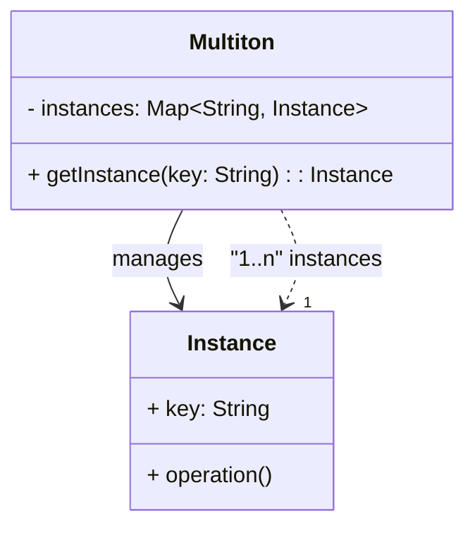

## 4.9 Multiton Pattern

In the realm of software design patterns, the Multiton pattern stands out as a sophisticated creational pattern that extends the Singleton pattern's concept. While the Singleton pattern ensures a class has only one instance, the Multiton pattern allows for a controlled number of instances, each identified by a unique key. This pattern is particularly useful when you need to manage a set of named instances, such as configuration settings for different environments or database connections for different tenants.

### Intent

The primary intent of the Multiton pattern is to manage a set of named instances, ensuring that each key corresponds to a unique instance. This pattern is beneficial in scenarios where you need to maintain a fixed number of instances, each associated with a specific identifier, and where creating new instances on demand is not desirable.

### Key Participants

- **Multiton Class**: The class that implements the Multiton pattern, responsible for managing instances.
- **Key**: A unique identifier used to retrieve or create instances.
- **Instance Map**: A data structure, typically a map, that stores instances associated with their keys.

### Applicability

The Multiton pattern is applicable in scenarios where:

- You need to manage a fixed number of instances, each associated with a unique key.
- Instances are expensive to create, and reusing existing instances is beneficial.
- You want to ensure that each key corresponds to a single instance throughout the application's lifecycle.

### Implementing Multiton with Maps and Companion Objects

In Kotlin, the Multiton pattern can be effectively implemented using maps and companion objects. The map serves as a storage for instances, while the companion object provides a convenient way to access and manage these instances.

#### Step-by-Step Implementation

1. **Define the Multiton Class**: Create a class that will represent the Multiton. This class should have a private constructor to prevent direct instantiation.

2. **Create a Companion Object**: Use a companion object to manage the instances. The companion object will contain a map that associates keys with instances.

3. **Implement the Instance Retrieval Method**: Within the companion object, implement a method that retrieves an instance based on a key. If the instance does not exist, create it and store it in the map.

4. **Ensure Thread Safety**: If your application is multithreaded, ensure that the instance retrieval method is thread-safe.

#### Example Code

Let's implement a Multiton pattern in Kotlin to manage database connections for different tenants.

```kotlin
class DatabaseConnection private constructor(val tenantId: String) {

    companion object {
        private val instances: MutableMap<String, DatabaseConnection> = mutableMapOf()

        fun getInstance(tenantId: String): DatabaseConnection {
            return instances.getOrPut(tenantId) {
                DatabaseConnection(tenantId)
            }
        }
    }

    fun connect() {
        println("Connecting to database for tenant: $tenantId")
    }
}

fun main() {
    val tenantAConnection = DatabaseConnection.getInstance("TenantA")
    tenantAConnection.connect()

    val tenantBConnection = DatabaseConnection.getInstance("TenantB")
    tenantBConnection.connect()

    // Reusing the existing instance for TenantA
    val anotherTenantAConnection = DatabaseConnection.getInstance("TenantA")
    anotherTenantAConnection.connect()

    println(tenantAConnection === anotherTenantAConnection) // true
}
```

**Explanation:**

- **DatabaseConnection Class**: Represents the Multiton class with a private constructor.
- **Companion Object**: Contains a mutable map to store instances and a method `getInstance` to retrieve or create instances.
- **getInstance Method**: Uses `getOrPut` to either retrieve an existing instance or create a new one if it doesn't exist.

### Design Considerations

- **Thread Safety**: In a multithreaded environment, ensure that the instance retrieval method is synchronized or uses concurrent collections to avoid race conditions.
- **Memory Management**: Consider the lifecycle of instances and ensure that unused instances are properly garbage collected.
- **Performance**: The use of maps can introduce overhead, so consider the performance implications in high-load scenarios.

### Differences and Similarities

- **Singleton vs. Multiton**: While the Singleton pattern restricts a class to a single instance, the Multiton pattern allows for multiple instances, each identified by a unique key.
- **Factory Method**: The Multiton pattern can be seen as a specialized Factory Method where the factory is responsible for managing a fixed set of instances.

### Use Cases and Examples

The Multiton pattern is useful in various scenarios, such as:

- **Configuration Management**: Managing configuration settings for different environments (e.g., development, testing, production).
- **Resource Management**: Managing resources like database connections, file handles, or network sockets for different clients or tenants.
- **Caching**: Implementing a cache where each key corresponds to a cached object.

#### Example: Configuration Management

Consider a scenario where you need to manage configuration settings for different environments. The Multiton pattern can be used to ensure that each environment has a unique configuration instance.

```kotlin
class Configuration private constructor(val environment: String) {

    companion object {
        private val instances: MutableMap<String, Configuration> = mutableMapOf()

        fun getInstance(environment: String): Configuration {
            return instances.getOrPut(environment) {
                Configuration(environment)
            }
        }
    }

    fun loadSettings() {
        println("Loading settings for environment: $environment")
    }
}

fun main() {
    val devConfig = Configuration.getInstance("Development")
    devConfig.loadSettings()

    val prodConfig = Configuration.getInstance("Production")
    prodConfig.loadSettings()

    // Reusing the existing instance for Development
    val anotherDevConfig = Configuration.getInstance("Development")
    anotherDevConfig.loadSettings()

    println(devConfig === anotherDevConfig) // true
}
```

### Visualizing the Multiton Pattern

To better understand the Multiton pattern, let's visualize the relationship between the key, instance map, and instances using a class diagram.



**Diagram Description**: The class diagram illustrates the Multiton pattern's structure, where the `Multiton` class manages multiple `Instance` objects, each associated with a unique key in the `instances` map.

### Try It Yourself

To gain a deeper understanding of the Multiton pattern, try modifying the code examples:

- **Add a New Tenant**: Extend the `DatabaseConnection` example by adding a new tenant and observe how the Multiton pattern manages instances.
- **Thread Safety**: Implement thread safety in the `getInstance` method using Kotlin's `synchronized` block or `ConcurrentHashMap`.
- **Memory Management**: Experiment with removing instances from the map when they are no longer needed.

### Knowledge Check

- **What is the primary intent of the Multiton pattern?**
- **How does the Multiton pattern differ from the Singleton pattern?**
- **What are some common use cases for the Multiton pattern?**

### Embrace the Journey

Remember, mastering design patterns like the Multiton pattern is just one step in your journey as a software engineer. As you continue to explore and apply these patterns, you'll gain a deeper understanding of software architecture and design principles. Keep experimenting, stay curious, and enjoy the journey!

## Quiz Time!



### What is the primary intent of the Multiton pattern?

- [x] To manage a set of named instances.
- [ ] To ensure a class has only one instance.
- [ ] To provide a simplified interface to a complex subsystem.
- [ ] To encapsulate actions as objects.

> **Explanation:** The Multiton pattern is designed to manage a set of named instances, each identified by a unique key.

### How does the Multiton pattern differ from the Singleton pattern?

- [x] Multiton allows multiple instances, each identified by a key.
- [ ] Multiton ensures a class has only one instance.
- [ ] Multiton provides a simplified interface to a complex subsystem.
- [ ] Multiton encapsulates actions as objects.

> **Explanation:** Unlike the Singleton pattern, which restricts a class to a single instance, the Multiton pattern allows for multiple instances, each identified by a unique key.

### Which data structure is typically used to implement the Multiton pattern?

- [x] Map
- [ ] List
- [ ] Set
- [ ] Queue

> **Explanation:** A map is typically used to store instances in the Multiton pattern, associating each instance with a unique key.

### What is a common use case for the Multiton pattern?

- [x] Configuration management for different environments.
- [ ] Providing a simplified interface to a complex subsystem.
- [ ] Encapsulating actions as objects.
- [ ] Ensuring a class has only one instance.

> **Explanation:** The Multiton pattern is commonly used for managing configuration settings for different environments, ensuring each environment has a unique configuration instance.

### How can you ensure thread safety in a Multiton implementation?

- [x] Use synchronized blocks or concurrent collections.
- [ ] Use a simple map without synchronization.
- [ ] Avoid using any collections.
- [ ] Use a list to store instances.

> **Explanation:** To ensure thread safety in a Multiton implementation, use synchronized blocks or concurrent collections like `ConcurrentHashMap`.

### What is the role of the companion object in a Multiton implementation?

- [x] To manage instances and provide access methods.
- [ ] To store instance data.
- [ ] To encapsulate actions as objects.
- [ ] To ensure a class has only one instance.

> **Explanation:** The companion object in a Multiton implementation manages instances and provides methods to access or create them.

### Which Kotlin feature can be used to create or retrieve instances in a Multiton pattern?

- [x] getOrPut function
- [ ] mapOf function
- [ ] listOf function
- [ ] setOf function

> **Explanation:** The `getOrPut` function is used to retrieve an existing instance or create a new one if it doesn't exist in the map.

### What is a potential drawback of using the Multiton pattern?

- [x] Increased memory usage due to multiple instances.
- [ ] Limited to a single instance.
- [ ] Complexity in managing a single instance.
- [ ] Difficulty in providing a simplified interface.

> **Explanation:** A potential drawback of the Multiton pattern is increased memory usage due to maintaining multiple instances.

### True or False: The Multiton pattern is a type of creational pattern.

- [x] True
- [ ] False

> **Explanation:** True. The Multiton pattern is a type of creational pattern, as it deals with the creation and management of instances.

### Which Kotlin feature can help manage memory in a Multiton pattern?

- [x] WeakReference
- [ ] StrongReference
- [ ] SoftReference
- [ ] HardReference

> **Explanation:** Using `WeakReference` can help manage memory in a Multiton pattern by allowing instances to be garbage collected when they are no longer in use.


