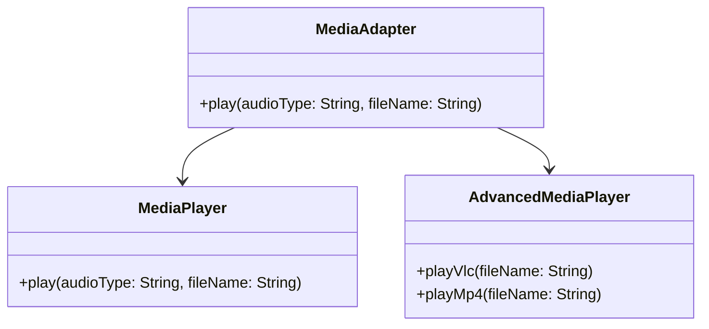

## 5.1 Adapter Pattern

In the realm of software engineering, the Adapter Pattern is a structural design pattern that plays a crucial role in bridging the gap between incompatible interfaces. It allows objects with incompatible interfaces to collaborate seamlessly by acting as a translator or intermediary. This pattern is particularly useful when integrating legacy components or third-party libraries into a modern system. In this section, we will delve into the intricacies of the Adapter Pattern in Kotlin, exploring its implementation through Class and Object Adapters, and leveraging Kotlin's powerful Extension Functions as Adapters.

### Intent

The primary intent of the Adapter Pattern is to allow two incompatible interfaces to work together. It involves creating an adapter class that converts the interface of a class into another interface that the client expects. This pattern is often used to make existing classes work with others without modifying their source code.

### Key Participants

1. **Target Interface**: This is the interface that the client expects to work with.
2. **Adaptee**: The existing class that needs to be adapted.
3. **Adapter**: The class that bridges the gap between the Target and the Adaptee.
4. **Client**: The entity that uses the Target interface.

### Applicability

Use the Adapter Pattern when:

- You want to use an existing class, and its interface does not match the one you need.
- You need to create a reusable class that cooperates with unrelated or unforeseen classes.
- You want to integrate third-party libraries or legacy systems into your application.

### Implementing Class and Object Adapters

#### Class Adapter

A Class Adapter uses inheritance to adapt one interface to another. In Kotlin, this is achieved by extending the Adaptee class and implementing the Target interface.

```kotlin
// Target interface
interface MediaPlayer {
    fun play(audioType: String, fileName: String)
}

// Adaptee class
class AdvancedMediaPlayer {
    fun playVlc(fileName: String) {
        println("Playing vlc file. Name: $fileName")
    }

    fun playMp4(fileName: String) {
        println("Playing mp4 file. Name: $fileName")
    }
}

// Adapter class
class MediaAdapter(private val advancedMediaPlayer: AdvancedMediaPlayer) : MediaPlayer {
    override fun play(audioType: String, fileName: String) {
        when (audioType.lowercase()) {
            "vlc" -> advancedMediaPlayer.playVlc(fileName)
            "mp4" -> advancedMediaPlayer.playMp4(fileName)
            else -> println("Invalid media. $audioType format not supported")
        }
    }
}

// Client code
fun main() {
    val player = MediaAdapter(AdvancedMediaPlayer())
    player.play("vlc", "movie.vlc")
    player.play("mp4", "song.mp4")
    player.play("avi", "video.avi")
}
```

In this example, `MediaAdapter` acts as an intermediary between `MediaPlayer` and `AdvancedMediaPlayer`, allowing the client to play different media formats.

#### Object Adapter

An Object Adapter uses composition to achieve the same goal. Instead of inheriting from the Adaptee, it holds an instance of the Adaptee.

```kotlin
// Adapter class using composition
class MediaObjectAdapter : MediaPlayer {
    private val advancedMediaPlayer = AdvancedMediaPlayer()

    override fun play(audioType: String, fileName: String) {
        when (audioType.lowercase()) {
            "vlc" -> advancedMediaPlayer.playVlc(fileName)
            "mp4" -> advancedMediaPlayer.playMp4(fileName)
            else -> println("Invalid media. $audioType format not supported")
        }
    }
}

// Client code
fun main() {
    val player = MediaObjectAdapter()
    player.play("vlc", "movie.vlc")
    player.play("mp4", "song.mp4")
    player.play("avi", "video.avi")
}
```

The Object Adapter pattern is more flexible than the Class Adapter pattern because it allows the Adapter to work with any subclass of the Adaptee.

### Using Extension Functions as Adapters

Kotlin's Extension Functions provide a unique way to implement the Adapter Pattern. By adding new functionality to existing classes without modifying them, Extension Functions can act as adapters.

```kotlin
// Adaptee class
class LegacyPrinter {
    fun printOldFormat(text: String) {
        println("Printing in old format: $text")
    }
}

// Extension function as an adapter
fun LegacyPrinter.printNewFormat(text: String) {
    println("Printing in new format: $text")
}

// Client code
fun main() {
    val printer = LegacyPrinter()
    printer.printOldFormat("Hello, World!")
    printer.printNewFormat("Hello, Kotlin!")
}
```

In this example, the `printNewFormat` extension function adapts the `LegacyPrinter` class to support a new printing format without altering the original class.

### Design Considerations

When implementing the Adapter Pattern in Kotlin, consider the following:

- **Class Adapter vs. Object Adapter**: Choose between inheritance and composition based on your needs. Use Class Adapter when you have control over the Adaptee class and Object Adapter when you need more flexibility.
- **Extension Functions**: Utilize Kotlin's Extension Functions for a clean and non-intrusive way to add functionality.
- **Performance**: Be mindful of the overhead introduced by adapters, especially in performance-critical applications.

### Differences and Similarities

The Adapter Pattern is often confused with the Facade Pattern. While both provide a simplified interface to a complex system, the Adapter Pattern focuses on converting one interface to another, whereas the Facade Pattern provides a unified interface to a set of interfaces.

### Visualizing the Adapter Pattern

To better understand the Adapter Pattern, let's visualize it using a class diagram.



This diagram illustrates how `MediaAdapter` implements the `MediaPlayer` interface and interacts with `AdvancedMediaPlayer`.

### Try It Yourself

Experiment with the code examples provided. Try modifying the `MediaAdapter` to support additional media formats or use Extension Functions to adapt other classes in your projects.

### References and Links

For further reading on the Adapter Pattern and its applications, consider exploring the following resources:

- [Adapter Pattern on Wikipedia](https://en.wikipedia.org/wiki/Adapter_pattern)
- [Kotlin Documentation on Extension Functions](https://kotlinlang.org/docs/extensions.html)

### Knowledge Check

- What is the primary purpose of the Adapter Pattern?
- How does a Class Adapter differ from an Object Adapter?
- What are the advantages of using Extension Functions as Adapters in Kotlin?

### Embrace the Journey

Remember, mastering design patterns like the Adapter Pattern is just the beginning. As you continue to explore Kotlin and its capabilities, you'll find new ways to apply these patterns to solve complex problems. Keep experimenting, stay curious, and enjoy the journey!

## Quiz Time!



### What is the primary purpose of the Adapter Pattern?

- [x] To allow incompatible interfaces to work together.
- [ ] To provide a simplified interface to a complex subsystem.
- [ ] To separate abstraction from implementation.
- [ ] To compose objects into tree structures.

> **Explanation:** The Adapter Pattern allows incompatible interfaces to work together by acting as a translator between them.

### How does a Class Adapter differ from an Object Adapter?

- [x] A Class Adapter uses inheritance, while an Object Adapter uses composition.
- [ ] A Class Adapter uses composition, while an Object Adapter uses inheritance.
- [ ] Both use inheritance.
- [ ] Both use composition.

> **Explanation:** A Class Adapter uses inheritance to adapt one interface to another, while an Object Adapter uses composition to achieve the same goal.

### What is a key advantage of using Extension Functions as Adapters in Kotlin?

- [x] They allow adding functionality without modifying the original class.
- [ ] They require modifying the original class.
- [ ] They are less flexible than Class Adapters.
- [ ] They are less flexible than Object Adapters.

> **Explanation:** Extension Functions allow adding new functionality to existing classes without modifying them, providing a clean and non-intrusive way to implement adapters.

### Which pattern is often confused with the Adapter Pattern?

- [x] Facade Pattern
- [ ] Singleton Pattern
- [ ] Builder Pattern
- [ ] Observer Pattern

> **Explanation:** The Adapter Pattern is often confused with the Facade Pattern, as both provide simplified interfaces, but they serve different purposes.

### In the Adapter Pattern, what role does the Client play?

- [x] The Client uses the Target interface.
- [ ] The Client adapts the Adaptee.
- [ ] The Client implements the Adapter.
- [ ] The Client provides the Target interface.

> **Explanation:** The Client uses the Target interface, which the Adapter implements to bridge the gap between the Client and the Adaptee.

### What is a potential drawback of using the Adapter Pattern?

- [x] It can introduce overhead in performance-critical applications.
- [ ] It simplifies the interface too much.
- [ ] It requires modifying the Adaptee class.
- [ ] It cannot be used with third-party libraries.

> **Explanation:** The Adapter Pattern can introduce overhead, especially in performance-critical applications, due to the additional layer of abstraction.

### When should you use a Class Adapter over an Object Adapter?

- [x] When you have control over the Adaptee class and need to use inheritance.
- [ ] When you need more flexibility and use composition.
- [ ] When the Adaptee class is final.
- [ ] When the Adaptee class is abstract.

> **Explanation:** Use a Class Adapter when you have control over the Adaptee class and can use inheritance to adapt its interface.

### What is the role of the Adapter in the Adapter Pattern?

- [x] It bridges the gap between the Target and the Adaptee.
- [ ] It acts as the Client.
- [ ] It provides the Target interface.
- [ ] It modifies the Adaptee class.

> **Explanation:** The Adapter bridges the gap between the Target interface and the Adaptee, allowing them to work together.

### How can you extend the functionality of a class in Kotlin without modifying it?

- [x] By using Extension Functions.
- [ ] By using Class Adapters.
- [ ] By using Object Adapters.
- [ ] By using inheritance.

> **Explanation:** Extension Functions in Kotlin allow you to add new functionality to existing classes without modifying them.

### True or False: The Adapter Pattern can only be used with classes you have written yourself.

- [ ] True
- [x] False

> **Explanation:** False. The Adapter Pattern can be used with any class, including third-party libraries and legacy systems, to make them compatible with your application's interface.


